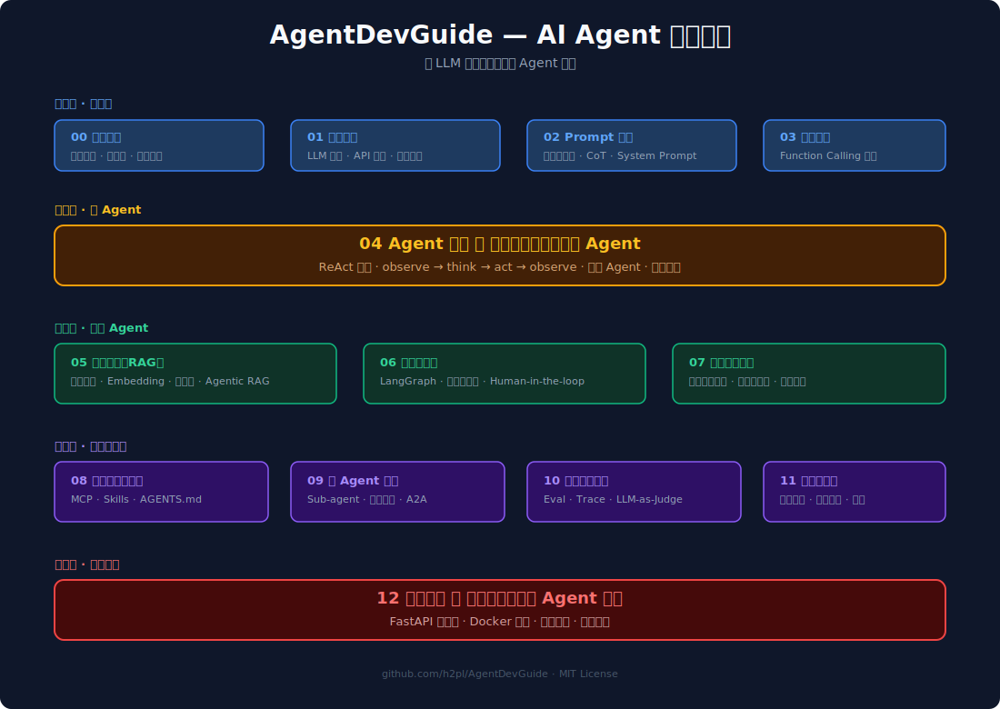

# AgentDevGuide

**AI Agent 开发指南**

## 学习路线

---

## 目录

| # | 章节 | 核心问题 | 产出 |
|:---:|------|---------|------|
| 00 | [生态认知](./docs/00-landscape/README.md) | Agent 和 Chatbot / Workflow / RAG 有什么区别？ | Agent 生态全景图 |
| 01 | [LLM 基础](./docs/01-llm-basics/README.md) | LLM 是什么？它怎么工作、能做什么、不能做什么？ | LLM 原理认知体系 |
| 02 | [模型接入](./docs/02-model-access/README.md) | 怎么调用 LLM？模型之间有什么差异？ | 多模型切换对话服务 |
| 03 | [Prompt 工程](./docs/03-prompt-engineering/README.md) | 怎么精确控制 LLM 输出？ | 结构化输出 + CoT demo |
| 04 | [工具调用](./docs/04-tool-use/README.md) | LLM 怎么调用外部函数？ | 多工具对话 demo |
| 05 | [Agent 循环](./docs/05-agent-loop/README.md) | Agent 的核心循环怎么工作？ | ⭐ 最小 ReAct Agent |
| 06 | [记忆管理](./docs/06-memory-management/README.md) | Agent 怎么记住之前的事？ | 带记忆的 Agent |
| 07 | [知识检索](./docs/07-rag-pipeline/README.md) | 怎么让 Agent 基于外部知识回答？ | RAG 问答系统 |
| 08 | [上下文工程](./docs/08-context-engineering/README.md) | 怎么高效管理 Agent 的上下文窗口？ | 上下文优化方案 |
| 09 | [框架与编排](./docs/09-framework/README.md) | 怎么用框架管理复杂 Agent？ | LangGraph Agent |
| 10 | [扩展协议与标准](./docs/10-protocols/README.md) | MCP / Skills / AGENTS.md 是什么？ | MCP Server + Skill |
| 11 | [多 Agent 协作](./docs/11-multi-agent/README.md) | 多个 Agent 怎么协作？ | 多 Agent 系统 |
| 12 | [评测与可观测](./docs/12-eval-trace/README.md) | 怎么知道 Agent 好不好？ | 评测集 + Trace |
| 13 | [安全与治理](./docs/13-safety/README.md) | 怎么防止 Agent 越权？ | 安全加固方案 |
| 14 | [产品交付](./docs/14-ship-to-prod/README.md) | 怎么部署上线？ | 🎯 可部署的 Agent 系统 |

---

## 参考资料

- [O'Reilly — The AI Agents Stack (2026)](https://www.oreilly.com/radar/the-ai-agents-stack-2026-edition/) — 6 层架构参考
- [AI Agent Architecture — MCP/Skills/Agent 三层模型](https://shuji-bonji.github.io/ai-agent-architecture/) — 协议分层参考
- [OpenAI Prompt Engineering Guide](https://platform.openai.com/docs/guides/prompt-engineering)
- [Anthropic Building Effective Agents](https://www.anthropic.com/engineering/building-effective-agents)
- [LangGraph Documentation](https://langchain-ai.github.io/langgraph/)

---

