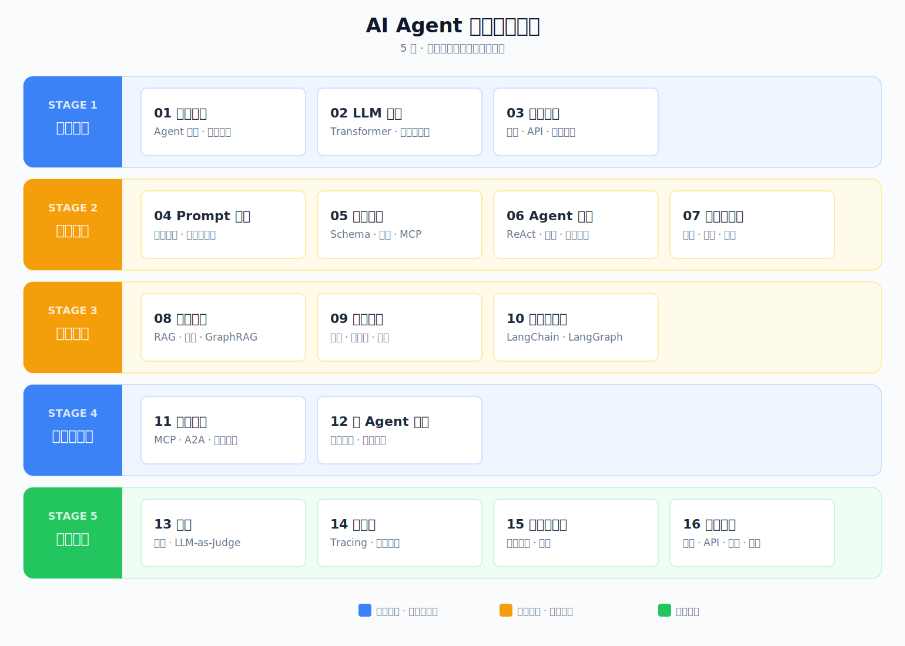



# LearnAgent

## AI Agent 系统化学习 + 面试指南

  

### AI 行业求职现状

2025-2026 年，AI Agent 成为大厂和创业公司争相投入的方向，Agent 开发、应用、架构类岗位快速增长。这个方向区别于 AI 算法研究（模型训练、数学推导）和 AI 基础设施（推理引擎、集群调度、MLOps），更聚焦于如何用 LLM 构建智能系统——工具调用、RAG 管线、多 Agent 协作、上下文处理等工程化能力。面试考察的也正是这些内容：ReAct 循环、工具调用设计、RAG 管线构建、多 Agent 协作编排……

如果你想进入这个方向，需要的不是零散的文章，而是一张完整的技术地图。

### 关于本指南

AI Agent 相关的资料并不少，但三个痛点普遍存在：**太浅**——停留在调 API 和跑 demo 的层面，缺少深度；**太散**——每篇文章讲一个点，拼不成体系；**断层**——从 demo 到生产之间有一道巨大的鸿沟，很少有人讲如何跨越。

这是一本面向「学习 + 面试」的系统化指南。16 章从底层原理到工程交付逐层递进，每章解决一个核心问题，前后衔接形成闭环。它覆盖 Agent 开发的完整知识栈，每一层都讲清楚为什么，而不只是怎么做。无论系统学习还是备战面试，这份路线图都能帮你建立完整的知识框架，查漏补缺。

### 目标读者

如果你属于以下任一角色，这个指南都会对你有用：

- **AI 爱好者**——看清整个领域的技术版图与演进方向
- **求职者**——系统备战 Agent 岗位面试，查漏补缺
- **开发者**——建立完整的 Agent 知识体系，而不只是学会用某个框架
- **产品经理 / 技术管理者**——理解 Agent 能做什么、不能做什么、以及如何做技术决策

> [开始阅读 → 什么是 AI Agent](./docs/01-landscape/01-what-is-agent.md)

---

## 学习路径一览

| 阶段 | 章节 |
|------|------|
| 🎯 **基础认知** | [01 生态认知](./docs/01-landscape/README.md) · [02 LLM 基础](./docs/02-llm-basics/README.md) |
| 🛠 **核心技能** | [03 模型接入](./docs/03-model-access/README.md) · [04 Prompt 工程](./docs/04-prompt-engineering/README.md) · [05 工具调用](./docs/05-tool-use/README.md) · [06 Agent 循环](./docs/06-agent-loop/README.md) |
| 🏗 **架构设计** | [07 上下文工程](./docs/07-context-engineering/README.md) · [08 知识检索（RAG）](./docs/08-rag-pipeline/README.md) · [09 记忆管理](./docs/09-memory-management/README.md) · [10 框架与编排](./docs/10-framework/README.md) · [11 扩展协议](./docs/11-protocols/README.md) · [12 多 Agent 协作](./docs/12-multi-agent/README.md) |
| 🚀 **工程交付** | [13 评测](./docs/13-evaluation/README.md) · [14 可观测](./docs/14-observability/README.md) · [15 安全与治理](./docs/15-safety/README.md) · [16 产品交付](./docs/16-ship-to-production/README.md) |

## 01 生态认知

什么是 Agent？它和 Chatbot / Workflow 有什么区别？

- [什么是 AI Agent](./docs/01-landscape/01-what-is-agent.md)
- [2026 主流 Agent 全景](./docs/01-landscape/02-mainstream-agents.md)
- [Claude Code 编程 Agent](./docs/01-landscape/03-claude-code.md)
- [OpenClaw 个人助理](./docs/01-landscape/04-openclaw.md)
- [Hermes Agent 开源 Agent](./docs/01-landscape/05-hermes-agent.md)

## 02 LLM 基础

LLM 是什么？怎么工作、能做什么、不能做什么？

**核心概念**：

- [认识大语言模型（LLM）](./docs/02-llm-basics/01-llm-overview.md)
- [LLM 的技术根基](./docs/02-llm-basics/02-nlp-to-transformer.md)
- [LLM 发展简史](./docs/02-llm-basics/03-llm-evolution.md)

**能力与限制**：

- [LLM 核心能力](./docs/02-llm-basics/04-capabilities.md)
- [LLM 的局限与工程对策](./docs/02-llm-basics/05-limitations-and-countermeasures.md)

**深入理解**：

- [Token 与 Embedding：文本是如何变成向量的](./docs/02-llm-basics/06-token-and-embedding.md)
- [Transformer 内部原理](./docs/02-llm-basics/07-transformer-internals.md)
- [从 Base 到 Chat](./docs/02-llm-basics/08-training-pipeline.md)

## 03 模型接入

怎么调用 LLM？模型之间有什么差异？

- [主流模型对比与选型](./docs/03-model-access/01-model-comparison.md)
- [关键参数与调优](./docs/03-model-access/02-key-parameters-and-tuning.md)
- [LLM API 调用实战](./docs/03-model-access/03-api-calling.md)
- [模型变体速查](./docs/03-model-access/04-model-variants-landscape.md)
- [深度思考与推理能力](./docs/03-model-access/05-deep-thinking-and-reasoning.md)
- [模型本地部署实战](./docs/03-model-access/06-local-deployment.md)
- [模型微调实战指南](./docs/03-model-access/07-finetuning-guide.md)

## 04 Prompt 工程

怎么精确控制 LLM 输出？

- [Prompt 工程入门](./docs/04-prompt-engineering/01-introduction.md)
- [Prompt 设计模式：从推测到精准控制](./docs/04-prompt-engineering/02-prompt-design-patterns.md)
- [结构化输出：让 LLM 输出稳定的 JSON](./docs/04-prompt-engineering/03-structured-output.md)
- [System Prompt 设计：定义 Agent 的核心行为](./docs/04-prompt-engineering/04-system-prompt.md)
- [Prompt 鲁棒性：应对意外输入](./docs/04-prompt-engineering/05-prompt-robustness.md)
- [Prompt 调试与评估](./docs/04-prompt-engineering/06-prompt-debugging-and-evaluation.md)

## 05 工具调用

LLM 怎么调用外部函数和工具？

- [工具调用机制与原理](./docs/05-tool-use/01-tool-calling-mechanism.md)
- [工具 Schema 设计](./docs/05-tool-use/02-tool-schema-design.md)
- [多工具编排策略](./docs/05-tool-use/03-multi-tool-orchestration.md)
- [MCP 与工具生态](./docs/05-tool-use/04-mcp-and-tool-ecosystem.md)
- [MCP 实战全流程](./docs/05-tool-use/05-mcp-in-practice.md)

## 06 Agent 循环

Agent 的核心循环怎么工作？

**模式与原理**：

- [Agent 与 Chatbot / Workflow 的区别](./docs/06-agent-loop/01-agent-vs-chatbot-workflow.md)
- [Agent 核心循环](./docs/06-agent-loop/02-agent-core-loop.md)
- [Agent 模式全景](./docs/06-agent-loop/03-agent-patterns-overview.md)
- [ReAct 模式](./docs/06-agent-loop/04-react-pattern.md)
- [Plan-and-Execute 模式](./docs/06-agent-loop/05-plan-and-execute.md)
- [Reflexion 与其他 Agent 模式](./docs/06-agent-loop/06-reflexion-and-other-patterns.md)
- [Agent 停止条件设计](./docs/06-agent-loop/07-stop-conditions.md)

**动手实现**：

- [从零实现最小 Agent](./docs/06-agent-loop/08-minimal-agent.md)

## 07 上下文工程

怎么高效管理 Agent 的上下文窗口？

- [上下文窗口：Agent 的瓶颈资源](./docs/07-context-engineering/01-context-window-bottleneck.md)
- [上下文压缩策略](./docs/07-context-engineering/02-context-compression.md)
- [Token 预算与成本控制](./docs/07-context-engineering/03-token-budget-cost.md)
- [上下文卸载与隔离](./docs/07-context-engineering/04-context-offloading-isolation.md)
- [上下文失败模式与反模式](./docs/07-context-engineering/05-context-failure-patterns.md)

## 08 知识检索（RAG）

怎么让 Agent 基于外部知识回答？

- [RAG 原理概述](./docs/08-rag-pipeline/01-rag-overview.md)
- [文档切分与向量化](./docs/08-rag-pipeline/02-chunking-embedding.md)
- [检索与重排序策略](./docs/08-rag-pipeline/03-retrieval-reranking.md)
- [RAG 评测与优化](./docs/08-rag-pipeline/04-evaluation-optimization.md)
- [构建你的第一个 RAG 系统](./docs/08-rag-pipeline/05-build-rag-system.md)
- [GraphRAG：知识图谱增强检索](./docs/08-rag-pipeline/06-graphrag.md)

## 09 记忆管理

Agent 怎么记住之前发生的事？

- [Agent 记忆三层模型](./docs/09-memory-management/01-memory-layers.md)
- [记忆存储与检索](./docs/09-memory-management/02-memory-storage-retrieval.md)
- [跨会话记忆实践](./docs/09-memory-management/03-cross-session-memory.md)
- [记忆框架与巩固策略](./docs/09-memory-management/04-memory-frameworks.md)
- [记忆框架实战：四大方案 Quick Start](./docs/09-memory-management/05-frameworks-hands-on.md)

## 10 框架与编排

怎么用框架管理复杂 Agent？

- [Agent 框架概述与选型](./docs/10-framework/01-framework-overview.md)
- [LangChain 详解](./docs/10-framework/02-langchain.md)
- [LangGraph 详解（一）](./docs/10-framework/03-langgraph-1.md)
- [LangGraph 详解（二）](./docs/10-framework/04-langgraph-2.md)
- [CrewAI 详解](./docs/10-framework/05-crewai.md)
- [Dify 详解](./docs/10-framework/06-dify.md)
- [OpenAI Agents SDK 与 Google ADK](./docs/10-framework/07-openai-sdk-google-adk.md)

## 11 扩展协议

MCP / A2A / AGENTS.md 是什么？

- [扩展协议全景](./docs/11-protocols/01-protocol-landscape.md)
- [MCP 深入](./docs/11-protocols/02-mcp-in-depth.md)
- [A2A 与 Agent 通信协议](./docs/11-protocols/03-a2a-and-beyond.md)
- [A2A 实战：多 Agent 协作实现](./docs/11-protocols/04-a2a-in-practice.md)
- [Skills 与 AGENTS.md](./docs/11-protocols/05-lightweight-conventions.md)
- [协议组合与选型](./docs/11-protocols/06-protocol-composition.md)

## 12 多 Agent 协作

多个 Agent 怎么协作完成复杂任务？

- [多 Agent 架构模式](./docs/12-multi-agent/01-architecture-patterns.md)
- [角色设计与任务分解](./docs/12-multi-agent/02-role-design.md)
- [CrewAI 实战：研究团队](./docs/12-multi-agent/03-crewai-research-team.md)
- [LangGraph 实战：工作流编排](./docs/12-multi-agent/04-langgraph-workflow.md)
- [多 Agent 系统设计权衡](./docs/12-multi-agent/05-design-tradeoffs.md)

## 13 评测

怎么知道 Agent 好不好？

- [评测体系与指标](./docs/13-evaluation/01-evaluation-system.md)
- [确定性评测方法](./docs/13-evaluation/02-deterministic-evaluation.md)
- [LLM-as-Judge：用 LLM 做自动评测](./docs/13-evaluation/03-llm-as-judge.md)
- [评测驱动开发实践](./docs/13-evaluation/04-eval-driven-development.md)
- [生产环境评测实践](./docs/13-evaluation/05-production-evaluation.md)

## 14 可观测

怎么追踪 Agent 的行为和成本？

- [可观测性设计原则](./docs/14-observability/01-observability-principles.md)
- [全链路追踪实现](./docs/14-observability/02-tracing-implementation.md)
- [性能分析与优化](./docs/14-observability/03-performance-analysis.md)
- [成本管理与优化](./docs/14-observability/04-cost-optimization.md)
- [生产监控与告警](./docs/14-observability/05-production-monitoring.md)

## 15 安全与治理

怎么防止 Agent 越权和失控？

- [Prompt 注入攻击与防御](./docs/15-safety/01-prompt-injection.md)
- [访问控制与沙箱执行](./docs/15-safety/02-access-control-and-sandbox.md)
- [输出过滤与人工审批](./docs/15-safety/03-output-and-human-in-loop.md)
- [Agent 安全实战：构建纵深防御系统](./docs/15-safety/04-security-implementation.md)

## 16 产品交付

怎么把 Agent 部署上线？

- [Agent 系统架构设计](./docs/16-ship-to-production/01-architecture.md)
- [API 服务化](./docs/16-ship-to-production/02-api-service.md)
- [Agent 部署方案](./docs/16-ship-to-production/03-deployment.md)
- [Agent 运维实战](./docs/16-ship-to-production/04-operations.md)

---

## 致谢

知识体系参考 [Anthropic Building Effective Agents](https://www.anthropic.com/engineering/building-effective-agents)、[OpenAI Prompt Engineering Guide](https://platform.openai.com/docs/guides/prompt-engineering)、[LangGraph Documentation](https://langchain-ai.github.io/langgraph/) 等权威资料，各篇文章末尾附有完整参考链接。

## License

[MIT](LICENSE)
