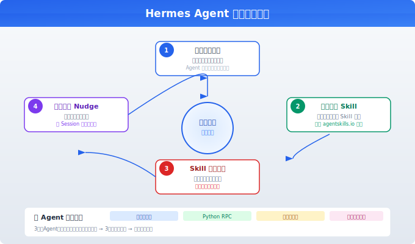

# Hermes Agent 开源 Agent

> Nous Research 出品的开源个人 Agent（197K Stars）。不止是一个助理——它有**闭环学习机制**：从每次交互中创建技能、改进技能、积累知识。用越久越了解你。

## 目录

- [Hermes Agent 是什么](#hermes-agent-是什么)
- [核心能力](#核心能力)
- [闭环学习：它如何成长](#闭环学习它如何成长)
- [它能做什么](#它能做什么)
- [部署与模型自由](#部署与模型自由)
- [和 OpenClaw 的对比](#和-openclaw-的对比)
- [快速上手](#快速上手)
- [总结](#总结)
- [参考链接](#参考链接)

你好，我是江小湖。在[全景概览](./01-mainstream-agents.md)中你看到了个人助理这个品类。Hermes Agent 是 Nous Research 开发的开源产品（2026 年 2 月发布），和 OpenClaw 定位类似但有一个关键差异：**它会自己成长**。

## Hermes Agent 是什么

Hermes Agent 是一个**自主成长的开源个人 Agent**。它像 OpenClaw 一样运行在你自己的设备上，通过聊天应用与你交互。但它最独特的地方在于一个**闭环学习机制**：从每次交互中学习——记住偏好、创建技能、改进技能、积累知识。用越久，它越了解你。

**一句话定位**：一个会自己成长的 AI Agent。

由 Nous Research（知名的开源 AI 研究机构，以 Hermes 系列模型闻名，200K+ GitHub Stars）开发和维护。


## 核心能力

| 能力 | 说明 |
|------|------|
| **持久记忆** | 记住偏好、项目上下文、历史对话，跨 Session 不丢失 |
| **自动技能创建** | 解决复杂问题后，自动将方法打包为可复用技能 |
| **技能自我改进** | 使用技能时自动优化，不成功则修正 |
| **记忆提醒（Nudge）** | 主动提醒你去记录值得保留的信息 |
| **子 Agent 委派** | 拆解任务给子 Agent 并行执行，不阻塞主对话 |
| **编码 Agent 编排** | 调度 Claude Code、Codex、Kimi Code 等编码 Agent |
| **多平台** | Telegram、Discord、Slack、WhatsApp、Signal、CLI、QQ Bot |
| **模型自由** | 200+ 模型，切换无需改代码 |
| **定时任务（Cron）** | 自然语言定义，结果投递到任意平台 |
| **沙箱执行** | 6 种后端：本地、Docker、SSH、Daytona、Singularity、Modal |
| **MCP 支持** | 连接 MCP Server 扩展工具 |
| **语音模式** | 语音收发 + Discord 语音频道实时对话 |
| **浏览器自动化** | 多个后端（Browserbase、Browser Use、本地 CDP） |
| **图像生成** | 9 种模型（FLUX、GPT-Image、Ideogram 等） |
| **上下文感知** | 自动加载项目 Context File（CLAUDE.md、AGENTS.md 等） |

## 闭环学习：它如何成长

这是 Hermes Agent 区别于所有产品的核心机制。它的学习循环：

1. **解决复杂问题** → 你要求它完成一个你不熟悉的任务
2. **自动创建 Skill** → Agent 将解决方案打包为可复用的 Skill 文件
3. **Skill 自我改进** → 下次使用这个 Skill 时，Agent 自动优化它
4. **记忆提醒** → Agent 主动询问"这条信息值得记住吗？"
5. **跨 Session 回顾** → Agent 能在旧对话中搜索相关经验

结果是：**头一周 a 你可能觉得自己在教它做事，一个月后它已经比你更熟悉你的工作模式。** 这和传统 Agent "每次从头开始"的体验完全不同。

<p align="center"><br/><em>图：Hermes 四步闭环学习——越用越强的自成长机制</em></p>

## 子 Agent 系统

Hermes 的子 Agent 不只是"后台跑一个任务"——它提供了完整的子 Agent 编程模型：

- **隔离上下文**：每个子 Agent 有独立的对话、终端、Python RPC，主会话上下文不受影响
- **Python RPC**：你可以写 Python 脚本通过 RPC 调用子 Agent 工具，将多步流水线压缩为一次推理调用
- **并行工作流**：一个研究任务可以拆为 3 个子 Agent 同时进行——一个搜索网页、一个读文档、一个写代码——完成后汇总
- **零上下文成本**：子 Agent 的结果以摘要形式返回，不膨胀主会话上下文

典型场景：你让 Hermes 调研"Agent 评测的最新方法"。它拆为 3 个子 Agent——一个读 SWE-bench 论文、一个搜索 Reddit 讨论、一个看最新 Benchmark 排行榜。3 分钟后返回一份综合报告，期间你可以继续和它聊天做其他事。

## 它能做什么

**日常个人助理**：通过聊天应用管理日程、做研究、回答问题。数据完全由你控制。

**研究助手**：异步子 Agent 系统特别适合研究——让一个子 Agent 去调研市场，另一个分析竞品，主 Agent 继续和你对话，完成后汇总结果。不阻塞、不串扰。

**编码 Co-pilot**（独特能力）：通过 Code Bridge 调度本地 Claude Code、Codex、Kimi Code 执行编码任务。Hermes 充当"调度中心"，把编码工作分发给最合适的工具。

**自动技能积累**（独特能力）：解决复杂问题后自动打包为 Skill。下次遇到同类问题直接使用，不需要重新思考和重复描述。

**定时自动化**：用自然语言设置定时任务——"每天早上 9 点检查服务器健康，结果发到 Telegram""每周一整理未读邮件，标记重要事项"。

**内容创建**：图像生成、语音合成、文本生成——支持的模型多，你可以在不同任务间切换不同模型。

**研究实验**：作为 Nous Research 的产品，它支持批量生成 Agent 轨迹、记录运行日志，可用于研究实验。

## Skills 生态

Hermes 的 Skills 兼容 **agentskills.io** 开放标准，这意味着 Skills 可以跨 Agent 框架复用。社区 Skills Hub 已有大量可直接使用的 Skill。

Skills 在 Hermes 中有几个独特机制：
- **自动创建**：完成复杂任务后，Agent 主动询问"要不要把这个方案存为 Skill"
- **自动改进**：使用 Skill 时，Agent 发现步骤不够好会主动优化它
- **条件激活**：只有当前工具可用时才显示对应的 Skill，避免无效菜单
- **前置检查**：Skill 可以声明依赖工具，不满足时自动隐藏

这和 Claude Code 需要手动写 Skill 的方式不同——Hermes 在你不知不觉中就帮你积累了 Skill 库。

## CLI 与 TUI 体验

Hermes 有一个功能丰富的终端界面（TUI），基于 React/Ink 构建：

- **粘性输入框**：多行编辑，支持粘贴大段代码
- **斜杠命令补全**：自动补全 `/skill`、`/model`、`/tools` 等命令
- **实时流式输出**：工具调用结果实时显示，支持 OSC-52 剪贴板
- **会话历史**：上下键浏览历史命令，支持搜索
- **子 Agent 监控**：在状态栏看到正在运行的子 Agent 数量

## 部署与模型自由

| 部署方式 | 说明 |
|----------|------|
| **本地（Linux/macOS/WSL2）** | 一键安装，60 秒可用 |
| **Docker** | 隔离运行，适合服务器 |
| **SSH 远程** | 在远端服务器运行，本地控制 |
| **Daytona / Modal** | 无服务器模式，闲置时几乎零成本 |

**模型自由**是其另一核心差异。通过 OpenRouter 可访问 200+ 模型，也支持 Nous Portal、OpenAI、Anthropic、Google、DeepSeek、本地 Ollama、vLLM 等。用 `hermes model` 命令切换模型，不需要修改任何代码。

这意味着你可以在高难度任务上用 Claude Opus，日常简单任务上用更便宜的模型，编码任务上用 Codex——不绑定任何单一供应商。

## 和 OpenClaw 的对比

| 维度 | Hermes Agent | OpenClaw |
|------|--------------|----------|
| **Stars** | 197K | 379K |
| **语言** | Python | TypeScript |
| **消息通道** | 6+（含 QQ Bot） | 20+（含微信/QQ） |
| **模型支持** | 200+（OpenRouter） | 35+ 供应商 |
| **独特优势** | 闭环学习（自动创建/改进技能）、编码 Agent 编排、模型自由 | 通道覆盖最广、Heartbeat 主动检查、ClawHub 技能市场 |
| **适合人群** | Python 开发者、需模型自由度、研究导向 | 需最多平台覆盖、需微信 |

**选型建议**：需要微信 → OpenClaw。需要模型自由度和编码 Agent 编排、Python 技术栈 → Hermes。两个都试试不冲突——它们可以运行在同一台机器上服务于不同场景。

## 快速上手

```bash
curl -fsSL https://raw.githubusercontent.com/NousResearch/hermes-agent/main/scripts/install.sh | bash
```

自动安装所有依赖。不需要 sudo。安装后走快速设置向导，连接到聊天平台和模型供应商，几分钟内开始使用。

## 总结

- Hermes Agent 的核心差异是闭环学习——自动创建和改进技能，越用越强
- 200+ 模型自由 + 编码 Agent 编排，灵活度同类最高
- 6 种终端后端 + 无服务器支持，部署灵活
- 和 OpenClaw 定位类似但各有侧重——选型取决于技术栈和平台需求

> 到这里你已经了解了当前主流的 Agent 产品生态。下一章开始进入 Agent 底层原理——[01 — LLM 基础](../../01-llm-basics/README.md)。

## 参考链接

- [Hermes Agent GitHub](https://github.com/NousResearch/hermes-agent)
- [Hermes Agent 官方文档](https://hermes-agent.nousresearch.com/docs/)
- [Hermes Agent 功能概览](https://hermes-agent.nousresearch.com/docs/user-guide/features/overview)
- [Nous Research](https://nousresearch.com/)
