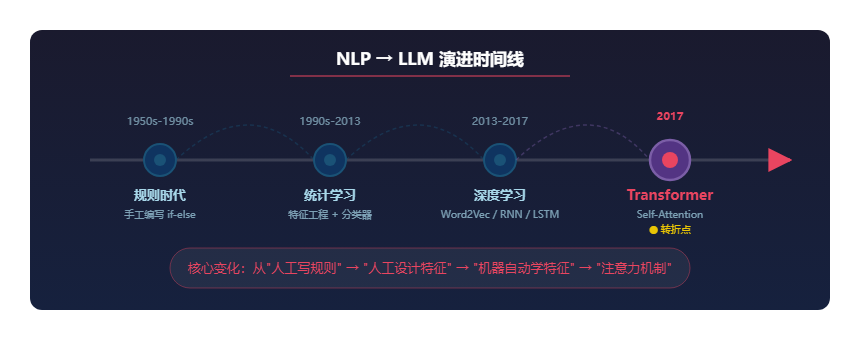

# LLM 的技术根基：从 NLP 到 Transformer

## 目录

- [概述](#概述)
- [什么是 NLP](#什么是-nlp)
- [规则时代（1950s–1990s）](#规则时代1950s1990s)
  - [核心思路](#核心思路)
  - [典型系统：ELIZA](#典型系统eliza)
  - [为什么走不通](#为什么走不通)
- [统计学习时代（1990s–2013）](#统计学习时代1990s2013)
  - [核心思路](#核心思路-1)
  - [关键突破：从规则到概率](#关键突破从规则到概率)
  - [为什么还不够](#为什么还不够)
- [深度学习时代（2013–2017）](#深度学习时代20132017)
  - [核心思路](#核心思路-2)
  - [词向量：让机器感知语义](#词向量让机器感知语义)
  - [RNN / LSTM：逐词处理与长程遗忘](#rnn--lstm逐词处理与长程遗忘)
  - [Seq2Seq + Attention：编码-解码的雏形](#seq2seq--attention编码-解码的雏形)
  - [为什么还是不够](#为什么还是不够)
- [Transformer 的诞生（2017）](#transformer-的诞生2017)
  - [自注意力机制](#自注意力机制)
  - [并行化：训练速度的飞跃](#并行化训练速度的飞跃)
  - [Transformer 改变了什么](#transformer-改变了什么)
- [参考链接](#参考链接)

## 概述

[上一篇](./01-llm-overview.md)我们知道了 LLM 的本质是"预测下一个词"。但 LLM 不是凭空出现的——在它之前，人类已经花了几十年教机器"读懂文字"。**这篇文章回答的问题是：LLM 之前的技术到底卡在哪里？Transformer 又是怎么解决这些问题的？** 理解这段演进，你才能真正明白 LLM 为什么是今天这个样子，以及为什么 Transformer 是一切的基础。

## 什么是 NLP

**NLP（Natural Language Processing，自然语言处理）** 是让计算机理解、生成和处理人类语言的技术。它并不遥远——搜索引擎理解你的查询词、垃圾邮件过滤器识别广告、输入法联想下一个词、翻译软件把中文变成英文，背后都是 NLP。

传统 NLP 的发展经历了三个阶段，每个阶段都在用不同的方式解决同一个核心问题：**怎么让机器从文字中提取有用的信息？**

<p align="center">
  
  <br/>
  <em>从规则系统到 Transformer 的 NLP 演进之路</em>
</p>

## 规则时代（1950s–1990s）

### 核心思路

**人工告诉机器怎么做。** 这个阶段的 NLP 系统，本质上就是一堆 if-else 规则。

### 典型系统：ELIZA

1966 年 MIT 开发的 ELIZA 是最早的"聊天机器人"之一。它用模式匹配模拟心理医生对话：

```python
# ELIZA 的核心逻辑（简化版）
rules = {
    "I am (.*)":       "Why are you {0}?",
    "I feel (.*)":     "Why do you feel {0}?",
    "(.*) mother(.*)": "Tell me more about your mother.",
}

def respond(user_input):
    for pattern, template in rules.items():
        match = re.match(pattern, user_input)
        if match:
            return template.format(*match.groups())
    return "Tell me more."
```

用户输入 `"I am sad"`，ELIZA 回复 `"Why are you sad?"`。看起来像在对话，实际上只是字符串替换。ELIZA 没有任何"理解"，它不知道 sad 是什么感觉，也不知道自己说了什么。

### 为什么走不通

规则系统有三个致命问题：

1. **规则写不完**：语言太灵活了——"你去不去？""帮我看看这个""难道你觉得这样好"都是问句，你不可能穷举所有问法
2. **规则互相冲突**：规则多了以后，新规则和旧规则矛盾，系统越来越难维护
3. **无法泛化**：给英语写的规则完全不能用于中文，甚至换个领域就要重写

规则时代持续了近 40 年，最终人们意识到：**语言太复杂了，人工写规则这条路走不通。**

## 统计学习时代（1990s–2013）

### 核心思路

**让机器从数据中学规律。** 既然规则写不完，不如给机器大量文本，让它自己统计出规律。

### 关键突破：从规则到概率

统计学习的核心转变是：不再用确定性规则做判断，而是用概率模型做预测。

以垃圾邮件过滤为例，传统规则方法：

```python
# 规则方法：硬编码判断条件
def is_spam_rule(email):
    if "免费" in email or "中奖" in email:
        return True
    if email.sender not in contacts:
        return True
    return False
```

统计学习方法：

```python
# 统计方法：从数据中学概率
def is_spam_bayes(email):
    # P(垃圾|邮件) ∝ P(邮件|垃圾) × P(垃圾)
    # 用训练数据统计每个词在垃圾/正常邮件中出现的频率
    p_spam = prior_spam  # 先验概率
    for word in email.words:
        p_spam *= word_spam_prob[word]   # 该词在垃圾邮件中的概率
        p_spam /= word_normal_prob[word]  # 该词在正常邮件中的概率
    return p_spam > 0.5
```

**朴素贝叶斯（Naive Bayes）** 是这个时期最经典的算法。它不需要你写任何规则，只需要标注好的训练数据——哪些邮件是垃圾、哪些不是。模型会自动统计出"免费"这个词出现在垃圾邮件中的概率是多少，然后对新邮件做分类。

这个时期还诞生了几个重要技术：

- **HMM（隐马尔可夫模型）**：用于词性标注和命名实体识别，把语言建模为状态转移过程
- **CRF（条件随机场）**：比 HMM 更灵活的序列标注方法，广泛用于中文分词
- **TF-IDF + SVM**：文本分类的经典组合，TF-IDF 提取关键词权重，SVM 做分类决策

### 为什么还不够

统计学习比规则灵活得多，但有一个根本限制：**特征要靠人来设计。**

做垃圾邮件过滤，你要设计"是否包含免费""发件人是否在通讯录"这些特征；做情感分析，你要设计"是否包含否定词""有没有转折连词"这些特征。每个 NLP 任务都需要大量的领域经验来做特征工程——**人类成了瓶颈。**

## 深度学习时代（2013–2017）

### 核心思路

**让机器自己学特征。** 深度学习的核心承诺是：你只需要提供数据和任务目标，神经网络会自动学到有用的特征，不再需要人工设计。

### 词向量：让机器感知语义

2013 年 Word2Vec 的出现是一个转折点。**词向量（Word Embedding）** 是把每个词映射成一组数字（向量），而且语义相近的词会被映射到相近的位置。

```python
# Word2Vec 训练后，语义相近的词向量也相近
king  → [0.50, 0.68, 0.21, ...]
queen → [0.49, 0.71, 0.18, ...]
apple → [0.02, -0.15, 0.89, ...]

# 经典的词向量运算
king - man + woman ≈ queen
```

这意味着机器第一次有了对词义的"感觉"——它知道"国王"和"女王"是近义词，而"国王"和"苹果"没有关系。词向量是深度学习 NLP 的基石，后续所有模型（包括 Transformer）都建立在"文本→向量"这个基本操作之上。

### RNN / LSTM：逐词处理与长程遗忘

有了词向量，下一步是处理整句话。**RNN（循环神经网络）** 的思路是像人类阅读一样，从左到右逐词处理，每读一个词就更新一次"记忆状态"。

```python
# RNN 的核心逻辑（简化版）
hidden = [0, 0, 0, ...]  # 初始记忆状态

for word_vector in sentence:
    hidden = tanh(W_input @ word_vector + W_hidden @ hidden + bias)
    # 每一步：用当前词 + 之前的记忆 → 更新记忆
```

**LSTM（长短期记忆网络）** 在 RNN 基础上加了"门控机制"，让网络自己决定哪些信息该记住、哪些该忘掉，一定程度上缓解了遗忘问题。

但 RNN/LSTM 有一个根本缺陷：**句子太长就会"忘"掉前面的内容。** 就像你读一篇很长的文章，读到结尾已经忘了开头说什么。这不是工程优化能解决的——它是 RNN 逐词处理这种架构的本质限制。

### Seq2Seq + Attention：编码-解码的雏形

**Seq2Seq（序列到序列模型）** 用于机器翻译等任务，由两个 RNN 组成：编码器负责"读"源语言，解码器负责"写"目标语言。

```python
# Seq2Seq 的核心逻辑
encoder_hidden = encode(source_sentence)  # 编码器：把源语言压缩成一个向量
target_sentence = decode(encoder_hidden)  # 解码器：从向量生成目标语言
```

但编码器要把整个源语言句子压缩成一个固定长度的向量——句子越长，信息损失越严重。

**注意力机制（Attention）** 正是为了解决这个问题而提出的：解码器在生成每个词时，不再只看编码器的最终状态，而是**回头看源语言的每一个位置，自动判断哪些词跟当前要生成的词最相关**。

```python
# Attention 的核心逻辑
for each target_word:
    # 对源语言的每个位置计算"相关性分数"
    scores = target_hidden @ source_hiddens.T  # 点积计算相关性
    weights = softmax(scores)                   # 归一化为权重
    context = weights @ source_hiddens          # 加权求和，得到最相关的信息
    target_word = generate(context)             # 用上下文信息生成目标词
```

这个"回头看、找相关"的机制，为后来 Transformer 的核心思想埋下了种子。

### 为什么还是不够

深度学习让 NLP 有了质的飞跃，但三个问题仍然没有解决：

1. **长程依赖**：即使 LSTM 加了门控，处理超过几百个 token 的序列仍然会丢失信息
2. **无法并行**：RNN 必须逐词处理，训练速度受限于序列长度，无法充分利用 GPU
3. **任务孤立**：每个任务需要单独训练一个模型，做翻译的模型不会做摘要，做分类的模型不会做问答

这三个问题，Transformer 一次性全部解决了。

## Transformer 的诞生（2017）

2017 年，Google 在论文 *Attention Is All You Need* 中提出了 Transformer 架构。它的核心思想其实很直觉：**处理一个词的时候，不再像 RNN 那样只能看到前面的内容，而是同时看到整个句子的所有词，并自动判断哪些词跟当前词最相关。**

### 自注意力机制

**自注意力（Self-Attention）** 是 Transformer 的核心。它做的事情和上一节讲的 Attention 本质一样——在处理每个词时，回头看序列中的所有词，计算相关性，然后加权汇总信息。区别在于：Seq2Seq 的 Attention 是"解码器看编码器"，而自注意力是"序列内部互相看"。

打个比方：RNN 像是逐字朗读一篇文章的人，读到后面就忘了开头；**Transformer 像是能同时看到整篇文章的人**，处理任何一个段落时都能直接参考所有其他段落，不需要"记住"前面的内容——因为它始终能看到。

自注意力的计算过程可以简化为三步：

```python
# Self-Attention 简化版
# 每个词生成三个向量：Query（我在找什么）、Key（我是什么）、Value（我的内容）
Q = X @ W_Q  # Query：当前词想找什么信息
K = X @ W_K  # Key：每个词能提供什么信息
V = X @ W_V  # Value：每个词的实际内容

# 第一步：计算相关性——Query 和每个 Key 的点积
scores = Q @ K.T / sqrt(d_k)

# 第二步：归一化为权重
attention_weights = softmax(scores)  # 每个词的权重，和为 1

# 第三步：加权汇总——用权重对 Value 加权求和
output = attention_weights @ V
```

举个例子，处理 `"The animal didn't cross the street because it was too tired"` 这句话时，Transformer 在处理 `"it"` 这个词时，自注意力机制会让 `"it"` 自动关注到 `"animal"`（因为语义上 "it" 指代 "animal"），而不是 `"street"`。**这个"找相关"的过程完全是数据驱动的，不需要人工指定。**

### 并行化：训练速度的飞跃

RNN 的计算是串行的——必须先处理第 1 个词，才能处理第 2 个词，以此类推。Transformer 的自注意力是**所有词同时计算**的，没有先后依赖。这意味着：

- **训练速度大幅提升**：同样的数据量，Transformer 的训练速度比 RNN 快一个数量级
- **可以训练更大的模型**：速度提升使得训练拥有数十亿甚至万亿参数的模型成为可能
- **充分利用 GPU**：矩阵运算天然适合 GPU 并行，Transformer 的计算几乎全是矩阵乘法

**没有并行化，就没有今天的 LLM。** GPT-3 用了 1750 亿参数在 3000 亿 token 上训练，如果用 RNN 架构，这个训练可能需要几十年；用 Transformer，几个月就完成了。

### Transformer 改变了什么

Transformer 解决了前面所有方法的核心瓶颈：

| 问题 | RNN/LSTM | Transformer |
|------|----------|-------------|
| 长程依赖 | 逐词传递，容易遗忘 | 任意两个位置直接连接，不会遗忘 |
| 训练速度 | 串行处理，无法并行 | 全并行，充分利用 GPU |
| 任务通用性 | 每个任务单独训练 | 一个架构适配所有序列任务 |

但 Transformer 本身只是一个架构——就像发明了发动机，还不等于造出了汽车。从 Transformer 到今天的 LLM，中间还经历了预训练、规模涌现、人类对齐等一系列关键突破。

> 接下来请阅读 [LLM 发展简史](./03-llm-evolution.md)，了解从 Transformer 到 ChatGPT 再到 Agent 时代的完整脉络。
>
> 关于 Transformer 架构的技术细节（多头注意力、位置编码、残差连接），请参考 [Transformer 架构直觉](./05-transformer-intuition.md)。

## 参考链接

- [Attention Is All You Need (2017)](https://arxiv.org/abs/1706.03762) — Transformer 原始论文
- [Efficient Estimation of Word Representations in Vector Space (2013)](https://arxiv.org/abs/1301.3781) — Word2Vec 论文
- [The Illustrated Transformer](https://jalammar.github.io/illustrated-transformer/) — 最经典的 Transformer 图解
- [Sequence to Sequence Learning with Neural Networks (2014)](https://arxiv.org/abs/1409.3215) — Seq2Seq 论文
- [Neural Machine Translation by Jointly Learning to Align and Translate (2014)](https://arxiv.org/abs/1409.0473) — Attention 机制的提出
- [Long Short-Term Memory (1997)](https://www.bioinf.jku.at/publications/older/2604.pdf) — LSTM 原始论文
- [Speech and Language Processing (Jurafsky & Martin)](https://web.stanford.edu/~jurafsky/slp3/) — NLP 经典教材
