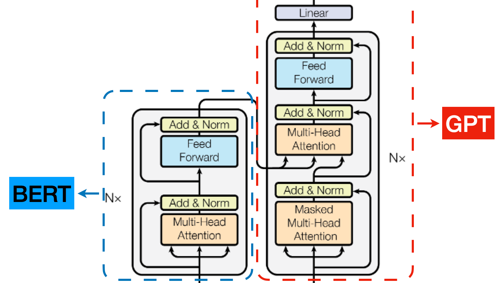
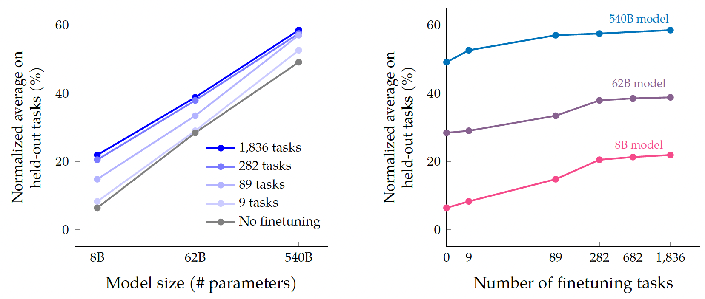
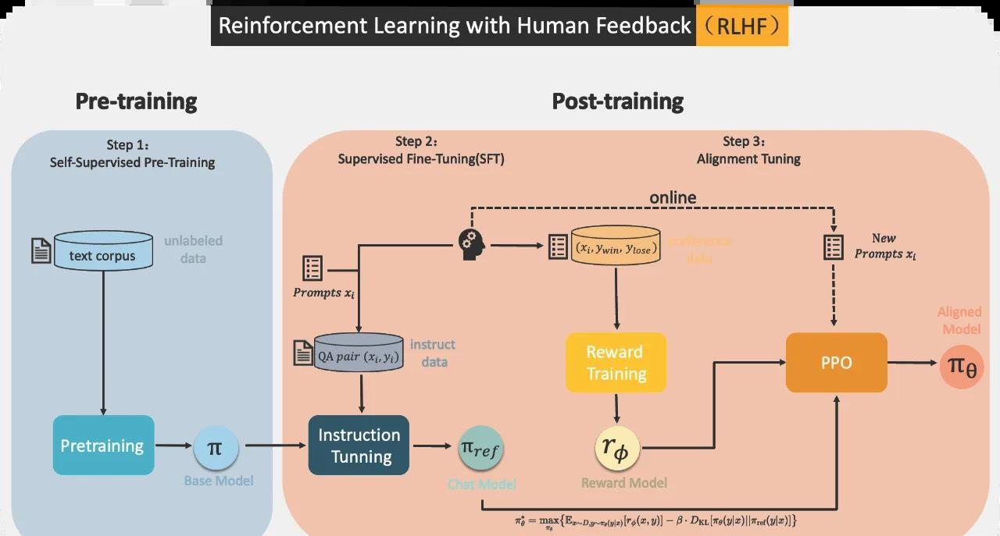
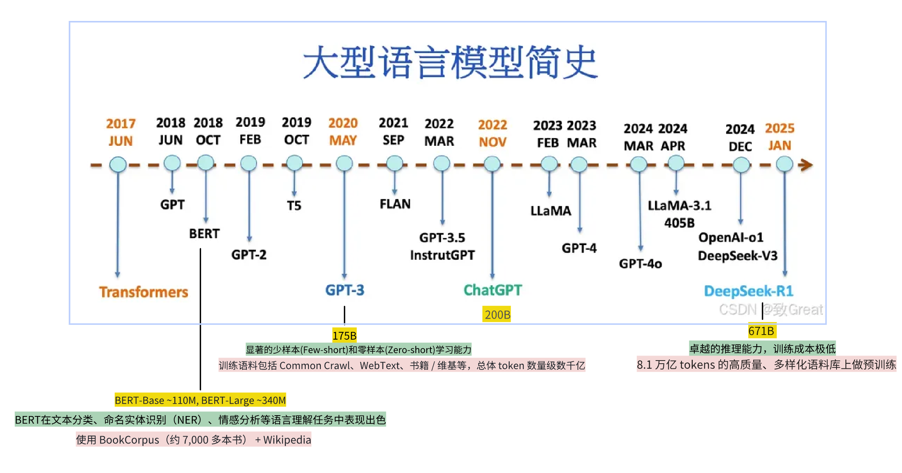

# LLM 发展简史

> 从 2018 年 BERT 到 2025 年 Agent 时代，LLM 经历了预训练、规模涌现、对齐革命和开源追赶等关键转折。本文用 15 分钟建立一条完整时间线，理解这些历史如何影响你今天的开发决策。

## 目录

- [概述](#概述)
- [2018：预训练范式确立](#2018预训练范式确立)
- [2019-2020：规模效应与涌现能力](#2019-2020规模效应与涌现能力)
- [2021：LLM 学会写代码](#2021llm-学会写代码)
- [2022：对齐与 ChatGPT 时刻](#2022对齐与-chatgpt-时刻)
- [2023：多模态与开源追赶](#2023多模态与开源追赶)
- [2024-2025：Agent 时代](#2024-2025agent-时代)
- [时间线总览](#时间线总览)
- [总结](#总结)
- [参考链接](#参考链接)

## 概述

[上一篇](./02-nlp-to-transformer.md)我们讲到 2017 年 Transformer 架构的诞生，它解决了 RNN 的遗忘和并行两大难题。但 Transformer 只是一个架构——就像发明了发动机，还不等于造出了汽车。

从 Transformer 到今天的 LLM，中间经历了一系列关键突破。这篇文章用 15 分钟帮你建立一条完整的时间线：LLM 是怎么一步步从"文本补全器"变成"能调用工具的 Agent"的。这些背景直接影响你今天的开发决策——比如为什么选 Instruct 模型而不是 Base 模型，为什么开源模型值得认真对待。

## 2018：预训练范式确立

2018 年，两个里程碑式的模型几乎同时出现，它们走了两条截然不同的路：

- **BERT**（Google）：用 Transformer 的 Encoder 部分，通过"完形填空"的方式训练——随机遮住句子中的一些词，让模型去猜。这让它能**双向理解**文本（同时看到一个词的左边和右边），在阅读理解、文本分类等任务上刷新了记录。但 BERT 不能生成文本——它擅长"理解"，不擅长"创作"。

- **GPT-1**（OpenAI）：用 Transformer 的 Decoder 部分，通过"预测下一个词"的方式训练。它只能从左到右看（单向），理解能力不如 BERT，但它能**生成文本**——给一个开头，它能续写下去。

  
   
  <em>BERT 双向理解 vs GPT 单向生成——两条路线决定了后来十年的分野</em>

这两个模型确立了一个全新的范式：**先在海量无标注文本上预训练，再针对具体任务微调（Fine-tuning）。** 以前每个 NLP 任务都要从零开始训练，现在只需要在预训练好的模型上做少量调整就行。这就像你先学会了"通用的语言能力"，再专门学习"法律文书写作"或"代码编程"——效率完全不同。

历史证明，GPT 的"生成"路线赢了。不是因为理解不重要，而是因为**生成是更通用的能力**——能生成文本的模型，也能通过生成来完成理解任务。今天我们使用的绝大多数 LLM，都是 GPT 这条路线的延续。

## 2019-2020：规模效应与涌现能力

GPT-1 只有 1.17 亿参数，效果一般。OpenAI 决定简单粗暴地"堆大"：

- **GPT-2**（2019, 15 亿参数）：生成的文本已经相当流畅，OpenAI 一度担心被滥用而延迟发布。
- **GPT-3**（2020, 1750 亿参数）：质变发生了。

GPT-3 最震撼的不是它生成的文本更好，而是它展示了一种全新的能力——**不需要微调，只靠 Prompt 里给几个示例就能完成新任务**。这叫 **少样本学习（Few-shot Learning）**。比如你在 Prompt 里给三个"英文→法文"的翻译示例，GPT-3 就能翻译第四句，尽管它从未被专门训练过翻译任务。

  
   
  <em>规模定律：模型越大，能力越强——且跨越阈值后会涌现出全新的能力</em>

模型规模跨过某个阈值后，突然出现了小模型完全不具备的能力（算术、翻译、推理、代码），这被称为**涌现能力（Emergent Abilities）**。与此同时，OpenAI 发现了**规模定律（Scaling Laws）**：模型性能与参数量、数据量、计算量之间存在可预测的幂律关系——模型越大、数据越多、效果就越好，而且这个趋势是平滑可预测的。这为后续所有公司"暴力堆参数"提供了理论依据。

**对开发者意味着什么**：规模定律解释了为什么行业一直在"卷"参数量——不是因为我们喜欢大，而是因为**不够大就不行**。当你在选模型时，参数量和训练数据量仍然是判断基础能力的重要指标。

## 2021：LLM 学会写代码

**Codex** 基于 GPT-3 在大量代码数据上微调，成为 GitHub Copilot 的基础。这是 LLM 第一次展示出强大的编程能力——你用自然语言描述需求，它生成代码。

这个事件对开发者意义重大：它证明了 LLM 不只是"聊天机器人"，而是可以真正参与软件开发的工具。从 Copilot 到今天的 Cursor、Windsurf、GitHub Copilot，本质都是同一条路线的延续——**让 LLM 理解你的意图，然后生成可执行的代码**。

Codex 还揭示了一个重要趋势：LLM 在**特定领域微调**后，能力会大幅跃升。通用模型做代码生成只有 60 分，但在 GitHub 代码库上微调后能到 85 分。这为后来的领域专用模型（代码模型、数学模型、Agent 模型）铺平了道路。

## 2022：对齐与 ChatGPT 时刻

GPT-3 虽然能力强大，但有个严重问题：**不听话**。你让它写一封邮件，它可能给你续写一段小说；你问它一个问题，它可能开始胡言乱语。因为它的训练目标是"预测下一个词"，不是"按照你的指令做事"。

OpenAI 用 **基于人类反馈的强化学习（RLHF, Reinforcement Learning from Human Feedback）** 解决了这个问题：

1. 先让人类标注员给模型的不同回答打分（哪个更好、更安全、更有帮助）
2. 用这些打分数据训练一个"奖励模型"
3. 用奖励模型来引导 LLM 生成更好的回答

  
   
  <em>现代 LLM 的三步训练流程：预训练 → 指令微调 → 人类对齐</em>

这样训练出来的 **InstructGPT** 让模型从"文本补全器"变成了"遵循指令的助手"。2022 年 11 月，基于同样技术的 **ChatGPT** 发布，两个月内用户突破 1 亿，成为史上增长最快的消费级应用。

这个阶段确立了现代 LLM 的三步训练流程：**预训练 → 指令微调（SFT）→ 人类对齐（RLHF）**，后续的 [训练流程概览](./06-training-pipeline.md) 会详细展开。

**对开发者意味着什么**：这就是为什么你在 HuggingFace 上会看到同一个模型有 `Base` 和 `Instruct` 两个版本。Base 模型是预训练完的半成品，不会听指令；Instruct 模型才是你开发 Agent 时应该用的版本。选错了，后面全白搭。

## 2023：多模态与开源追赶

2023 年是 LLM 领域格局剧变的一年：

- **GPT-4**（2023.3）：支持图片输入，推理能力大幅提升，成为第一个真正实用的**多模态（Multimodal）**大模型。它证明了 LLM 不只能处理文本——图片、语音、视频都可以成为输入和输出。
- **Llama 系列**（Meta）：开源模型能力逐步逼近闭源，彻底改变了"只有大公司才能做 LLM"的局面。Llama 2 开源后，围绕它涌现了大量微调工具、部署方案和评测体系。
- **Qwen、DeepSeek** 等中国模型在中文理解和代码生成场景表现突出，给开发者提供了更多选择。

**开源对 Agent 开发者的意义不只是免费**——它意味着你可以本地部署（隐私安全）、私有化定制（领域适配）、不受 API 限制（无调用频率瓶颈）。对于需要处理敏感数据或要求低延迟的 Agent 场景，开源模型是闭源 API 做不到的选择。

## 2024-2025：Agent 时代

LLM 的定位从"聊天工具"进化为"能调用工具、自主决策的智能体"。这不是一个单点突破，而是多条线索同时成熟后的汇合：

**Agent 框架成熟**。LangChain、LangGraph 等框架让开发者不再需要从零搭建 Agent 循环。你只需要定义工具和状态，框架帮你处理重试、错误恢复、并行执行等工程细节。

**协议标准化**。**模型上下文协议（MCP, Model Context Protocol）** 统一了工具调用接口，A2A（Agent-to-Agent）定义了 Agent 间协作方式。这意味着你写的 Agent 可以和其他人的 Agent 互操作，不用为每个工具单独写适配器。

**推理能力飞跃**。以 o1、DeepSeek-R1 为代表的**推理模型（Reasoning Model）**让 LLM 学会了"先想再答"。在生成最终答案之前，模型会先进行一段内部的思维链（Chain of Thought）计算，在数学、逻辑、规划等任务上的表现有了质的飞跃。

**多模态成为标配**。文本 + 图片 + 语音 + 视频，模型能"看"能"听"。这让 Agent 的应用场景从纯文本扩展到了视觉理解、语音交互、视频分析等领域。

**这也正是本课程的起点**——我们站在 Agent 时代的开端，学习如何用 LLM 构建真正有用的智能体。

## 时间线总览

  
   
  <em>从 Transformer 到 Agent 时代——LLM 七年演进之路</em>

## 总结

回顾这段历史，几个关键转折点直接塑造了你今天的开发环境：

- **2018 预训练范式**：BERT 和 GPT 确立了"先预训练、再微调"的路线，GPT 的生成路线最终胜出。
- **2020 规模涌现**：GPT-3 证明了"够大就行"，规模定律为行业提供了明确的投资方向。
- **2022 对齐革命**：RLHF 让模型从"文本补全器"变成"听话的助手"，ChatGPT 引爆了大众关注。
- **2023 多模态 + 开源**：GPT-4 和 Llama 让 LLM 的能力边界大幅扩展，开源生态开始追赶闭源。
- **2024-2025 Agent 时代**：框架成熟、协议标准化、推理能力飞跃，LLM 从"聊天"进化到"做事"。

对开发者来说，最重要的启示是：**选对模型版本（Base vs Instruct）、理解开源模型的价值、关注 Agent 生态的标准化**——这些判断都来自这段历史的积累。

> 接下来请阅读 [Token 与 Embedding](./04-token-and-embedding.md)，从最微观的视角理解 LLM 的工作基础。

## 参考链接

- [BERT: Pre-training of Deep Bidirectional Transformers (2018)](https://arxiv.org/abs/1810.04805) — BERT 原始论文
- [Language Models are Few-Shot Learners (GPT-3, 2020)](https://arxiv.org/abs/2005.14165) — GPT-3 论文，少样本学习和规模定律
- [Training language models to follow instructions with human feedback (InstructGPT, 2022)](https://arxiv.org/abs/2203.02155) — RLHF 对齐论文
- [Scaling Laws for Neural Language Models (2020)](https://arxiv.org/abs/2001.08361) — 规模定律
- [3Blue1Brown — But what is a GPT?](https://www.youtube.com/watch?v=wjZofJX0v4M) — 直观视频讲解
- [Andrej Karpathy — State of GPT](https://www.youtube.com/watch?v=bZQun8Y4L2A) — GPT 训练全流程概览
