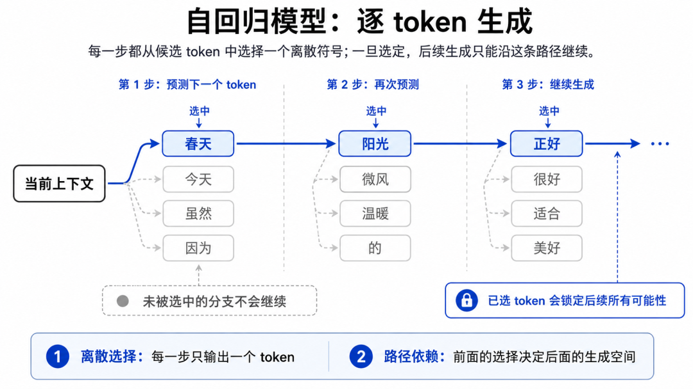
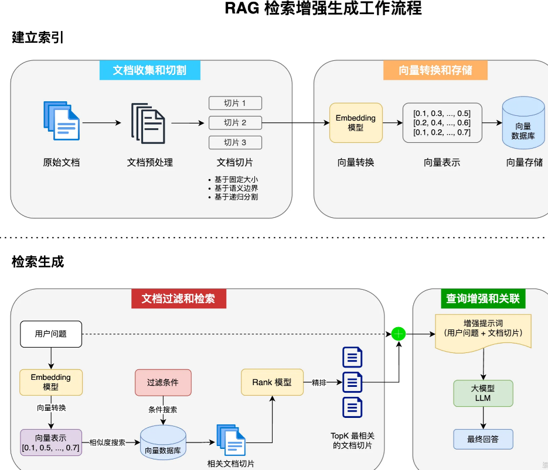

# LLM 的局限与工程对策

> [LLM 能做什么：五项核心能力的深度展开](./04-capabilities.md)讲了 LLM 能做什么，这篇反过来看——它**做不到什么**、为什么做不到、工程上怎么应对。每个局限都有明确的架构根因，理解了根因，你才能对症下药，而不是盲目地改 Prompt 或微调。

## 目录

- [局限的架构根因](#局限的架构根因)
- [幻觉：最危险的局限](#幻觉最危险的局限)
- [知识截止：时间锁在预训练日](#知识截止时间锁在预训练日)
- [数学与精确逻辑的弱点](#数学与精确逻辑的弱点)
- [上下文窗口与迷失在中间](#上下文窗口与迷失在中间)
- [Agent 工程的应对策略](#agent-工程的应对策略)
- [总结](#总结)
- [参考链接](#参考链接)

你好，我是江小湖。前面讲了 LLM 的五项核心能力，但光知道"它能做什么"不够——你还需要知道它哪里做不到，以及为什么做不到。这篇把每个局限追到架构根因，再给出工程对策。

## 局限的架构根因

LLM 的四大局限，每一个都能追溯到前面文章讲过的架构设计选择：

| 局限 | 架构根因 | 将在哪里深入 |
|------|---------|------------|
| 幻觉 | 自回归预测（预测下一个词而非检索事实）+ 预训练数据含真假混杂信息 | 训练管线（预训练阶段） |
| 知识截止 | 知识来源是预训练数据，训练完成后无法主动更新 | 训练管线（预训练数据有截止日期） |
| 数学/逻辑弱点 | 分词机制看不见单个数字字母 + 自回归无法做精确符号运算 | Token与Embedding篇（Token机制）+ Transformer篇（自回归生成） |
| 迷失在中间 | 注意力分布偏向 Prompt 开头和结尾 + 位置编码对长距离衰减 | Transformer篇（注意力机制+位置编码） |

这不是偶然的 Bug，而是**架构设计带来的必然代价**。理解了根因，就不会试图用错误的方法去修复——比如用微调消除幻觉（根因在预训练，微调改不了），或者用更长 Prompt 解决数学问题（根因在分词机制，更多文字反而更乱）。

## 幻觉：最危险的局限

### 为什么会产生幻觉

两层原因叠加：

**第 1 层：自回归概率机制**。模型的生成逻辑是"下一个最可能的词是什么"，而不是"事实是什么"。当训练数据中没有对应的事实时，模型不是选择沉默，而是选择概率最高的续写——看起来合理，但可能是编造的。

**第 2 层：预训练数据混杂**。后文会讲到预训练数据来自整个互联网，包括大量不准确、矛盾甚至虚构的信息。模型在优化过程中无法区分真伪——准确的信息和错误的信息都被同样编码进了参数。

<p align="center">
  
  <br/>
  <em>自回归模型逐 Token 生成过程</em>
</p>

### 幻觉的具体表现

幻觉不只是"胡说八道"，它有多种形态：

**伪造学术引用**：模型会编造看起来完全真实的论文标题、作者、期刊名和 DOI 号，格式完美但查不到任何对应论文。

**虚构 API 函数**：在代码生成中，模型会调用根本不存在的方法或库函数，参数类型也对不上。

**事实错误但自信陈述**：模型会用极其确定的语言陈述错误事实，不带任何犹豫语气，比普通人犯错时更自信。

### 为什么幻觉难以根治

幻觉不是偶然的 Bug，而是自回归机制的**结构性特征**。你无法通过微调完全消除它，因为微调改的是"回答方式"，不是"底层概率机制"。模型永远会在不确定时选择概率最高的续写，而概率最高的续写未必是事实。

## 知识截止：时间锁在预训练日

### 根因：知识来自预训练数据

后文会讲到，模型参数中编码的所有信息都来自预训练阶段的互联网数据。预训练完成后，参数就固定了——模型无法主动获取新信息，也无法判断自己的参数中是否包含某个领域的信息。

这就导致两个问题：
- **旧信息**：模型可能告诉你已经过时的技术方案或已经失效的 API
- **无法判断自身盲区**：面对训练数据未覆盖的领域，模型不会坦白说"我的参数里没有这方面的信息"，而是基于已有参数的概率分布继续生成，可能给出看似合理但完全错误的回答

## 数学与精确逻辑的弱点

### 根因追溯

两层架构原因叠加：

**分词机制**（后文会详细展开）：分词把数字和字母拆成子词单位。比如 `34598` 可能被分成 `["345", "98"]` 两个 Token，`"strawberry"` 可能被分成 `["str", "aw", "berry"]`。模型看不到单个字符，自然无法精确地数字母个数或逐位计算。

**自回归生成**（后文会详细展开）：数学计算需要严格的符号运算——每一步都必须精确无误。但自回归生成是概率性的，每一步都有微小的不确定性，累积多步后误差就会放大。乘法 `34598 × 23489` 需要 5 位×5 位的多步计算，每一步的微小概率偏差都会让最终结果偏离正确答案。

### 实际表现

```
问: "34598 × 23489 = ?"
LLM答: "812,480,122"    ← 看起来合理，实际错误（正确答案: 812,518,422）

问: "strawberry 里有几个 r？"
LLM答: "2个"            ← 错误（实际是 3 个），因为分词后看不到每个字母
```

这不是"粗心"，而是**架构性限制**——分词机制遮挡了字符级信息，自回归无法做精确符号运算。

## 上下文窗口与迷失在中间

### 上下文窗口的物理限制

后文会讲 KV Cache 的机制——每一步推理都要和所有历史 Token 的 K/V 做注意力计算。上下文越长，KV Cache 越大（内存消耗），注意力计算越慢（推理成本）。这就是上下文窗口有物理上限的根本原因。

### 迷失在中间（Lost in the Middle）

即使模型支持 1M tokens 的上下文，你也不能随便塞满它。研究表明，模型对 Prompt 中信息的检索准确率不是均匀分布的：

- **开头**的信息准确率最高——它始终在注意力范围内
- **结尾**的信息准确率也高——紧邻生成位置，最近才处理过
- **中间**的信息准确率显著下降——被两端的信息"挤压"，注意力权重偏低

实测数据（来自 [Lost in the Middle 论文](https://arxiv.org/abs/2307.03172)）：在一个需要从长文本中检索特定事实的测试中，把关键信息放在开头或结尾，准确率 80%+；放在中间，准确率跌到 40% 以下。

**对 Prompt 设计的实际影响**：把最重要的指令和参考资料放在 Prompt 的开头和结尾，不要把关键信息埋在中间。

## Agent 工程的应对策略

每个局限都有对应的工程解决方案，这不是"改 Prompt"这种表层修补，而是用架构性的手段从根本上去补齐：

### RAG：应对知识截止 + 幻觉

**RAG（检索增强生成）** 是解决知识截止和幻觉最有效的方法。工作流程：

```
用户提问
    ↓
先去外部知识库（数据库/搜索引擎）检索相关事实
    ↓
把检索到的真实资料 + 用户问题一起放进 Prompt
    ↓
LLM 基于提供的真实资料回答，而不是凭参数中的统计规律生成
```

<p align="center">
  
  <br/>
  <em>RAG 检索增强生成工作流程</em>
</p>

**关键理解**：RAG 不是让模型"变得更聪明"，而是把正确答案直接放在它面前，让它从"猜答案"变成"找答案"。[Token 与 Embedding：文本是如何变成向量的](./06-token-and-embedding.md)中讲的 Embedding 技术就是 RAG 的检索基础——把问题和文档都变成向量，用相似度搜索找到最相关的文档片段。

**RAG 解决不了的问题**：推理错误、数学计算错误、格式控制不稳定。这些不是知识问题，是能力问题。

### 工具调用：应对数学弱点 + 实时数据

**工具调用（Function Calling / Tool Use）** 的思路是：LLM 不亲自做它不擅长的事，而是调用专门的工具去做。

```
LLM 需要计算 → 调用 Python 执行环境 → 得到精确结果
LLM 需要最新数据 → 调用搜索 API → 获得实时信息
LLM 需要操作数据库 → 调用 SQL 工具 → 精确查询
```

LLM 在这个流程中的角色是**决策者**——决定调用哪个工具、传什么参数、怎么组合工具的结果。精确的运算和实时数据由工具负责。

### 事实锚定与交叉验证：应对幻觉

RAG 提供了参考资料，但模型仍可能忽略资料而自己编造。**事实锚定（Grounding）** 要求模型在回答时必须引用资料来源：

```
Prompt: "回答必须引用提供的资料片段，标注来源段落编号。
        如果资料中没有相关信息，请明确说明'提供的资料未包含此信息'。"
```

更进一步，可以引入**交叉验证（Eval）**：用另一个 LLM 审查第一个 LLM 的回答，检查是否与参考资料一致，是否有未引用的断言。

### 记忆管理：应对上下文限制

不能把所有历史对话都塞进 Prompt。**记忆管理** 的核心是选择性保留：

- **短期记忆**：最近几轮对话，直接保留在上下文中
- **长期记忆**：历史对话向量化存储（06 讲的 Embedding），需要时检索最相关的片段注入上下文
- **摘要记忆**：对长对话定期做摘要，用摘要替代原始对话节省 Token

这是 Agent 应用中 Token 管理的核心策略——前面讲了 Token 是预算，这里就是怎么花预算的具体方法。

### 任务分解：应对复杂任务出错

LLM 在复杂多步任务中容易迷路或出错。**SOP 分解** 的思路是：不让 LLM 一次完成整个大任务，而是拆成多个小步骤，每步只做一个简单决策：

```
复杂任务: "帮我调研竞品并写一份分析报告"
    ↓ 拆解为
步骤1: 搜索竞品信息 → 调用搜索工具
步骤2: 整理关键数据 → LLM 提取要点
步骤3: 生成分析报告 → LLM 写报告
步骤4: 审查报告质量 → 另一个 LLM 或规则检查
```

每一步的输入更短、目标更明确，LLM 出错的概率大幅降低。这是 Agent 框架（LangGraph、CrewAI 等）的核心设计理念。

## 总结

这篇追问了每个局限的根因，并给出了工程对策：

- **幻觉** → 根因在自回归概率机制 + 预训练数据混杂，对策是 RAG + 事实锚定 + 交叉验证
- **知识截止** → 根因在知识来源是预训练数据，对策是 RAG + 工具调用获取实时数据
- **数学/逻辑弱点** → 根因在分词机制遮挡字符信息 + 自回归无法精确符号运算，对策是工具调用（让计算器/代码来算）
- **迷失在中间** → 根因在注意力分布偏向两端，对策是 Prompt 设计（关键信息放开头结尾）+ 记忆管理（选择性注入上下文）

**核心心法**：LLM 是强大的文本处理器和决策引擎，不是全知全能的数据库。Agent 工程的本质是用代码把 LLM 的优点放大（理解、推理、生成），用工具把它的缺点补齐（检索、计算、验证）。

> 知道了 LLM 能做什么、不能做什么，接下来深入技术底层——先看看文本是如何变成向量的。请阅读 [Token 与 Embedding：文本是如何变成向量的](./06-token-and-embedding.md)。

## 参考链接

- [Lost in the Middle (2023)](https://arxiv.org/abs/2307.03172) — 长上下文遗忘现象的经典实证研究
- [Anthropic — Claude Model Card](https://docs.anthropic.com/en/docs/about-claude/models) — 官方对模型能力的客观评估
- [OpenAI — Function Calling Guide](https://platform.openai.com/docs/guides/function-calling) — 工具调用的官方实现指南
- [Lilian Weng — LLM Powered Autonomous Agents](https://lilianweng.github.io/posts/2023-06-23-agent/) — Agent 架构综述，涵盖记忆、工具、规划
- [DeepSeek-R1 Technical Report](https://arxiv.org/abs/2501.12948) — 推理模型的技术原理
