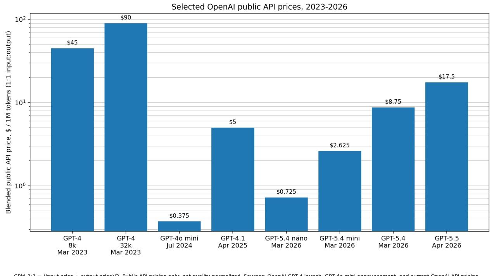
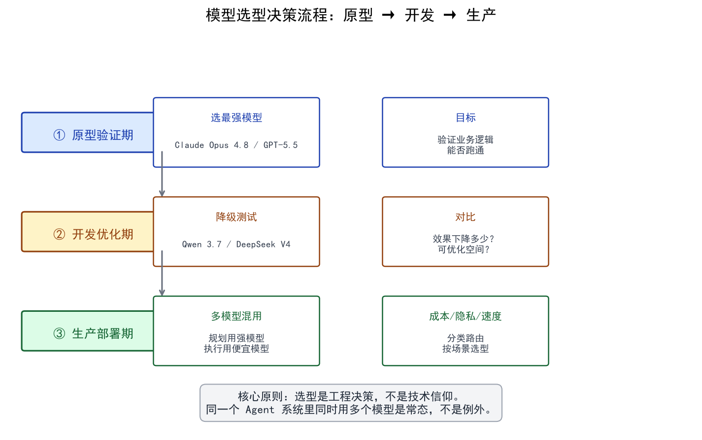

# 主流模型对比与选型

> 市面上 LLM 模型众多，本文从能力、成本、开源三个维度对比主流模型，帮你建立选型决策框架。

## 目录

- [模型能力矩阵](#模型能力矩阵)
- [成本对比](#成本对比)
- [开源 vs 闭源](#开源-vs-闭源)
- [选型决策树](#选型决策树)
- [总结](#总结)
- [参考链接](#参考链接)

你好，我是江小湖。模型这么多，到底该选哪个？这是每个 Agent 开发者都会面对的第一个工程决策。

在 [01 — LLM 基础](../01-llm-basics/README.md) 中，你已经了解了 LLM 的本质、Token 与 Embedding 的工作原理、Transformer 架构、以及模型从预训练到 RLHF 的完整训练流程。现在该动手了：面对市面上这么多模型，怎么选、怎么调、怎么用好。

在 Agent 开发中，“选哪个模型”是一个纯粹的工程决策，而不是技术信仰。

没有一个模型能在所有场景下都做到最好。最聪明的模型通常最贵、最慢；最便宜的模型可能在复杂逻辑上会翻车。优秀的 Agent 系统通常是**多模型混用（Model Routing）**的：用聪明但贵的模型做复杂规划，用便宜且快的模型做简单的数据提取。

> **注意**：模型迭代极快，本文数据基于 2026 年中期的行业状态。实际选型时，请务必参考最新的 [LLM Stats](https://llm-stats.com/) 或 [Arena Leaderboard](https://arena.ai/leaderboard) 排行榜。

## 模型能力矩阵

目前市面上的主流模型可以分为以下几个梯队（数据参考 [LLM Stats](https://llm-stats.com/) 综合评分）：

### 1. 旗舰全能型（Tier 1）
代表：**Claude Opus 4.8 (Anthropic)**, **GPT-5.5 (OpenAI)**
- **特点**：各方面能力拉满，支持原生多模态（音视频），极强的复杂推理和长文本理解能力。Claude Opus 4.8 GPQA 93.6%，但在 Agent 工具编排场景下，GPT-5.5 以 9.11% 胜率反超 Claude 的 9.06%（Arena Agent Leaderboard）。
- **适用场景**：Agent 的核心大脑（Planner）、极其复杂的代码生成、需要极高准确率的科研分析。
- **缺点**：贵（$5/百万输入 Token），延迟相对较高（~53-57 tok/s）。

### 2. 编程与性价比主力（Tier 1.5）
代表：**Claude Opus 4.6 (Anthropic)**, **GPT-5.4 (OpenAI)**, **GLM-5.1 (智谱)**
- **特点**：Claude Opus 4.6 是代码之王（Code Arena 排名第一 2126，SWE-bench 80.8%），是代码助手（Cursor/Windsurf）的默认选择。GPT-5.4 速度极快（130 tok/s），价格只有 Tier 1 的一半。GLM-5.1 是国产开源模型中的全能选手（Code Arena 1765，159 tok/s）。
- **适用场景**：日常工作流 Agent、代码生成、高吞吐场景。
- **缺点**：在极复杂的推理任务上仍不及 Tier 1。

### 3. 极致性价比与国产开源（Tier 2）
代表：**DeepSeek V4-Pro (深度求索)**, **Qwen 3.7 Max (阿里)**, **Kimi K2.6 (月之暗面)**, **MiniMax M3 (稀宇科技)**
- **特点**：价格只有 Tier 1 的五分之一，但在推理、代码生成上能达到 80%-90% 的水平。**DeepSeek V4-Pro 是性价比之王**（SWE-bench 80.6%，$0.435 输入，全场最便宜）。Qwen 3.7 Max 的 GPQA 高达 92.4%（甚至超过部分 Tier 1），适合推理密集场景。Kimi K2.6 是开源模型之王（GPQA 90.5%，Code Arena 1550）。MiniMax M3 全能均衡（MIT 开源，$0.60 输入，SWE-Bench Pro 59.0%）。
- **适用场景**：高并发的生产环境、RAG 系统的文本总结、多 Agent 系统中的“打工人” Agent、隐私敏感的私有化部署。
- **缺点**：在极长上下文（>100K）的细节提取、极其复杂的指令遵循上偶尔会翻车。DeepSeek V4 速度较慢（14 tok/s），不适合实时场景。

> **选型启示**：通用能力和 Agent 工具编排能力是两套本事。代码生成为主选 Claude Opus 4.6，复杂工具编排选 GPT-5.5，两者混用是最佳实践。

## 成本对比

在评估成本时，你需要关注三个指标：
1. **输入价格（Input Tokens）**：你发给模型的 Prompt 和上下文。
2. **输出价格（Output Tokens）**：模型生成的回答。通常输出比输入贵 3-5 倍。
3. **上下文缓存（Prompt Caching）**：很多厂商（如 Anthropic, DeepSeek）支持缓存重复的系统提示词，命中缓存的输入价格会打 1-5 折。

*以下为实际价格（每百万 Token，美元，数据来自 [LLM Stats](https://llm-stats.com/)）：*

  
   
  <em>OpenAI API 价格演变（2023-2026）</em>

| 模型 | 输入价格 | 输出价格 | 速度 (tok/s) | 定位 |
|------|---------|---------|-------------|------|
| Claude Opus 4.8 | $5.00 | $25.00 | 53 | 旗舰全能 |
| GPT-5.5 | $5.00 | $30.00 | 57 | 旗舰全能 |
| Claude Opus 4.6 | $5.00 | $25.00 | 53 | 代码之王 |
| GPT-5.4 | $2.50 | $15.00 | 130 | 性价比 + 高速 |
| GLM-5.1（智谱，开源） | $1.40 | $4.40 | 159 | 国产全能 |
| DeepSeek V4-Pro（开源） | $0.435 | $0.87 | 14 | 性价比之王 |
| Qwen 3.7 Max（阿里） | $1.25 | $3.75 | 39 | 推理特化 |
| Kimi K2.6（月之暗面，开源） | $0.95 | $4.00 | 38 | 开源之王 |
| MiniMax M3（稀宇科技，开源） | $0.60 | $2.40 | 119 | 全能均衡 |

**算一笔账**：如果你有一个客服 Agent，每天处理 10,000 次对话，每次对话平均消耗 2000 输入 Token 和 500 输出 Token（即每天 20M 输入 + 5M 输出）。
- 用 Claude Opus 4.8：每天约 **$225**
- 用 Qwen 3.7 Max：每天约 **$44**
- 用 Kimi K2.6（开源自部署）：成本可进一步降至 **$20 以下**

**成本差异可达 5-10 倍**，这就是为什么选型是生产环境的核心决策。

## 开源 vs 闭源

| 维度 | 闭源 API (OpenAI/Anthropic) | 开源/开放权重 (Llama/Qwen/DeepSeek) |
|------|---------------------------|----------------------------------|
| **上手难度** | 极低（注册给钱就能用） | 较高（需要自己部署或找云厂商托管） |
| **能力上限** | 最高（代表行业 SOTA） | 紧跟其后（差距在半年到一年内） |
| **数据隐私** | 数据会传给厂商（除非签企业协议） | 完全可控（可本地/私有云部署） |
| **定制化** | 只能做有限的微调 | 可以深度微调、量化、修改架构 |
| **稳定性** | 依赖厂商服务，偶尔会宕机 | 自己运维，稳定性自己兜底 |

## 选型决策树

在实际开发中，建议遵循以下路径：

1. **原型验证期（PoC）**：
   - **无脑选最强的模型**（如 Claude Opus 4.8 或 GPT-5.5）。
   - 为什么？因为在这个阶段，你需要验证的是“这个业务逻辑能不能跑通”。如果用最强的模型都跑不通，说明思路有问题；如果用弱模型跑不通，你不知道是你的 Prompt 写得烂，还是模型太笨。

2. **开发与优化期**：
   - 业务跑通后，开始**降级测试**。
   - 把模型切换到 Qwen 3.7 Max、DeepSeek V4-Pro 或 MiniMax M3，看看效果下降了多少。
   - 如果效果下降，尝试优化 Prompt、增加 Few-shot 示例、或者把大任务拆解成小任务。

3. **生产部署期**：
   - **核心决策节点**：用最强模型（保证效果）。
   - **高频重复节点**（如数据提取、格式转换）：用便宜模型（控制成本）。
   - **隐私敏感节点**（如处理用户内部财务数据）：用本地部署的开源模型。

  
   
  <em>模型选型决策流程：从原型验证到生产部署</em>

## 总结

- **模型选型是工程决策，不是技术信仰**——没有万能模型，只有最适合场景的模型
- **生产环境的最佳实践是多模型混用**：聪明但贵的做规划，便宜且快的做数据提取
- **原型期无脑选最强**，跑通业务后再降级测试，用数据说话
- **成本差异可达 5-10 倍**，选型直接影响项目的经济可行性

> 选好了模型，接下来就是动手写代码调通它。请前往 [调用方式与 API 实战](./02-api-calling.md)。

## 参考链接

- [LLM Stats](https://llm-stats.com/) — 300+ 模型综合排行榜，含评分、价格、速度多维对比
- [Arena Leaderboard](https://arena.ai/leaderboard) — 基于人类盲测的模型排名
- [Arena Agent Leaderboard](https://arena.ai/leaderboard/agent) — Agent 工具编排能力专项排名
- [Artificial Analysis — LLM Benchmarks](https://artificialanalysis.ai/) — 详细的成本、速度、能力多维对比图表
