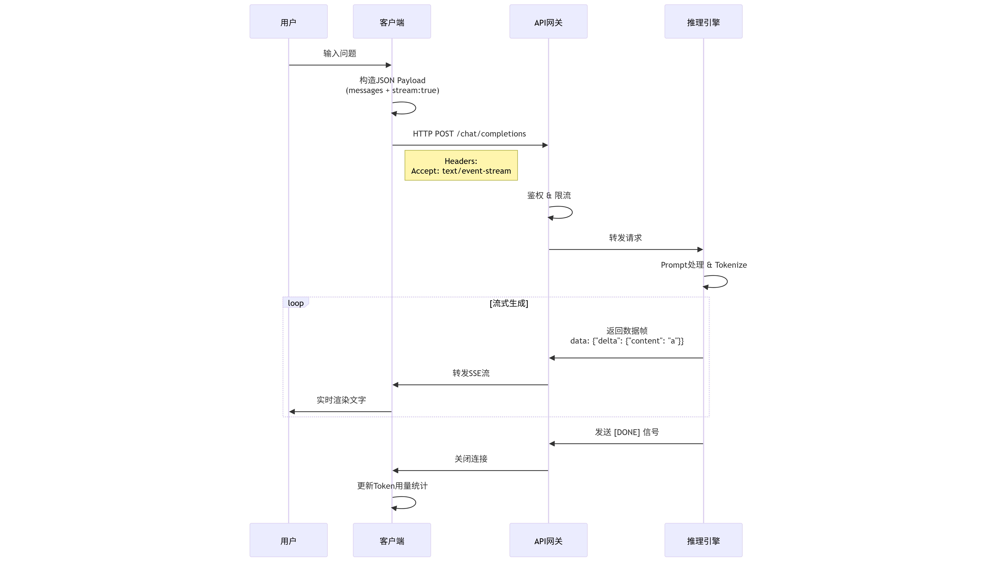
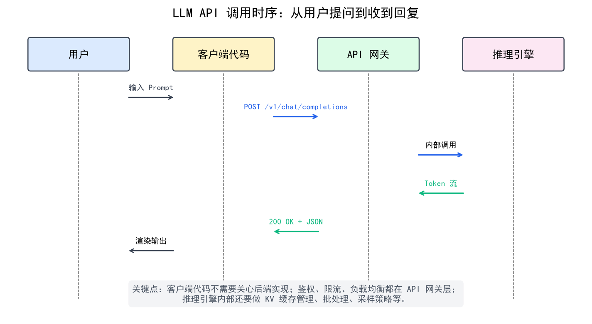

# LLM API 调用实战

> 模型选好了，接下来就是写代码把它调通。本文以 OpenAI 兼容格式为标准，覆盖基础调用、流式输出、多模型统一路由和生产级错误处理——这是所有 Agent 系统的代码基础。

## 目录

- [一个事实标准：OpenAI API 格式](#一个事实标准openai-api-格式)
- [基础调用示例](#基础调用示例)
- [流式输出（Streaming）](#流式输出streaming)
- [多模型统一调用（LiteLLM）](#多模型统一调用litellm)
- [错误处理与重试](#错误处理与重试)
- [总结](#总结)
- [参考链接](#参考链接)

你好，我是江小湖。[主流模型对比与选型](./01-model-comparison.md)帮你选定了要用的模型。现在该动手了。

好消息：你不需要为每个厂商学一套新 API。在 LLM 领域，**OpenAI 的 Chat Completions 格式已经是事实上的行业标准**。OpenAI、DeepSeek、硅基流动、Groq、甚至本地的 Ollama/vLLM——全都兼容这套格式。

> **模型跑在哪里？** 这是另一个问题。大多数情况下你会先调云端 API 快速原型；如果数据不能出内网或成本太高，再考虑[本地部署实战](./05-local-deployment.md)。无论模型跑在哪，底层都是 HTTP 请求到某个端点——区别只在于你用什么方式发这个请求。

## 你有几种方式发起这个请求

虽然底层都是 HTTP POST 到同一个格式的端点，但从开发者的角度，有几个不同层次的入口：

```
┌─────────────────────────────────────────────────┐
│            所有方式最终都变成这个：                │
│  POST /v1/chat/completions  {"model":"...",      │
│   "messages":[...]}                              │
└──────────┬──────────────┬───────────────┬────────┘
           │              │               │
     ┌─────▼────┐  ┌─────▼─────┐  ┌────▼────────┐
     │  SDK 封装  │  │ 裸 HTTP   │  │  CLI 工具    │
     │ (推荐)    │  │ (底层)     │  │ (调试)       │
     └───────────┘  └───────────┘  └─────────────┘
           │              │               │
     openai-python   requests/fetch   ollama run / curl
     anthropic-sdk                   openai chat ...
     google-genai
           │
     ┌─────▼──────────────────────────┐
     │  统一代理层（多模型路由）        │
     │  LiteLLM / OpenRouter / ...    │
     └────────────────────────────────┘
```

| 层次 | 代表 | 适合场景 | 本文主线？ |
|------|------|---------|----------|
| **SDK** | `openai`、`anthropic`、`google-genai` | **日常开发、生产环境** | **是** |
| **统一代理** | LiteLLM、**OpenRouter** | 需要在一个项目里切换多个厂商 | 下文专门讲 |
| **裸 HTTP** | `requests`/`fetch` 手动拼请求 | 不想装 SDK、特殊语言环境 | 了解即可 |
| **CLI** | `ollama run`、`openai chat`、curl | 快速测试、终端交互 | 调试时顺手用 |

**本文以 SDK 为主线**展开，因为它是 95% 场景下的选择。其他几种你只需要知道它们存在、知道什么时候可能用到。

### 插一句：中间商 / 模型聚合平台

除了直接找各家厂商买 API，还有一种选择：**中间商（Model Router / Aggregator）**。它们帮你统一接入多家模型，一个 API Key 访问全部：

| 平台 | 特点 | 适合谁 |
|------|------|-------|
| **[OpenRouter](https://openrouter.ai)** | 一个 key 用 GPT/Claude/Gemini/Qwen 全部模型，按量付费 | 多模型对比测试、不想管理多个 key |
| **[硅基流动 SiliconFlow](https://siliconflow.cn)** | 国产模型聚合 + 开源模型托管 | 国内开发者、需要国产模型一站式服务 |
| **[Groq](https://groq.com)** | 自研推理芯片，免费 tier 极快速度 | 高吞吐量、延迟敏感场景 |
| **[Together AI](https://together.ai)** | 开源模型云端托管，支持微调 | 需要跑开源模型但没 GPU |

这些平台的 API 也兼容 OpenAI 格式，所以**代码完全不用改**——换个 `base_url` 和 `api_key` 就行。后面讲 LiteLLM 时会看到具体用法。

## 一个事实标准：OpenAI API 格式

一个标准的对话请求（Chat Completions）包含两个核心部分：`model` 和 `messages`。

`messages` 是一个数组，里面包含不同角色的消息：
- `system`：系统提示词，用于设定 Agent 的角色和行为规范。
- `user`：用户的输入。
- `assistant`：模型的回复（在多轮对话中，你需要把模型之前的回复也放进数组里传回去）。

## 基础调用示例

首先安装官方 SDK：
```bash
pip install openai
```

最基础的调用代码：

```python
import os
from openai import OpenAI

# 初始化客户端
# 如果调用其他兼容厂商（如 DeepSeek），只需修改 base_url 和 api_key
client = OpenAI(
    api_key=os.environ.get("OPENAI_API_KEY"),
    # base_url="https://api.deepseek.com/v1"  # 切换到 DeepSeek
)

response = client.chat.completions.create(
    model="gpt-4o", # 或者 "deepseek-chat"
    messages=[
        {"role": "system", "content": "你是一个资深的 Python 工程师，回答要简明扼要。"},
        {"role": "user", "content": "解释一下什么是 Python 的装饰器？"}
    ],
    temperature=0.7,
    max_tokens=500
)

# 提取并打印回复内容
print(response.choices[0].message.content)
```

## 流式输出（Streaming）

在实际产品中，LLM 生成长文本可能需要几秒甚至十几秒。为了不让用户干等，我们必须使用**流式输出（Streaming）**——模型生成一个字，前端就显示一个字。

在 API 中，只需要加上 `stream=True`：

<p align="center">
  
  <br/>
  <em>流式输出（Streaming）完整时序</em>
</p>

```python
response = client.chat.completions.create(
    model="gpt-4o",
    messages=[{"role": "user", "content": "写一首关于春天的长诗。"}],
    stream=True  # 开启流式输出
)

# response 现在是一个生成器（generator）
for chunk in response:
    # 每次提取增量的文本片段
    content = chunk.choices[0].delta.content
    if content is not None:
        print(content, end="", flush=True)
```

## 多模型统一调用（LiteLLM）

虽然大多数厂商兼容 OpenAI 格式，但 Anthropic (Claude) 和 Google (Gemini) 有自己独立的 SDK。如果你想在代码里无缝切换所有模型，推荐使用 **LiteLLM**。

LiteLLM 是一个轻量级的代理库，它把所有厂商的 API 都包装成了 OpenAI 的格式。

```bash
pip install litellm
```

```python
from litellm import completion
import os

# 设置各家 API Key
os.environ["OPENAI_API_KEY"] = "sk-..."
os.environ["ANTHROPIC_API_KEY"] = "sk-ant-..."

# 调用 GPT-4o
response1 = completion(
    model="gpt-4o",
    messages=[{"role": "user", "content": "你好"}]
)

# 代码完全不用改，只需换个模型名字，就能调用 Claude
response2 = completion(
    model="claude-3-5-sonnet-20240620",
    messages=[{"role": "user", "content": "你好"}]
)
```

在构建复杂的 Agent 系统时，LiteLLM 能帮你极大地简化模型路由（Model Routing）的代码。

<p align="center">
  
  <br/>
  <em>API 调用流程：从客户端请求到模型响应</em>
</p>

## 错误处理与重试

在生产环境中调用 API，网络波动和限流（Rate Limit）是家常便饭。你必须加上重试机制。

OpenAI SDK 默认自带了重试机制（默认重试 2 次），但如果你想更精细地控制，可以使用 `tenacity` 库：

```python
from tenacity import retry, stop_after_attempt, wait_exponential
import openai

@retry(
    stop=stop_after_attempt(3), # 最多重试 3 次
    wait=wait_exponential(multiplier=1, min=2, max=10), # 指数退避：等 2s, 4s, 8s
    reraise=True
)
def call_llm_with_retry(messages):
    try:
        response = client.chat.completions.create(
            model="gpt-4o",
            messages=messages,
            timeout=30 # 设置超时时间
        )
        return response.choices[0].message.content
    except openai.RateLimitError:
        print("触发限流 (429)，准备重试...")
        raise
    except openai.APIConnectionError:
        print("网络连接失败，准备重试...")
        raise
    except openai.APIError as e:
        print(f"API 内部错误: {e}")
        raise

# 调用
result = call_llm_with_retry([{"role": "user", "content": "你好"}])
```

## 总结

- **底层都是 HTTP**——SDK、CLI、中间商（OpenRouter/硅基流动）都是对同一套 OpenAI 格式 API 的不同封装层次
- **SDK 是生产首选**——`openai` 官方 SDK 封装了认证、重试、流式等细节，95% 场景用它
- **中间商平台值得了解**——OpenRouter 一个 key 访问全部模型，适合多模型对比和不想管理多个 key 的场景
- **流式输出是产品必备**——加 `stream=True`，用户体验立刻提升一个档次
- **LiteLLM 解决多模型统一调用**——换个模型名就能切换 Claude/GPT/Gemini
- **生产环境必须加重试**——网络波动和限流是家常便饭，指数退避是标配

> 代码调通了，但你可能注意到了 `temperature`、`max_tokens` 这些参数。它们到底怎么影响模型输出？请前往 [关键参数与调优](./07-key-parameters.md)。

## 参考链接

- [OpenAI API Reference](https://platform.openai.com/docs/api-reference/chat) — 官方 API 文档
- [LiteLLM Documentation](https://docs.litellm.ai/docs/) — 多模型统一调用神器
- [Tenacity Documentation](https://tenacity.readthedocs.io/en/latest/) — Python 重试库
