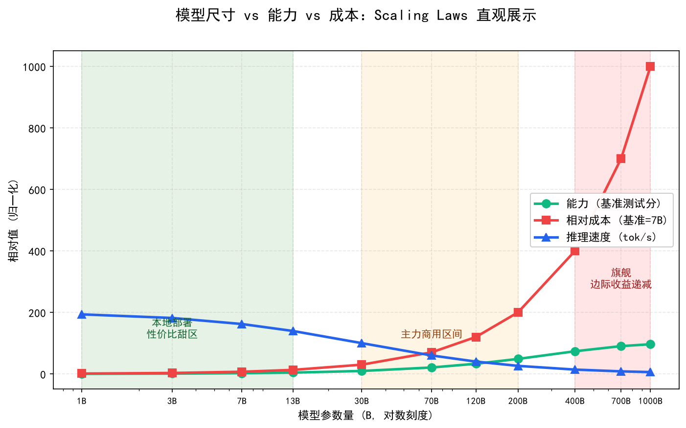
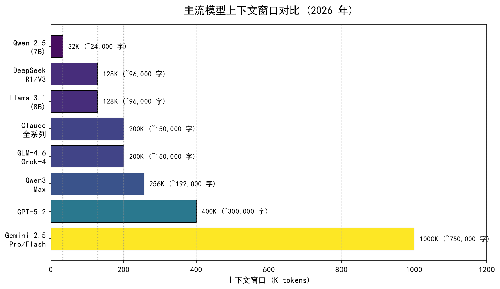

# 模型尺寸、变体与上下文：选型时容易踩的坑

> 同一家族模型有多个尺寸和变体（Haiku/Sonnet/Opus、Flash/Pro），本文帮你理解尺寸差异的本质、小模型什么时候够用、以及如何为 Agent 系统选择合适的模型尺寸。

## 目录

- [为什么同一家族有多个尺寸](#为什么同一家族有多个尺寸)
- [主流家族的尺寸矩阵](#主流家族的尺寸矩阵)
- [Base 模型 vs Instruct 模型 vs Chat 模型](#base-模型-vs-instruct-模型-vs-chat-模型)
- [小模型什么时候够用](#小模型什么时候够用)
- [Agent 场景的尺寸选型策略](#agent-场景的尺寸选型策略)
- [总结](#总结)
- [参考链接](#参考链接)

你好，我是江小湖。[主流模型对比与选型](./01-model-comparison.md)讲了不同厂商之间的横向对比。[调用方式与 API 实战](./02-api-calling.md)让你已经能跑通第一个 `hello world` 了。但实际开发中你还会遇到另一个问题：**同一个厂商的模型有好几个版本**——Claude 有 Haiku、Sonnet、Opus，GPT 有 4o-mini 和 4o，DeepSeek 有 V4-Flash 和 V4-Pro。

这些不同尺寸/变体的模型到底有什么区别？什么时候该用小的、什么时候必须用大的？这篇从 Agent 开发的实际需求出发，给你一套可操作的决策框架。

## 为什么同一家族有多个尺寸

这不是厂商在搞"产品线营销"，而是**不同场景对模型能力的需求差异极大**。

一个客服聊天机器人需要的"智能程度"，和一个做数学证明的研究助手完全不同。如果让所有用户都用最贵最大的模型：
- **成本爆炸**：简单任务（如"把这段话翻译成英文"）不需要千亿参数
- **延迟过高**：大模型的推理时间更长，实时交互体验差
- **资源浪费**：GPU 算力被低复杂度任务占用

所以厂商会训练同一架构的不同尺寸版本，本质上是**能力与成本的权衡曲线上的不同采样点**：

```
能力 ↑
     │        ● Opus/GPT-5.5    （最强但最贵）
     │       /
     │      ● Sonnet/GPT-5.4   （主力平衡）
     │     /
     │    ● Haiku/GPT-4o-mini   （轻量快速）
     │   /
     └──────────────────────→ 成本/延迟
```

## 主流家族的尺寸矩阵

### Claude 家族（Anthropic）

| 变体 | 参数量 | 定位 | 价格（输入/输出，$/M tokens） | 适用场景 |
|------|--------|------|---------------------------|---------|
| Haiku 4.5 | ~小型 | 极速低成本 | $0.80 / $4.00 | 高并发、简单任务 |
| Sonnet 4.6 | ~中型 | 编程性价比之王 | $3.00 / $15.00 | 代码生成、日常 Agent |
| Opus 4.8 | ~大型 | 旗舰全能 | $5.00 / $25.00 | 复杂推理、核心规划 |

Claude 的命名很直观：**Haiku（俳句）短小精悍，Sonnet（十四行诗）均衡优雅，Opus（交响乐）宏大完整**。三者共享基础架构和能力边界，区别在于参数规模带来的能力深度。

### GPT 家族（OpenAI）

| 变体 | 定位 | 价格（输入/输出，$/M tokens） | 特点 |
|------|------|---------------------------|------|
| GPT-4.1 mini / nano | 轻量 | 低 | 简单分类、格式化 |
| GPT-4.1 | 中端 | 中等 | 日常对话、通用 |
| GPT-5.4 | 高速主力 | $2.50 / $15.00 | 130 tok/s，高吞吐 |
| GPT-5.5 | 旗舰 | $5.00 / $30.00 | 最强综合能力 |

OpenAI 的命名更偏向版本号体系。GPT-5.4 引入了**可配置推理模式**（reasoning_effort 参数），开发者可以在单次调用中选择低延迟或深度推理——这是 OpenAI 在"一个模型适配多种场景"方向的重要尝试。

### 国产开源家族

| 家族 | 轻量版 | 主力版 | 旗舰版 |
|------|--------|--------|--------|
| DeepSeek V4 | Flash（极便宜） | Pro | — |
| Qwen 3 | Max（推理特化） | — | — |
| Kimi K2 | — | K2.6（开源） | — |

国产模型通常只发布 1-2 个版本，不像 Claude/GPT 那样精细分层。但它们的优势在于**同价位下参数量更大**——DeepSeek V4-Pro 的价格只有 Claude Opus 的十分之一，但在 SWE-bench 上达到了相近的水平（80.6% vs 80.8%）。

<p align="center">
  
  <br/>
  <em>模型尺寸的能力-成本权衡曲线</em>
</p>

## 上下文窗口：另一个关键维度

除了参数量和价格，**上下文窗口（Context Window）**大小是选择模型时必须考虑的第三个核心指标。它决定了模型一次能"看到"多少文本。

### 什么是上下文窗口

上下文窗口是模型单次请求能处理的最大 Token 数。所有内容——系统提示词、对话历史、当前输入、模型回复——都必须塞进这个窗口里。超出的部分会被截断或报错。

### 主流模型的上下文窗口对比（2025）

| 模型 | 上下文窗口 | 约合中文字数 | 定位 |
|------|-----------|------------|------|
| Gemini 2.5 Pro / Flash | **1,000,000** | ~75 万字 | 长文档王者 |
| GPT-5.2 | 400,000 | ~30 万字 | 企业级长上下文 |
| Claude 全系列 (Haiku/Sonnet/Opus) | 200,000 | ~15 万字 | 均衡标准 |
| GLM-4.6 / Grok-4 / Qwen3 Max | 200,000–256,000 | ~15-19 万字 | 国产主流 |
| DeepSeek R1 / V3 系列 | 128,000 | ~9.6 万字 | 性价比优先 |
| Llama 3.1 (8B) | 128,000 | ~9.6 万字 | 开源本地部署 |
| Qwen 2.5 (7B) | 32,000 | ~2.4 万字 | 小型开源 |

**Gemini 2.5 的 1M 窗口是目前的绝对领先者**，可以一次性吞下整本书或整个代码库。而大多数模型集中在 128K-256K 区间，对日常任务已经够用。

### 上下文窗口的实际影响

**1. 对话轮次限制**

假设你的系统提示词占 500 Token，每轮对话平均消耗 1000 Token：

```
可用上下文 = 总窗口 - 系统提示词
             = 128,000 - 500 = 127,500 Token

最大对话轮次 ≈ 127,500 / 1,000 ≈ 127 轮（理论值）
```

实际开发中，长对话需要**滑动窗口**或**摘要压缩**策略来管理上下文，否则模型会"忘记"早期的对话内容。

**2. RAG 文档处理能力**

RAG 场景中，你需要把检索到的文档片段塞进上下文：

```
系统提示词:     ~500 Token
用户问题:       ~200 Token
检索到的文档:   ~5,000-20,000 Token（取决于分块策略）
模型回答:       ~1,000 Token
─────────────────────────────
总计:           ~7,000-22,000 Token / 次
```

对于 32K 窗口的模型，一次只能塞入约 1-3 个大文档块；而 200K+ 窗口可以轻松容纳 10+ 个文档块，**检索精度显著提升**。

**3. "Lost in the Middle" 问题**

即使在大窗口内，模型对不同位置的注意力也不均匀：
- **开头**（系统提示词）→ 高注意力
- **结尾**（最新消息）→ 高注意力
- **中间** → 注意力衰减

这意味着：**把最重要的信息放在开头或结尾**，参考材料放中间。这是使用长上下文时的一个重要技巧。

### 选型建议

| 你的场景 | 推荐窗口大小 | 代表模型 |
|---------|------------|---------|
| 简单问答 / 单轮任务 | 32K 就够 | Qwen 2.5 7B |
| 多轮对话 / 标准 RAG | 128K 标准 | DeepSeek V3、Llama 3.1 |
| 长文档分析 / 代码库理解 | 200K+ 推荐 | Claude 全系列、GPT-5.2 |
| 整书级处理 / 超大规模知识库 | 1M 唯一选 | Gemini 2.5 Pro |

<p align="center">
  
  <br/>
  <em>2025 年主流模型上下文窗口对比</em>
</p>

## Base 模型 vs Instruct 模型 vs Chat 模型

除了尺寸之分，同一模型还有**训练阶段变体**的区别。这在 HuggingFace 上下载开源模型时尤其重要。

### 三种变体的含义

| 变体 | 训练阶段 | 能力特点 | 能否直接用于 Agent |
|------|---------|---------|------------------|
| **Base 模型** | 仅预训练 | 有知识，但不听指令。给它"写一首诗"，它会续写成"写一首散文、写一部小说..." | 不能 |
| **Instruct 模型** | 预训练 + SFT | 听指令，能问答，但可能不够安全或礼貌 | 可以，基础可用 |
| **Chat 模型** | 预训练 + SFT + RLHF/DPO | 安全、有用、诚实，经过人类偏好对齐 | 推荐，生产首选 |

### 实际影响

以 Llama 3 为例，HuggingFace 上你会看到：
- `Meta-Llama-3-8B` → Base 模型（研究用）
- `Meta-Llama-3-8B-Instruct` → 经过指令微调（Agent 开发用这个）
- `Meta-Llama-3-8B-Instruct-GGUF` → 量化版本（本地部署用）

**永远下载 Instruct 或 Chat 版本**。Base 模型是给研究人员做进一步微调的半成品，它在 Agent 框架中的表现会让你怀疑人生——它不会回答你的问题，只会续写你的句子。

## 小模型什么时候够用

这是 Agent 开发中最常遇到的决策点。以下是一个实用的判断框架：

### 小模型（Haiku / 4o-mini / Flash）够用的场景

- **文本分类**：判断一段话的情感正负、意图识别、垃圾邮件过滤
- **格式转换**：JSON 提取、Markdown 转 HTML、数据清洗
- **简单翻译**：日常文档翻译（非专业领域）
- **摘要生成**：压缩长文到指定长度
- **RAG 的重排序**：对检索结果打分排序

这些任务的共同特点是：**输出空间有限、逻辑链条短、不需要深度推理**。小模型在这些任务上的准确率和大模型差距很小，但速度快 3-5 倍、成本低 5-10 倍。

### 必须用大模型（Opus / GPT-5.5 / V4-Pro）的场景

- **多步逻辑推理**：需要"先算 A，再根据 A 算 B，最后综合得出 C"
- **代码生成与调试**：尤其是涉及多文件、复杂架构的任务
- **Agent 核心规划**：决定下一步该调什么工具、怎么组合工具结果
- **创意写作**：需要风格一致性、长程连贯性的内容
- **专业领域问答**：法律、医疗、金融等容错率低的领域

### 边界模糊的场景：用数据说话

对于不确定的场景，**不要猜，要测**。做法很简单：

```python
import json
from openai import OpenAI

client = OpenAI()

test_cases = [
    {"input": "解释 Python 装饰器", "expected_keys": ["函数", "wrapper", "@"]},
    {"input": "将 JSON 转为 SQL", "expected_keys": ["SELECT", "FROM", "WHERE"]},
    {"input": "分析这段代码的时间复杂度", "expected_keys": ["O(", "n", "循环"]},
]

models = ["gpt-4o-mini", "gpt-4o", "claude-sonnet-4-20250514"]

results = {}
for model in models:
    results[model] = {"pass": 0, "total": len(test_cases)}
    for case in test_cases:
        resp = client.chat.completions.create(
            model=model,
            messages=[{"role": "user", "content": case["input"]}],
            max_tokens=200,
            temperature=0
        )
        content = resp.choices[0].message.content or ""
        if all(k in content for k in case["expected_keys"]):
            results[model]["pass"] += 1

for model, stats in results.items():
    print(f"{model}: {stats['pass']}/{stats['total']} 通过")
```

跑一遍这个测试，哪个模型在你的具体任务上通过率高就用哪个。**你的业务数据比任何 Benchmark 都有说服力。**

## Agent 场景的尺寸选型策略

在实际的 Agent 系统中，最佳实践不是"全用大模型"或"全用小模型"，而是**按角色分配不同尺寸的模型**：

```
用户请求进入
    ↓
[路由器] ← 用小模型就够了（简单的意图分类）
    ↓
┌─────────────────────────────────┐
│  Agent 核心循环                  │
│                                 │
│  规划器（Planner）→ 大模型        │  ← 决策链复杂
│  工具执行结果解析 → 小模型         │  ← 结构化提取
│  最终回答生成 → 中模型            │  ← 平衡质量和速度 │
└─────────────────────────────────┘
```

**具体建议**：

| Agent 角色 | 推荐尺寸 | 原因 |
|-----------|---------|------|
| 意图分类/路由 | Haiku / 4o-mini / Flash | 二三分类任务，小模型足够 |
| 工具参数提取 | Sonnet / GPT-4o | 需要 JSON 格式稳定性 |
| 核心规划 | Opus / GPT-5.5 | 多步推理，不能出错 |
| 结果汇总 | Sonnet / GPT-5.4 | 平衡质量与速度 |
| 代码执行 | Sonnet 4.6（代码专用） | Code Arena 第一 |

这种分层策略能让你的系统总成本降低 50%-70%，同时不牺牲关键环节的质量。

## 总结

- **同一家族的多尺寸是能力-成本曲线上不同的采样点**，不是营销手段——不同场景确实需要不同规模的模型
- **上下文窗口是第三个关键选型指标**：Gemini 2.5 以 1M 窗口独占鳌头，大多数模型在 128K-256K 区间，注意 "Lost in the Middle" 问题
- **三种训练变体**（Base / Instruct / Chat）对应不同训练阶段，Agent 开发永远选 Instruct 或 Chat 版本
- **小模型适合输出有限、逻辑简短的任务**（分类、提取、翻译），大模型适合多步推理、复杂规划和专业领域
- **不确定时用数据说话**：拿你的真实测试集跑一遍对比，比看 Benchmark 可靠得多
- **Agent 最佳实践是按角色分配模型尺寸**：规划用大的、提取用小的、汇总用中的

> 知道了模型尺寸和上下文窗口怎么选，接下来有一类特殊的模型值得单独讨论——它们不是靠"更大"来变强，而是靠"想得更久"。请前往 [推理模型专题：o1、R1、QwQ 的机制与调用](./04-reasoning-models.md)。

## 参考链接

- [Anthropic — Model Comparison](https://docs.anthropic.com/en/docs/about-claude/models) — Claude 各变体官方对比
- [OpenAI — Model Overview](https://platform.openai.com/docs/models) — GPT 家族各版本说明
- [LLM Stats](https://llm-stats.com/) — 300+ 模型的详细规格、价格、性能数据
- [Llama Model Card (Meta)](https://ai.meta.com/blog/meta-llama-3/) — Llama 3 Base vs Instruct 区分说明
