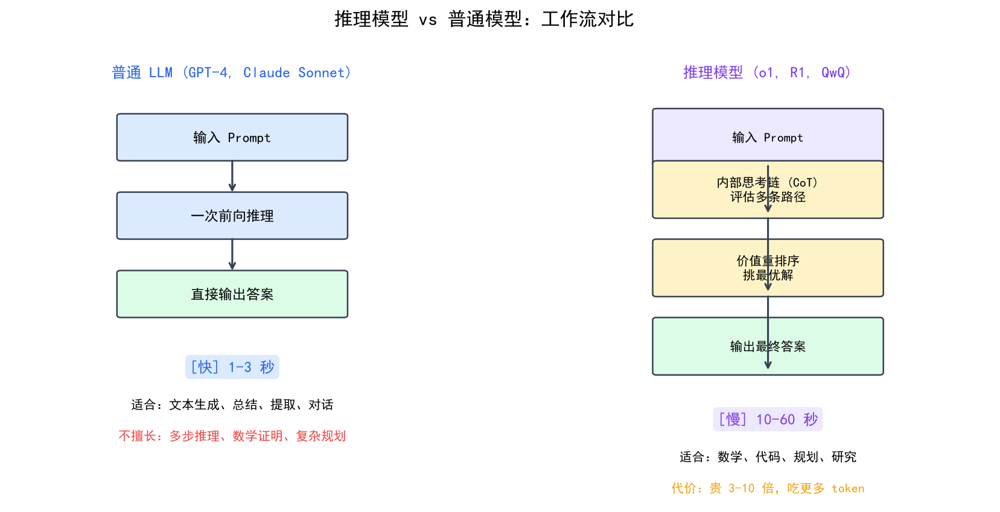
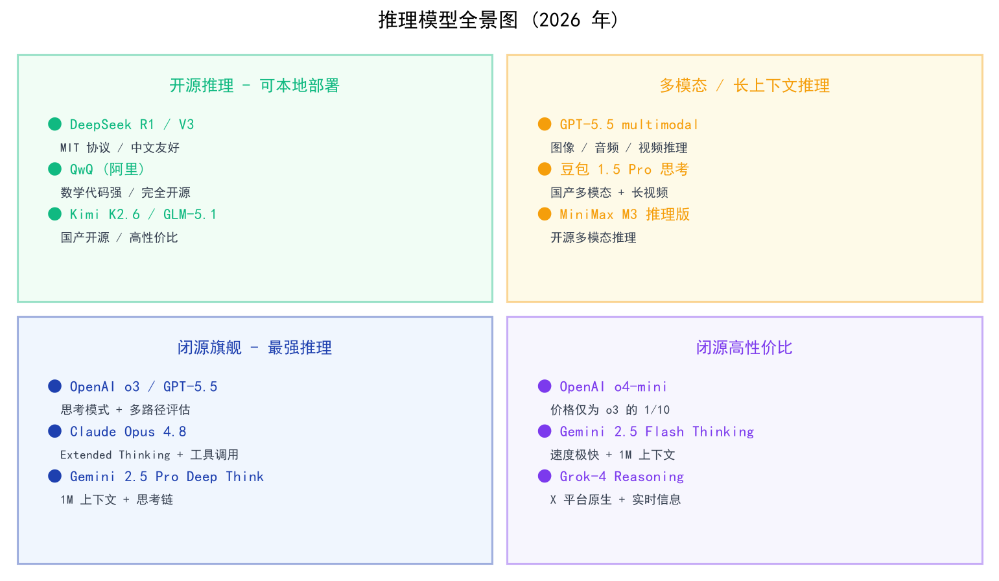

# 推理模型专题

> o1、o3、DeepSeek R1、Claude Extended Thinking——这些"会思考"的模型和普通 LLM 有什么本质区别？本文从机制、调用方式、成本到适用场景，帮你建立推理模型的完整认知。

## 目录

- [什么是推理模型](#什么是推理模型)
- [推理模型 vs 普通 LLM：本质区别](#推理模型-vs-普通-llm本质区别)
- [主流推理模型一览](#主流推理模型一览)
- [如何调用推理模型](#如何调用推理模型)
- [什么时候该用推理模型](#什么时候该用推理模型)
- [什么时候不该用](#什么时候不该用)
- [成本与延迟的权衡](#成本与延迟的权衡)
- [总结](#总结)
- [参考链接](#参考链接)

你好，我是江小湖。[模型尺寸、变体与上下文](./03-model-variants.md)讲了同一家族不同大小的模型以及上下文窗口的差异。但有一类模型，它们不是靠"更大"来变强，而是靠**"想得更久"**来变强。

这就是**推理模型（Reasoning Model）**——2024 年底到 2025 年最重要的技术方向之一。OpenAI 的 o 系列、DeepSeek R1、Claude Extended Thinking 都属于这一类。它们在回答之前会先"思考"一段相当长的时间，然后才给出最终答案。

## 什么是推理模型

**推理模型**是一类在生成最终答案之前，会先执行内部多步推理链（Chain of Thought）的 LLM。

普通 LLM 的工作流程：

```
用户问题 → [一次前向传播] → 直接给出答案
```

推理模型的工作流程：

```
用户问题 → [思考阶段：多步推理] → [回答阶段：基于推理结果输出]
```

这个"思考阶段"可能是几百个 Token 到几万个 Token 不等，取决于问题的复杂度。关键是：**这些思考 Token 是模型在内部生成的，用于辅助最终答案的生成，而不是直接展示给用户的**（虽然也可以选择展示）。

## 推理模型 vs 普通 LLM：本质区别

### 架构层面的差异

普通 LLM 和推理模型使用的基础架构相同（都是 Transformer），但**训练目标和推理行为**有根本差异：

| 维度 | 普通 LLM | 推理模型 |
|------|---------|---------|
| 训练目标 | 预测下一个词 | 先推理再回答，奖励正确答案 |
| 推理过程 | 单次前向传播 | 多次自回归生成（思维链） |
| 计算分配 | 固定（每次调用一样多） | 动态（简单问题少想，复杂问题多想） |
| 典型场景 | 聊天、翻译、写作 | 数学证明、代码调试、逻辑分析 |

### 为什么"想得更久"能变强

在 [LLM 能做什么](../01-llm-basics/04-capabilities.md) 中讲过：普通 LLM 每次预测下一个 Token 时只有**一次前向传播的计算量**。对于需要多步推理的问题（如数学计算 `34598 × 23489`），单次计算的中间状态必须全部编码进隐层向量中——信息容易丢失或混淆。

推理模型通过**把计算拆成多步**来解决这个问题：
- 第 1 步："先算 34598 × 20000 = 691,960,000"
- 第 2 步："再算 34598 × 3000 = 103,794,000"
- 第 3 步："...最后加起来"

每一步都是一次完整的前向传播，上一步的结果作为新的上下文进入下一步。这就像考试时允许打草稿vs只准写答案的区别。

<p align="center">
  
  <br/>
  <em>推理模型 vs 普通模型：单次生成 vs 多步思维链</em>
</p>

## 主流推理模型一览

### OpenAI o 系列（o1 / o3 / o4-mini / GPT-5.2 Thinking）

OpenAI 是推理模型的先驱。o1 于 2024 年发布，是第一个大规模商用的推理模型系列。到 2025 年底，OpenAI 已将推理能力整合进 GPT-5.2 的 Thinking 模式中。

**核心机制**：在训练阶段使用强化学习（RL），让模型学会"在回答之前先生成推理链"。推理过程中模型会产生内部的"思考 Token"（thinking tokens），这些 Token 不对用户可见（除非特别请求）。

**关键 API 参数**：`reasoning_effort`，控制模型"想多久"：

```python
from openai import OpenAI

client = OpenAI()

# 低推理努力模式：快速但深度有限
response_low = client.chat.completions.create(
    model="o4-mini",
    messages=[{"role": "user", "content": "15 * 27 + 13 * 8 = ?"}],
    reasoning_effort="low"   # low / medium / high
)

# 高推理努力模式：更慢但更准确
response_high = client.chat.completions.create(
    model="o4-mini",
    messages=[{"role": "user", "content": "证明根号2是无理数"}],
    reasoning_effort="high"
)
```

**GPT-5.2 的进化**：GPT-5.2 将推理模式整合为三个变体——Instant（速度优先）、Thinking（深度推理，默认）、Pro（精度最高）。不再需要单独的 o 系列产品线，一个模型通过参数切换即可适配不同场景。

### DeepSeek R1 系列

DeepSeek R1 是开源推理模型的代表，其训练方法尤为值得关注。

**R1-Zero：纯 RL 的奇迹**。DeepSeek 先用纯强化学习（GRPO 算法）在一个 Base 模型上训练，**不使用任何 SFT 数据**。令人惊讶的是，模型自发地学会了生成长思维链——它自己"发现"了"先想再做"能提高正确率。AIME 2024 数学竞赛成绩从 15.6% 飙升到 71.0%。

**R1：生产版本**。R1-Zero 虽然推理能力强，但输出可读性差（语言混杂、格式混乱）。R1 在此基础上加入了：
- **冷启动 SFT**：少量高质量 (思维链, 答案) 对，规范输出格式
- **通用领域 SFT**：写作、事实问答等非推理任务的对齐数据
- **最终 RL 微调**：兼顾推理能力和通用表现

**API 调用特点**：DeepSeek R1 的推理过程用 ` thinker` 标签包裹：

```
<thinkuser>让我仔细算一下这个问题...</thinkuser>

答案是 610。
```

`<thinkuser>` 内的内容就是模型的思维链，你可以选择是否向用户展示。

### Claude Extended Thinking

Anthropic 的方案叫 **Extended Thinking（扩展思考）**，通过 API 参数启用：

```python
import anthropic

client = anthropic.Anthropic()

message = client.messages.create(
    model="claude-sonnet-4-20250514",
    max_tokens=16000,
    thinking={
        "type": "enabled",
        "budget_tokens": 10000   # 分配给思考的 Token 预算
    },
    messages=[{"role": "user", "content": "分析这段代码的时间复杂度"}]
)

# 思维块和正文分开返回
for block in message.content:
    if block.type == "thinking":
        print(f"[思考]: {block.thinking[:200]}...")
    elif block.type == "text":
        print(f"[回答]: {block.text}")
```

Claude 的设计特点是**显式预算控制**：你告诉模型"最多想多少个 Token"，模型在这个预算内自主决定怎么分配思考深度。

### 其他重要推理模型

除了上述三家，2025 年还有多个值得关注的推理模型：

#### Google Gemini Deep Think / Flash Thinking

Google 在 Gemini 2.5 Pro 和 Flash 中都集成了思考模式：

| 变体 | 特点 | 上下文窗口 | 适用场景 |
|------|------|-----------|---------|
| **Gemini 2.5 Pro Deep Think** | 最强推理之一，支持 1M 超长上下文 | 1,000,000 | 复杂研究、长文档分析 |
| **Gemini 2.5 Flash Thinking** | 快速+轻量推理，性价比极高 | 1,000,000 | 高吞吐量推理任务 |

Gemini 的独特优势是**超长上下文 + 推理结合**——其他推理模型的窗口大多在 128K-200K，而 Gemini 可以在 1M Token 的上下文中进行思维链推理，这对处理整本书或大型代码库的场景是独家的。

```python
import google.generativeai as genai

genai.configure(api_key="...")

model = genai.GenerativeModel("gemini-2.5-flash-thinking-exp")

response = model.generate_content(
    "分析这个 500 页 PDF 中的所有法律风险",
    generation_config=genai.types.GenerationConfig(
        # Flash Thinking 会自动启用思考模式
        max_output_tokens=8192,
    )
)

# thought_parts 包含推理过程，text_parts 包含最终答案
for part in response.candidates[0].content.parts:
    if hasattr(part, 'thought'):
        print(f"[思考]: {part.text[:200]}")
```

#### QwQ（阿里通义千问）

QwQ 是阿里巴巴开源的推理模型，基于 Qwen 架构：

- **完全开源**：可在 HuggingFace 免费下载权重
- **擅长数学和编程**：在 AIME 和 Codeforces 上表现优异
- **中文能力强**：相比 R1，QwQ 在中文推理任务上更有优势
- **适合本地部署**：有蒸馏版（32B/7B），消费级 GPU 可跑

#### Kimi-k1.5（月之暗面）

Kimi-k1.5 是一个**多模态推理模型**（文本+视觉）：

- **多模态思维链**：能同时处理图片和文字的混合推理
- **长上下文 RL**：支持 128K Token 上下文的强化学习
- **Partial Rollouts（部分展开）**：可以复用之前推理轨迹的大部分内容，减少重复计算
- **Long-to-Short 迁移**：先在大模型上训练推理策略，再迁移到小模型

#### Grok 思考模式（xAI）

xAI 的 Grok-3/Grok-4 也推出了思考模式：

- **256K 上下文窗口**：比大多数推理模型更大
- **实时信息优势**：Grok 接入 X/Twitter 数据，适合需要时事信息的推理任务
- **Fast Reasoning 变体**：针对延迟敏感场景优化

#### 豆包 1.5 Pro 思考模式（字节跳动）

字节跳动的豆包 1.5 Pro 在港大评测中跻身多模态推理全球前五：

- **通用模式和思考模式差距极小**：说明底层推理能力已经内化
- **多模态推理强项**：文本+图像的综合分析能力突出
- **国产推理模型标杆**：在中文语境下是重要的选择

### 推理模型全景对比

| 模型 | 厂商 | 开源 | 上下文窗口 | 核心特色 |
|------|------|------|-----------|---------|
| GPT-5.2 Thinking | OpenAI | 否 | 400K | 综合最强，三档模式切换 |
| o4-mini | OpenAI | 否 | 200K | 性价比推理首选 |
| DeepSeek R1 | DeepSeek | 是 | 128K | 开源标杆，纯 RL 训练 |
| Claude Extended Thinking | Anthropic | 否 | 200K | 显式预算控制 |
| Gemini 2.5 Pro Deep Think | Google | 否 | **1M** | 超长上下文+推理 |
| QwQ | 阿里 | 是 | 32K | 中文推理强，开源 |
| Kimi-k1.5 | 月之暗面 | 部分 | 128K | 多模态推理 |
| Grok-4 Thinking | xAI | 否 | 256K | 实时信息+大窗口 |
| 豆包 1.5 Pro 思考 | 字节跳动 | 否 | — | 中文多模态 TOP5 |

<p align="center">
  
  <br/>
  <em>2025 推理模型全景图</em>
</p>

## 如何调用推理模型

### 统一调用模式

虽然各家实现不同，但调用推理模型的核心模式是一致的：

```python
def call_reasoning_model(provider, question, effort="medium"):
    """
    统一调用推理模型的封装
    provider: "openai" | "deepseek" | "anthropic"
    effort: "low" | "medium" | "high"
    """
    if provider == "openai":
        from openai import OpenAI
        client = OpenAI()
        resp = client.chat.completions.create(
            model="o4-mini",
            messages=[{"role": "user", "content": question}],
            reasoning_effort=effort
        )
        return resp.choices[0].message.content

    elif provider == "deepseek":
        from openai import OpenAI  # DeepSeek 兼容 OpenAI 格式
        client = OpenAI(base_url="https://api.deepseek.com/v1")
        resp = client.chat.completions.create(
            model="deepseek-reasoner",
            messages=[{"role": "user", "content": question}]
        )
        # DeepSeek R1 返回中包含 thinkuser 标签
        return resp.choices[0].message.content

    elif provider == "anthropic":
        import anthropic
        client = anthropic.Anthropic()
        budget = {"low": 3000, "medium": 8000, "high": 15000}[effort]
        resp = client.messages.create(
            model="claude-sonnet-4-20250514",
            max_tokens=16000,
            thinking={"type": "enabled", "budget_tokens": budget},
            messages=[{"role": "user", "content": question}]
        )
        return next(b.text for b in resp.content if b.type == "text")
```

### 注意事项

- **推理 Token 也计费**：DeepSeek R1 的推理 Token 价格是普通 Token 的约 3 倍。OpenAI 的 o 系列推理 Token 单独计费。不要忽略这部分成本。
- **延迟显著更高**：一个复杂问题可能需要 10-30 秒才能得到回答（普通模型通常 1-3 秒）。实时交互场景需谨慎使用。
- **Temperature 建议**：推理模型建议设为 0 或接近 0。高 Temperature 会干扰推理链的一致性。

## 什么时候该用推理模型

### 明确适合的场景

| 场景 | 示例 | 为什么需要推理模型 |
|------|------|------------------|
| 数学计算 | 复杂算术、方程求解、概率统计 | 多步精确运算，不能靠概率猜测 |
| 代码调试 | 定位 bug 原因、分析报错堆栈 | 需要追踪执行路径和多文件关联 |
| 逻辑分析 | 法律条款对比、合同审查 | 长链条条件判断 |
| 科学推理 | 实验设计、假设验证 | 需要系统性排除错误假设 |
| Agent 规划器 | 决定工具调用顺序、处理分支条件 | 多步决策，每步依赖上一步 |

### Agent 开发中的最佳位置

推理模型最适合放在 **Agent 的规划层（Planner）**：

```python
# Agent 核心循环中的分层策略

def agent_loop(user_input):
    # 1. 意图识别 → 小模型（快）
    intent = classify_intent(user_input)  # Haiku / Flash

    # 2. 规划 → 推理模型（准）
    plan = reasoner_plan(              # o4-mini / R1 / Claude Thinking
        user_input=user_input,
        available_tools=get_tools(),
        reasoning_effort="medium"
    )

    # 3. 工具执行 → 代码直接执行
    results = execute_tools(plan.actions)

    # 4. 结果汇总 → 中模型（平衡）
    final_answer = synthesize(results)  # Sonnet / GPT-5.4

    return final_answer
```

**规划层是整个 Agent 最不能出错的地方**——如果规划错了，后面所有工具调用都白费。所以这里值得花更多的时间和 Token 用推理模型。

## 什么时候不该用

推理模型不是万能的。以下场景用它纯属浪费钱和时间：

- **简单问答**："Python 的列表怎么去重？"→ 普通模型 1 秒搞定，推理模型要 5-8 秒
- **文本生成**：写邮件、翻译、摘要 → 推理模型不会写得更好，只会更慢
- **高并发低延迟场景**：客服聊天、实时推荐 → 延迟要求 < 2s，推理模型做不到
- **创意任务**：写诗、头脑风暴 → 推理模型的"严谨"反而限制创造力
- **格式化任务**：JSON 提取、数据清洗 → 小模型就够用

**简单判断标准**：如果一个问题你能在 30 秒内心算出答案，那大概率不需要推理模型。

## 成本与延迟的权衡

用一个具体例子说明成本差异：

假设你的 Agent 每天处理 1000 个查询，其中 20% 需要深度推理：

| 方案 | 推理查询成本 | 普通查询成本 | 日总成本 | 平均延迟 |
|------|------------|------------|---------|---------|
| 全用 GPT-5.4（普通） | $0.75 | $3.00 | $3.75 | ~2s |
| 全用 o4-mini（推理） | $2.50 | $2.50 | $5.00 | ~8s |
| **混合策略**（推理+普通） | $2.50（200个） | $2.40（800个） | **$4.90** | ~4s |

混合策略的成本介于两者之间，但**关键任务的质量显著提升**。这就是为什么生产环境的 Agent 系统几乎都采用多模型路由。

## 总结

- **推理模型的核心创新**是在回答之前先执行多步思维链，用更多计算换取更高准确率
- **不止三家**：除了 OpenAI（reasoning_effort）、DeepSeek R1（纯 RL + thinker 标签）、Claude（budget_tokens 预算），还有 Gemini Deep Think（1M 超长上下文推理）、QwQ（开源中文强）、Kimi-k1.5（多模态推理）、Grok（实时信息+大窗口）、豆包思考模式（中文多模态 TOP5）
- **Agent 最佳实践**：推理模型放在规划层，工具提取用小模型，汇总用中模型
- **不该用的场景**：简单问答、文本生成、高并发低延迟、创意任务——用了就是浪费
- **成本意识**：推理 Token 单独计费且更贵，延迟比普通模型高 3-10 倍

> 掌握了模型选型和推理模型的使用，云端 API 也已经会调了。但如果你的数据不能出内网呢？请前往 [本地部署实战](./05-local-deployment.md)。

## 参考链接

- [OpenAI — Reasoning Models Guide](https://platform.openai.com/docs/guides/reasoning) — o 系列官方指南
- [DeepSeek-R1 Technical Report](https://arxiv.org/abs/2501.12948) — R1 的完整技术论文
- [Anthropic — Extended Thinking](https://docs.anthropic.com/en/docs/build-with-claude/extended-thinking) — Claude 扩展思考官方文档
- [Reasoning Models Guide (myengineeringpath.dev)](https://myengineeringpath.dev/genai-engineer/reasoning-models/) — 推理模型综合对比教程
