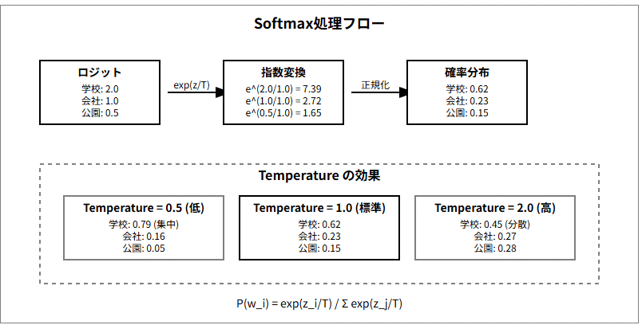
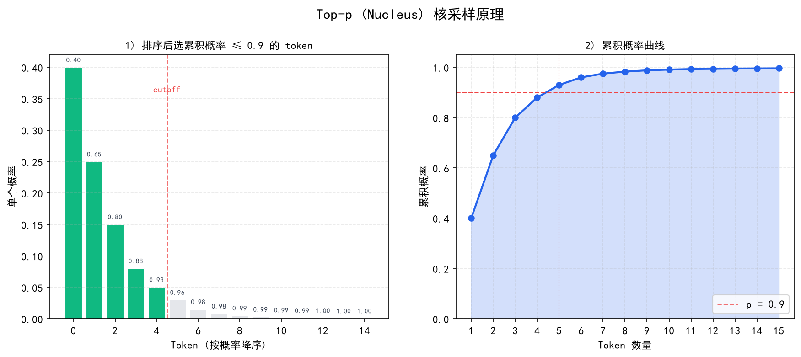

# 关键参数与调优

> Temperature、Top_p、max_tokens、stop 序列——这些参数怎么影响模型输出？本文逐一拆解，帮你避开常见坑。

## 目录

- [Temperature（温度）](#temperature温度)
- [Top_p（核采样）](#top_p核采样)
- [Max_tokens（最大输出长度）](#max_tokens最大输出长度)
- [Stop Sequences（停止词）](#stop-sequences停止词)
- [Frequency / Presence Penalty（惩罚项）](#frequency--presence-penalty惩罚项)
- [总结](#总结)
- [参考链接](#参考链接)

你好，我是江小湖。代码调通了，但模型输出的质量可能还不稳定。这时候你需要认识 API 上的几个关键参数。

> **注意**：本文讲的是**推理时**的调参（temperature、top_p 等），不影响模型能力本身。想要真正改变模型行为，需要微调（Fine-tuning），详见 [微调实战指南](./07-finetuning-guide.md)。

在调用 LLM API 时，除了传入 Prompt，你还可以设置一系列参数。这些参数就像是收音机上的旋钮，能精细地调节模型输出的“风格”和“行为”。

对于 Agent 开发者来说，最常犯的错误就是**在需要严谨逻辑的地方使用了过高的 Temperature，导致模型胡言乱造**。

## Temperature（温度）

**这是最重要、最常用的参数。** 它控制模型输出的**随机性（创造力）**。

取值范围通常是 `0.0` 到 `2.0`（有些模型上限是 1.0）。

- **底层原理**：LLM 每次预测下一个词时，会计算出一个概率分布。Temperature 越低，模型越倾向于选择概率最高的那个词；Temperature 越高，模型越可能选择概率较低的词。

  
   
  <em>Temperature 对概率分布的影响</em>

- **`Temperature = 0.0`**：**绝对严谨**。模型几乎每次都会给出完全相同的回答。
  - **适用场景**：代码生成、数据提取（JSON 格式化）、数学计算、逻辑推理、RAG 问答。
  - **Agent 开发建议**：在 Agent 的核心决策循环（如判断下一步调用什么工具）中，**永远把 Temperature 设为 0**。
- **`Temperature = 0.7`**：**默认值**。平衡了准确性和流畅度。
  - **适用场景**：日常聊天、邮件撰写、文章总结。
- **`Temperature = 1.0+`**：**天马行空**。模型会使用很多生僻词，甚至开始胡编乱造。
  - **适用场景**：头脑风暴、写诗、写小说。

## Top_p（核采样）

**Top_p 是 Temperature 的替代方案**，同样用于控制随机性。

取值范围是 `0.0` 到 `1.0`。

- **底层原理**：模型把所有可能的下一个词按概率从高到低排序，然后只从累积概率达到 `Top_p` 的词汇集合中进行抽样。
- **举例**：如果 `Top_p = 0.1`，模型只会在概率最高的前 10% 的词里选，输出非常稳定。
- **最佳实践**：**官方强烈建议，Temperature 和 Top_p 只调其中一个，另一个保持默认。** 绝大多数开发者习惯只调 Temperature。

  
   
  <em>Top_p 核采样：动态选择概率累积达到阈值的词汇集合</em>

## Max_tokens（最大输出长度）

**控制模型最多能生成多少个 Token。**

- **常见误区**：很多新手以为这个参数是用来控制"输入+输出"的总长度的。**错！** 它只限制**输出（生成的回复）**的长度。
- **作用 1：控制成本**。防止模型陷入死循环，生成几万字的废话把你的 API 余额刷光。
- **作用 2：截断保护**。如果你发现模型的回答总是说到一半就断了，通常是因为 `max_tokens` 设置得太小。
- **注意**：如果你希望模型回答得简短，**不要用 max_tokens 来限制**（这会导致话说到一半被硬生生切断）。正确的做法是在 Prompt 里写："请用一句话回答"或"回复不要超过 50 个字"。

## Stop Sequences（停止词）

**告诉模型："当你生成这个词时，立刻闭嘴。"**

你可以传入一个数组，比如 `stop=["\n\n", "User:"]`。

- **在 Agent 中的妙用**：在早期的 Agent 框架（如 ReAct）中，模型需要输出 `Thought:`（思考）、`Action:`（动作）、`Observation:`（观察）。为了防止模型自己把 `Observation:` 也伪造出来，开发者会把 `Observation:` 设为停止词。这样模型生成完动作后就会停下，把控制权交还给代码，等代码执行完工具后，再把真实结果喂给模型。
- **Few-shot 隔离**：在给模型提供多个示例时，可以用特定的分隔符（如 `###`），并把它设为停止词，防止模型无休止地生成多余的示例。

## Frequency / Presence Penalty（惩罚项）

这两个参数用于**防止模型变成复读机**。取值范围通常是 `-2.0` 到 `2.0`。

- **Frequency Penalty（频率惩罚）**：根据一个词在**当前生成的文本中出现的频率**来惩罚它。值越高，模型越倾向于使用不同的词汇，而不是反复用同一个词。
- **Presence Penalty（存在惩罚）**：只要一个词在生成的文本中**出现过**，就惩罚它（不管出现几次）。值越高，模型越倾向于引入新的话题。

**最佳实践**：在绝大多数 Agent 场景下，保持默认值 `0` 即可。只有当你发现模型在写长文时反复使用"总而言之"、"综上所述"时，可以稍微调高（如 `0.5`）。

## 总结

对于 Agent 开发者，记住这个万能公式：
- **做逻辑、写代码、调工具、提数据**：`Temperature = 0`
- **写文章、做聊天、头脑风暴**：`Temperature = 0.7`
- **防止破产**：设置合理的 `max_tokens`
- **控制流程**：善用 `stop` 序列

> 至此，你已经具备了调用 LLM 的扎实基础。接下来进入 Agent 开发的灵魂环节：如何通过文字精确控制模型行为。请前往 [03 — Prompt 工程](../03-prompt-engineering/README.md)。

## 参考链接

- [OpenAI API Reference - Chat Completions](https://platform.openai.com/docs/api-reference/chat/create) — 官方参数说明
- [Cohere - Temperature and Top-p](https://docs.cohere.com/docs/temperature) — 对采样参数非常直观的图文解释
