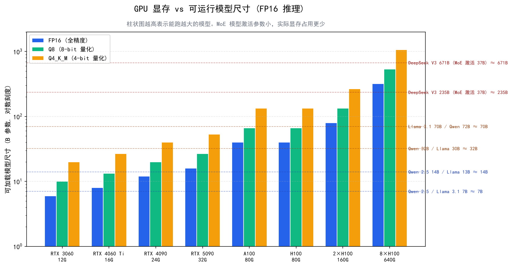

# 本地部署实战

> 不想把数据发给 OpenAI/Anthropic？想在自己的服务器上跑 LLM？本文从硬件选型到 Ollama/vLLM 部署，帮你搭建一套可用的本地推理服务。

## 目录

- [为什么需要本地部署](#为什么需要本地部署)
- [硬件选型：你的 GPU 能跑什么模型](#硬件选型你的-gpu-能跑什么模型)
- [量化技术：让大模型塞进小显存](#量化技术让大模型塞进小显存)
- [Ollama：最简单的本地部署方案](#ollama最简单的本地部署方案)
- [vLLM：生产级推理引擎](#vllm生产级推理引擎)
- [Ollama vs vLLM 怎么选](#ollama-vs-vllm-怎么选)
- [总结](#总结)
- [参考链接](#参考链接)

你好，我是江小湖。前面的文章讲了怎么通过 API 调用云端模型。但有些场景下，你必须把模型跑在本地——数据不能出内网、成本要可控、延迟要稳定。

这篇从零开始，带你完成一次完整的本地部署。

## 为什么需要本地部署

| 原因 | 典型场景 |
|------|---------|
| **数据隐私** | 医疗、金融、军工——用户数据绝对不能离开你的服务器 |
| **成本控制** | 日调用量 > 10 万次时，自建 GPU 服务器的月成本可能低于 API 费用 |
| **低延迟** | 实时代码补全、语音交互——网络往返的 100-500ms 延迟不可接受 |
| **离线可用** | 边缘设备、无外网的工业环境 |
| **定制化** | 需要用自己的数据微调模型，API 厂商不支持 |

**核心权衡**：本地部署省去了 API 费用和网络延迟，但你需要自己承担 GPU 硬件成本、运维负担和模型更新工作。

## 硬件选型：你的 GPU 能跑什么模型

### 模型大小与显存的关系

模型的显存占用主要由参数量和精度决定：

| 精度 | 每个参数占用 | 7B 模型 | 13B 模型 | 32B 模型 | 70B 模型 |
|------|-----------|---------|---------|---------|---------|
| FP32（原始） | 4 字节 | 28 GB | 52 GB | 128 GB | 280 GB |
| FP16（半精度） | 2 字节 | 14 GB | 26 GB | 64 GB | 140 GB |
| INT8（8 位量化） | 1 字节 | 7 GB | 13 GB | 32 GB | 70 GB |
| INT4（4 位量化） | 0.5 字节 | 3.5 GB | 6.5 GB | 16 GB | 35 GB |

**注意**：这只是模型权重的显存。实际运行还需要额外的 KV Cache（与上下文长度成正比）和激活值内存。一个 7B FP16 模型跑 8K 上下文大约需要 18-22 GB 总显存。

### 消费级 GPU 参考表

| 显卡 | 显存 | FP16 可运行 | Q4 量化可运行 | 价格参考 |
|------|------|------------|-------------|---------|
| RTX 3060 (12GB) | 12 GB | 7B 勉强 | 13B OK | ~$250 |
| RTX 4060 Ti (16GB) | 16 GB | 7B OK | 13B OK | ~$450 |
| RTX 4090 (24GB) | 24 GB | 13B OK | 34B OK | ~$1,600 |
| RTX A6000 (48GB) | 48 GB | 34B OK | 70B OK | ~$6,500 |

**对大多数个人开发者来说**：RTX 4090 是"甜点"——能跑 34B 的 Q4 量化模型（能力接近 GPT-3.5 级别），价格在消费级显卡中可以接受。

<p align="center">
  
  <br/>
  <em>不同 GPU 显存可运行的模型尺寸</em>
</p>

### Apple Silicon 用户

Mac 用户也有好消息。Apple M 系列芯片使用统一内存架构，意味着 CPU 和 GPU 共享内存：

| 芯片 | 统一内存 | 推荐配置 | 可运行模型 |
|------|---------|---------|-----------|
| M1/M2 Pro | 16-32 GB | 32 GB | 7B Q4 |
| M1/M2 Max | 64-128 GB | 64 GB+ | 13B Q4 / 34B Q4 |
| M2 Ultra | 192 GB | — | 70B Q4 |

Apple Silicon 运行速度比同价位的 NVIDIA GPU 慢（约 1/3 到 1/2），但胜在安静、省电、且不需要额外购买显卡。

## 量化技术：让大模型塞进小显存

**量化（Quantization）**是把模型参数从高精度（FP16/FP32）压缩到低精度（INT8/INT4）的过程。

### 直观理解

假设一个参数原本是 `3.14159265`（FP32，32 位浮点数）。量化后可能变成 `3.14`（INT4，用 4 个比特表示 16 个离散值之一）。精度有损失，但：
- **存储体积缩小 75%**（FP16 → INT4）
- **计算更快**（低精度运算在 GPU 上更高效）
- **质量损失通常可控**（对于 7B 以上的模型）

### 主流量化格式

| 格式 | 特点 | 适用工具 | 典型质量损失 |
|------|------|---------|------------|
| **GGUF** | llama.cpp 原生格式，支持多种量化级别 | Ollama、llama.cpp | Q4_K_M 是最佳平衡点 |
| **GPTQ** | GPU 专用，推理速度快 | vLLM、AutoGPTQ | 比 GGUF 稍好 |
| **AWQ** | 基于激活值的量化，精度保持更好 | vLLM、AutoAWQ | 三者中最优 |
| **EXL2** | ExLlamaV2 专用，极致速度 | ExLlamaV2 | 适合极限性能追求 |

### 量化级别速查（以 GGUF 为例）

| 级别 | 压缩率 | 质量评价 | 推荐度 |
|------|--------|---------|-------|
| Q2_K | 极高 | 明显退化，不推荐 | 仅极端受限环境 |
| Q3_K_M | 高 | 轻微退化 | 内存非常紧张时 |
| **Q4_K_M** | 中等 | **几乎无感知损失** | **推荐默认选择** |
| Q5_K_M | 低 | 几乎无损 | 对质量要求高时 |
| Q8_0 | 很低 | 接近原版 | 有足够显存时 |

**结论**：绝大多数情况下，**Q4_K_M 是性价比最优选择**——体积压缩约 75%，但实际使用中的质量差异极难感知。

## Ollama：最简单的本地部署方案

Ollama 是目前最友好的本地 LLM 运行工具。它封装了 llama.cpp 引擎，提供类似 Docker 的命令行体验。

### 安装与启动

```bash
# macOS / Linux / Windows (WSL2) 一键安装
curl -fsSL https://ollama.com/install.sh | sh

# Windows 也可直接下载安装包
```

### 运行第一个模型

```bash
# 下载并运行 Qwen 2.5 7B Instruct（自动选用 Q4_K_M 量化版本）
ollama run qwen2.5:7b

# 交互式对话界面
>>> 你好
你好！我是通义千问...
```

就这么简单。Ollama 会自动处理模型下载、量化加载、内存管理。

### 常用命令

```bash
# 查看已安装的模型列表
ollama list

# 删除模型释放磁盘空间
ollama rm qwen2.5:7b

# 查看模型信息（参数量、大小、量化级别）
ollama show qwen2.5:7b

# 创建自定义 Modelfile（修改系统提示词等）
cat > Modfile << 'EOF'
FROM qwen2.5:7b
SYSTEM """你是一个专业的 Java 后端开发助手。
回答简洁，代码优先，不要废话。"""
PARAMETER temperature 0
EOF

ollama create my-java-assistant -f Modfile
ollama run my-java-assistant
```

### 作为 API Server 使用

Ollama 启动后自动监听 `http://localhost:11434`，提供 **OpenAI 兼容的 REST API**：

```python
from openai import OpenAI

# Ollama 兼容 OpenAI SDK，只需改 base_url
client = OpenAI(
    base_url="http://localhost:11434/v1",
    api_key="ollama"  # 必填但不验证
)

response = client.chat.completions.create(
    model="qwen2.5:7b",
    messages=[
        {"role": "system", "content": "你是 Java 开发助手"},
        {"role": "user", "content": "解释 Spring Boot 自动装配原理"}
    ],
    stream=True
)

for chunk in response:
    content = chunk.choices[0].delta.content
    if content:
        print(content, end="", flush=True)
```

这意味着你把 Agent 系统中的 `base_url` 从 `https://api.openai.com/v1` 改成 `http://localhost:11434/v1`，其他代码完全不用改。**这就是 OpenAI 兼容格式的威力。**

## vLLM：生产级推理引擎

如果你的场景是**多用户并发访问**（如团队共享一台 GPU 服务器），Ollama 的串行请求处理会成为瓶颈。这时需要 **vLLM**。

### 为什么 vLLM 更快

vLLM 的核心技术是 **PagedAttention（分页注意力）** 和 **Continuous Batching（连续批处理）**：

- **PagedAttention**：像操作系统的虚拟内存一样管理 KV Cache，避免固定分配造成的浪费
- **Continuous Batching**：新请求到达时立即加入批次，不必等待当前批次全部完成

实测数据（A100 单卡，Llama 3.1 8B）：

| 并发用户数 | Ollama (tok/s) | vLLM (tok/s) | vLLM 加速比 |
|-----------|---------------|-------------|------------|
| 1 | 62 | 71 | 1.1x |
| 10 | 98 | 485 | 4.9x |
| 50 | 155 | 920 | 5.9x |
| 100 | 142（开始降级） | 1,640 | 11.5x |

单用户差距不大，但并发越高 vLLM 优势越明显。

### 快速启动

```bash
pip install vllm

# 启动 OpenAI 兼容的 API Server
python -m vllm.entrypoints.openai.api_server \
    --model Qwen/Qwen2.5-7B-Instruct \
    --port 8000 \
    --gpu-memory-utilization 0.92 \
    --max-model-len 8192
```

Server 启动后，同样兼容 OpenAI SDK：

```python
from openai import OpenAI

client = OpenAI(
    base_url="http://localhost:8000/v1",
    api_key="not-needed"
)

response = client.chat.completions.create(
    model="Qwen/Qwen2.5-7B-Instruct",
    messages=[{"role": "user", "content": "你好"}]
)
print(response.choices[0].message.content)
```

## Ollama vs vLLM 怎么选

| 维度 | Ollama | vLLM |
|------|--------|------|
| 上手难度 | 极低（一条命令） | 中等（需 Python 环境） |
| 适用场景 | 个人开发、原型验证、1-4 用户 | 生产服务、多用户并发（5+） |
| 吞吐量（高并发） | 低（串行处理） | 高（连续批处理） |
| Time to First Token | ~65ms | ~11ms |
| 模型格式 | GGUF（自带量化） | 支持原生权重、GPTQ、AWQ |
| 多 GPU 支持 | 有限 | 完善（Tensor Parallel） |
| 自定义程度 | 中等（Modelfile） | 高（完整 Python API）|

**决策规则**：
- **个人开发 / 学习 / 原型** → Ollama，零门槛
- **团队内部服务 / 生产环境 / 多用户** → vLLM，吞吐量碾压
- **不确定** → 先用 Ollama 跑通，遇到瓶颈再迁移到 vLLM（API 兼容，迁移成本低）

## 总结

- **本地部署的核心价值**在于数据隐私、成本控制和低延迟，代价是自己承担运维和硬件成本
- **硬件选型的关键指标是显存**：RTX 4090（24GB）能跑 34B Q4 模型，是个人开发的甜点；Apple M2 Ultra（192GB）能跑 70B Q4
- **量化技术让大模型塞进小显存**：Q4_K_M 是默认推荐，75% 压缩率下质量损失几乎不可感知
- **Ollama 适合个人和原型**：一条命令运行，OpenAI 兼容 API，零学习曲线
- **vLLM 适合生产环境**：PagedAttention + 连续批处理，高并发吞吐量是 Ollama 的 5-12 倍
- **两者 API 都兼容 OpenAI 格式**，切换只需改 `base_url`

> 本地模型跑起来了，API 也通了，接下来看看那些控制模型行为的关键参数。请前往 [关键参数与调优](./07-key-parameters.md)。

## 参考链接

- [Ollama 官方文档](https://ollama.com/) — 模型库、Modelfile 参考、API 文档
- [vLLM GitHub](https://github.com/vllm-project/vllm) — PagedAttention 论文、部署指南、性能基准
- [llama.cpp GitHub](https://github.com/ggerganov/llama.cpp) — GGUF 格式定义、量化工具链
- [HuggingFace — The LLM Racing Arena](https://huggingface.co/spaces/open-llm-leaderboard/open_llm_leaderboard) — 开源模型排行榜
