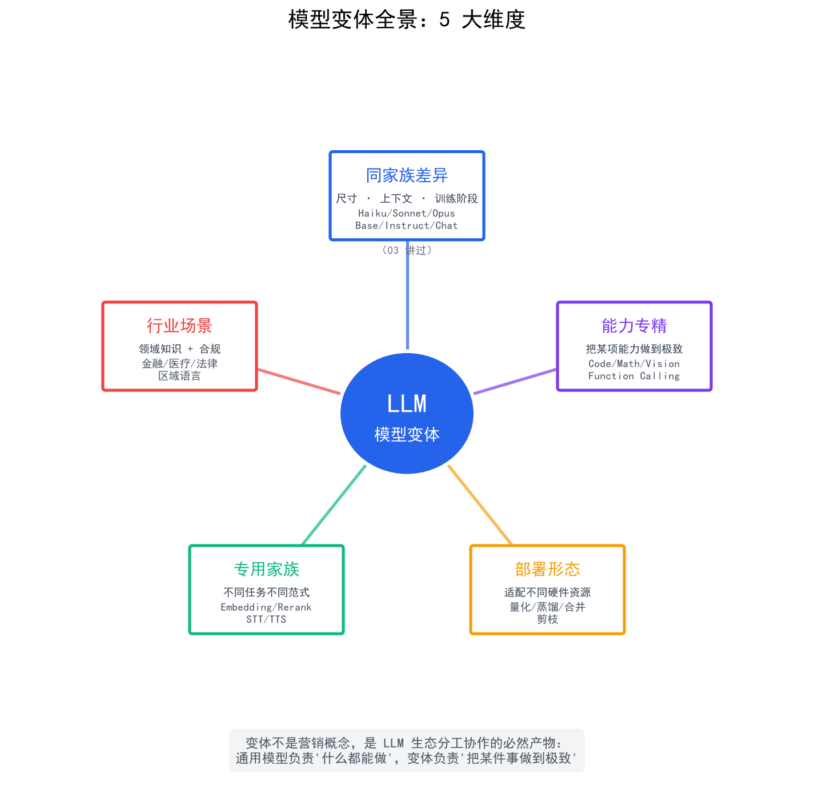

# 模型变体速查

> [模型尺寸与上下文窗口](./03-model-variants.md)讲了同家族内的尺寸差异（Haiku/Sonnet/Opus）、上下文窗口、训练阶段变体（Base/Instruct/Chat）。但 LLM 生态里"变体"远不止这些——**能力专精、部署形态、专用模型、行业场景**是另外四个重要维度，Agent 选型时绕不开。这篇帮你建立完整的变体认知。

## 目录

- [变体全景：5 个维度]
- [变体维度 1：能力专精]
  - [Code 专用模型]
  - [Math 专用模型]
  - [多模态变体]
  - [Function Calling 优化版]
- [变体维度 2：部署形态]
  - [量化（Quantization）]
  - [蒸馏（Distillation）]
  - [合并（Merge）]
  - [剪枝（Pruning）]
- [变体维度 3：专用模型家族]
  - [嵌入模型（Embedding）]
  - [重排序模型（Rerank）]
  - [语音模型（STT / TTS）]
- [变体维度 4：行业 / 场景]
- [变体选型决策框架]
- [总结]
- [参考链接]

## 变体全景：5 个维度

"变体"（Variants）在 LLM 生态里指**针对特定目标做了专门优化的模型版本**。从大类上分：

| # | 维度 | 解决的问题 | 典型变体 |
|---|------|----------|---------|
| 1 | **能力专精** | 某个能力做到极致 | Code / Math / Vision / Function Calling 专用模型 |
| 2 | **部署形态** | 适配不同硬件和资源 | 量化、蒸馏、合并、剪枝 |
| 3 | **专用模型家族** | 不同任务用不同范式 | Embedding / Rerank / STT / TTS |
| 4 | **行业 / 场景** | 领域知识 + 合规 | 金融 / 医疗 / 法律行业模型 |
| 5 | **同家族差异** | 大小 / 上下文 / 训练阶段 | Haiku/Sonnet/Opus、Base/Instruct/Chat |

第 5 个维度已经在 [模型尺寸与上下文窗口](./03-model-variants.md) 讲过，这篇聚焦前 4 个。

<p align="center">
  
  <br/>
  <em>模型变体的 5 大维度</em>
</p>

> **一句话区分**：变体不是营销，是 LLM 生态分工协作的必然产物——通用大模型负责"什么都能做"，变体负责"把某件事做到极致"。

## 变体维度 1：能力专精

### Code 专用模型

通用模型能写代码，但 **Code 专用模型在代码任务上更快、更准、更便宜**。

| 模型 | 来源 | 规模 | 特点 | Agent 用途 |
|------|------|------|------|----------|
| **Codestral** | Mistral | 7B / 22B | 开源，工具调用友好 | IDE 补全、代码 Agent |
| **DeepSeek-Coder-V2** | DeepSeek | 16B / 236B MoE | 中英双语代码，SWE-bench 强 | 复杂重构、跨文件理解 |
| **Qwen2.5-Coder** | 阿里 | 0.5B-32B | 尺寸齐全，可本地部署 | 多场景覆盖 |
| **Code Llama** | Meta | 7B / 13B / 34B / 70B | 经典选择 | 已逐渐被新一代取代 |
| **GPT-5.4 / Claude Sonnet** | 商用 API | — | 综合能力含代码 | 中等代码任务 |

**什么时候用 Code 专用模型？**

- IDE 插件 / 代码补全（要求 < 100ms 响应，专用小模型更快）
- 训练数据高度专业（编译原理、底层优化）
- 离线环境无法调 API

**什么时候通用模型就够了？**

- Agent 工具调用（GPT-4o/Claude 的工具调用已经很成熟）
- 简单的代码解释、转换、生成
- 提示词工程层面已经能解决

### Math 专用模型

| 模型 | 规模 | 特点 | 适用 |
|------|------|------|------|
| **Qwen2.5-Math** | 1.5B / 7B / 72B | 中文数学题解强 | 教学、题库 |
| **NuminaMath** | 7B | 竞赛数学 | 数学竞赛 |
| **DeepSeek-Math** | 7B | 学术数学 | 论文级数学 |

**重要提醒**：o1、o3、R1、Gemini Thinking 这类**推理模型**就是 Math/Logic 推理的通用版，能力远超专门的 Math 模型。Math 专用模型适合**离线 + 推理成本极度敏感**的场景，否则优先用推理模型。

### 多模态变体（Vision）

能"看懂"图片的模型——同一架构基础上加了视觉编码器。

| 模型 | 视觉能力 | 上下文 | 适合场景 |
|------|---------|-------|---------|
| **GPT-4V / GPT-5 Vision** | ★★★★★ | 128K | 通用图文理解 |
| **Claude 3/4 Sonnet/Opus** | ★★★★★ | 200K | 文档+图片分析 |
| **Gemini 2.5 Pro** | ★★★★★ | 1M | 长视频、超长文档 |
| **Qwen2.5-VL** | ★★★★ | 32K | 国产开源首选 |
| **LLaVA** | ★★★ | 4K | 本地部署 |
| **InternVL** | ★★★★ | 8K-32K | 国产开源，强 OCR |

> 注意：**不是所有同族模型都支持 Vision**。例如 Llama 3 纯文本版不支持图片，Llama 3.2 Vision 才支持。选型时要看清楚能力矩阵。

### Function Calling 优化版

工具调用（Function Calling）是 Agent 的核心能力。各家模型在工具调用上的稳定性差异巨大：

| 模型 | 工具调用能力 | JSON 稳定性 |
|------|------------|------------|
| **GPT-4o / GPT-5 系列** | ★★★★★ | 99%+ |
| **Claude Sonnet / Opus** | ★★★★★ | 99%+ |
| **Gemini 2.5 Flash** | ★★★★ | 95%+ |
| **Qwen2.5 / DeepSeek V3** | ★★★★ | 90%+ |
| **Llama 3.1 8B** | ★★★ | 80-85% |
| **Mistral 7B** | ★★ | 70-80% |

**Agent 框架（LangChain、AutoGen）对工具调用格式要求严格**——某个 JSON 字段写错就解析失败。建议优先选择 ★★★★ 及以上的模型；如果只能选小模型，**用专门微调过的 Function Calling 版本**（如 Hermes 系列、ToolACE）。

### 长上下文优化版

有些厂商会在主模型之外发布**长上下文专用版**：

- Gemini 2.5 Pro / Flash：1M 上下文（标准）
- Claude 全系列：200K 上下文（标准）
- Qwen2.5-1M：100 万 token 上下文
- Yi-Lightning：200K 上下文

## 变体维度 2：部署形态

部署形态变体主要解决**"我的 GPU 跑不动原版模型"**或**"我想要更小的模型"**的问题。

### 量化（Quantization）

将模型权重从高精度（FP16/FP32）压缩到低精度（4-bit/8-bit），**减少显存占用、加快推理速度**。

| 格式 | 精度 | 显存节省 | 质量损失 | 典型工具 |
|------|------|---------|---------|---------|
| FP16（原始） | 16-bit | 1x | 0% | — |
| **BF16** | 16-bit | 1x | < 0.1% | HuggingFace |
| **INT8** | 8-bit | ~2x | < 1% | bitsandbytes |
| **Q8_0 (GGUF)** | 8-bit | ~2x | < 1% | llama.cpp / Ollama |
| **Q4_K_M (GGUF)** | 4-bit 混合 | ~4x | 1-2% | Ollama（推荐） |
| **AWQ** | 4-bit | ~4x | 1-3% | AutoAWQ |
| **GPTQ** | 4-bit | ~4x | 1-3% | GPTQ-for-LLaMa |
| **Q2_K (GGUF)** | 2-bit | ~8x | 5-10% | 极限压缩 |

**选型建议**：

- 显存充足（4x 模型大小）→ **FP16 / BF16**（最准）
- 显存紧张但要保留质量 → **INT8**
- 消费级 GPU 跑 7B-13B 模型 → **Q4_K_M GGUF**（性价比之王）
- 24GB 显存想跑 70B → **AWQ 4-bit** + offload

> **Q4_K_M 是消费级 GPU 跑大模型的"标配"**——4 倍显存节省，质量损失 < 2%，几乎人人都在用。

### 蒸馏（Distillation）

把大模型的能力"传授"给更小的模型，让小模型"继承"大模型的部分能力。

- **DeepSeek-R1-Distill-Qwen-7B / 1.5B** → 把 R1 的推理能力蒸馏到 7B / 1.5B 模型
- **Qwen2.5 系列** → 阿里用 72B 蒸馏出 0.5B/1.5B/7B/14B/32B 全家桶
- **Phi-3.5 / Phi-4 系列** → 微软用 GPT-4 类模型蒸馏出 3.8B/14B 小模型，性能惊人
- **TinyLlama** → 用 Llama 2 7B 蒸馏到 1.1B

**优势**：同参数量下能力更强（小而精）
**劣势**：能力上限受限于教师模型

### 合并（Merge）

把多个微调模型"线性组合"，获得混合能力。

```python
# 用 mergekit 合并两个 LoRA 模型
import yaml
config = """
models:
  - model: model-A   # 偏聊天
    weight: 0.5
  - model: model-B   # 偏代码
    weight: 0.5
merge_method: linear
"""
with open("merge.yaml", "w") as f:
    f.write(config)
# mergekit-yaml merge.yaml merged-model
```

**典型场景**：

- 模型 A 偏聊天 + 模型 B 偏代码 → 合并后既能聊又能写代码
- 不同 DPO 偏好模型 → 合并出"更平衡"的对齐效果

**优势**：低成本获得定制能力
**劣势**：合并效果难预测，需要实验

### 剪枝（Pruning）

移除模型中"不重要"的神经元或层，让模型更小。

- **结构化剪枝**：移除整个 attention head 或 FFN 层
- **非结构化剪枝**：移除单个权重（更激进但需要稀疏计算支持）

实操中剪枝**不如量化+蒸馏常用**——剪枝后的模型在通用 GPU 上加速不明显。

## 变体维度 3：专用模型家族

LLM 生态里除了"对话生成"模型，还有几个**完全不同的范式**专门解决特定任务。

### 嵌入模型（Embedding）

**把文本变成向量**——用于相似度计算、检索、聚类。

| 模型 | 维度 | 上下文 | 特点 |
|------|------|--------|------|
| **OpenAI text-embedding-3-large** | 3072 | 8K | 综合最强 |
| **BGE-M3** | 1024 | 8K | **中文开源最强** |
| **BGE-large-zh-v1.5** | 1024 | 512 | 中文经典 |
| **M3E** | 768 | 8K | 中文轻量 |
| **Cohere embed-v3** | 1024 | 8K | 多语言商用 |
| **Nomic Embed Text v2** | 768 | 8K | 长文本开源 |

**重要**：**对话模型 ≠ 嵌入模型**！两个完全不同的范式：

| 维度 | 对话模型 | 嵌入模型 |
|------|---------|---------|
| 任务 | 文本生成 | 文本→向量 |
| 结构 | 自回归（Decoder） | 双塔结构（Encoder） |
| 输出 | Token 序列 | 一个定长向量 |
| 用途 | 聊天、推理 | 检索、聚类、推荐 |

> 混用会导致检索效果非常差。例如把 Llama 3 的最后一层 hidden state 当 embedding 用，效果远不如专门的嵌入模型。

### 重排序模型（Rerank）

**对召回结果重新打分排序**——RAG 系统的精排阶段必备。

| 模型 | 规模 | 速度 | 质量 |
|------|------|------|------|
| **BGE-reranker-v2-m3** | 568M | 中 | ★★★★★ 多语言 |
| **BGE-reranker-large** | 560M | 中 | ★★★★ |
| **Cohere Rerank 3** | API | 快 | ★★★★★ |
| **Jina Rerank** | API | 快 | ★★★★ |
| **mxbai-rerank-large-v2** | 1.5B | 中 | ★★★★ |

**RAG 标准两阶段**：

```
用户问题 → 嵌入模型召回 Top 100 → Rerank 精排 Top 5 → LLM 生成答案
            ↑                            ↑
        速度优先                     精度优先
```

Rerank 模型比直接用 LLM 精排**快 10-100 倍**，且更准。

### 语音模型

| 用途 | 模型 | 特点 |
|------|------|------|
| **STT**（语音→文字） | Whisper / Whisper-Large-V3 | OpenAI 开源，多语言 |
| **STT** | Paraformer | 阿里开源，中文优秀 |
| **TTS**（文字→语音） | CosyVoice / CosyVoice 2 | 阿里开源，零样本克隆 |
| **TTS** | ChatTTS | 国产开源，聊天场景 |
| **TTS** | ElevenLabs | 商用，效果顶级 |
| **Realtime 语音对话** | GPT-4o Realtime | 低延迟 < 300ms |

## 变体维度 4：行业 / 场景

### 行业模型

针对特定行业做了大量微调：

| 行业 | 代表模型 | 特点 |
|------|---------|------|
| **金融** | BloombergGPT、FinGPT、轩辕 | 财报分析、风险评估 |
| **医疗** | Med-PaLM 2、扁鹊（HuaTuo）、DISC-MedLLM | 临床问答、影像 |
| **法律** | ChatLaw、通义法睿、LawGPT | 法规检索、合同分析 |
| **代码** | StarCoder、Code Llama、DeepSeek-Coder | 已是细分方向 |
| **教育** | 智谱 EduAgent、作业帮系列 | K12 辅导 |

**经验**：通用模型（GPT-4o/Claude/DeepSeek）在大多数场景已足够，**行业模型只在合规要求严格、专业知识密度极高的场景才有必要**（如三甲医院、金融监管）。

### 区域 / 语言变体

- **国产模型**：Qwen、DeepSeek、GLM、Kimi、文心、豆包——中文优化 + 数据合规
- **多语言模型**：Llama 3.1（8 语言）、Qwen2.5（29 语言）、Mixtral
- **区域合规模型**：Falcon（阿联酋）、Jais（阿拉伯语）

> 国内业务**优先选国产开源模型**——中文能力强、推理速度快、数据不出境、可商用。

## 变体选型决策框架

| 你的需求 | 推荐变体 | 代表 |
|---------|---------|------|
| 普通对话 / Agent 工具调用 | 通用大模型 | Sonnet / GPT-4o / DeepSeek V3 |
| IDE 代码补全（< 100ms） | **Code 专用小模型** | Codestral 7B / Qwen-Coder 1.5B |
| 数学 / 逻辑难题 | 推理模型 | o1 / R1 / Gemini Thinking |
| RAG 检索（向量召回） | **Embedding 模型** | BGE-M3 / text-embedding-3 |
| RAG 精排 | **Rerank 模型** | BGE-reranker-v2-m3 / Cohere Rerank |
| 多模态（图片理解） | Vision 模型 | GPT-4V / Claude / Gemini |
| 离线部署 + 性能敏感 | **4-bit 量化** | Q4_K_M GGUF |
| 离线部署 + 能力要求高 | **蒸馏版** | Distill-Qwen-7B |
| 消费级 GPU 跑 70B | **AWQ 4-bit** | AutoAWQ + offload |
| 行业知识（金融 / 医疗） | 行业微调模型 | BloombergGPT / 扁鹊 |
| 语音转文字 | **STT 模型** | Whisper / Paraformer |
| 文字转语音 | **TTS 模型** | CosyVoice / ElevenLabs |

## 总结

- **变体不是营销概念，是 LLM 生态分工协作的必然产物**——5 大维度（能力专精、部署形态、专用家族、行业场景、同家族差异）共同构成完整生态
- **能力专精变体**：Code / Math / Vision / Function Calling 各有专门模型，**按需选型，不要用大炮打蚊子**
- **部署形态变体**：**量化是消费级 GPU 跑大模型的关键**（Q4_K_M 是标配），蒸馏实现"小而精"
- **专用模型家族**：Embedding / Rerank / 语音模型是 **RAG / Agent / 多模态系统的组件库**，混用会出大问题
- **行业变体**：通用模型通常已够用，**只在合规要求严、专业密度高的场景**用行业模型
- **变体选型核心**：先明确需求（在线 / 离线？延迟 / 质量？通用 / 专用？），再选变体；不要先选最大模型再想怎么压缩

> 本篇是 02 章内部 [模型尺寸与上下文窗口](./03-model-variants.md) 的延伸阅读——03 讲了"同家族差异"维度，本篇补完另外 4 个维度（能力专精 / 部署形态 / 专用家族 / 行业场景）。
> 
> 主线请回到 [关键参数与调优](./06-key-parameters.md) → 之后进入 [03 — Prompt 工程](../03-prompt-engineering/README.md)。

## 参考链接

- [LangChain — Embedding Models](https://python.langchain.com/docs/integrations/text_embedding) — 嵌入模型集成
- [mergekit GitHub](https://github.com/arcee-ai/mergekit) — 模型合并工具
- [BAAI 智源 BGE 系列](https://huggingface.co/BAAI) — 中文最强 Embedding / Rerank
- [Ollama Model Library](https://ollama.com/library) — 各种 GGUF 量化模型
- [OpenAI Whisper](https://github.com/openai/whisper) — 开源语音识别
- [HuggingFace Open Reranker Leaderboard](https://huggingface.co/spaces/mteb/leaderboard) — Embedding / Rerank 排名
- [Ollama 量化格式说明](https://github.com/ollama/ollama/blob/main/docs/quantization.md)
