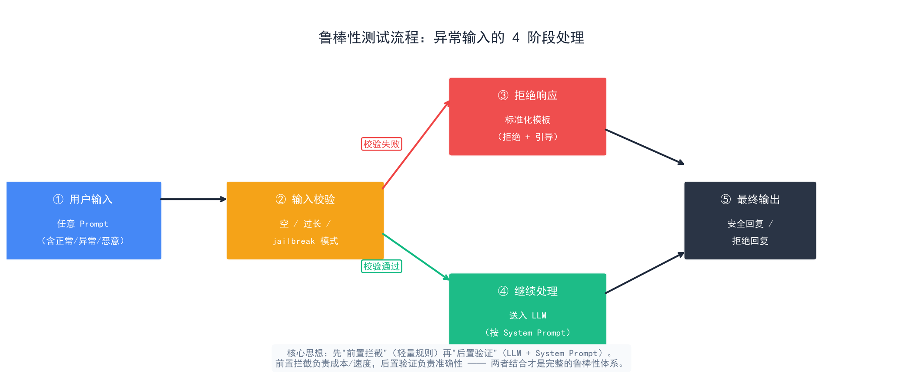
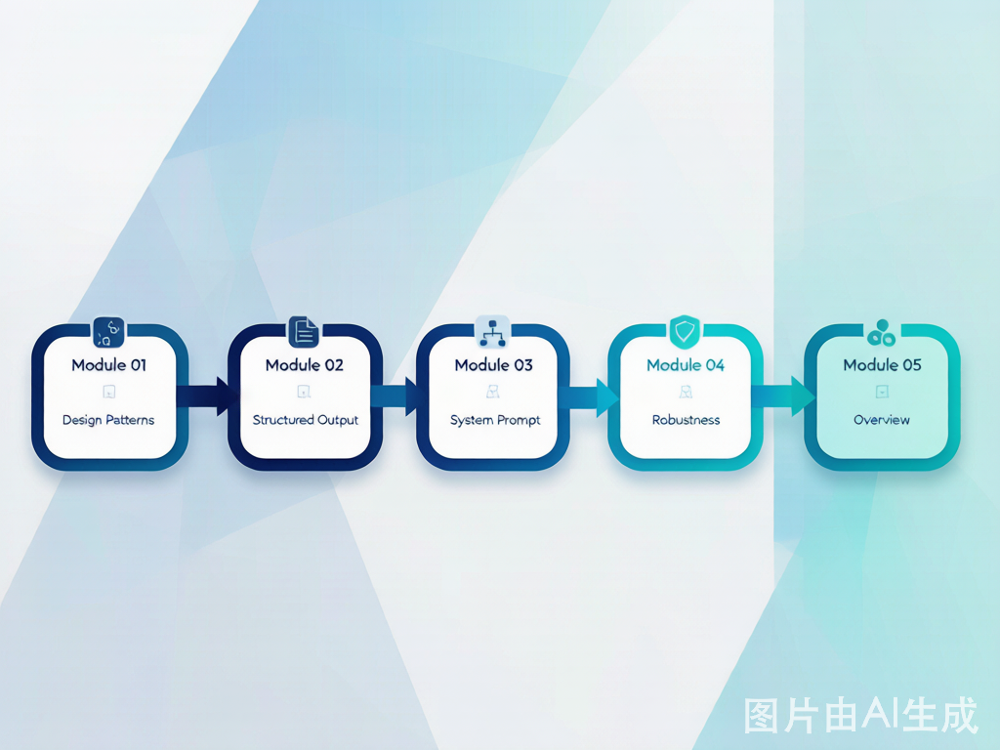

# Prompt 工程概述：控制 Agent 行为的四项核心技术

> Prompt 工程是 Agent 开发的"控制层"——你如何给 LLM 下指令，决定了 Agent 的行为质量、输出可靠性和安全边界。本章四篇文章覆盖了从模式选择到鲁棒性验证的完整链路。

## 目录

- [本章在 AgentDevGuide 中的位置](#本章在-agentdevguide-中的位置)
- [四篇文章的关系](#四篇文章的关系)
- [核心概念地图](#核心概念地图)
- [学习路径建议](#学习路径建议)
- [下一章预告](#下一章预告)
- [总结](#总结)

你好，我是江小湖。在前两章建立了 LLM 认知和模型接入能力之后，这一章解决 **Agent 行为的"控制"问题**——你怎么跟 LLM 沟通，决定了 Agent 的行为质量、输出可靠性和安全边界。这篇文章先帮你建立全局认知，再逐篇深入。

在前两章建立了 LLM 认知（LLM 基础）和模型接入的基础上，这一章解决的是 **Agent 行为的"控制"问题**。LLM 的能力是给定的，你能控制的是你怎么跟它沟通。Prompt 工程就是这门"沟通的语言学"——从模式选择、结构定义、系统设计到鲁棒性保障。

## 本章在 AgentDevGuide 中的位置

```
01 — LLM 基础          理解 Agent 的"大脑"
02 — 模型接入           把大脑接入系统
03 — Prompt 工程  ←    精确控制 Agent 的行为     ← 你在这里
04 — 工具调用           让 Agent 能做事
05 — Agent 循环         感知→决策→行动的架构
...
```

Prompt 工程是承上启下的一章——知道了 LLM 能做什么、怎么接入，现在要解决**怎么控制它**的问题。而学完这一章，你就掌握了让 Agent "听你的话"的能力，接下来才能进入工具调用——因为工具调用的输入和输出，本质上是 Prompt 工程的延伸应用。

<p align="center">
  
  <br/>
  <em>Prompt 工程全景：从模式选择到鲁棒性保障的完整链路</em>
</p>

## 四篇文章的关系

本章四篇文章不是并列关系，而是从**粗到细、从前到后**的递进体系：

<p align="center">
  
  <br/>
  <em>本章四篇文章：从"怎么问"到"怎么稳"的递进链路</em>
</p>

```
设计模式         结构化输出       System Prompt      鲁棒性
  (怎么问)   →    (输出格式)  →    (行为定义)    →   (怎么稳)
```

| 文章 | 解决的问题 | 核心交付 |
|------|-----------|---------|
| [02 — Prompt 设计模式](./02-prompt-design-patterns.md) | 不同场景下用什么方式组织 Prompt | 四种模式的选型决策树 |
| [03 — 结构化输出](./03-structured-output.md) | 如何让 LLM 输出可被代码消费的数据 | JSON Mode + Schema + 解析三层体系 |
| [04 — System Prompt 设计](./04-system-prompt.md) | 如何定义 Agent 的角色、边界和规范 | 四段式结构 + XML 标签组织法 |
| [05 — Prompt 鲁棒性](./05-prompt-robustness.md) | 如何在意外输入下保持安全可控 | 幻觉控制 + 边界处理 + 测试体系 |

## 核心概念地图

把四篇文章的关键概念放在一起，形成本章的完整知识地图：

```
┌─────────────────────────────────────────────────────────┐
│                    Prompt 工程全景                       │
├───────────────┬───────────────┬───────────────┬─────────┤
│   设计模式     │  结构化输出    │ System Prompt │ 鲁棒性  │
├───────────────┼───────────────┼───────────────┼─────────┤
│ Zero-shot     │ JSON Mode     │ 角色定义       │ 幻觉控制 │
│ Few-shot      │ Schema 约束   │ 行为规则       │ 边界处理 │
│ CoT           │ Pydantic      │ 安全护栏       │ 一致性   │
│ 角色设定       │ 三层解析       │ 输出规范       │ 测试体系 │
├───────────────┴───────────────┴───────────────┴─────────┤
│  组合使用：角色(Few-shot + CoT) + Schema 约束 + 鲁棒性   │
└─────────────────────────────────────────────────────────┘
```

**关键概念速查**：

| 概念 | 一句话定义 | 在哪篇 |
|------|-----------|--------|
| Few-shot | 给 2-5 个示例教模型输出格式 | 设计模式 |
| CoT | 让模型"先想再说"提升推理准确率 | 设计模式 |
| JSON Mode | API 参数强制输出合法 JSON | 结构化输出 |
| Schema 约束 | 用 Pydantic/JSON Schema 定义输出结构 | 结构化输出 |
| 角色定义 | 四要素：身份 + 领域 + 约束 + 格式 | System Prompt |
| XML 标签 | 用 `<role>` `<rules>` 等标签组织复杂 Prompt | System Prompt |
| 引用约束 | 要求模型为事实性陈述提供来源 | 鲁棒性 |
| 拒绝模板 | 标准化拒绝方式，不解释原因 | 鲁棒性 |

## 学习路径建议

根据你的背景和目标，选择不同的学习路径：

**路径一：快速上手（2 小时）**
1. 读 [02 设计模式](./02-prompt-design-patterns.md) —— 掌握四种模式就够了
2. 读 [03 结构化输出](./03-structured-output.md) 的前半部分 —— JSON Mode 和 Schema 约束
3. 动手：写一个带 Few-shot + Schema 约束的 Agent Prompt

**路径二：系统掌握（1 天）**
1. 按顺序读完设计模式 → 结构化输出 → System Prompt → 鲁棒性
2. 每篇读完写一个对应的 Agent Prompt 练手
3. 组合四项技术，构建一个完整的客服 Agent Prompt

**路径三：深入研究（1 周）**
1. 读完四篇文章 + 所有参考链接
2. 搭建 Prompt 测试套件（参考鲁棒性篇的测试方法）
3. 对比不同 Prompt 模式在同一任务上的表现差异
4. 尝试用 Instructor / Outlines 等库替代手写解析

## 下一章预告

> 提示工程解决了"怎么说"，接下来要解决"怎么做"。下一章 [工具调用（Function Calling）](../04-tool-use/README.md) 教你让 Agent 调用外部函数、API 和数据库——这是 Agent 从"聊天机器人"到"能做事"的关键跨越。

## 总结

Prompt 工程是 Agent 开发的控制层，本章的四篇文章构建了从输入到输出的完整控制链路：

- **[设计模式](./02-prompt-design-patterns.md)** 解决"怎么组织输入"——Zero-shot → Few-shot → CoT → 角色设定，从低控制到高控制的递进
- **[结构化输出](./03-structured-output.md)** 解决"输出格式"——JSON Mode 做格式保证，Schema 做结构定义，解析器做异常兗底
- **[System Prompt](./04-system-prompt.md)** 解决"行为定义"——四段式结构（角色/规则/边界/输出）+ XML 标签组织法
- **[鲁棒性](./05-prompt-robustness.md)** 解决"怎么稳"——幻觉控制、边界处理、一致性验证三层防御 + 测试体系

这四项技术不是独立使用的——在实际 Agent 开发中，它们始终组合在一起。一个典型的 Agent Prompt 会同时用到：角色定义（System Prompt）+ Few-shot 引导（设计模式）+ Schema 约束（结构化输出）+ 拒绝模板（鲁棒性）。

> 这一章结束了 Prompt 工程。下一章进入 Agent 开发的核心——工具调用：让 LLM 调用外部函数和 API。
