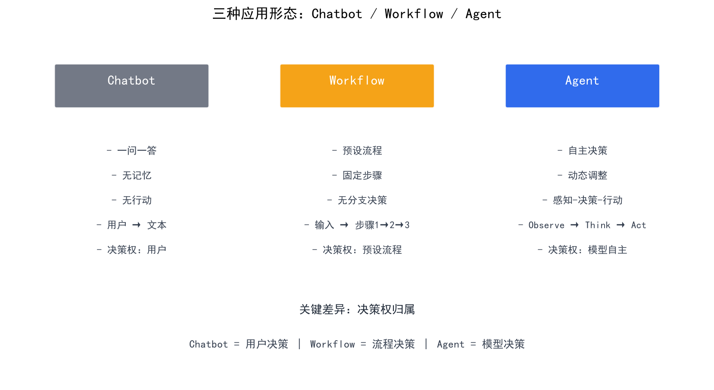
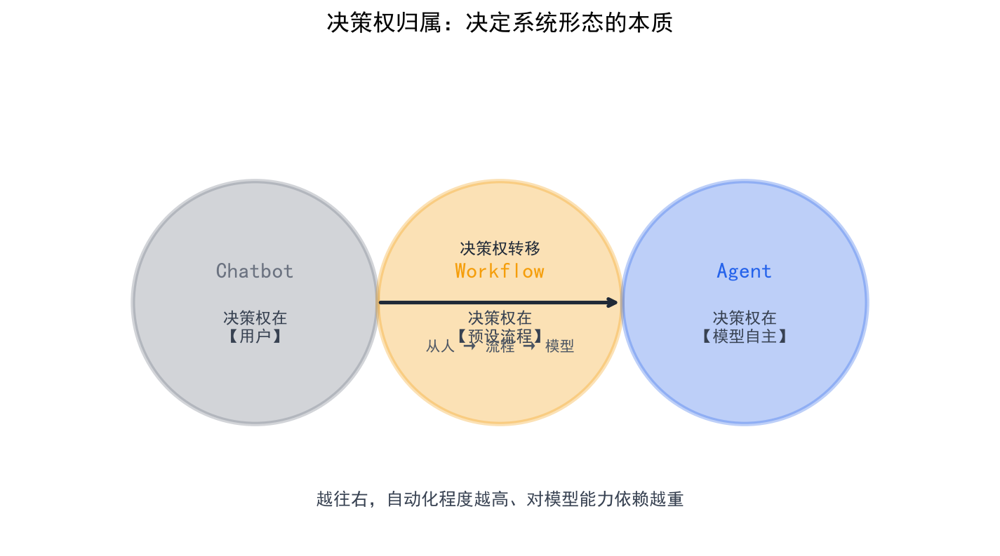

# Agent 与 Chatbot / Workflow 的区别

> Agent、Chatbot、Workflow 三者的核心差异在于"谁做决策"——Chatbot 是一问一答，Workflow 是预设流程，而 Agent 拥有自主决策循环，能根据观察动态调整行动。

## 目录

- [三种形态的本质区别](#三种形态的本质区别)
- [Chatbot：一问一答的文本生成器](#chatbot一问一答的文本生成器)
- [Workflow：预设流程的自动化](#workflow预设流程的自动化)
- [Agent：自主决策的智能体](#agent自主决策的智能体)
- [判断标准：你的场景需要哪种形态](#判断标准你的场景需要哪种形态)
- [总结](#总结)
- [参考链接](#参考链接)

你好，我是江小湖。在 [工具调用](../04-tool-use/01-tool-calling-mechanism.md) 中，你学会了让 LLM 突破文本边界。但"能调用工具"只是 Agent 的一个特征，真正的 Agent 还需要自主决策能力。这篇文章帮你厘清三种形态的本质区别：**什么场景用 Chatbot 就够，什么场景必须上 Agent**。

## 三种形态的本质区别

Chatbot、Workflow、Agent 的区别不是技术高低，而是**决策权的归属**不同：

| 形态 | 决策权 | 核心特征 | 适用场景 |
|------|--------|----------|----------|
| **Chatbot** | 用户 | 一问一答，无记忆，无行动 | 客服问答、知识查询 |
| **Workflow** | 预设流程 | 按固定步骤执行，无分支决策 | 数据清洗、报表生成 |
| **Agent** | 模型自主 | 感知→决策→行动的自主循环 | 复杂任务、多步推理 |

**关键洞察**：这三种形态是递进关系——Chatbot + 工具调用 = 能行动的 Chatbot，但还不是 Agent。Agent 的核心是**自主决策循环**：模型根据观察动态决定下一步做什么，而不是执行预设流程。

<p align="center">
  
  <br/>
  <em>Chatbot / Workflow / Agent：决策权归属递进</em>
</p>

## Chatbot：一问一答的文本生成器

Chatbot 是最简单的形态：用户输入一段文本，LLM 生成一段回复。没有记忆、没有行动、没有循环。

```python
# 最简 Chatbot：一问一答
def chatbot(user_input: str) -> str:
    response = llm.generate(user_input)
    return response

# 用户问天气
chatbot("北京今天天气怎么样？")
# 返回：我不太清楚，因为我没有实时数据访问权限
```

**Chatbot 的本质**：每次调用都是独立的，不依赖历史对话。用户问什么，LLM 根据概率分布生成最可能的回复。没有外部工具，没有记忆，输出完全由 Prompt 和模型参数决定。

**局限**：Chatbot 无法执行任何操作——不能查天气、不能调 API、不能操作数据库。它只是一个文本生成器，输出的是"关于"某个话题的文本，而不是"执行"某个操作。

<p align="center">
  
  <br/>
  <em>从 Chatbot 到 Agent：决策权从用户→流程→模型</em>
</p>

## Workflow：预设流程的自动化

Workflow 将任务拆解为固定步骤，按顺序执行。流程由开发者预定义，LLM 只负责填充某个步骤的具体内容。

```python
# Workflow：预设流程
def workflow(user_input: str):
    # 步骤 1：提取意图
    intent = llm.generate(f"从用户输入中提取意图：{user_input}")
    
    # 步骤 2：根据意图执行固定操作
    if intent == "查询天气":
        result = get_weather()  # 预设函数
    elif intent == "预订会议室":
        result = book_meeting_room()  # 预设函数
    else:
        result = "抱歉，我无法处理这个请求"
    
    # 步骤 3：生成回复
    return llm.generate(f"用自然语言回复：{result}")
```

**Workflow 的特点**：
- **步骤固定**：开发者预先定义所有可能的分支和操作
- **LLM 只是填充器**：在某个步骤中，LLM 负责从文本中提取信息，但不决定流程走向
- **确定性高**：同样的输入必然产生同样的流程，行为可预测

**Workflow 的局限**：无法处理预设之外的情况。如果用户输入超出预定义的意图，Workflow 只能返回"无法处理"。它没有自主决策能力，无法根据新信息调整行动。

## Agent：自主决策的智能体

Agent 拥有**自主决策循环**：观察环境 → 决定行动 → 执行行动 → 观察结果 → 继续决策。这个循环不是预设的，而是模型根据当前状态动态决定下一步做什么。

```python
# Agent：自主决策循环
def agent(user_input: str):
    # 初始化：用户输入是第一个观察
    observations = [user_input]
    tools = [get_weather, search_database, send_email]
    
    while True:
        # 模型根据当前所有观察，决定下一步做什么
        decision = llm.generate(
            f"当前观察：{observations}\n"
            f"可用工具：{tools}\n"
            "请决定下一步操作（调用工具或直接回复）"
        )
        
        if decision.type == "tool_call":
            # 执行工具调用
            result = execute_tool(decision.tool_name, decision.args)
            observations.append(f"工具 {decision.tool_name} 返回：{result}")
        elif decision.type == "final_answer":
            # 模型认为任务完成，返回最终答案
            return decision.answer
```

**Agent 的核心特征**：

1. **自主决策**：模型根据当前状态决定下一步做什么，而不是执行预设流程
2. **循环执行**：观察→决策→行动→观察，直到任务完成
3. **动态调整**：根据中间结果调整后续行动，而不是沿固定路径执行
4. **工具集成**：能调用外部工具获取实时数据或执行操作

**Agent 与 Workflow 的本质区别**：Workflow 的流程是开发者预定义的，Agent 的流程是模型动态生成的。同样的任务，Workflow 需要开发者穷举所有分支，Agent 只需要定义工具接口，让模型自主决策。

## 判断标准：你的场景需要哪种形态

选择 Chatbot、Workflow 还是 Agent，取决于三个维度：

| 维度 | Chatbot | Workflow | Agent |
|------|---------|----------|-------|
| **任务复杂度** | 单步问答 | 多步但固定 | 多步且动态 |
| **决策需求** | 无需决策 | 预定义决策 | 动态决策 |
| **可预测性** | 高 | 高 | 中（依赖模型） |

**决策树**：

1. **用户只是问问题，不需要执行操作？** → 用 Chatbot
2. **任务有固定流程，步骤和分支都能穷举？** → 用 Workflow
3. **任务需要根据中间结果动态调整？** → 用 Agent

**实际案例**：

- **客服系统**：简单问题用 Chatbot，涉及退款/投诉等需要多步操作的场景用 Agent
- **数据分析**：固定报表生成用 Workflow，探索性分析（"帮我看看这个数据有什么异常"）用 Agent
- **内容创作**：单篇文章生成用 Chatbot，系列文章规划+素材搜集+撰写+排版用 Agent

## 总结

- **Chatbot** 是一问一答的文本生成器，无记忆、无行动、无循环
- **Workflow** 是预设流程的自动化，步骤固定、LLM 只是填充器
- **Agent** 是自主决策的智能体，拥有"观察→决策→行动"的循环，能根据中间结果动态调整
- 三者是递进关系，选择取决于任务复杂度、决策需求和可预测性

> 下一篇，我们将深入 Agent 核心循环的四个阶段：Observe → Think → Act → Observe，理解 Agent 是如何"思考"和"行动"的。

## 参考链接

- [Anthropic — Building Effective Agents](https://www.anthropic.com/engineering/building-effective-agents)
- [OpenAI — A practical guide to building agents](https://platform.openai.com/docs/guides/agents)
- [LangChain — What is an Agent?](https://python.langchain.com/docs/concepts/agents/)
- [Google — What are AI agents?](https://cloud.google.com/discover/what-are-ai-agents)
