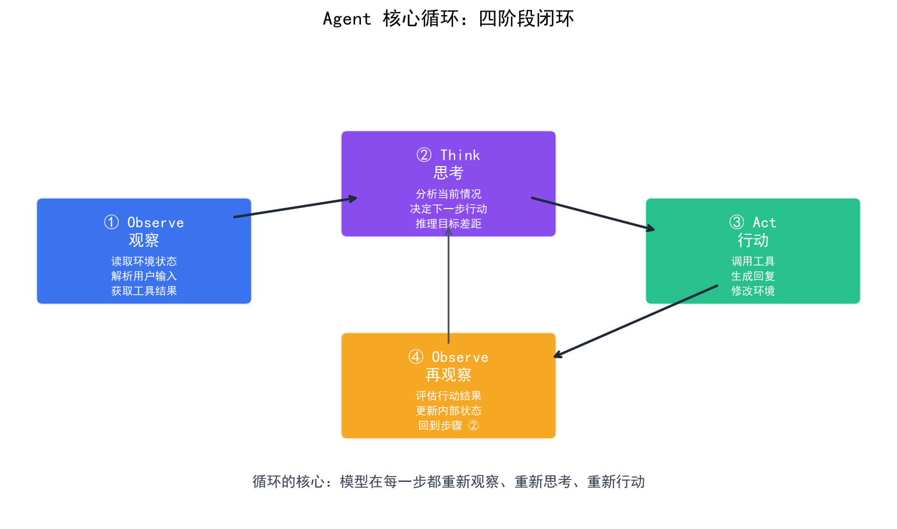
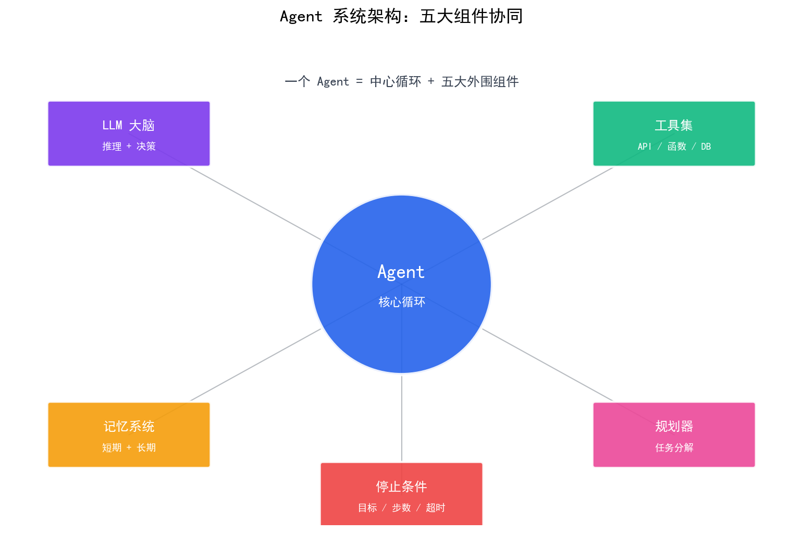

# Agent 核心循环

> Agent 的核心是"观察→决策→行动→观察"的循环——模型根据当前状态决定下一步做什么，执行后将结果反馈给自身，如此反复直到任务完成。

## 目录

- [循环的四个阶段](#循环的四个阶段)
- [Observe：感知环境状态](#observe感知环境状态)
- [Think：决策与推理](#think决策与推理)
- [Act：执行行动](#act执行行动)
- [循环的终止条件](#循环的终止条件)
- [循环的代码骨架](#循环的代码骨架)
- [总结](#总结)
- [参考链接](#参考链接)

你好，我是江小湖。在 [Agent 与 Chatbot / Workflow 的区别](./01-agent-vs-chatbot-workflow.md) 中，你理解了 Agent 的本质是"自主决策"。这篇文章拆解 Agent 核心循环的四个阶段：**Observe → Think → Act → Observe**，理解 Agent 是如何一步步完成任务的。

## 循环的四个阶段

Agent 核心循环是一个闭环，包含四个阶段：

```
Observe（观察）→ Think（决策）→ Act（行动）→ Observe（观察）→ ...
```

<p align="center">
  
  <br/>
  <em>Agent 核心循环四阶段闭环</em>
</p>

| 阶段 | 输入 | 输出 | 负责方 |
|------|------|------|--------|
| **Observe** | 环境状态 | 结构化观察 | Agent 代码 |
| **Think** | 当前观察 + 历史 | 下一步决策 | LLM |
| **Act** | 决策指令 | 执行结果 | Agent 代码 |
| **Observe** | 执行结果 | 更新后的状态 | Agent 代码 |

**关键洞察**：循环中只有 Think 阶段由 LLM 负责，其他三个阶段都是你的代码在执行。Agent 的"智能"来自 LLM 的决策能力，"行动"来自你的代码对工具的调用。

## Observe：感知环境状态

Observe 阶段负责收集当前环境的状态，将其转化为 LLM 能理解的文本描述。这不是"看"，而是将原始数据结构化为上下文。

```python
# Observe 阶段：收集环境状态
def observe(state: dict) -> str:
    """将当前状态转化为 LLM 能理解的文本"""
    observations = []
    
    # 收集用户输入
    if state.get("user_input"):
        observations.append(f"用户请求：{state['user_input']}")
    
    # 收集工具返回的结果
    if state.get("tool_results"):
        for result in state["tool_results"]:
            observations.append(f"工具 {result['tool']} 返回：{result['output']}")
    
    # 收集历史决策
    if state.get("history"):
        observations.append(f"历史决策：{state['history']}")
    
    return "\n".join(observations)
```

**Observe 的设计原则**：

1. **完整性**：包含所有相关信息，不遗漏关键上下文
2. **结构性**：用清晰的格式组织信息，便于 LLM 理解
3. **时效性**：只包含当前相关的信息，避免过时数据干扰决策

## Think：决策与推理

Think 阶段是 Agent 的"大脑"——LLM 根据当前观察和历史信息，决定下一步做什么。这是循环中唯一由 LLM 负责的阶段。

```python
# Think 阶段：LLM 决策
def think(observations: str, tools: list) -> dict:
    """LLM 根据观察决定下一步行动"""
    
    prompt = f"""你是一个 Agent，正在执行一个任务。

当前观察：
{observations}

可用工具：
{format_tools(tools)}

请决定下一步行动。选择以下之一：
1. 调用某个工具（提供工具名和参数）
2. 返回最终答案（如果任务已完成）

输出 JSON 格式：{{"type": "tool_call", "tool": "工具名", "args": {{}}}}
或：{{"type": "final_answer", "answer": "最终答案"}}
"""
    
    response = llm.generate(prompt)
    return parse_decision(response)
```

**Think 的关键要素**：

1. **上下文管理**：将所有观察组织成清晰的 Prompt，包含历史决策和当前状态
2. **工具描述**：提供可用工具的名称、功能和参数结构
3. **决策格式**：明确输出格式（工具调用或最终答案），便于代码解析

## Act：执行行动

Act 阶段执行 Think 阶段的决策——调用工具或返回最终答案。这是你的代码完全控制的阶段。

```python
# Act 阶段：执行决策
def act(decision: dict, tools: dict) -> str:
    """执行 LLM 的决策"""
    
    if decision["type"] == "tool_call":
        # 执行工具调用
        tool_name = decision["tool"]
        args = decision["args"]
        
        # 校验工具是否存在
        if tool_name not in tools:
            return f"错误：工具 {tool_name} 不存在"
        
        # 执行工具
        try:
            result = tools[tool_name](**args)
            return f"工具执行成功：{result}"
        except Exception as e:
            return f"工具执行失败：{str(e)}"
    
    elif decision["type"] == "final_answer":
        # 任务完成，返回最终答案
        return decision["answer"]
```

**Act 的安全边界**：

1. **工具校验**：确保调用的工具在可用列表中
2. **参数校验**：验证参数类型和范围，防止注入攻击
3. **异常处理**：捕获工具执行错误，避免 Agent 崩溃
4. **权限控制**：对敏感操作进行权限检查

## 循环的终止条件

Agent 循环必须有明确的终止条件，否则会无限执行。常见的终止条件有三种：

| 终止条件 | 说明 | 适用场景 |
|----------|------|----------|
| **目标达成** | LLM 返回 `final_answer` | 明确的任务目标 |
| **最大步数** | 循环超过预设次数 | 防止无限循环 |
| **超时** | 执行时间超过限制 | 时间敏感的任务 |

```python
# 循环终止条件
def should_continue(state: dict, max_steps: int = 10) -> bool:
    """判断是否继续循环"""
    
    # 条件 1：已达到最大步数
    if state["step_count"] >= max_steps:
        print("达到最大步数，终止循环")
        return False
    
    # 条件 2：已超时
    if time.time() - state["start_time"] > 300:  # 5 分钟超时
        print("执行超时，终止循环")
        return False
    
    # 条件 3：LLM 返回最终答案
    if state.get("last_decision", {}).get("type") == "final_answer":
        print("任务完成，终止循环")
        return False
    
    return True
```

**终止条件的设计原则**：

1. **必须有兜底**：最大步数和超时是安全网，防止无限循环
2. **目标明确**：让 LLM 能清晰判断任务是否完成
3. **日志记录**：记录终止原因，便于调试和优化

## 循环的代码骨架

将四个阶段组合成完整的 Agent 循环：

```python
# Agent 核心循环的完整骨架
def agent_loop(user_input: str, tools: dict, max_steps: int = 10):
    """Agent 核心循环"""
    
    # 初始化状态
    state = {
        "user_input": user_input,
        "tool_results": [],
        "history": [],
        "step_count": 0,
        "start_time": time.time()
    }
    
    while should_continue(state, max_steps):
        # 阶段 1：Observe
        observations = observe(state)
        
        # 阶段 2：Think
        decision = think(observations, tools)
        
        # 阶段 3：Act
        result = act(decision, tools)
        
        # 更新状态
        state["step_count"] += 1
        state["history"].append({
            "step": state["step_count"],
            "decision": decision,
            "result": result
        })
        
        # 如果是最终答案，返回结果
        if decision["type"] == "final_answer":
            return result
        
        # 将工具结果添加到观察中
        state["tool_results"].append({
            "tool": decision["tool"],
            "output": result
        })
    
    # 循环结束但未完成任务
    return "任务未能在限定步数内完成"
```

**代码骨架的关键点**：

1. **状态管理**：用字典维护所有上下文，便于传递和更新
2. **阶段分离**：每个阶段独立函数，便于测试和替换
3. **终止控制**：通过 `should_continue` 统一管理终止条件
4. **历史记录**：保存每一步的决策和结果，便于调试和审计

<p align="center">
  
  <br/>
  <em>Agent 系统架构：五大组件协同</em>
</p>

## 总结

- Agent 核心循环是 **Observe → Think → Act → Observe** 的闭环
- **Observe** 收集环境状态，**Think** 由 LLM 决策，**Act** 执行行动
- 循环必须有终止条件：目标达成、最大步数、超时
- 代码骨架的关键是状态管理、阶段分离和终止控制

> 下一篇，我们将深入 ReAct 模式——推理（Reasoning）与行动（Acting）交替的 Agent 设计范式，理解 Agent 是如何"边想边做"的。

## 参考链接

- [ReAct: Synergizing Reasoning and Acting](https://arxiv.org/abs/2210.03629)
- [LangChain — How agents work](https://python.langchain.com/docs/concepts/how_agents_work/)
- [Anthropic — Building Effective Agents](https://www.anthropic.com/engineering/building-effective-agents)
- [OpenAI — A practical guide to building agents](https://platform.openai.com/docs/guides/agents)


> 下一页请阅读：[Agent 模式全景](./03-agent-patterns-overview.md)
