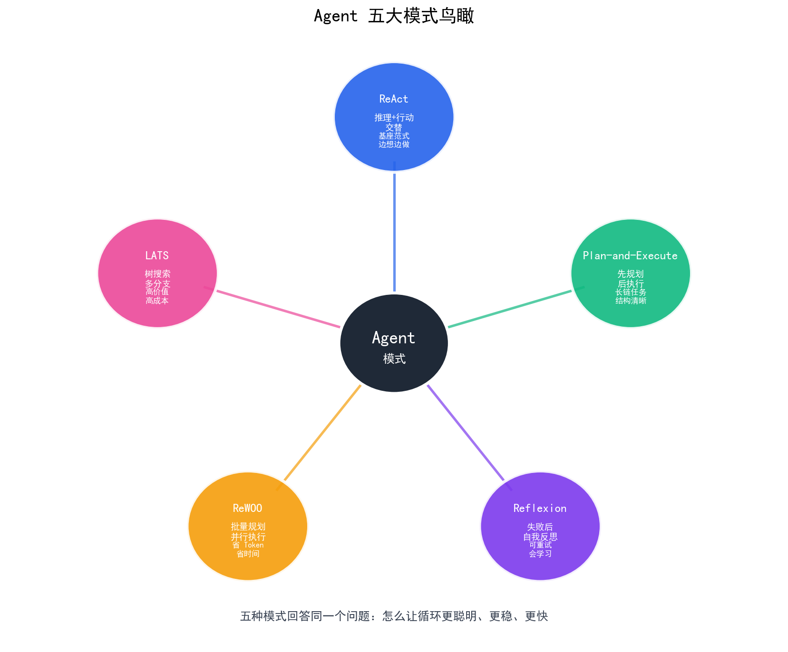
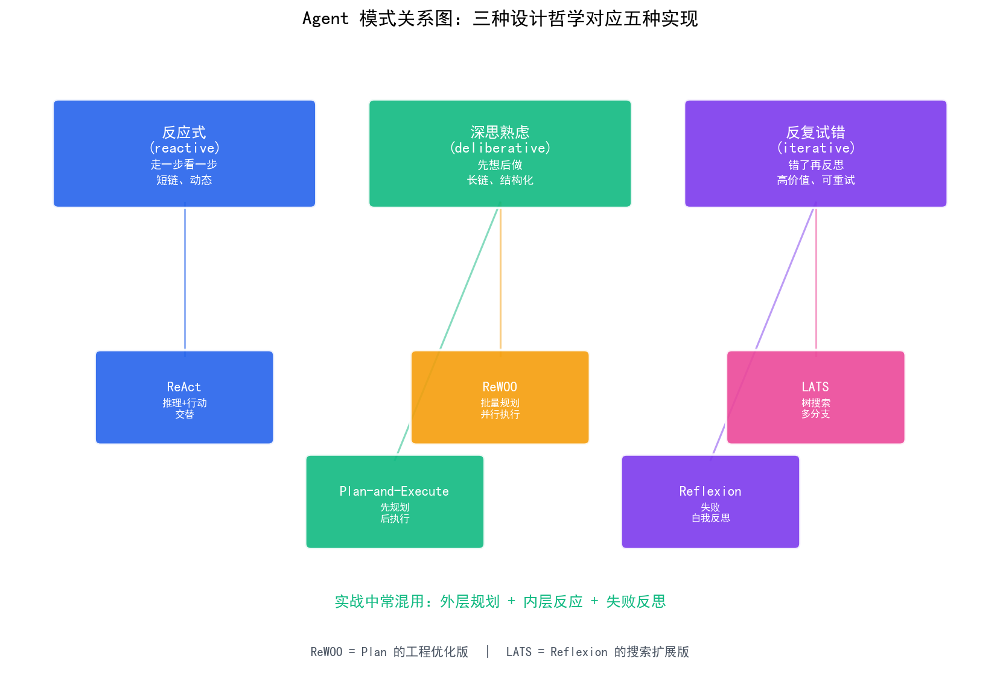
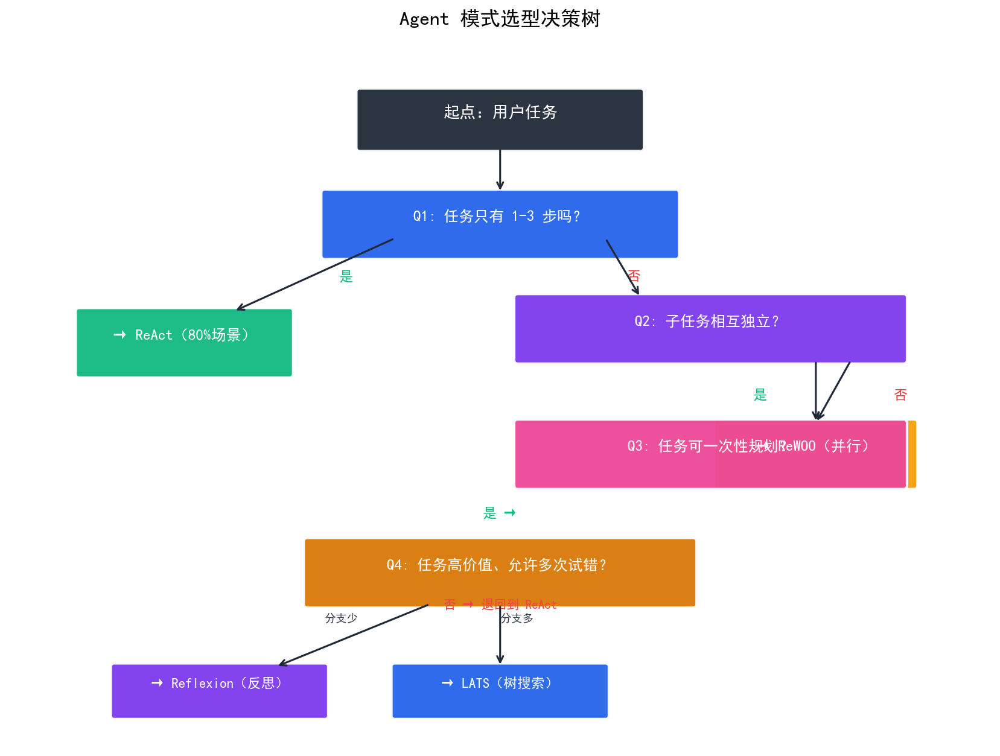

# Agent 模式全景

> Agent 不是只有 ReAct 一种范式——本章带你俯瞰五大主流模式：ReAct、Plan-and-Execute、Reflexion、ReWOO、 LATS，看清它们各自的设计哲学、适用场景与选型策略。后面的文章再逐个深入。

## 目录

- [为什么要看全景](#为什么要看全景)
- [五大模式鸟瞰](#五大模式鸟瞰)
- [模式关系图](#模式关系图)
- [设计哲学对比](#设计哲学对比)
- [核心维度对比表](#核心维度对比表)
- [选型决策树](#选型决策树)
- [模式的常见混用方式](#模式的常见混用方式)
- [总结](#总结)
- [参考链接](#参考链接)

你好，我是江小湖。在 [Agent 核心循环](./02-agent-core-loop.md) 中，你理解了 Observe → Think → Act 的基本结构。但 Think 与 Act 怎么交替、遇到不同任务该用什么策略，业界发展出了多种实现范式。**这一章先给你一张全景地图**，看清这片"江湖"上有哪些门派、各自擅长什么、什么场景该选谁。后面的文章再逐个深入拆解。

## 为什么要看全景

只看一种 Agent 范式有两个隐患：

1. **不知道为什么这样设计**——每种模式背后是对某类问题的妥协，不知道它的设计假设，就无法判断它适不适合你的场景
2. **不知道还有别的选择**——遇到当前模式不擅长的场景，会死磕到底而不是换范式

**这一篇帮你建立"选型地图"**：知道 Agent 设计模式这片"江湖"上有哪些门派、它们各自擅长什么、什么场景该用谁。后面 3 篇再分别深入。

## 五大模式鸟瞰

<p align="center">
  
  <br/>
  <em>Agent 五大模式鸟瞰：ReAct / Plan-and-Execute / Reflexion / ReWOO / LATS</em>
</p>

五种模式可以按**设计哲学**分成三类：

| 哲学 | 核心问题 | 代表模式 | 适用场景 |
|------|---------|---------|---------|
| **反应式**（reactive） | 眼前这一步该做什么？ | **ReAct** | 短链、动态变化 |
| **深思熟虑**（deliberative） | 整个任务该怎么拆？ | **Plan-and-Execute**、**ReWOO** | 长链、结构清晰 |
| **反复试错**（iterative） | 上次错在哪？怎么改进？ | **Reflexion**、**LATS** | 高价值、可重试 |

**一句话介绍**：

| 模式 | 一句话 | 出处 |
|------|--------|------|
| **ReAct** | 推理和行动**交替**进行 | [ReAct 论文](https://arxiv.org/abs/2210.03629)（2022） |
| **Plan-and-Execute** | 先规划完整计划，**再按步执行** | LangChain / BabyAGI（2023） |
| **ReWOO** | 把工具调用**批量化、并行执行** | [ReWOO 论文](https://arxiv.org/abs/2305.18323)（2023） |
| **Reflexion** | 失败后用自然语言**自我反思** | [Reflexion 论文](https://arxiv.org/abs/2303.11381)（2023） |
| **LATS** | 用**树搜索**展开多分支决策 | [LATS 论文](https://arxiv.org/abs/2310.04406)（2023） |

**时间观察**：2022–2023 是 Agent 模式爆发期，核心范式基本都来自这个时期。它们本质上是在回答同一个问题——**怎么让 LLM 在循环中更聪明、更稳、更快**——但选择了不同的权衡方向。

## 模式关系图

<p align="center">
  
  <br/>
  <em>模式间关系：三种设计哲学对应五种具体实现</em>
</p>

**关键关系**：

- 五种模式并非互斥，而是**对同一问题的不同回答**：任务该"边想边做"、"先想后做"、还是"错了再想"？
- **ReAct** 与 **Plan-and-Execute** 是最基本的两种对立思路：前者走一步看一步，后者一次性规划
- **ReWOO** 可看作 Plan-and-Execute 的"工程优化版"——把串行执行改成并行
- **Reflexion** 与 **LATS** 则是在 ReAct 或 Plan-and-Execute 的基础上叠加"失败后反思/搜索"机制
- 实战中**混用**才是常态：外层规划 + 内层反应 + 失败重试

## 设计哲学对比

三种设计哲学背后是截然不同的任务假设：

**反应式** = 边走边看，灵活但容易走偏。适合环境变化快、任务步骤少的场景。

**深思熟虑** = 出发前想好，稳但缺乏应变。适合任务结构清晰、步骤可预知的场景。

**反复试错** = 错了就反思，强但慢且贵。适合允许重试、失败代价高的场景（如编程、复杂推理）。

## 核心维度对比表

以下从 10 个维度横向对比五种模式。注意：**没有绝对的好坏，只有场景适配**。

| 维度 | ReAct | Plan-and-Execute | ReWOO | Reflexion | LATS |
|------|-------|------------------|-------|-----------|------|
| **决策时机** | 每步 | 一次性 | 一次性 | 每步 + 反思 | 树搜索 |
| **LLM 调用次数** | 步数+1 | 1+步数 | 2 | 步数×N（含反思）| 步数×N×分支 |
| **Token 消耗** | 中 | 中-低 | **低** | 高 | 极高 |
| **延迟** | 中 | 中 | **低** | **高** | 极高 |
| **可解释性** | 中 | **高**（计划可见）| 中 | 高（含反思）| 中 |
| **可重试** | 弱 | 中 | 弱 | **强** | **强** |
| **并行能力** | 弱 | 弱 | **强** | 弱 | 弱 |
| **适合任务长度** | 1-5 步 | 5-10 步 | 3-10 步（独立子任务）| 3-8 步 | 5-15 步 |
| **实现复杂度** | 低 | 中 | 中 | 中 | **高** |
| **典型应用** | 通用问答 | 研究报告 | 数据聚合 | 编程/推理 | 复杂决策 |

**方向分化观察**：

- **更稳**：Plan-and-Execute（先想清楚再执行，出错易定位）
- **更快**：ReWOO（批量化并行，省 Token 省时间）
- **更深**：Reflexion（反复试错，用自然语言自我纠错）
- **更强**：LATS（树搜索暴力求解，算力换正确率）
- **更简单**：ReAct（实现直接，80% 场景够用）

## 选型决策树

<p align="center">
  
  <br/>
  <em>Agent 模式选型决策树：按任务特点一步步选</em>
</p>

**决策路径**（文字版，方便屏幕阅读）：

```
1. 任务是否只有 1-3 步？
   ├─ 是 → ReAct（最简单，80% 场景）
   └─ 否 → 进入第 2 步

2. 子任务之间是否独立（可并行）？
   ├─ 是 → ReWOO（省 Token、省时间）
   └─ 否 → 进入第 3 步

3. 任务结构清晰、可一次性规划吗？
   ├─ 是 → Plan-and-Execute（计划可见、出错易定位）
   └─ 否 → 进入第 4 步

4. 任务高价值、可接受重试和成本？
   ├─ 是 → 决策分支多吗？
   │       ├─ 多 → LATS（树搜索暴力求解）
   │       └─ 少 → Reflexion（失败反思）
   └─ 否 → 退回到 ReAct（接受不完美）
```

## 模式的常见混用方式

实战中**纯用一种模式的情况很少**。最常见的混用套路：

**1. 外层规划 + 内层反应**

```python
# 外层 Plan-and-Execute
plan = planner(user_input)        # 一次规划

for step in plan:
    # 内层 ReAct 处理每步
    result = react_loop(step)     # 每步内部反应式执行
```

适合：研究报告、数据处理流水线

**2. ReAct + Reflexion**

```python
for trial in range(3):
    result = react_loop(task)
    if is_good(result):
        return result
    # 失败 → 反思
    memory.append(reflect(result))
return best_of_three
```

适合：编程、推理、调试

**3. Plan-and-Execute + 失败重规划**

```python
plan = planner(user_input)
for i in range(2):
    result = run_plan(plan)
    if is_good(result):
        return result
    plan = replan(user_input, plan, result)  # 失败后重规划
```

适合：多步研究、自动化运营

**4. 路由 + 多种模式**

```python
# 先判断任务类型，路由到不同范式
if is_short_task(task):
    return react_loop(task)
elif is_parallel_task(task):
    return rewoo_loop(task)
elif is_complex_task(task):
    return lats_loop(task)
```

适合：通用 Agent 平台

## 总结

- **五种模式解决同一个问题**：怎么让 LLM 在循环中更聪明、更稳、更快——但选择了不同的设计哲学
- **反应式**（ReAct）适合短链、动态变化的场景，实现简单，80% 场景够用
- **深思熟虑式**（Plan-and-Execute、ReWOO）适合长链、结构清晰的任务，ReWOO 额外提供并行加速
- **反复试错式**（Reflexion、LATS）适合高价值、可重试的任务，用时间/算力换正确率
- 实战中**混用多种模式**是常态——外层规划、内层反应、失败反思

> 下一篇 [ReAct 模式](./04-react-pattern.md) 深入第一种范式：ReAct = **Re**(asoning) + **Act**(ing) 的"边想边做"循环。我们会从命名由来、核心思想、Thought/Action/Observation 三阶段拆解到完整代码实现，彻底讲透这个最经典的 Agent 设计模式。

## 参考链接

- [ReAct: Synergizing Reasoning and Acting](https://arxiv.org/abs/2210.03629)
- [Plan-and-Execute (LangChain Blog)](https://blog.langchain.com/planning-agents/)
- [Reflexion: Language Agents with Verbal Reinforcement Learning](https://arxiv.org/abs/2303.11381)
- [ReWOO: Decoupling Reasoning from Observations](https://arxiv.org/abs/2305.18323)
- [LATS: Language Agent Tree Search](https://arxiv.org/abs/2310.04406)
- [Anthropic — Building Effective Agents](https://www.anthropic.com/engineering/building-effective-agents)


> 下一页请阅读：[ReAct 模式](./04-react-pattern.md)
