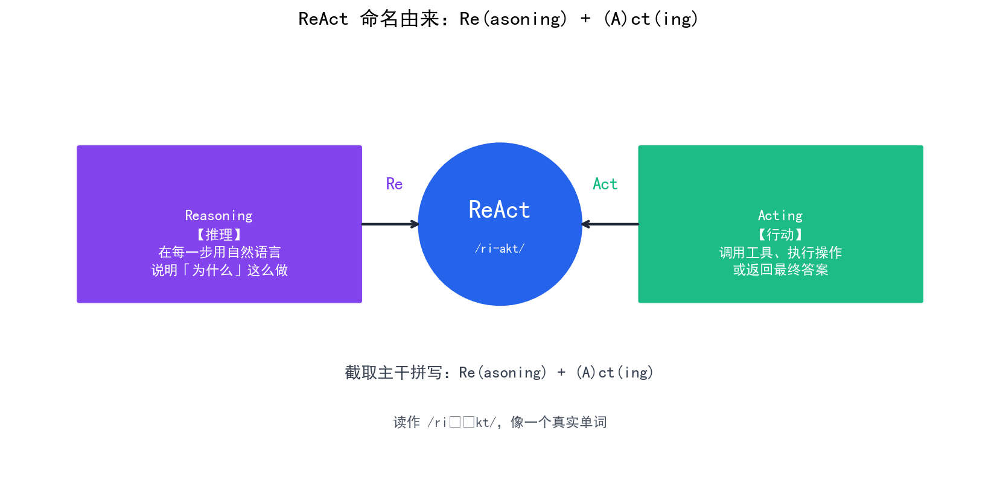
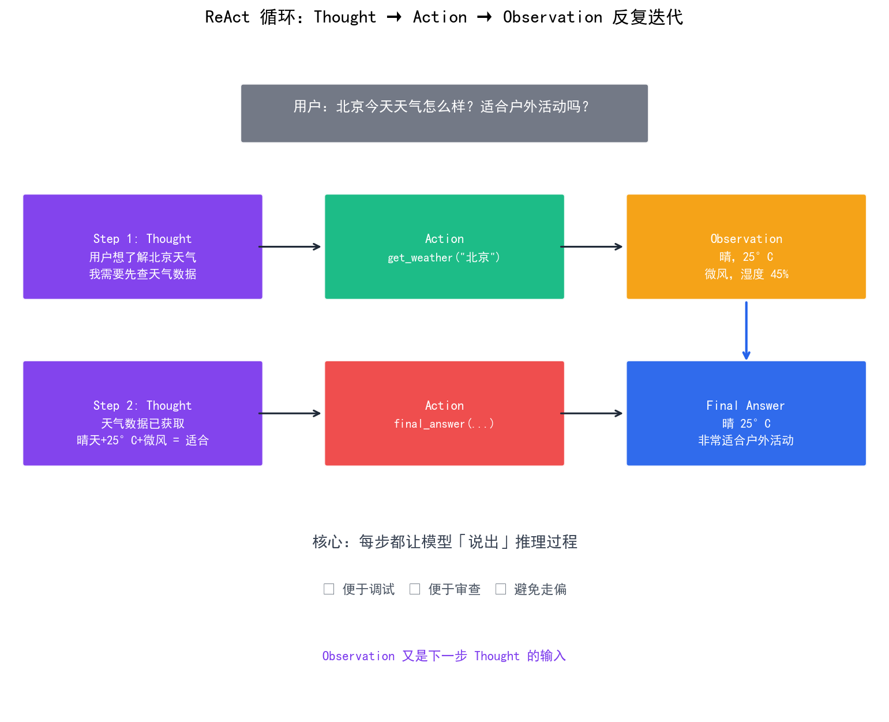
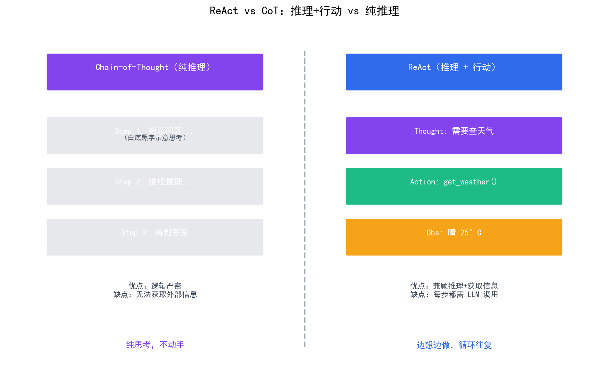

# ReAct 模式

> **ReAct** = **Re**(asoning) + **Act**(ing)，是 Agent 最经典的设计模式——模型交替进行推理（Thought）和行动（Action），用思维链驱动每一步决策，让 Agent"边想边做"。

## 目录

- [ReAct 命名由来](#react-命名由来)
- [ReAct 的核心思想](#react-的核心思想)
- [Thought：思维链驱动决策](#thought思维链驱动决策)
- [Action：执行具体操作](#action执行具体操作)
- [Observation：获取执行结果](#observation获取执行结果)
- [ReAct 的完整流程](#react-的完整流程)
- [ReAct 与纯推理/纯行动的对比](#react-与纯推理纯行动的对比)
- [总结](#总结)
- [参考链接](#参考链接)

你好，我是江小湖。在 [Agent 核心循环](./02-agent-core-loop.md) 中，你理解了 Observe → Think → Act 的基本循环。ReAct 模式是这个循环的具体实现——**Thought（推理）和 Action（行动）交替进行**，让 Agent 每一步都有明确的推理过程。这是目前最主流的 Agent 设计范式。

## ReAct 命名由来

**ReAct** 是一个合成词，由两部分组成：

- **Re** —— 取自 **Reasoning**（推理）
- **Act** —— 取自 **Acting**（行动）

把两个词的"主干"拼起来就是 **ReAct**：

<p align="center">
  
  <br/>
  <em>ReAct 命名由来：Re(asoning) + (A)ct(ing)</em>
</p>

## ReAct 的核心思想

ReAct 来自 2022 年的论文 [ReAct: Synergizing Reasoning and Acting in Language Models](https://arxiv.org/abs/2210.03629)，核心思想是**将推理和行动交织在一起**：

```
Thought: 我需要先查天气
Action: get_weather("北京")
Observation: 北京今天晴，25°C
Thought: 天气不错，可以安排户外活动
Action: final_answer("北京今天晴，25°C，适合户外活动")
```

**为什么推理和行动要交替？**

| 模式 | 优点 | 缺点 |
|------|------|------|
| **纯推理**（只思考不行动） | 逻辑严密 | 无法获取实时信息 |
| **纯行动**（只行动不思考） | 执行快速 | 容易走偏，缺乏规划 |
| **ReAct**（推理+行动交替） | 兼顾规划和执行 | 每步都需要 LLM 调用 |

**关键洞察**：ReAct 的本质是**让模型在每一步都"说出"自己的推理过程**。这不仅帮助模型自己理清思路，也让开发者能审查和调试 Agent 的决策逻辑。

## Thought：思维链驱动决策

Thought 是 ReAct 的"大脑"——模型在每次行动前，先用自然语言描述自己的推理过程。这不是给用户看的，而是给模型自己看的。

```python
# Thought 阶段：模型推理
def thought(observations: str, history: list) -> str:
    """模型推理下一步该做什么"""
    
    prompt = f"""你是一个 ReAct Agent。请按以下格式思考：

当前观察：{observations}

历史记录：
{format_history(history)}

请思考下一步该做什么。格式：
Thought: [你的推理过程]
Action: [具体行动]
"""
    
    response = llm.generate(prompt)
    return extract_thought(response)
```

**Thought 的设计原则**：

1. **明确推理**：模型必须用自然语言说明"为什么"要做这个行动
2. **引用观察**：推理必须基于当前观察，不能凭空想象
3. **规划步骤**：如果任务复杂，模型应该分解为多个子步骤

**示例**：

```
Thought: 用户想了解北京天气并推荐活动。我需要先查询天气，
然后根据天气情况推荐合适的活动。这是两个子任务。
Action: get_weather("北京")
```

## Action：执行具体操作

Action 是 ReAct 的"手"——根据 Thought 的推理，执行具体的操作。Action 可以是工具调用，也可以是返回最终答案。

```python
# Action 阶段：执行操作
def action(thought: str, tools: dict) -> str:
    """根据推理执行具体操作"""
    
    prompt = f"""基于以下推理，决定具体行动：

{thought}

可用工具：
{format_tools(tools)}

输出 JSON 格式：
{{"type": "tool_call", "tool": "工具名", "args": {{}}}}
或：{{"type": "final_answer", "answer": "最终答案"}}
"""
    
    response = llm.generate(prompt)
    decision = parse_decision(response)
    
    # 执行工具调用
    if decision["type"] == "tool_call":
        tool_name = decision["tool"]
        args = decision["args"]
        result = tools[tool_name](**args)
        return f"Observation: {result}"
    
    # 返回最终答案
    elif decision["type"] == "final_answer":
        return f"Final Answer: {decision['answer']}"
```

**Action 的类型**：

| 类型 | 说明 | 示例 |
|------|------|------|
| **工具调用** | 调用外部工具获取信息或执行操作 | `get_weather("北京")` |
| **最终答案** | 任务完成，返回结果 | `final_answer("北京今天晴")` |
| **中间步骤** | 任务未完成，继续循环 | `continue` |

## Observation：获取执行结果

Observation 是 ReAct 的"眼睛"——获取 Action 的执行结果，作为下一轮 Thought 的输入。

```python
# Observation 阶段：获取结果
def observation(action_result: str) -> str:
    """获取 Action 的执行结果"""
    
    # 解析 Observation
    if action_result.startswith("Observation:"):
        return action_result[len("Observation:"):].strip()
    elif action_result.startswith("Final Answer:"):
        return action_result[len("Final Answer:"):].strip()
    else:
        return action_result
```

**Observation 的设计原则**：

1. **简洁性**：只包含必要信息，不添加额外解释
2. **结构化**：用清晰的格式组织结果，便于下一轮推理
3. **错误处理**：如果工具执行失败，返回错误信息而非崩溃

## ReAct 的完整流程

将 Thought、Action、Observation 组合成完整的 ReAct 循环：

```python
# ReAct Agent 的完整实现
def react_agent(user_input: str, tools: dict, max_steps: int = 10):
    """ReAct Agent 核心循环"""
    
    history = []
    current_observation = f"用户请求：{user_input}"
    
    for step in range(max_steps):
        # Thought：推理
        thought_text = thought(current_observation, history)
        
        # Action：决策
        action_result = action(thought_text, tools)
        
        # 检查是否完成
        if action_result.startswith("Final Answer:"):
            return action_result[len("Final Answer:"):].strip()
        
        # Observation：获取结果
        current_observation = observation(action_result)
        
        # 记录历史
        history.append({
            "step": step + 1,
            "thought": thought_text,
            "action": action_result,
            "observation": current_observation
        })
    
    return "任务未能在限定步数内完成"
```

**完整流程示例**：

```
用户：北京今天天气怎么样？适合户外活动吗？

Step 1:
Thought: 用户想了解北京天气。我需要先查询天气数据。
Action: get_weather("北京")
Observation: 北京今天晴，25°C，湿度 45%，微风

Step 2:
Thought: 天气数据已获取。晴天、25°C、微风，非常适合户外活动。
Action: final_answer("北京今天晴，25°C，微风，非常适合户外活动")
```

<p align="center">
  
  <br/>
  <em>ReAct 循环：Thought → Action → Observation 反复迭代</em>
</p>

## ReAct 与纯推理/纯行动的对比

| 维度 | 纯推理（Chain-of-Thought） | 纯行动（Tool-only） | ReAct |
|------|---------------------------|---------------------|-------|
| **推理能力** | 强 | 弱 | 强 |
| **行动能力** | 无 | 强 | 强 |
| **可解释性** | 高 | 低 | 高 |
| **适用场景** | 问答、分析 | 数据查询、API 调用 | 复杂任务、多步推理 |

<p align="center">
  
  <br/>
  <em>ReAct vs CoT：推理+行动 vs 纯推理</em>
</p>

**ReAct 的优势**：

1. **可解释性**：每步都有推理过程，便于调试和审查
2. **灵活性**：能根据中间结果动态调整后续行动
3. **鲁棒性**：推理过程帮助模型避免走偏

**ReAct 的局限**：

1. **Token 消耗**：每步都需要 LLM 调用，成本较高
2. **延迟**：推理过程增加响应时间
3. **复杂度**：需要设计合适的 Prompt 和工具接口

## 总结

- **ReAct** 是推理（Thought）和行动（Action）交替的 Agent 设计模式
- **Thought** 是思维链驱动决策，模型用自然语言说明推理过程
- **Action** 是执行具体操作，可以是工具调用或返回最终答案
- **Observation** 是获取执行结果，作为下一轮推理的输入
- ReAct 兼顾推理和行动，适用于复杂任务和多步推理

> 下一篇，我们将深入停止条件设计——如何让 Agent 在正确的时机停止，避免无限循环或过早终止。

## 参考链接

- [ReAct: Synergizing Reasoning and Acting](https://arxiv.org/abs/2210.03629)
- [LangChain — ReAct agent](https://python.langchain.com/docs/concepts/how_agents_work/)
- [Anthropic — Building Effective Agents](https://www.anthropic.com/engineering/building-effective-agents)
- [OpenAI — A practical guide to building agents](https://platform.openai.com/docs/guides/agents)
