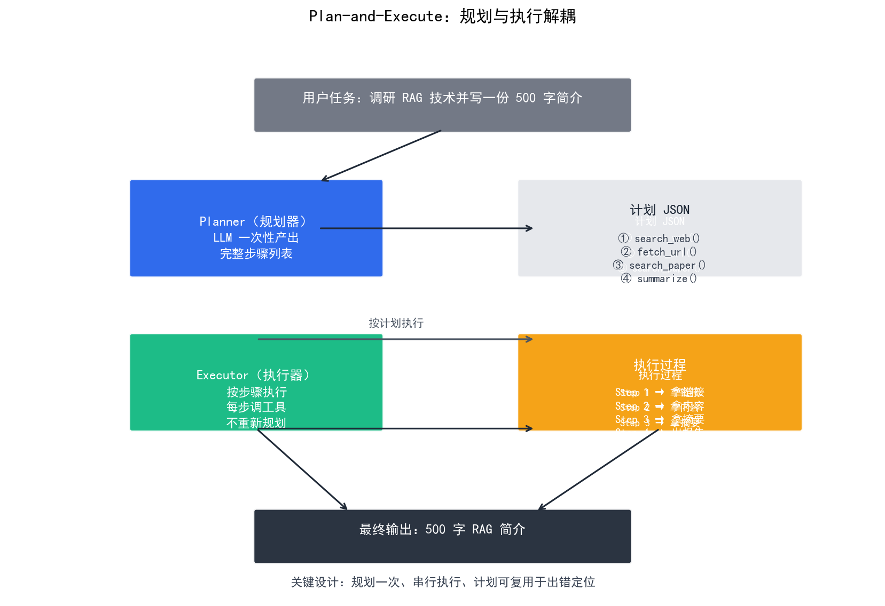
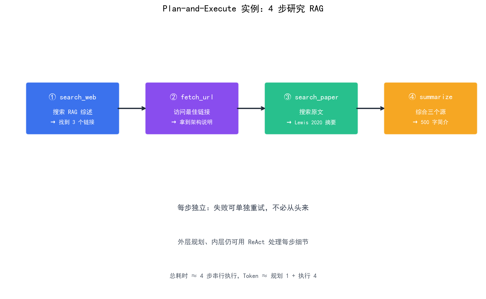

# Plan-and-Execute 模式

> ReAct 是"边想边做"，而 Plan-and-Execute 是"先想清楚再动手"——把规划和执行解耦：Planner 一次性产出完整计划，Executor 按步骤执行。适合需要长视野、跨多工具的复杂任务。

## 目录

- [为什么需要 Plan-and-Execute](#为什么需要-plan-and-execute)
- [核心思想：规划与执行解耦](#核心思想规划与执行解耦)
- [完整流程](#完整流程)
- [最小实现](#最小实现)
- [Plan-and-Execute vs ReAct](#plan-and-execute-vs-react)
- [进阶：动态重规划](#进阶动态重规划)
- [适用与不适用场景](#适用与不适用场景)
- [总结](#总结)
- [参考链接](#参考链接)

你好，我是江小湖。在 [ReAct 模式](./03-react-pattern.md) 中，你学会了"边想边做"的 Agent 范式。但 ReAct 有个问题：**每一步都让模型重新思考**，面对"先查 A、再查 B、根据结果查 C、再整合"这类需要长视野的任务，模型容易走偏。本节介绍另一种主流范式：**Plan-and-Execute**。

## 为什么需要 Plan-and-Execute

ReAct 在每一步都重新决策，看似灵活，实则有两个隐患：

1. **短视**：模型只看到当前 observation，很难规划 5 步之后的事
2. **走偏后难回头**：上一步选错了工具，后续推理会基于错误前提累积

**真实场景痛点**：让 Agent "研究某技术并产出报告"——如果用 ReAct，模型可能：

```
Step 1: 搜索 → 找到一个过时链接
Step 2: 访问 → 内容无关
Step 3: 又搜索 → 找到另一个过时链接
... 一直打转
```

如果用 Plan-and-Execute，模型会先规划：

```
1. 搜索该技术的官方文档
2. 访问 GitHub 仓库 README
3. 调研近一年的引用论文
4. 综合三个来源写报告
```

按计划执行，**每一步都有明确目标**，不会打转。

## 核心思想：规划与执行解耦

Plan-and-Execute 把 Agent 拆成两个角色：

| 角色 | 职责 | 调用频率 |
|------|------|----------|
| **Planner（规划器）** | 一次性产出完整步骤列表 | 通常 1 次（可重规划） |
| **Executor（执行器）** | 按步骤执行具体工具调用 | 每步 1 次 |

**关键设计原则**：

- Planner 只负责"想清楚做什么"，不关心具体怎么调工具
- Executor 只负责"按步骤干活"，不重新规划
- 两者通过**结构化的计划**（JSON / 步骤列表）通信

<p align="center">
  
  <br/>
  <em>Plan-and-Execute：规划与执行解耦</em>
</p>

```
用户任务
   │
   ▼
┌──────────┐
│ Planner  │  ← LLM A：擅长长视野规划
└──────────┘
   │  计划（步骤列表）
   ▼
┌──────────┐
│ Executor  │  ← LLM B：擅长具体执行
└──────────┘
   │  步骤 1 结果 → 步骤 2 → ... → 最终输出
```

## 完整流程

```
用户：调研 RAG 技术并写一份 500 字简介

[Planner 输出]
{
  "goal": "产出 RAG 技术 500 字简介",
  "steps": [
    {"id": 1, "action": "search_web", "args": {"query": "RAG 检索增强生成 综述"}, "expected": "找到 2-3 篇权威综述"},
    {"id": 2, "action": "fetch_url",   "args": {"url": "<从 step1 选>"},         "expected": "获取核心定义和架构图"},
    {"id": 3, "action": "search_paper","args": {"query": "RAG original paper"},  "expected": "Lewis 2020 原文"},
    {"id": 4, "action": "summarize",   "args": {"sources": ["step1","step2","step3"], "length": 500}, "expected": "500 字中文简介"}
  ]
}

[Executor 按步骤执行]
Step 1: search_web → 拿到 3 个链接
Step 2: fetch_url  → 拿到架构说明
Step 3: search_paper → 拿到原文摘要
Step 4: summarize  → 输出 500 字简介 ✅
```

**注意**：Step 1 → Step 4 是**顺序执行**的，但 Executor 在每步内部**仍然可以用 ReAct** 完成子任务（比如"搜索时该用什么关键词"是子级 ReAct）。这是 Plan-and-Execute 与 ReAct 的常见嵌套方式：**外层规划，内层反应**。

<p align="center">
  
  <br/>
  <em>Plan-and-Execute 实例：4 步研究 RAG</em>
</p>

## 最小实现

```python
"""
最小 Plan-and-Execute Agent（伪代码）
"""
import json
from openai import OpenAI

client = OpenAI()

# ---------- Planner ----------
PLANNER_PROMPT = """你是一个 Planner。根据用户任务，输出 JSON 形式的执行计划。
要求：
- 步骤尽量原子化（每步只做一件事）
- 每步标注 expected（期望的中间结果），便于后续验证
- 步骤数控制在 3-7 步

输出 JSON 格式：
{
  "goal": "用户原始目标",
  "steps": [
    {"id": 1, "action": "工具名", "args": {...}, "expected": "..."}
  ]
}"""

def make_plan(user_input: str) -> dict:
    resp = client.chat.completions.create(
        model="gpt-4o",
        messages=[
            {"role": "system", "content": PLANNER_PROMPT},
            {"role": "user",   "content": user_input},
        ],
        response_format={"type": "json_object"},
    )
    return json.loads(resp.choices[0].message.content)

# ---------- Executor ----------
def execute_step(step: dict, context: dict) -> str:
    """执行单步：可以用 LLM 解析参数 + 调工具"""
    tool = TOOLS[step["action"]]
    return tool(**step["args"])

def run_plan(plan: dict) -> str:
    context = {"results": []}
    for step in plan["steps"]:
        result = execute_step(step, context)
        context["results"].append({"step": step["id"], "result": result})
    return context

# ---------- 主循环 ----------
def plan_and_execute(user_input: str) -> str:
    plan = make_plan(user_input)
    print(f"计划：{json.dumps(plan, ensure_ascii=False, indent=2)}")
    return run_plan(plan)
```

## Plan-and-Execute vs ReAct

| 维度 | ReAct | Plan-and-Execute |
|------|-------|------------------|
| **决策时机** | 每步重新决策 | 一次性规划 |
| **LLM 调用次数** | 步数 × 1 | 1（规划） + 步数 × 1（执行） |
| **Token 消耗** | 高（每步都带历史） | 中（计划可复用） |
| **可解释性** | 中（看完整 trace） | 高（计划 + 执行分离） |
| **应对意外** | 强（实时反应） | 弱（需重规划） |
| **适合任务** | 短链、动态变化 | 长链、结构清晰 |
| **出错定位** | 难 | 易（直接看哪步失败） |

**核心权衡**：

- ReAct = **反应式**（reactive），灵活但容易走偏
- Plan-and-Execute = **深思熟虑**（deliberative），稳定但不灵活

实际项目里，**两者经常混用**：

```
外层：Plan-and-Execute（规划好 5 步大方向）
内层：每步内部用 ReAct（处理每步的细节决策）
```

## 进阶：动态重规划

纯 Plan-and-Execute 假设计划能从头执行到尾，但现实中常出错。进阶做法是**带重规划的版本**：

```python
def plan_and_execute_with_replan(user_input, max_replans=2):
    plan = make_plan(user_input)
    for i in range(max_replans + 1):
        result = run_plan(plan)
        if is_success(result):
            return result

        # 失败 → 让 Planner 根据当前情况重规划
        plan = replan(user_input, plan, result)
    return result
```

**Replanner 的输入**：

- 原始用户目标
- 当前计划
- 已执行的步骤和结果
- 失败原因 / 观察

**典型框架**：LangChain 的 `PlanAndExecute` agent、LangGraph 的 planner-executor 模式都内置了重规划。

## 适用与不适用场景

**适合 Plan-and-Execute**：

- 研究报告、数据分析等**多步骤长任务**
- 需要**提前展示计划**给用户确认（如审批流）
- 任务**结构稳定**（步骤类型可枚举）

**不适合 Plan-and-Execute**：

- 对话式问答（用户会中途改变需求）
- 高度依赖中间结果的探索任务
- 步骤完全不可预测的任务（不如直接用 ReAct）

## 总结

- **Plan-and-Execute** = Planner 一次性规划 + Executor 按步骤执行，规划与执行解耦
- 优势：**可解释性高、Token 复用、出错易定位**，适合长链任务
- 劣势：**不灵活**，需配合重规划机制应对意外
- 实战中常**外层规划、内层 ReAct** 混用

> 下一篇 [Reflexion 与其他模式](./07-reflexion-and-other-patterns.md) 介绍自我反思、ReWOO、 LATS 等更进一步的范式。

## 参考链接

- [Plan-and-Execute Agents (LangChain)](https://blog.langchain.com/planning-agents/)
- [LangGraph — Plan-and-Execute](https://langchain-ai.github.io/langgraph/tutorials/plan-and-execute/plan-and-execute/)
- [Chain-of-Thought Prompting](https://arxiv.org/abs/2201.11903)
- [ReAct 论文](https://arxiv.org/abs/2210.03629)
