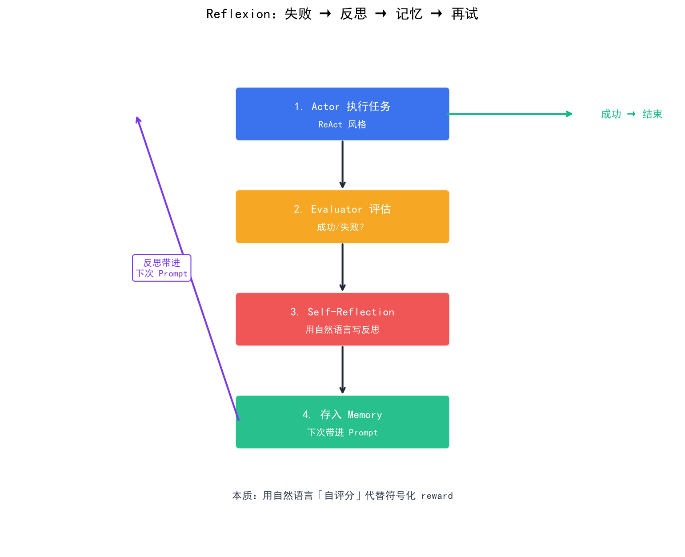
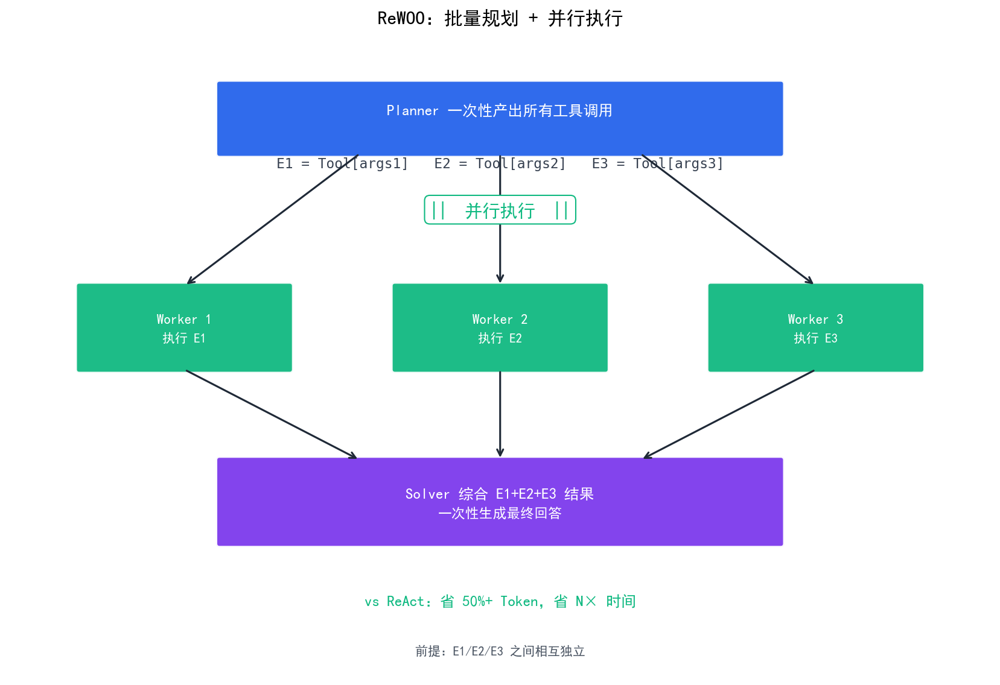
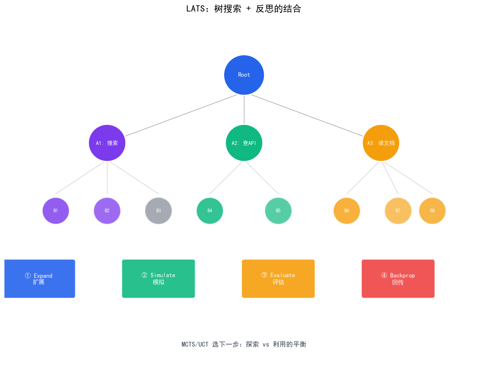

# Reflexion 与其他 Agent 模式

> ReAct 和 Plan-and-Execute 是"主干范式"，但实战中还有**让 Agent 自我反思**（Reflexion）、**减少 LLM 调用次数**（ReWOO）、**树搜索式规划**（LATS）等进阶模式。本节把主流变体串成一张全景图，帮你根据任务特点选对范式。

## 目录

- [为什么需要其他模式](#为什么需要其他模式)
- [Reflexion：让 Agent 自我反思](#reflexion让-agent-自我反思)
- [ReWOO：去工具化推理，省 Token](#rewoo去工具化推理省-token)
- [LATS：树搜索 + 反思的结合](#lats树搜索--反思的结合)
- [其他值得了解的变体](#其他值得了解的变体)
- [全景对比与选型指南](#全景对比与选型指南)
- [总结](#总结)
- [参考链接](#参考链接)

你好，我是江小湖。在 [ReAct](./03-react-pattern.md) 和 [Plan-and-Execute](./06-plan-and-execute.md) 中，你掌握了两种主流范式。但它们并非银弹——ReAct 容易在错误路径上"一条路走到黑"，Plan-and-Execute 一次规划不能应对意外。本节介绍三种重要的进阶模式：**Reflexion**、**ReWOO**、**LATS**。

## 为什么需要其他模式

先看 ReAct 在实际任务中的两个常见失败：

**失败 1：同一个错误反复犯**

```
Step 1: 调 search("RAG paper")  → 拿到一堆噪声结果
Step 2: 选了错误链接，提取出错误结论
Step 3: 基于错误结论继续推理 → 越来越错
Step 4: 死循环
```

**失败 2：没必要的工具调用**

```
任务：计算 (3 + 5) * 7
Step 1: 调 calculator("3+5")     ← 不必要的工具调用
Step 2: 调 calculator("8*7")     ← 还得再来一次
```

进阶模式就是为了解决这两类问题。

## Reflexion：让 Agent 自我反思

**Reflexion**（论文：[Reflexion: Language Agents with Verbal Reinforcement Learning](https://arxiv.org/abs/2303.11381)）的核心思想是：**让 Agent 像人一样复盘**——任务失败后，用自然语言写下"我为什么错了"，下次避免。

**工作流程**：

```
┌─────────────────────────────────────┐
│  1. Actor 执行任务（ReAct 风格）    │
│              ↓                       │
│  2. Evaluator 评估结果是否正确       │
│              ↓                       │
│  3. Self-Reflection 生成反思文本     │
│     "我没考虑 X，导致 Y..."          │
│              ↓                       │
│  4. 把反思存到 Memory                │
│              ↓                       │
│  5. 下次任务时把反思带进 Prompt      │
└─────────────────────────────────────┘
```

**最小实现（伪代码）**：

```python
def reflexion_agent(task, max_trials=3):
    memory = []  # 存历史反思
    for trial in range(max_trials):
        # 1. 带反思的 ReAct
        trajectory = react_loop(task, extra_context=memory)

        # 2. 评估
        success, feedback = evaluator(trajectory)

        if success:
            return trajectory

        # 3. 让 LLM 写反思
        reflection = llm(f"""
            任务：{task}
            本次轨迹：{trajectory}
            失败原因：{feedback}
            请用一段话总结：我犯了什么错？下次该怎么做？
        """)

        # 4. 存入 memory
        memory.append(reflection)
```

**关键设计点**：

- **反思形式**：自然语言段落，不是符号化 reward（区别于 RLHF）
- **Memory 设计**：通常只保留**最近 N 条**反思，避免 Prompt 过长
- **Evaluator**：可以是 LLM-as-Judge，也可以是规则（如代码测试用例）

**优势 vs 代价**：

- ✅ 显著降低重试率，特别是多步推理任务
- ✅ 反思可读，便于调试
- ❌ 多了一次 LLM 调用（生成反思）
- ❌ 反思质量依赖 LLM 能力

<p align="center">
  
  <br/>
  <em>Reflexion：失败 → 反思 → 记忆 → 再试</em>
</p>

## ReWOO：去工具化推理，省 Token

**ReWOO**（Reasoning WithOut Observation，论文：[ReWOO: Decoupling Reasoning from Observations for Augmented Language Models](https://arxiv.org/abs/2305.18323)）观察到 ReAct 的一个**浪费**：

> 每步都等 Observation 才推理，**串行**且**每步都要带历史**，Token 消耗高。

ReWOO 的解法：**先用 LLM 把"需要调什么工具、参数是什么"全规划出来，再批量执行**。

```
[Planner]                  [Solver]
   ↓                          ↓
# Plan:                     # 证据 1, 2, 3
E1 = Tool[args1]            结合证据回答问题
E2 = Tool[args2]
E3 = Tool[args3]
   ↓
[Worker 批量并行执行 E1, E2, E3]
   ↓
回到 Solver
```

**对比 ReAct**：

| 维度 | ReAct | ReWOO |
|------|-------|-------|
| 工具调用方式 | 串行（一调一观察） | **并行**（批量调） |
| LLM 调用次数 | 步数 + 1 | 1（规划）+ 1（总结） |
| Token 消耗 | 高 | **低 50%+** |
| 应对依赖 | 强 | 弱（必须能并行） |
| 适合任务 | 串行探索 | 独立子任务 |

**实战用法**：当你有 N 个**互相独立**的查询（"查 A 城市的天气、B 城市的天气、C 城市的天气"），用 ReWOO 一次出计划、并行执行，比 ReAct 快 N 倍。

<p align="center">
  
  <br/>
  <em>ReWOO：批量规划 + 并行执行</em>
</p>

## LATS：树搜索 + 反思的结合

**LATS**（Language Agent Tree Search，论文：[LATS: Language Agent Tree Search Unifies Reasoning, Acting, and Planning](https://arxiv.org/abs/2310.04406)）把 ReAct 升级成**树搜索**：

```
                    Root: 用户任务
              ┌──────────┼──────────┐
           A1:搜索      A2:查 API   A3:读文档
          ┌──┴──┐         │          │
       B1:点链接 B2:换关键词  ...      ...
        ...
```

**LATS 的关键操作**：

1. **Expand（扩展）**：从当前最佳节点出发，生成 N 个候选 Action
2. **Simulate（模拟）**：把每个候选推演几步
3. **Evaluate（评估）**：用 LLM-as-Judge 给候选打分
4. **Backprop（回传）**：把分数回传到父节点，更新 UCT 等指标
5. **Select（选择）**：用树搜索算法（如 MCTS）选下一步

**代价与收益**：

- ✅ 在**复杂决策**任务（数学证明、代码调试）上成功率显著高于 ReAct
- ❌ **算力消耗大**：N 倍的 LLM 调用
- ❌ 实现复杂，需要树搜索框架

**适用场景**：计算成本不敏感、任务高价值的场景（自动化研究、企业级代码 Agent）。

<p align="center">
  
  <br/>
  <em>LATS：树搜索 + 反思的结合</em>
</p>

## 其他值得了解的变体

| 变体 | 一句话特点 | 适用场景 |
|------|-----------|----------|
| **ReST** | 用自然语言"自评分"做反思 | 数据生成 |
| **ToT** (Tree of Thoughts) | 树形思维链，搜索多分支 | 复杂推理（24 点、逻辑谜题） |
| **BoT** (Buffer of Thoughts) | 缓存"思维模板"复用 | 重复结构任务 |
| **AutoGPT + 反思** | 长时自治循环 + 自我批评 | 实验性研究 |
| **Voyager** | 持续学习 + 技能库 | 开放世界 / 游戏 |
| **MRKL** | 多模块路由（哪个专家） | 异构工具路由 |
| **Toolformer** | 模型自己学何时调工具 | 模型内嵌工具能力 |

## 全景对比与选型指南

**一张图看懂选型**：

```
                    任务复杂度
                        ↑
   简单问答             │            长链决策
   一次性完成            │            多步推理
                        │
   ┌────────────────────┼────────────────────┐
   │  ReAct   ←──── 主流范式（80% 场景）───→  Plan-and-Execute
   │                    │                       │
   │              中等复杂度                  高复杂度
   │                    │                       │
   │              反思加持：Reflexion        树搜索：LATS
   │              降本加持：ReWOO           反思+规划：Reflexion+Replan
   └─────────────────────────────────────────────┘
                        │
                  简单任务：直接 Prompt
                  复杂任务：Plan + ReAct + Reflexion
```

**选型决策树**：

```
任务有 1-3 步且步骤可预测吗？
├─ 是 → 直接 ReAct（最简单）
└─ 否 → 步骤相互独立吗？
        ├─ 是 → ReWOO（并行省 Token）
        └─ 否 → 任务结构清晰、可一次性规划吗？
                ├─ 是 → Plan-and-Execute
                └─ 否 → 经常失败、需要重试吗？
                        ├─ 是 → Plan-and-Execute + Reflexion
                        └─ 否 → 决策分支多吗？
                                ├─ 多 → LATS（树搜索）
                                └─ 少 → ReAct + 强 Prompt
```

**实战建议**：

1. **从 ReAct 起步**：80% 的 Agent 任务用 ReAct 就够了
2. **Token 紧张时试 ReWOO**：子任务相互独立就用
3. **容易失败时加 Reflexion**：先跑 3 次看错误模式，再加反思
4. **谨慎使用 LATS**：算力代价大，复杂场景才需要
5. **混用是常态**：外层 Plan-and-Execute + 内层 ReAct + 失败时 Reflexion

## 总结

- **Reflexion**：让 Agent 失败后用自然语言反思，下一次避免重蹈覆辙
- **ReWOO**：把"推理"和"观察"解耦，**并行**调工具，省 50%+ Token
- **LATS**：把 ReAct 升级为**树搜索**，适合高价值复杂决策
- 其他变体：ToT（思维树）、BoT（思维模板）、Voyager（持续学习）等
- **选型原则**：从最简单的 ReAct 起步，按需加复杂度

> 至此你已经掌握了 Agent 循环的所有主流范式。下一章 [06 — 上下文工程](../06-context-engineering/README.md) 会带你理解 Agent 最核心的瓶颈：上下文窗口有限，信息无限。

## 参考链接

- [Reflexion: Language Agents with Verbal Reinforcement Learning](https://arxiv.org/abs/2303.11381)
- [ReWOO: Decoupling Reasoning from Observations](https://arxiv.org/abs/2305.18323)
- [LATS: Language Agent Tree Search](https://arxiv.org/abs/2310.04406)
- [Tree of Thoughts (ToT)](https://arxiv.org/abs/2305.10601)
- [Anthropic — Building Effective Agents](https://www.anthropic.com/engineering/building-effective-agents)
- [OpenAI — A practical guide to building agents](https://platform.openai.com/docs/guides/agents)


> 下一页请阅读：[Agent 停止条件设计](./07-stop-conditions.md)
