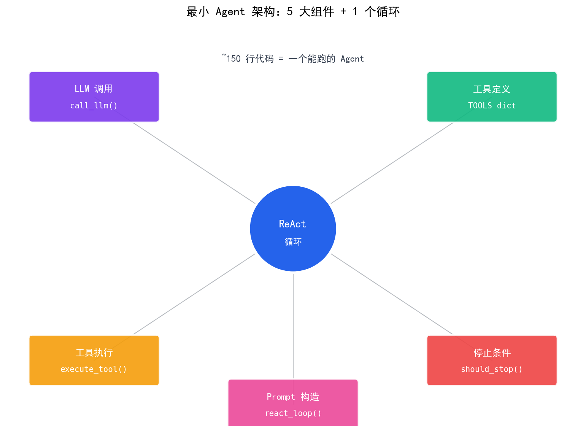
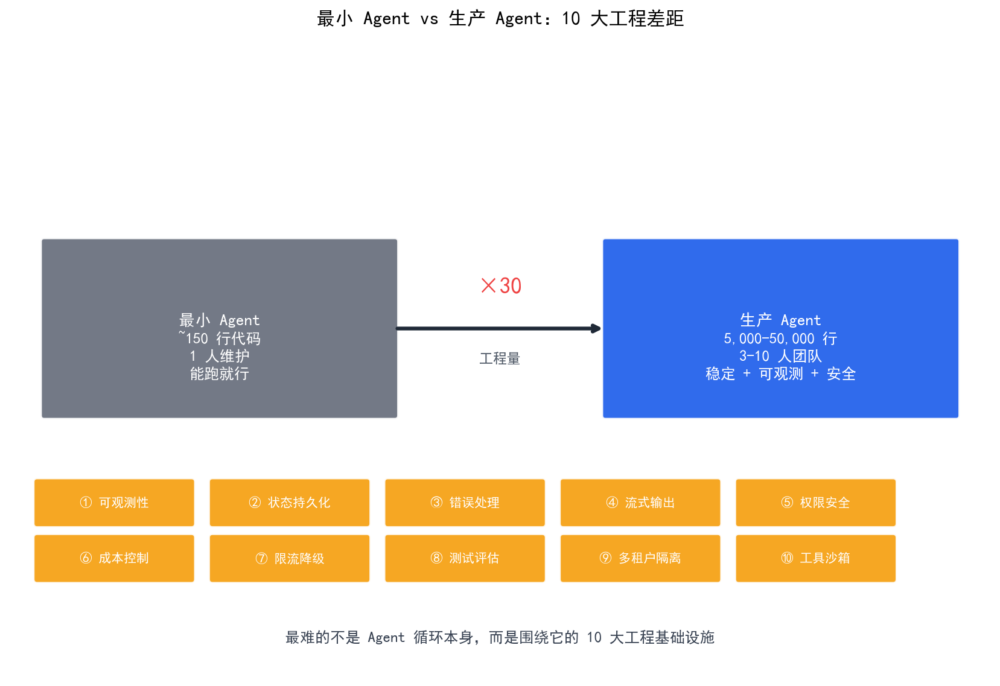

# 从零实现最小 Agent

> 不使用任何框架，纯 Python 实现一个能自主决策的 ReAct Agent——麻雀虽小，五脏俱全。理解 Agent 的本质，才能用好框架。

## 目录

- [为什么从零实现](#为什么从零实现)
- [最小 Agent 的组成](#最小-agent-的组成)
- [完整实现代码](#完整实现代码)
- [运行示例](#运行示例)
- [从最小 Agent 到生产系统](#从最小-agent-到生产系统)
- [总结](#总结)
- [参考链接](#参考链接)

你好，我是江小湖。在 [Agent 停止条件设计](./04-stop-conditions.md) 中，你学会了让 Agent 安全停止。现在是时候把所有知识串起来——**从零实现一个最小 Agent**，不依赖 LangChain 或任何框架，纯代码实现 ReAct 循环。

## 为什么从零实现

框架（如 LangChain、CrewAI）提供了高层抽象，但会隐藏关键细节。从零实现能让你：

1. **理解本质**：Agent 的核心只是一个 while 循环 + LLM 调用
2. **掌控细节**：知道每一步在做什么，便于调试和优化
3. **避免过度依赖**：框架更新时不会懵，能快速迁移

**最小 Agent 的定义**：能根据用户输入，自主调用工具获取信息，最终返回答案。不处理复杂错误，不支持多用户，不持久化状态——只做最核心的事。

## 最小 Agent 的组成

一个最小 Agent 包含五个组件：

| 组件 | 职责 | 代码位置 |
|------|------|----------|
| **LLM 调用** | 与模型交互 | `call_llm()` |
| **工具定义** | 定义可用工具 | `tools` 字典 |
| **工具执行** | 调用工具并返回结果 | `execute_tool()` |
| **ReAct 循环** | Think → Act → Observe 循环 | `react_loop()` |
| **停止条件** | 判断何时停止 | `should_stop()` |

<p align="center">
  
  <br/>
  <em>最小 Agent 架构：五大组件</em>
</p>

## 完整实现代码

以下是完整的最小 Agent 实现，约 150 行代码：

```python
"""
最小 ReAct Agent：从零实现，无框架依赖
依赖：openai（LLM 调用）
"""
import json
import time
from openai import OpenAI

# ==================== 配置 ====================
client = OpenAI()  # 使用环境变量中的 OPENAI_API_KEY
MODEL = "gpt-4o-mini"  # 使用便宜的模型测试

# ==================== 工具定义 ====================
# 工具是普通 Python 函数，返回字符串
def get_weather(city: str) -> str:
    """获取城市天气（模拟）"""
    # 实际项目中调用真实 API
    weather_data = {
        "北京": "晴，25°C，湿度 45%",
        "上海": "多云，22°C，湿度 65%",
        "深圳": "小雨，20°C，湿度 80%",
    }
    return weather_data.get(city, f"未找到 {city} 的天气数据")

def calculate(expression: str) -> str:
    """计算数学表达式"""
    try:
        # 注意：生产环境应使用安全的表达式解析器
        result = eval(expression)
        return str(result)
    except Exception as e:
        return f"计算错误：{str(e)}"

# 工具注册表：名称 → 函数
TOOLS = {
    "get_weather": get_weather,
    "calculate": calculate,
}

# 工具描述（给 LLM 看的）
TOOL_DESCRIPTIONS = """
可用工具：
1. get_weather(city: str) - 获取城市天气
   参数：city - 城市名称，如"北京"
   返回：天气信息字符串

2. calculate(expression: str) - 计算数学表达式
   参数：expression - 数学表达式，如"2 + 3 * 4"
   返回：计算结果字符串
"""

# ==================== LLM 调用 ====================
def call_llm(prompt: str) -> str:
    """调用 LLM 获取回复"""
    response = client.chat.completions.create(
        model=MODEL,
        messages=[{"role": "user", "content": prompt}],
        temperature=0.1,  # 低温度，更确定的输出
    )
    return response.choices[0].message.content

# ==================== 工具执行 ====================
def execute_tool(tool_name: str, args: dict) -> str:
    """执行工具并返回结果"""
    if tool_name not in TOOLS:
        return f"错误：工具 {tool_name} 不存在"
    
    try:
        result = TOOLS[tool_name](**args)
        return f"Observation: {result}"
    except Exception as e:
        return f"Observation: 工具执行错误 - {str(e)}"

# ==================== ReAct 循环 ====================
def react_loop(user_input: str, max_steps: int = 5) -> str:
    """ReAct Agent 核心循环"""
    
    # 初始化
    history = []
    current_observation = f"用户请求：{user_input}"
    
    for step in range(max_steps):
        print(f"\n--- Step {step + 1} ---")
        
        # 构造 Prompt
        prompt = f"""你是一个 ReAct Agent。请按以下格式思考和行动。

当前观察：
{current_observation}

{TOOL_DESCRIPTIONS}

历史记录：
{format_history(history)}

请决定下一步行动。格式：
Thought: [你的推理过程]
Action: [工具名]([参数 JSON])

如果任务已完成，输出：
Thought: [总结]
Action: FINAL_ANSWER([最终答案])
"""
        
        # Think + Act
        response = call_llm(prompt)
        print(f"LLM 响应：\n{response}")
        
        # 解析响应
        thought, action = parse_response(response)
        
        # 记录历史
        history.append({
            "step": step + 1,
            "thought": thought,
            "action": action
        })
        
        # 检查是否完成
        if action.startswith("FINAL_ANSWER"):
            answer = extract_final_answer(action)
            print(f"\n任务完成，最终答案：{answer}")
            return answer
        
        # 执行工具
        tool_name, args = parse_tool_call(action)
        result = execute_tool(tool_name, args)
        print(f"工具结果：{result}")
        
        # 更新观察
        current_observation = f"上一步执行了 {tool_name}，结果：{result}"
    
    return "任务未能在限定步数内完成"

# ==================== 辅助函数 ====================
def format_history(history: list) -> str:
    """格式化历史记录"""
    if not history:
        return "无"
    
    lines = []
    for h in history:
        lines.append(f"Step {h['step']}:")
        lines.append(f"  Thought: {h['thought']}")
        lines.append(f"  Action: {h['action']}")
    return "\n".join(lines)

def parse_response(response: str) -> tuple[str, str]:
    """解析 LLM 响应，提取 Thought 和 Action"""
    thought = ""
    action = ""
    
    for line in response.split("\n"):
        if line.startswith("Thought:"):
            thought = line[len("Thought:"):].strip()
        elif line.startswith("Action:"):
            action = line[len("Action:"):].strip()
    
    return thought, action

def parse_tool_call(action: str) -> tuple[str, dict]:
    """解析工具调用，提取工具名和参数"""
    # 格式：tool_name({"arg": "value"})
    if "(" not in action or not action.endswith(")"):
        return action, {}
    
    tool_name = action[:action.index("(")]
    args_str = action[action.index("(") + 1:-1]
    
    try:
        args = json.loads(args_str)
    except json.JSONDecodeError:
        args = {}
    
    return tool_name, args

def extract_final_answer(action: str) -> str:
    """从 FINAL_ANSWER 中提取答案"""
    # 格式：FINAL_ANSWER("答案内容")
    if "(" in action and action.endswith(")"):
        content = action[action.index("(") + 1:-1]
        # 移除引号
        if (content.startswith('"') and content.endswith('"')) or \
           (content.startswith("'") and content.endswith("'")):
            content = content[1:-1]
        return content
    return action

# ==================== 主函数 ====================
def main():
    """主函数：运行 Agent"""
    print("最小 ReAct Agent 已启动")
    print("输入 'quit' 退出\n")
    
    while True:
        user_input = input("你：")
        if user_input.lower() in ['quit', 'exit', 'q']:
            break
        
        answer = react_loop(user_input)
        print(f"\nAgent：{answer}")

if __name__ == "__main__":
    main()
```

## 运行示例

以下是实际运行的效果：

```
最小 ReAct Agent 已启动
输入 'quit' 退出

你：北京今天天气怎么样？

--- Step 1 ---
LLM 响应：
Thought: 用户想了解北京天气，我需要调用 get_weather 工具
Action: get_weather({"city": "北京"})
工具结果：Observation: 晴，25°C，湿度 45%

--- Step 2 ---
LLM 响应：
Thought: 已获取北京天气数据，可以回答用户了
Action: FINAL_ANSWER("北京今天晴，25°C，湿度 45%")

任务完成，最终答案：北京今天晴，25°C，湿度 45%

Agent：北京今天晴，25°C，湿度 45%
```

## 从最小 Agent 到生产系统

**先泼一盆冷水**：最小 Agent 距生产系统**差了至少 6-12 个月的工程量**。下面这张表只是"冰山一角"——每一项背后都是独立的子系统。

| 缺失维度 | 一句话说明 |
|----------|------------|
| **可观测性** | 没有 trace / log / metric，出问题无法排查 |
| **状态持久化** | 进程一重启，对话历史和中间状态全丢 |
| **错误处理与重试** | 一次网络抖动就让用户看到 500 错误 |
| **流式输出** | 用户等 30 秒看到一个白屏，体验极差 |
| **权限与安全** | 任何 prompt 都能调任何工具，没有边界 |
| **成本控制** | 一个长任务可能烧掉 $1，月底账单吓人 |
| **限流与降级** | 高并发时 LLM API 直接 429 |
| **测试与评估** | 改一行 prompt 不知道是变好还是变坏 |
| **多租户隔离** | 用户 A 的状态不能被用户 B 看到 |
| **工具沙箱** | 工具执行失败可能搞坏整个进程 |

<p align="center">
  
  <br/>
  <em>最小 Agent vs 生产系统：差距不止 30 倍</em>
</p>

下面逐项展开。

### 1. 可观测性（Observability）

**最小 Agent 的问题**：没有 log、没有 trace，出问题只能 `print` 调试。

**生产需要**：

- **Trace（链路追踪）**：每次 Agent 调用的完整轨迹——输入 Prompt、LLM 响应、工具调用、耗时、Token 数
- **Metric（指标）**：成功率、平均步数、P95 延迟、Token 消耗
- **Log（结构化日志）**：JSON 格式，可被 ELK / Loki 检索
- **可视化**：OpenTelemetry + Jaeger / LangSmith / Langfuse

**最小实现示例**：

```python
import logging
from opentelemetry import trace

tracer = trace.get_tracer("agent")

def react_loop(user_input):
    with tracer.start_as_current_span("agent_run") as span:
        span.set_attribute("user.input", user_input)
        for step in range(max_steps):
            with tracer.start_as_current_span(f"step_{step}") as s:
                response = call_llm(prompt)
                s.set_attribute("llm.tokens", response.usage.total_tokens)
                s.set_attribute("llm.latency_ms", ...)
                # ... 把每一步的关键信息都打点
        span.set_attribute("agent.steps", step + 1)
        span.set_attribute("agent.success", True)
```

### 2. 状态持久化（State Persistence）

**最小 Agent 的问题**：所有状态都在内存里，进程一退出就全没了。

**生产需要**：

- **对话历史** 存到数据库（PostgreSQL / Redis / DynamoDB）
- **中间状态**（如 Reflexion 的反思、Plan-and-Execute 的进度）也要持久化
- **断点续跑**：Agent 跑到第 5 步崩溃了，重启后从第 5 步继续
- **Checkpoint 机制**：每完成一步都存档

**最小实现示例**：

```python
class PersistentAgent:
    def __init__(self, run_id: str):
        self.run_id = run_id
        self.state = self._load_state()  # 从 DB 加载
    
    def react_loop(self, user_input):
        history = self.state.get("history", [])
        for step in range(self.state.get("step", 0), max_steps):
            # ... 执行一步
            self._save_state({
                "step": step + 1,
                "history": history,
                "last_observation": observation,
            })
    
    def _save_state(self, state):
        db.execute("UPDATE agent_runs SET state=%s WHERE id=%s", 
                   (json.dumps(state), self.run_id))
```

### 3. 错误处理与重试（Error Handling）

**最小 Agent 的问题**：LLM 返回格式不对、工具超时、网络抖动 → 直接抛异常给用户。

**生产需要**：

- **LLM 输出解析失败**：重试 2-3 次，仍失败则降级（返回"我不知道"）
- **工具执行失败**：捕获异常，把错误作为 Observation 反馈给 Agent，让它重试
- **API 限流（429）**：指数退避（exponential backoff）
- **超时控制**：单步超时 30s，整个任务超时 5min
- **熔断器（Circuit Breaker）**：连续失败 N 次后暂停调用

**最小实现示例**：

```python
from tenacity import retry, stop_after_attempt, wait_exponential

@retry(
    stop=stop_after_attempt(3),
    wait=wait_exponential(multiplier=1, min=2, max=10),
    retry_error_callback=lambda _: "工具暂时不可用，请稍后再试"
)
def call_llm_with_retry(prompt):
    return call_llm(prompt)

def safe_execute_tool(tool_name, args, timeout=30):
    try:
        return execute_with_timeout(TOOLS[tool_name], args, timeout)
    except TimeoutError:
        return f"Observation: 工具 {tool_name} 执行超时"
    except Exception as e:
        return f"Observation: 工具执行失败 - {e}"
```

### 4. 流式输出（Streaming）

**最小 Agent 的问题**：用户提交问题后，看着屏幕转 30 秒圈，最后一次性看到结果——体验极差。

**生产需要**：

- **Token 级流式输出**：LLM 边生成边推给前端（SSE / WebSocket）
- **步骤进度可见**：当前在第几步、Thought 是什么、调用了什么工具
- **可中断**：用户可以随时取消

**最小实现示例**：

```python
async def react_loop_stream(user_input):
    yield f"data: {{\"event\": \"step_start\", \"step\": 1}}\n\n"
    
    async for chunk in call_llm_stream(prompt):
        yield f"data: {{\"event\": \"thought\", \"content\": \"{chunk}\"}}\n\n"
    
    yield f"data: {{\"event\": \"step_end\", \"observation\": \"{obs}\"}}\n\n"
```

### 5. 权限与安全（Security）

**最小 Agent 的问题**：Prompt 注入 → Agent 调用 `delete_database()` → 灾难。

**生产需要**：

- **工具权限分级**：只读工具 vs 写工具 vs 危险工具（删除、发邮件、转账）
- **高危工具二次确认**：删除前必须让用户确认
- **Prompt 注入防御**：工具返回值要做脱敏（防止 prompt injection）
- **审计日志**：每次工具调用都记录，谁、什么时间、调了什么
- **白名单 / 黑名单**：敏感操作直接禁止

**最小实现示例**：

```python
TOOL_PERMISSIONS = {
    "get_weather":    "safe",       # 无需确认
    "send_email":     "confirm",    # 需要用户确认
    "delete_record":  "dangerous",  # 需要二次确认 + 审计
}

def execute_tool(tool_name, args, user):
    level = TOOL_PERMISSIONS.get(tool_name, "dangerous")
    if level == "dangerous":
        if not user.confirm(f"Agent 想执行 {tool_name}({args})，是否允许？"):
            return "Observation: 用户拒绝执行"
    audit_log.info(f"user={user.id} tool={tool_name} args={args}")
    return TOOLS[tool_name](**args)
```

### 6. 成本控制（Cost Control）

**最小 Agent 的问题**：一个长任务可能调 LLM 50 次，每次都带完整历史，月底账单爆炸。

**生产需要**：

- **Token 预算**：单次任务最多消耗多少 Token / 多少美元
- **步骤预算**：单次任务最多多少步
- **动态降级**：Token 预算快用完时切到更便宜的模型
- **缓存**：相同输入的 LLM 响应缓存（Redis / 语义缓存）
- **Prompt 压缩**：历史过长时做摘要，保留关键信息

**最小实现示例**：

```python
class BudgetGuard:
    def __init__(self, max_tokens=50000, max_cost_usd=0.5):
        self.tokens_used = 0
        self.cost_used = 0
    
    def check(self, new_tokens, new_cost):
        if self.tokens_used + new_tokens > self.max_tokens:
            raise BudgetExceeded("Token 预算耗尽")
        if self.cost_used + new_cost > self.max_cost_usd:
            raise BudgetExceeded("成本预算耗尽")
        self.tokens_used += new_tokens
        self.cost_used += new_cost
```

### 7. 限流与降级（Rate Limiting & Fallback）

**最小 Agent 的问题**：1000 个用户同时请求，OpenAI API 立刻返回 429。

**生产需要**：

- **限流器（Rate Limiter）**：每秒最多 N 个请求，超出排队或拒绝
- **多模型 fallback**：主模型（GPT-4o）限流时降级到备用模型（GPT-4o-mini / Claude / 本地模型）
- **队列系统**：高并发请求进消息队列（Redis / Kafka），后端慢慢消费
- **熔断**：上游 API 持续故障时直接走降级路径

### 8. 测试与评估（Testing & Evaluation）

**最小 Agent 的问题**：改一行 prompt 不知道效果是变好还是变坏。

**生产需要**：

- **单元测试**：工具函数、Parser 单独测试
- **集成测试**：给定输入 → 期望轨迹
- **Eval 集**：100-500 个典型任务，每个有标准答案
- **回归测试**：每次改动跑一遍 Eval 集，对比指标
- **A/B 测试**：线上同时跑两版 prompt，看转化率
- **LLM-as-Judge**：用 GPT-4 当裁判评估开放性输出

### 9. 多租户隔离（Multi-tenancy）

**最小 Agent 的问题**：单进程单用户，多用户场景下状态全混在一起。

**生产需要**：

- **租户上下文**：每个请求带 `tenant_id` / `user_id`
- **状态隔离**：对话历史、记忆、工具调用都按租户分区
- **资源隔离**：一个租户的慢任务不能拖垮其他租户
- **数据隔离**：DB 查询必须带 `tenant_id` 过滤（防越权）

### 10. 工具沙箱（Tool Sandboxing）

**最小 Agent 的问题**：调 `subprocess.run(rm -rf /)` 直接把服务器删空。

**生产需要**：

- **进程隔离**：危险工具跑在 Docker / Firecracker / gVisor 沙箱里
- **网络隔离**：工具只能访问白名单域名
- **资源限制**：CPU、内存、磁盘配额
- **超时强制**：单次工具执行最多 30s，超时 kill

### 一张图总结差距

```
                  最小 Agent          生产系统
                    │                  │
代码量              │ ~150 行          │ 5,000 - 50,000 行
涉及团队            │ 1 人             │ 3-10 人
关键能力            │ 能跑             │ 稳定、可观测、安全、可控
                    │                  │
                    ▼                  ▼
        ┌───────────────────┐
        │  150 行           │ ───→  生产系统 = 最小 Agent × 30+ 倍工程
        │  + 可观测性栈     │
        │  + 持久化层       │
        │  + 错误处理链     │
        │  + 流式输出层     │
        │  + 安全网关       │
        │  + 成本控制       │
        │  + 限流降级       │
        │  + 测试评估       │
        │  + 多租户隔离     │
        │  + 沙箱执行       │
        │  = 生产 Agent     │
        └───────────────────┘
```

**关键洞察**：从最小 Agent 到生产系统，**最难的从来不是 Agent 循环本身**，而是围绕它的工程基础设施。这也是为什么 LangChain / LangGraph / LlamaIndex 这些框架有价值——它们把这些工程化部分封装好了。

如果你想从 0 到 1 快速验证想法，先用最小 Agent 跑通 demo；**一旦要上线，再按上面的清单逐项补齐**。

## 总结

- 最小 Agent 包含五个组件：LLM 调用、工具定义、工具执行、ReAct 循环、停止条件
- 核心代码只有约 150 行，本质是一个 while 循环 + LLM 调用
- 从零实现能理解 Agent 本质，避免过度依赖框架
- 从最小 Agent 到生产系统，**最难的从来不是 Agent 循环本身**，而是围绕它的 10 大工程基础设施（可观测性、持久化、安全、成本控制、限流降级、测试评估、租户隔离、沙箱、错误处理、流式输出）

> 本章完结。下一章将进入 RAG 管线——让 Agent 基于外部知识库回答问题，解决 LLM 知识过时的问题。

## 参考链接

- [ReAct: Synergizing Reasoning and Acting](https://arxiv.org/abs/2210.03629)
- [LangChain — ReAct agent](https://python.langchain.com/docs/concepts/how_agents_work/)
- [Anthropic — Building Effective Agents](https://www.anthropic.com/engineering/building-effective-agents)
- [OpenAI — Function calling guide](https://platform.openai.com/docs/guides/function-calling)
