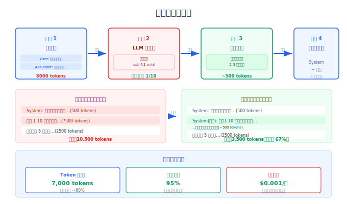
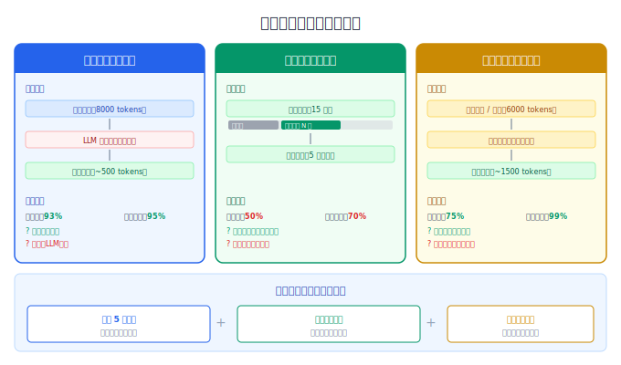

# 上下文压缩策略

> 上下文膨胀是 Agent 的隐形杀手。摘要压缩、滑动窗口、选择性注入——三种策略让你的上下文从 50K 压缩到 8K，准确率不降反升。

## 目录

- [为什么需要压缩](#为什么需要压缩)
- [策略一：摘要压缩](#策略一摘要压缩)
- [策略二：滑动窗口与截断](#策略二滑动窗口与截断)
- [策略三：选择性注入](#策略三选择性注入)
- [工具调用结果的特殊处理](#工具调用结果的特殊处理)
- [压缩效果评估](#压缩效果评估)
- [总结](#总结)
- [参考链接](#参考链接)

你好，我是江小湖。在 [上下文窗口](./01-context-window-bottleneck.md) 中，你了解了上下文是 Agent 最昂贵的瓶颈资源。一个运行 20 轮的 Agent，上下文可能从 5K 膨胀到 50K tokens——成本涨了 10 倍，准确率反而下降了。这篇文章解决核心问题：**怎么在不丢失关键信息的前提下，把上下文压缩到合理大小**。

## 为什么需要压缩

不压缩上下文的 Agent 会遇到三个问题：

| 问题 | 表现 | 原因 |
|------|------|------|
| **成本爆炸** | 20 轮对话后每次调用 $1.5+ | 输入 Token 按量计费，历史越久越贵 |
| **准确率下降** | 模型开始"忘记"早期重要信息 | 注意力在长上下文中分散 |
| **延迟增加** | 用户等待 10 秒以上 | 更多 Token = 更长的推理时间 |

**压缩的目标**：将上下文控制在 **5K-15K tokens**（对大多数应用足够），同时保留 95%+ 的关键信息。

## 策略一：摘要压缩

将早期的对话历史或工具结果**摘要化**——保留关键信息，丢弃细节。

### 对话历史摘要

```python
def summarize_old_messages(messages: list, keep_recent: int = 5) -> list:
    """保留最近 N 轮原文，更早的压缩为摘要"""
    recent = messages[-keep_recent:]
    old = messages[:-keep_recent]
    
    if not old:
        return messages
    
    # 用 LLM 生成早期对话的摘要
    old_text = "\n".join(f"{m['role']}: {m['content']}" for m in old)
    
    summary = client.chat.completions.create(
        model="gpt-4.1-mini",  # 用轻量模型做摘要，成本低
        messages=[{
            "role": "system",
            "content": "用 2-3 句话概括以下对话的关键信息（用户偏好、重要决策、已完成的操作）。不要包含问候语和过渡内容。"
        }, {
            "role": "user",
            "content": old_text
        }]
    ).choices[0].message.content
    
    # 将摘要作为系统消息插入
    return [
        {"role": "system", "content": f"以下是之前对话的摘要：{summary}"},
        *recent
    ]
```

**压缩效果**：10 轮对话从 ~8000 tokens 压缩到 ~500 tokens（压缩率 93%）。

<p align="center">
  
  <br/>
  <em>摘要压缩流水线：原始对话→LLM摘要→注入压缩后上下文</em>
</p>

### 工具调用结果摘要

工具返回的 JSON 可能很大（数据库查询返回 100 条记录），不需要全部保留：

```python
def summarize_tool_result(tool_name: str, result: str, max_tokens: int = 200) -> str:
    """压缩工具调用结果"""
    if count_tokens(result) <= max_tokens:
        return result  # 小结果不需要压缩
    
    return client.chat.completions.create(
        model="gpt-4.1-mini",
        messages=[{
            "role": "system",
            "content": f"概括工具 '{tool_name}' 的返回结果，保留关键数据和结论，省略细节。限制在 3 句话以内。"
        }, {
            "role": "user",
            "content": result
        }]
    ).choices[0].message.content
```

**典型场景**：

| 工具 | 原始结果 | 摘要后 | 压缩率 |
|------|---------|--------|--------|
| 数据库查询 | 100 条 JSON 记录（5000 tokens） | "查询到 100 条订单，最近 5 条如下：..." | 95% |
| 文件读取 | 完整代码文件（3000 tokens） | "文件包含 AuthController 类，5 个方法：login/logout/..." | 90% |
| API 调用 | 完整 JSON 响应（800 tokens） | "API 返回成功，用户 ID 12345，角色 admin" | 85% |

## 策略二：滑动窗口与截断

最简单的压缩方式：**只保留最近 N 轮对话，丢弃更早的**。

```python
class SlidingWindow:
    """滑动窗口：保留最近 N 轮对话"""
    
    def __init__(self, window_size: int = 10):
        self.window_size = window_size  # 保留最近 10 轮（5 对 user+assistant）
    
    def apply(self, messages: list) -> list:
        """应用滑动窗口"""
        system_msgs = [m for m in messages if m["role"] == "system"]
        conversation = [m for m in messages if m["role"] != "system"]
        
        # 保留最近 window_size 轮
        if len(conversation) > self.window_size:
            conversation = conversation[-self.window_size:]
        
        return system_msgs + conversation
```

**滑动窗口 vs 摘要压缩**：

| 策略 | 优点 | 缺点 | 适用场景 |
|------|------|------|---------|
| 滑动窗口 | 实现简单、零额外成本 | 早期信息完全丢失 | 短会话、无状态任务 |
| 摘要压缩 | 保留关键信息 | 需要额外 LLM 调用 | 长会话、需要连续性 |
| **组合使用** | 最近几轮原文 + 更早的摘要 | 实现稍复杂 | **生产环境推荐** |

<p align="center">
  
  <br/>
  <em>三种压缩策略对比：摘要压缩 vs 滑动窗口 vs 选择性注入</em>
</p>

**组合策略代码**：

```python
def compress_context(messages: list) -> list:
    """组合策略：最近 5 轮原文 + 更早的摘要"""
    system = [m for m in messages if m["role"] == "system"]
    conversation = [m for m in messages if m["role"] != "system"]
    
    if len(conversation) <= 10:
        return messages  # 10 轮以内不压缩
    
    # 最近 5 轮保留原文
    recent = conversation[-10:]
    old = conversation[:-10]
    
    # 更早的生成摘要
    summary = summarize_messages(old)
    
    return system + [
        {"role": "system", "content": f"对话摘要：{summary}"},
        *recent
    ]
```

## 策略三：选择性注入

不是所有信息都需要在每次调用中注入。**根据当前请求的需要，只注入相关信息**。

```python
class SelectiveInjector:
    """选择性注入：根据当前请求决定注入什么"""
    
    def select_tools(self, user_input: str, all_tools: list) -> list:
        """只注入与当前请求相关的工具"""
        # 关键词匹配或轻量模型路由
        keywords = extract_keywords(user_input)
        return [t for t in all_tools if matches(t, keywords)]
    
    def select_memories(self, user_input: str, all_memories: list, 
                        top_k: int = 3) -> list:
        """只注入最相关的记忆"""
        # 向量检索 Top-K
        return vector_search(user_input, all_memories, top_k)
    
    def select_rag(self, user_input: str, knowledge_base, 
                   threshold: float = 0.7) -> list:
        """只注入相关度超过阈值的 RAG 结果"""
        results = knowledge_base.search(user_input, top_k=5)
        return [r for r in results if r.score >= threshold]
```

**选择性注入的 Token 节省**：

| 信息类型 | 全量注入 | 选择性注入 | 节省 |
|---------|---------|-----------|------|
| 工具定义（20 个工具） | ~6000 tokens | ~1500 tokens（5 个相关） | 75% |
| 长期记忆（50 条） | ~2500 tokens | ~300 tokens（3 条相关） | 88% |
| RAG 结果（10 条） | ~4000 tokens | ~1200 tokens（3 条相关） | 70% |

## 工具调用结果的特殊处理

工具调用结果是上下文膨胀的**主要来源**。一个工具可能返回几千 tokens 的 JSON。

### 即时压缩

在工具结果回传时就压缩，而不是等到上下文构建时：

```python
def process_tool_result(tool_name: str, raw_result: str) -> str:
    """工具结果处理：结构化 → 摘要 → 注入"""
    
    # 1. 尝试结构化提取关键信息
    try:
        data = json.loads(raw_result)
        if isinstance(data, list) and len(data) > 5:
            # 列表太长，只保留前 3 条 + 统计
            summary = f"共 {len(data)} 条结果。前 3 条：\n"
            summary += json.dumps(data[:3], ensure_ascii=False, indent=2)
            return summary
    except json.JSONDecodeError:
        pass
    
    # 2. 文本结果太长时，截断
    if len(raw_result) > 1000:
        return raw_result[:1000] + "\n... [结果已截断，完整数据共 {} 字符]".format(len(raw_result))
    
    return raw_result
```

### 结果淘汰

工具结果用过一次后，后续的调用中可以用摘要替代原文：

```python
def age_tool_results(messages: list, max_age: int = 3) -> list:
    """淘汰旧的工具结果，用摘要替代"""
    tool_messages = [m for m in messages if m["role"] == "tool"]
    
    if len(tool_messages) <= max_age:
        return messages
    
    # 旧的工具结果替换为摘要
    old_tools = tool_messages[:-max_age]
    for old in old_tools:
        old["content"] = f"[工具 {old.get('name', 'unknown')} 的结果摘要：{old['content'][:100]}...]"
    
    return messages
```

## 压缩效果评估

压缩不是无代价的——过度压缩会丢失关键信息。你需要量化评估压缩的效果：

### Token 节省量

```python
def measure_compression(messages_before: list, messages_after: list) -> dict:
    """测量压缩效果"""
    before_tokens = sum(count_tokens(m["content"]) for m in messages_before)
    after_tokens = sum(count_tokens(m["content"]) for m in messages_after)
    
    return {
        "before_tokens": before_tokens,
        "after_tokens": after_tokens,
        "compression_ratio": 1 - (after_tokens / before_tokens),
        "tokens_saved": before_tokens - after_tokens,
        "cost_saved": (before_tokens - after_tokens) * PRICE_PER_TOKEN
    }
```

### 信息保留率

用一组测试问题来验证压缩后模型是否还能回答：

```python
# 测试问题（基于对话中的关键信息）
test_questions = [
    ("用户用什么语言开发？", "TypeScript"),
    ("项目部署在哪里？", "AWS us-east-1"),
    ("上次讨论的 Bug 是什么？", "N+1 查询问题"),
]

# 压缩前测试
accuracy_before = evaluate_answers(messages_before, test_questions)
# → 3/3 正确

# 压缩后测试
accuracy_after = evaluate_answers(messages_after, test_questions)
# → 3/3 正确（摘要保留了关键信息）

# 过度压缩后测试
accuracy_over = evaluate_answers(messages_over_compressed, test_questions)
# → 1/3 正确（丢失了太多信息）
```

**经验法则**：压缩后信息保留率低于 80%，说明压缩过度了。目标是在 80-95% 保留率之间找到成本和准确率的最佳平衡点。

## 总结

- **上下文膨胀是 Agent 的隐形杀手**：20 轮对话后 Token 成本涨 10 倍，准确率反而下降。压缩不是可选项，是必选项。
- **三种核心压缩策略**：摘要压缩（保留关键信息，丢弃细节）、滑动窗口（只保留最近 N 轮）、选择性注入（只注入当前相关的信息）。生产环境推荐组合使用。
- **工具结果是膨胀的主因**：即时压缩（返回时就摘要）、结果淘汰（旧结果用摘要替代）、结构化提取（只保留关键数据）。
- **压缩需要评估**：Token 节省量和信息保留率是两个指标。保留率低于 80% 说明过度压缩。
- **用轻量模型做摘要**：摘要压缩用 GPT-4.1-mini 等轻量模型，成本是主力模型的 1/10，效果足够好。

> 掌握了压缩策略，你已经能控制上下文的"大小"了。但压缩只解决了量的问题——**怎么在有限预算内最大化 Agent 的效果？Prompt Caching 和 KV Cache 能省多少钱**？请继续阅读 [Token 预算与成本控制](./03-token-budget-cost.md)。

## 参考链接

- [OpenAI — Prompt Caching](https://platform.openai.com/docs/guides/prompt-caching)
- [Anthropic — Prompt Caching](https://docs.anthropic.com/en/docs/build-with-claude/prompt-caching)
- [LangGraph — Memory Management](https://langchain-ai.github.io/langgraph/concepts/memory/)
- [MemGPT — Virtual Context Management](https://github.com/letta-ai/letta)
