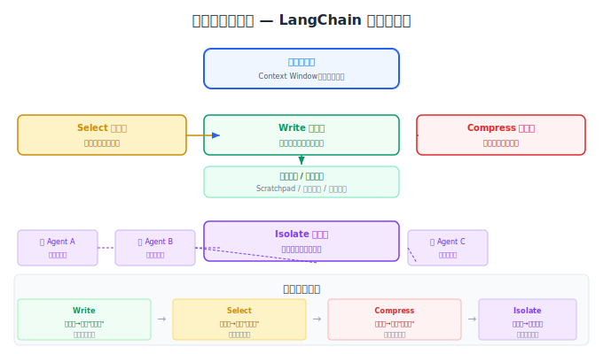
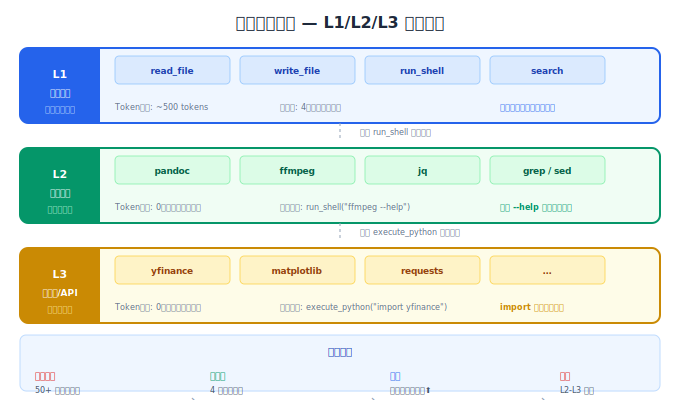

# 上下文卸载与隔离

> 压缩解决"量"的问题，但无法解决"质"的问题——上下文中的信息互相干扰、工具过多导致模型混乱、长任务中早期错误污染后续决策。卸载和隔离是更高阶的策略：把信息移到上下文之外，把关注点隔离开。

## 目录

- [LangChain 四桶分类法](#langchain-四桶分类法)
- [上下文卸载：文件系统当外存](#上下文卸载文件系统当外存)
- [上下文隔离：分而治之](#上下文隔离分而治之)
- [生产环境的卸载与隔离](#生产环境的卸载与隔离)
- [总结](#总结)
- [参考链接](#参考链接)

你好，我是江小湖。前几篇讲了 [上下文窗口的瓶颈](./01-context-window-bottleneck.md)、[压缩策略](./02-context-compression.md) 和 [Token 预算控制](./03-token-budget-cost.md)。压缩能省 Token，但压缩不了"干扰"——把 20 种工具全塞进上下文，即使每个定义都很短，模型还是会选错。这篇文章讲两个更高级的策略：**卸载**（把信息移到上下文之外，需要时再取回）和 **隔离**（把关注点切分到独立的上下文中），让你的 Agent 在长任务中保持清醒。

## LangChain 四桶分类法

LangChain 团队在 2025 年提出了上下文工程的四种核心策略，后来被业界广泛采纳为标准分类框架：

| 策略 | 核心动作 | 解决的问题 | 核心思想 |
|------|---------|-----------|---------|
| **Write** | 写入外部存储 | 上下文容量超限 | 把信息写到上下文之外，需要时取回 |
| **Select** | 精准选择信息 | 不相关信息干扰 | 不是"有什么给什么"，而是"用什么取什么" |
| **Compress** | 压缩上下文 | 信息冗余膨胀 | 保留关键信息，丢弃细节 |
| **Isolate** | 隔离关注点 | 信息互相干扰 | 把不同任务分配到独立的上下文中 |

**前三种策略的关系**：

```
Write（写出去） — 把信息持久化到外部系统
Select（选进来） — 按需从外部系统检索
Compress（压下去）— 对已经在上文中的信息做精简

三者互相配合：Write 提供"信息库"，Select 决定"取什么"，Compress 控制"怎么用"。
```

前三篇已经覆盖了 Compress。这篇文章聚焦 Write（卸载）和 Isolate（隔离）。

<p align="center">
  
  <br/>
  <em>四桶分类法：Write→Select→Compress→Isolate 协作关系</em>
</p>

## 上下文卸载：文件系统当外存

**上下文卸载（Context Offloading）** 的核心思想很简单：**不是所有信息都需要一直留在上下文中**。把信息"卸载"到文件系统或外部存储，只在需要时通过引用取回。

这就像编程中的"内存换页"——热数据留在内存，冷数据写到硬盘，需要时再加载回来。

### 100:1 压缩率的秘密

Manus 团队在 2025 年的分享中披露了一个关键数据：**他们的 Agent 输入输出 Token 比约为 100:1**。具体做法是：

1. **工具输出写文件，上下文中只留文件路径**
2. **网页搜索结果写 Markdown 文件，上下文中只留摘要**
3. **中间计算结果写临时文件，需要时 grep/cat 取回**

```python
# ❌ 错误做法：工具返回的完整内容占满上下文
result = web_search("Python async best practices 2026")
# 搜索结果 8000 tokens，全部注入上下文

# ✅ 正确做法：完整内容写文件，上下文只留引用
def search_and_offload(query: str, file_store: Path) -> str:
    """搜索结果卸载到文件系统"""
    result = web_search(query)  # 8000 tokens

    # 完整结果写入文件
    file_id = f"search_{hash(query)}.md"
    (file_store / file_id).write_text(result, encoding="utf-8")

    # 上下文中只保留摘要和文件路径（约 80 tokens）
    summary = llm.generate(f"用一句话概括以下搜索结果：\n{result[:2000]}")

    return f"""搜索结果摘要：{summary}
    完整内容存储在：{file_id}
    如需查看详情，使用 read_file("{file_id}") 读取。"""

# 压缩率：8000 → 80 tokens（100:1）
```

**压缩率的计算**：不是简单的 Token 数比值，而是"上下文占用"的比值。原始结果 8000 tokens 占据上下文；卸载后只占 80 tokens——模型需要时才主动读取完整内容，这是 **可逆压缩**。

### 可逆压缩 vs 不可逆压缩

压缩策略（前一篇讲的摘要、截断）是**不可逆**的——一旦压缩，原始信息就丢失了。卸载则保留了**可逆性**：

| 维度 | 摘要压缩（不可逆） | 卸载（可逆） |
|------|-----------------|------------|
| 信息保留 | 部分丢失 | 完整保留 |
| 恢复方式 | 无法恢复 | 读取文件即可恢复 |
| Token 节省 | 高（压缩率 80-95%） | 高（压缩率 90-99%+） |
| 适用场景 | 信息"不再需要精读" | 信息"暂时不需要，但可能回头查" |
| 额外开销 | LLM 调用费 | 文件 I/O（几乎为零） |

**Manus 的实践**：先做可逆压缩（工具输出写文件），只有逼近上下文窗口上限（128K-200K tokens）时才触发不可逆摘要。摘要前先把关键上下文整段 dump 到日志文件，确保可回溯。

### Scratchpad：模型的草稿本

卸载的另一个经典应用是 **Scratchpad（暂存区）** ——给 Agent 一个"笔记本"，让它随时记录中间推理和临时信息。

```python
class ScratchpadManager:
    """Agent 的草稿本：上下文卸载的最简实现"""

    def __init__(self, workspace: Path):
        self.workspace = workspace
        self.scratchpad_path = workspace / "scratchpad.md"

    def init_task(self, goal: str):
        """任务开始时初始化草稿本"""
        self.scratchpad_path.write_text(f"""# 任务目标
{goal}

## 进度
- 步骤 1: 进行中...
""", encoding="utf-8")

    def append(self, note: str):
        """追加笔记到草稿本"""
        with open(self.scratchpad_path, "a", encoding="utf-8") as f:
            f.write(f"- {note}\n")

    def update_todo(self, todos: list[dict]):
        """更新待办列表——每次迭代后重写，确保目标在上下文末尾"""
        todo_section = "\n".join(
            f"- [{'x' if t['done'] else ' '}] {t['task']}"
            for t in todos
        )
        # 将 todo 注入到上下文的末尾位置
        return f"""## 当前进度

{todo_section}

已完成 {sum(1 for t in todos if t['done'])}/{len(todos)} 项任务。"""

    def get_summary(self) -> str:
        """获取草稿本摘要（不把全部内容放回上下文）"""
        content = self.scratchpad_path.read_text(encoding="utf-8")
        # 只返回最近 50 行
        lines = content.split("\n")
        return "\n".join(lines[-50:])
```

**Anthropic 的实验数据**：给 Agent 配备 Scratchpad 工具后，基准测试性能提升了 **54%**。核心原因不是"记住了更多信息"，而是"思考过程和最终输出被解耦了"——Agent 可以在草稿本上反复推敲，只把结论放回上下文。

### 文件系统作为工具空间

Manus 将上下文卸载发展到了一个更高级的阶段：**把文件系统变成 Agent 的工具空间**。

```python
class FileSystemToolSpace:
    """文件系统作为 Agent 的无限上下文"""

    def __init__(self, sandbox_root: Path):
        self.root = sandbox_root
        # 预定义目录结构
        (self.root / "outputs").mkdir(exist_ok=True)
        (self.root / "temp").mkdir(exist_ok=True)
        (self.root / "knowledge").mkdir(exist_ok=True)

    def get_tool_manifest(self) -> list[dict]:
        """只暴露原子操作，不让模型看到具体工具"""
        return [
            {
                "name": "write_file",
                "description": "将内容写入文件",
                "parameters": {"path": "string", "content": "string"}
            },
            {
                "name": "read_file",
                "description": "读取文件内容",
                "parameters": {"path": "string", "offset": "int (optional)", "limit": "int (optional)"}
            },
            {
                "name": "run_shell",
                "description": "执行 Shell 命令（grep, cat, sed, awk 等）",
                "parameters": {"command": "string"}
            }
        ]

    def execute(self, tool_name: str, params: dict) -> str:
        """执行工具调用，大结果只返回摘要"""
        if tool_name == "run_shell":
            result = self._run_shell(params["command"])
            # 大输出自动卸载到文件
            if len(result) > 2000:
                output_file = self.root / "temp" / "shell_output.txt"
                output_file.write_text(result, encoding="utf-8")
                return f"输出共 {len(result)} 字符，已写入 temp/shell_output.txt。" \
                       f"前 500 字符：\n{result[:500]}"
            return result

        # ... write_file, read_file 的实现
```

**关键原则**：Agent 看到的不是"50 个专业工具"，而是"3 个原子工具 + 一个 Linux 环境"。任何复杂操作都可以用 Shell 命令组合完成——新增工具不会污染工具空间。

## 上下文隔离：分而治之

**上下文隔离（Context Isolation）** 的核心思想：**不要让一个 Agent 处理所有事情**。把复杂任务分解给多个子 Agent，每个子 Agent 有独立的上下文窗口、独立的工具集、独立的目标。

### 为什么需要隔离？

一个模型面对多任务混合的上下文时，会出现两个问题：

1. **注意力稀释**：系统提示说"你是客服"，但上下文中全是代码——模型在两个角色间摇摆
2. **信息冲突**：不同子任务的信息交叉污染——客服看到了技术讨论，技术 Agent 看到了客户抱怨

隔离后的效果：**Anthropic 的多 Agent 研究系统比单 Agent 表现优越 90.2%**。

### 两种隔离模式

| 模式 | 通信方式 | Token 开销 | 适用场景 |
|------|---------|-----------|---------|
| **通信模式**（主子 Agent） | 主 Agent 发指令，子 Agent 返回结果 | 低（子 Agent 零上下文启动） | 明确可拆分的子任务 |
| **共享内存模式** | 子 Agent 共享文件系统/状态 | 高（子 Agent 看到全部历史） | 需要共享中间结果的深度研究 |

#### 通信模式：主子 Agent

```python
class SubAgentDispatcher:
    """主 Agent 调度子 Agent，只传递必要信息"""

    def dispatch(self, sub_agent: str, task: str, context: dict = None) -> str:
        """启动子 Agent，只给任务描述和必要上下文"""
        agent = self._get_agent(sub_agent)

        # 子 Agent 的上下文只包含：
        # 1. 子 Agent 专属的系统提示（短）
        # 2. 任务描述（用户输入）
        # 3. 必要的上下文片段（可选）
        system_prompt = self._get_role_prompt(sub_agent)
        messages = [
            {"role": "system", "content": system_prompt},
            {"role": "user", "content": f"任务：{task}"}
        ]

        if context:
            messages.insert(1, {
                "role": "system",
                "content": f"相关上下文：\n{json.dumps(context, ensure_ascii=False)}"
            })

        result = agent.run(messages)
        return result  # 只返回最终结果给主 Agent

# 使用示例
dispatcher = SubAgentDispatcher()

# 主 Agent 分析用户请求后，分发子任务
code_result = dispatcher.dispatch(
    sub_agent="code_analyzer",
    task="分析 auth.ts 中的安全漏洞"
)
test_result = dispatcher.dispatch(
    sub_agent="test_writer",
    task="为 auth.ts 的 login 函数写单元测试"
)

# 两个子 Agent 的上下文完全隔离，互不干扰
```

**通信模式的核心优势**：每个子 Agent 的上下文窗口只专注于自己的子任务。子 Agent 不需要知道主 Agent 在和用户聊什么、不需要看到其他子 Agent 的工具调用历史。

#### 共享内存模式：文件系统作 Shuffle 媒介

当子 Agent 需要共享中间结果时，用文件系统充当"shuffle 媒介"：

```python
class SharedMemoryDispatcher:
    """通过文件系统共享中间结果"""

    def __init__(self, workspace: Path):
        self.workspace = workspace
        self.shared = workspace / "shared"

    def run_parallel_tasks(self, tasks: list[dict]) -> dict:
        """并行执行多个子任务，通过文件交换结果"""
        results = {}

        # 阶段 1：并行执行
        for task in tasks:
            agent = SubAgent(task["type"], self.workspace)
            output = agent.run(task["instruction"])
            # 结果写入共享文件
            result_file = self.shared / f"{task['id']}.json"
            result_file.write_text(json.dumps(output, ensure_ascii=False))
            results[task["id"]] = output

        # 阶段 2：汇总分析（子 Agent 可以读取其他 Agent 的结果）
        summary_prompt = f"""分析以下子任务结果，给出综合结论：

        {self._format_shared_results(results)}

        各任务结果存储在 shared/ 目录下，如需查看详情请读取对应文件。"""

        return self._run_summary_agent(summary_prompt)
```

### 环境隔离：沙盒中的 Agent

**环境隔离**是隔离策略的另一个维度——不只是上下文隔离，连**执行环境**也隔离。

```python
# HuggingFace 的 CodeAgent 实践
# Agent 生成的代码在独立沙盒中执行，只有返回值和错误信息传回上下文

class SandboxExecutor:
    """在隔离环境中执行代码，只回传必要信息"""

    def execute(self, code: str, timeout: int = 30) -> dict:
        """沙盒执行代码"""
        try:
            # 在独立进程中执行
            result = subprocess.run(
                ["python", "-c", code],
                capture_output=True,
                text=True,
                timeout=timeout,
                cwd="/tmp/sandbox"  # 受限的工作目录
            )

            # 只回传摘要信息
            return {
                "success": result.returncode == 0,
                "output_summary": result.stdout[:500],
                "error_summary": result.stderr[:200] if result.stderr else None,
                "output_size": len(result.stdout)
            }
        except subprocess.TimeoutExpired:
            return {"success": False, "error_summary": "执行超时 (>30s)"}
```

**环境隔离的价值**：

- **安全**：Agent 生成的代码在沙盒中运行，不会影响主系统
- **Token 节省**：大型输出（如图像处理、数据分析结果）只传摘要，不占上下文
- **状态隔离**：每个沙盒实例独立，不会因为上一个任务的状态影响下一个任务

### 状态字段隔离

最简单的隔离方式：在系统提示中划分不同的"状态区域"。

```python
def build_isolated_prompt(agent_type: str, task: dict,
                          shared_context: dict) -> str:
    """构建带隔离区的系统提示"""

    prompt = f"""你是 {agent_type}，专注于特定领域。

=== 你的职责 ===
{task['role_instructions']}

=== 当前任务 ===
{task['instruction']}

=== 共享上下文（只读） ===
{json.dumps(shared_context, ensure_ascii=False, indent=2)}

=== 其他 Agent 的状态（不要修改） ===
{json.dumps(task.get('peer_states', {}), ensure_ascii=False, indent=2)}

仅基于"你的职责"和"当前任务"工作。共享上下文供参考，不需要全部使用。
不要修改其他 Agent 的状态区域。"""
    return prompt
```

**原则**：每个 Agent 有清晰的"职责边界"和"数据边界"。职责外的信息放在"只读区域"，Agent 知道这些信息存在，但不会主动修改。

## 生产环境的卸载与隔离

### 分层式工具空间（Manus 三层架构）

Manus 的实践表明，工具定义本身也会造成上下文污染。他们的分层方案：

| 层级 | 工具类型 | Token 占用 | 示例 |
|------|---------|-----------|------|
| **L1：原子函数** | 固定的读写文件、搜索、Shell | ~500 tokens（始终在上下文） | `read_file`、`run_shell`、`search` |
| **L2：沙盒工具** | 预装 CLI 工具，按需用 `--help` 查看 | 0 tokens（不占工具定义空间） | `pandoc`、`ffmpeg`、`jq` |
| **L3：软件包/API** | Python 脚本调用预授权 API | 0 tokens（按需 import） | 金融 API、3D 渲染库 |

**核心设计**：L1 是固定的原子操作，L2-L3 的工具不定义在上下文中——Agent 通过 `run_shell` 或 `execute_python` 间接调用，`--help` 和 `import` 替代了工具描述。

```python
# L1 原子函数（在上下文中）
FIXED_TOOLS = [
    "read_file(path)",      # 读取文件
    "write_file(path, content)",  # 写入文件
    "run_shell(cmd)",       # 执行 Shell 命令
    "search(query)",        # 网页搜索
]

# L2 沙盒工具（不在上下文中，通过 run_shell 调用）
# Agent 执行：run_shell("ffmpeg --help") 查看用法
# Agent 执行：run_shell("jq '.data[] | select(.score > 0.8)' results.json")

# L3 Python 脚本（不在上下文中，通过 execute_python 调用）
# Agent 执行：execute_python("import yfinance; ...")
```

<p align="center">
  
  <br/>
  <em>分层工具空间：L1原子函数→L2沙盒工具→L3软件包的三层隔离</em>
</p>

**效果**：工具定义从 3000-6000 tokens 降到 500 tokens，工具选择准确率反而提升——因为 Agent 只需要理解 4 个原子操作，不会在 50 个工具中"迷路"。

### 隔离的代价

隔离不是免费的，你需要权衡：

| 代价 | 影响 | 缓解措施 |
|------|------|---------|
| **Token 总量增加** | Anthropic 数据显示多 Agent 比单 Agent 多用 15 倍 Token | 子 Agent 用轻量模型、只返回必要结果 |
| **协调复杂度** | 子 Agent 之间需要通信协议 | 统一 JSON Schema 输出、文件系统作 Shuffle 媒介 |
| **KV-Cache 失效** | 新 Agent = 新上下文，缓存从零开始 | 子 Agent 保持相同的前缀结构、复用工具定义 |
| **调试困难** | 多个 Agent 的决策链路难以追踪 | 每个子 Agent 独立记录日志、标注入 ID |

**决策原则**：**隔离的收益 > 代价时，才启用**。

```
隔离的收益 = 准确率提升 × 任务价值
隔离的代价 = Token 增加 × 单价 + 协调复杂度 × 开发成本

当收益 > 代价 时启用隔离。
```

**实际例子**：
- 代码审查 Agent：单 Agent 本身任务明确，隔离收益低 → 不用隔离
- 深度研究 Agent：需要并行搜索多个数据源，隔离后准确率提升 90% → 用隔离
- 客服 + 技术支持混合 Agent：两种角色互相干扰 → 用隔离

## 总结

- **LangChain 四桶分类法是上下文工程的完整框架**：Write（写出去）→ Select（选进来）→ Compress（压下去）→ Isolate（隔离开），四种策略分别解决上下文的容量、质量、效率和干扰问题。
- **上下文卸载实现 100:1 压缩率**：把工具输出和中间结果写入文件系统，上下文中只留摘要和文件路径。关键是 **可逆性**——压缩后的信息可以随时从文件恢复。
- **Scratchpad 是卸载的轻量级实践**：给 Agent 一个草稿本记录中间推理，解耦思考过程和最终输出。Anthropic 实测性能提升 54%。
- **上下文隔离是"分而治之"的智慧**：通信模式（主子 Agent）节省 Token，共享内存模式允许中间结果交换。选哪种取决于子任务间是否需要共享状态。
- **分层式工具空间是最先进的卸载实践**：L1 原子函数（始终在上下文）、L2 CLI 工具（按需 `--help`）、L3 Python 脚本（按需 import），工具定义从 6000 tokens 降到 500 tokens。
- **隔离有代价，需权衡**：多 Agent 系统 Token 用量可能高 15 倍，只在"隔离收益 > 隔离代价"时启用。

> 卸载和隔离解决的是上下文的"结构"问题。但上下文还有一类更难对付的问题——**看似正常的信息，实际上在悄悄破坏 Agent 的决策**。请继续阅读 [上下文失败模式与反模式](./05-context-failure-patterns.md)，识别四种致命失效和七个常见反模式。

## 参考链接

- [LangChain — Context Engineering for AI Agents](https://blog.langchain.com/context-engineering-for-ai-agents/) — 四桶分类法的原始出处
- [Manus — Context Engineering Lessons from Building Manus](https://manus.im/blog/Context-Engineering-for-AI-Agents-Lessons-from-Building-Manus) — 分层工具空间、可逆压缩
- [Anthropic — Built a Multi-Agent Research System](https://www.anthropic.com/engineering/built-multi-agent-research-system) — 多 Agent 隔离的性能提升 90.2% 数据来源
- [Drew Breunig — How to Fix Your Context](https://www.dbreunig.com/2025/06/22/how-contexts-fail-and-how-to-fix-them.html) — 上下文失败的诊断与修复
- [HuggingFace — CodeAgent with Sandbox](https://huggingface.co/docs/transformers/agents) — 沙盒执行环境隔离
- [OpenAI — KV Cache and Prompt Caching](https://platform.openai.com/docs/guides/prompt-caching) — 缓存对上下文设计的影响
