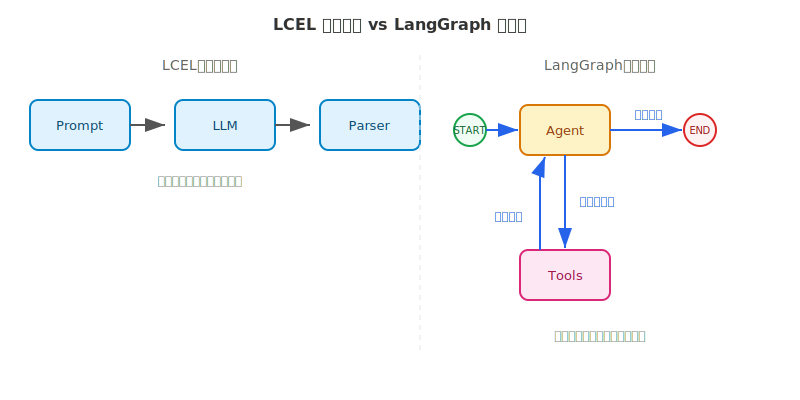
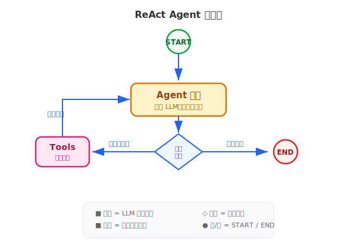

# LangGraph 详解（一）

> 用状态图定义 Agent 流程——状态、节点、边、条件路由，把线性管道变成有分支、有循环的工作流。

## 目录

- [为什么需要状态图](#为什么需要状态图)
- [核心概念](#核心概念)
  - [State：共享数据](#state共享数据)
  - [Node：处理步骤](#node处理步骤)
  - [Edge：流转路径](#edge流转路径)
- [条件路由](#条件路由)
- [START 与 END](#start-与-end)
- [构建一个 ReAct Agent](#构建一个-react-agent)
- [并行执行](#并行执行)
- [LangGraph 与手写循环](#langgraph-与手写循环)
- [总结](#总结)
- [参考链接](#参考链接)

你好，我是江小湖。在 [LangChain 详解](./02-langchain.md) 中，你用 LCEL 的管道运算符 `|` 把 Prompt、模型、解析器串成一条处理链路。这种方式对线性流程很够用，但当工作流需要**分支、循环、条件判断**时，线性管道就力不从心了。

LangGraph 是 LangChain 团队推出的状态图框架（当前版本 1.2.5），专门解决这类问题。读完本文，你将掌握 LangGraph 的核心概念，能用状态图构建一个有分支和循环的 Agent 工作流。

## 为什么需要状态图

先看 LCEL 擅长的场景：

```python
# LCEL：一条线性管道
chain = prompt | llm | parser
result = chain.invoke({"question": "什么是 RAG？"})
```

**数据沿一条直线从输入流到输出**——Prompt 格式化、模型生成、结果解析，每一步的输出直接喂给下一步。

但真实的 Agent 工作流很少是直线的。回顾在 [从零实现最小 Agent](../05-agent-loop/08-minimal-agent.md) 中构建的 ReAct 循环：

```python
# 手写 ReAct 循环
while True:
    response = llm.invoke(messages)
    if response.tool_calls:          # 条件分支
        result = execute_tool(...)
        messages.append(...)          # 循环
    else:
        return response.content       # 终止
```

这段代码里有三个 LCEL 表达不了的模式：

- **条件分支**：根据模型输出决定是调用工具还是直接回答
- **循环**：工具执行完后回到模型继续推理
- **并行**：多个独立任务同时执行后汇总

用 if-else 和 while 循环手写当然可以，但当流程变得更复杂——多个分支嵌套、需要中断恢复、多用户状态隔离——手写代码会迅速膨胀。**状态图**用图结构显式定义流程：节点是处理步骤，边是流转路径，条件边实现动态路由。分支、循环、并行都变成了图的拓扑结构，一眼就能看清。

<p align="center">
  
  <br/>
  <em>LCEL 线性管道 vs LangGraph 状态图</em>
</p>

## 核心概念

LangGraph 围绕三个核心概念构建：**State**（状态）定义共享数据，**Node**（节点）定义处理逻辑，**Edge**（边）定义流转规则。掌握这三点，你就能描述任意复杂的 Agent 工作流。

### State：共享数据

状态是图运行时的共享数据容器，所有节点通过读写同一份状态来协作。用 Python 的 `TypedDict` 定义：

```python
from typing import TypedDict, Annotated
from langgraph.graph.message import add_messages

class AgentState(TypedDict):
    # Annotated + add_messages：新消息追加到列表
    messages: Annotated[list, add_messages]
    # 普通字段：值会被覆盖
    current_step: int
    final_answer: str
```

**关键概念：reducer**。当多个节点修改同一个字段时，默认行为是覆盖——后一个节点的返回值替换前一个。但对话消息需要追加而非覆盖。`Annotated[list, add_messages]` 告诉 LangGraph：这个字段的更新方式是追加。

`add_messages` 是 LangGraph 内置的消息 reducer，它会把新消息追加到现有列表，并根据消息 ID 去重。你自定义 reducer 也很简单：

```python
from typing import Annotated

# 自定义 reducer：数值累加
def add_numbers(old: int, new: int) -> int:
    return old + new

class CounterState(TypedDict):
    count: Annotated[int, add_numbers]
```

**经验法则**：对话消息用 `Annotated[list, add_messages]`，其他字段根据场景决定是否需要 reducer。没有 Annotated 的字段，节点返回的值会直接覆盖旧值。

### Node：处理步骤

节点是干活的函数——接收当前状态，返回需要更新的字段：

```python
def greet_node(state: AgentState) -> dict:
    name = state.get("user_name", "用户")
    return {"messages": [{"role": "assistant", "content": f"你好，{name}！"}]}

def count_node(state: AgentState) -> dict:
    # 返回 partial dict，只更新需要修改的字段
    return {"current_step": state["current_step"] + 1}
```

注意节点的返回值是 **partial dict**——只需要包含你要修改的字段，不需要返回完整的状态。LangGraph 会自动合并到当前状态中。

节点本身不知道图的存在，也不知道自己的前一个和后一个节点是谁。**这种解耦让每个节点可以独立测试和复用**。

### Edge：流转路径

边定义节点之间的流转关系，分为两种：

**固定边**——确定性的顺序流转：

```python
from langgraph.graph import StateGraph, START, END

graph = StateGraph(AgentState)
graph.add_node("greet", greet_node)
graph.add_node("count", count_node)

# 固定边：入口 → greet → count → 结束
graph.add_edge(START, "greet")
graph.add_edge("greet", "count")
graph.add_edge("count", END)
```

`START` 和 `END` 是 LangGraph 内置的特殊节点，分别标记图的入口和出口（后文详述）。

**条件边**——根据状态动态选择下一步，这是状态图的核心能力，下一节展开。

## 条件路由

条件边让图的执行路径根据运行时状态动态变化。用法是 `add_conditional_edges()`：

```python
def route(state: AgentState) -> str:
    """路由函数：根据状态返回下一步方向"""
    if state["current_step"] > 5:
        return "finish"
    return "continue"

graph.add_conditional_edges(
    "count",           # 从哪个节点出发
    route,             # 路由函数
    {                  # 返回值 → 目标节点的映射
        "continue": "greet",
        "finish": END,
    }
)
```

**工作原理**：

1. `count` 节点执行完毕
2. LangGraph 调用 `route(state)`，拿到返回值（如 `"continue"`）
3. 在映射字典中查找对应的目标节点
4. 流转到目标节点（`greet`）或终止（`END`）

**路由函数可以访问完整状态**，所以你可以基于任意字段做判断——消息内容、工具调用结果、计数器值，都可以作为路由依据。

```python
def should_call_tool(state: AgentState) -> str:
    """根据 LLM 最新输出决定是否调用工具"""
    last = state["messages"][-1]
    if hasattr(last, "tool_calls") and last.tool_calls:
        return "call_tool"
    return "done"
```

条件边是 LangGraph 区别于线性管道的关键能力——**流程不再写死在代码里，而是由状态驱动**。

## START 与 END

`START` 和 `END` 是 LangGraph 内置的特殊节点：

- **`START`**：虚拟入口。从 `START` 出发的边标记了图的起始节点
- **`END`**：虚拟出口。任何节点连接到 `END` 表示流程结束

```python
from langgraph.graph import START, END

# 单入口
graph.add_edge(START, "first_node")

# 多入口（并行启动）
graph.add_edge(START, "node_a")
graph.add_edge(START, "node_b")
```

没有连接到 `START` 的节点不会被执行，没有连接到 `END` 的路径会导致图永远循环——**编译时 LangGraph 会检查这些错误**。

## 构建一个 ReAct Agent

把前面的概念组合起来，构建一个实用的 ReAct Agent。架构很简单：

- **agent** 节点：调用 LLM，让它决定下一步
- **tools** 节点：执行 LLM 指定的工具
- **条件边**：根据 LLM 输出决定是执行工具还是直接回答

<p align="center">
  
  <br/>
  <em>ReAct Agent 的状态图结构</em>
</p>

先定义状态和节点：

```python
from typing import Annotated, TypedDict
from langgraph.graph import StateGraph, START, END
from langgraph.graph.message import add_messages
from langchain_openai import ChatOpenAI
from langchain_core.tools import tool
from langchain_core.messages import ToolMessage

# 状态：只需要一个消息列表
class State(TypedDict):
    messages: Annotated[list, add_messages]

llm = ChatOpenAI(model="gpt-4o")

@tool
def get_weather(city: str) -> str:
    """查询城市天气"""
    return f"{city}：晴，25°C"

tools = [get_weather]
llm_with_tools = llm.bind_tools(tools)

# Agent 节点：调用 LLM
def agent(state: State):
    return {"messages": [llm_with_tools.invoke(state["messages"])]}
```

接下来是工具节点和路由函数：

```python
# 工具节点：执行所有待处理的工具调用
def tools_node(state: State):
    results = []
    for tc in state["messages"][-1].tool_calls:
        matched = {t.name: t for t in tools}[tc["name"]]
        result = matched.invoke(tc["args"])
        results.append(ToolMessage(
            content=str(result), tool_call_id=tc["id"]
        ))
    return {"messages": results}

# 路由函数：是否需要调用工具？
def should_continue(state: State) -> str:
    last = state["messages"][-1]
    if hasattr(last, "tool_calls") and last.tool_calls:
        return "tools"
    return "end"
```

最后组装图并运行：

```python
# 组装图
workflow = StateGraph(State)
workflow.add_node("agent", agent)
workflow.add_node("tools", tools_node)
workflow.add_edge(START, "agent")
workflow.add_conditional_edges(
    "agent", should_continue, {"tools": "tools", "end": END}
)
workflow.add_edge("tools", "agent")   # 工具结果反馈给 LLM
app = workflow.compile()

# 运行
response = app.invoke({
    "messages": [{"role": "user", "content": "北京天气怎么样？"}]
})
print(response["messages"][-1].content)
```

三个核心部分各约十几行代码，**状态图自动管理了"分支→执行→循环"的流程**。LLM 输出包含工具调用时，走 `tools` 分支；执行完后回到 `agent` 重新推理；当 LLM 不再调用工具时，流程走向 `END`。

这就是 LangGraph 的核心价值：**你定义图的拓扑结构，框架负责按拓扑执行和传递状态**。

## 并行执行

当多个独立任务需要同时执行时，LangGraph 支持从同一个节点出发的多条边并行执行。

典型场景是 RAG 系统中的多路召回：同时从知识库和网络搜索获取信息，汇总后生成回答。

```python
class QAState(TypedDict):
    query: str
    rag_result: str
    web_result: str
    answer: str

def rag_search(state: QAState):
    return {"rag_result": f"知识库检索：{state['query']}"}

def web_search(state: QAState):
    return {"web_result": f"网络搜索：{state['query']}"}

def summarize(state: QAState):
    return {"answer": f"综合：{state['rag_result']}；{state['web_result']}"}
```

从 `START` 出发的两条边让 `rag_search` 和 `web_search` **并行执行**：

```python
graph = StateGraph(QAState)
graph.add_node("rag", rag_search)
graph.add_node("web", web_search)
graph.add_node("summarize", summarize)

# 两条边从 START 出发 → 并行执行
graph.add_edge(START, "rag")
graph.add_edge(START, "web")

# 两条边都汇入 summarize → 等待两者完成后执行
graph.add_edge("rag", "summarize")
graph.add_edge("web", "summarize")
graph.add_edge("summarize", END)
```

**汇合逻辑**：`summarize` 节点会等待 `rag` 和 `web` 都完成后才执行——状态中同时包含了两者的结果。

如果需要异步并行，节点函数可以定义为 `async`，然后用 `ainvoke()` 调用编译后的图。

## LangGraph 与手写循环

| 维度 | 手写循环 | LangGraph |
|------|---------|-----------|
| **流程定义** | if-else 嵌套在代码中 | 图的拓扑结构显式定义 |
| **状态管理** | 手动维护变量 | 状态自动在节点间传递 |
| **流程可视化** | 无 | `app.get_graph().draw_mermaid()` |
| **扩展能力** | 需要自己实现 | 天然支持持久化、HITL |
| **学习成本** | 无 | 需要理解状态图概念 |

**什么时候用 LangGraph**：

- 流程有 3 个以上分支或循环
- 需要中断恢复（Checkpoint，下一篇会讲）
- 多人协作开发，需要统一的流程描述方式

**什么时候手写就够**：

- 简单的请求-响应模式
- 只有一轮工具调用
- 追求极致性能，不想要框架开销

经验法则：**如果你的 Agent 代码超过 300 行，或者流程图很难用文字描述清楚，就该考虑 LangGraph 了**。

## 总结

- **状态图**是 LangGraph 的核心抽象——节点是处理步骤，边是流转路径，条件边实现动态路由
- **三件套**：State 定义共享数据（TypedDict + reducer），Node 处理逻辑（返回 partial dict），Edge 控制流向（固定边 + 条件边）
- 一个完整的 ReAct Agent 只需约 40 行核心代码，状态图自动管理分支、循环和状态传递
- **并行执行**：从同一节点出发的多条边可以同时执行，适合多路召回等场景
- 流程简单时手写循环更直接，流程复杂时框架的结构化优势不可替代

> 下一篇 [LangGraph 详解（二）](./04-langgraph-2.md) 将深入 Checkpoint 和 Human-in-the-Loop——让 Agent 能中断恢复、在关键步骤等待人类审批，这是从 demo 到生产的关键一步。

## 参考链接

- [LangGraph 官方文档](https://langchain-ai.github.io/langgraph/) — LangGraph 核心概念和 API 参考
- [LangGraph GitHub](https://github.com/langchain-ai/langgraph) — 源码、示例和版本发布
- [Building Effective Agents](https://www.anthropic.com/engineering/building-effective-agents) — Anthropic 的 Agent 设计模式参考
- [LangChain 官方文档](https://python.langchain.com/) — LangChain 生态和 LCEL 详解
