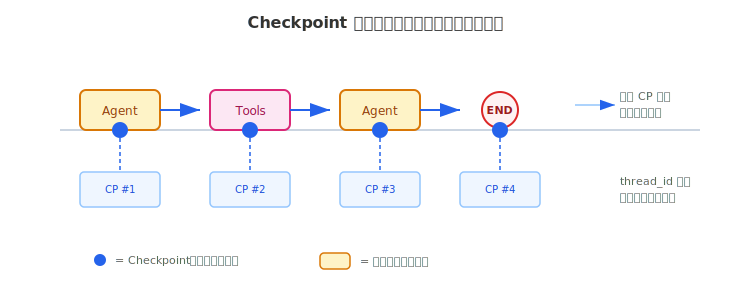
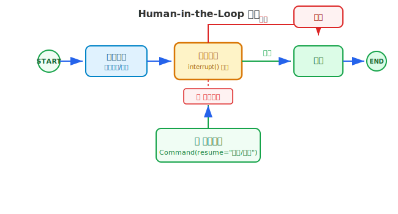

# LangGraph 详解（二）

> Checkpoint 让 Agent 能中断恢复、记住对话历史；Human-in-the-Loop 让 Agent 在关键步骤暂停，等待人类审批——从 demo 到生产的最后一块拼图。

## 目录

- [为什么需要持久化](#为什么需要持久化)
- [Checkpoint 机制](#checkpoint-机制)
  - [状态快照](#状态快照)
  - [thread_id：会话隔离](#thread_id会话隔离)
  - [存储后端](#存储后端)
- [多轮对话](#多轮对话)
- [Human-in-the-Loop](#human-in-the-loop)
  - [interrupt()：暂停等待](#interrupt暂停等待)
  - [Command：恢复执行](#command恢复执行)
  - [审批流程示例](#审批流程示例)
- [时间旅行](#时间旅行)
  - [浏览历史](#浏览历史)
  - [修改历史并重新执行](#修改历史并重新执行)
- [总结](#总结)
- [参考链接](#参考链接)

你好，我是江小湖。在 [LangGraph 详解（一）](./03-langgraph-1.md) 中，你用状态图构建了一个 ReAct Agent——节点定义处理步骤，条件边控制流转。但那个 Agent 有一个致命问题：**每次运行都从零开始**，没有记忆，不能中断，无法恢复。

这篇解决的就是从 demo 到生产的最后一块拼图。读完本文，你将掌握三个核心能力：Checkpoint 持久化、Human-in-the-Loop、时间旅行。

## 为什么需要持久化

上一篇文章的 ReAct Agent 是这样运行的：

```python
# 每次调用都从头开始
response = app.invoke({"messages": [HumanMessage(content="你好")]})
```

**状态只在内存中存在**。程序一停，所有对话历史、工具调用结果、中间推理步骤全部丢失。

这在 demo 里无所谓，但在生产环境中完全不够用：

- **多轮对话**：用户问"今天天气"，Agent 回答后用户追问"那明天呢"——Agent 需要记住上下文
- **中断恢复**：一个需要 20 步的工作流在第 15 步超时了，你需要从第 15 步继续，而不是重新开始
- **人类审批**：Agent 准备发邮件，你需要先看一眼内容再决定发不发——这要求 Agent 能暂停

这三个场景都需要同一个基础能力：**把 Agent 的运行状态保存下来，随时恢复**。

## Checkpoint 机制

LangGraph 的 Checkpoint 机制很直接：**每个节点执行完后，自动保存一份完整的状态快照**。就像游戏的自动存档——每个关卡通过后自动存盘，你可以从任意存档点继续。

<p align="center">
  
  <br/>
  <em>每个节点执行后自动保存状态快照</em>
</p>

### 状态快照

Checkpoint 保存的不是聊天记录，而是**图在某一执行步骤的完整状态**——包括所有消息、中间变量、当前在哪个节点、下一步去哪。

工作流程：

1. 读取上一个 Checkpoint
2. 执行当前节点，更新状态
3. 写入新的 Checkpoint
4. 流转到下一个节点

**每个节点执行完都会产生一个新的 Checkpoint**，形成一条版本化的历史链，类似 Git 的 commit 记录。

### thread_id：会话隔离

要启用 Checkpoint，你需要做两件事：编译时传入一个 **checkpointer**，调用时传入一个 **thread_id**。

```python
from langgraph.checkpoint.memory import MemorySaver

# 编译时传入 checkpointer
checkpointer = MemorySaver()
app = graph.compile(checkpointer=checkpointer)

# 调用时传入 thread_id
config = {"configurable": {"thread_id": "user-001"}}
response = app.invoke(
    {"messages": [{"role": "user", "content": "你好"}]},
    config
)
```

**`thread_id` 是会话的隔离坐标**。不同的 `thread_id` 对应不同的 Checkpoint 链，互不干扰——就像游戏里不同的存档槽位。

如果调用时不传 `thread_id`，持久化会被跳过，行为和不配置 checkpointer 一样。

### 存储后端

LangGraph 提供三种内置的 Checkpointer，适配不同部署场景：

| 后端 | 存储位置 | 适用场景 |
|------|---------|---------|
| **MemorySaver** | 内存 | 本地开发、测试 |
| **SqliteSaver** | SQLite 文件 | 单机部署 |
| **PostgresSaver** | PostgreSQL | 多实例、高并发生产环境 |

```python
from langgraph.checkpoint.memory import MemorySaver
from langgraph.checkpoint.sqlite import SqliteSaver

# 内存（进程结束即丢失）
memory = MemorySaver()

# SQLite（持久化到文件）
sqlite = SqliteSaver.from_conn_string("./checkpoints.db")

# 编译时选择
app = graph.compile(checkpointer=sqlite)
```

PostgresSaver 需要在首次使用前调用 `setup()` 创建数据库表：

```python
from langgraph.checkpoint.postgres import PostgresSaver

postgres = PostgresSaver.from_conn_string("postgresql://...")
postgres.setup()  # 创建所需的表结构
app = graph.compile(checkpointer=postgres)
```

**选型建议**：开发阶段用 MemorySaver 快速迭代，单机上线用 SqliteSaver，多实例部署用 PostgresSaver。

## 多轮对话

有了 Checkpoint，多轮对话变得非常简单——只需要在每次调用时传入相同的 `thread_id`，LangGraph 会自动从上一个 Checkpoint 恢复状态：

```python
config = {"configurable": {"thread_id": "user-001"}}

# 第一轮
app.invoke(
    {"messages": [{"role": "user", "content": "我叫小明"}]},
    config
)

# 第二轮：Agent 记住了"我叫小明"
response = app.invoke(
    {"messages": [{"role": "user", "content": "我叫什么？"}]},
    config
)
print(response["messages"][-1].content)  # "你叫小明"
```

**不需要手动管理消息历史**。LangGraph 通过 Checkpoint 自动累积消息——第二轮调用时，状态中已经包含了第一轮的全部对话。

不同用户的对话用不同的 `thread_id` 隔离：

```python
# 用户 A 的对话
config_a = {"configurable": {"thread_id": "user-A"}}
app.invoke({"messages": [...]}, config_a)

# 用户 B 的对话（完全独立）
config_b = {"configurable": {"thread_id": "user-B"}}
app.invoke({"messages": [...]}, config_b)
```

## Human-in-the-Loop

Human-in-the-Loop（HITL）让 Agent 在关键步骤暂停，等待人类审批后再继续。典型场景：Agent 要发邮件、执行转账、删除数据——这些操作需要人类确认。

### interrupt()：暂停等待

LangGraph 用 `interrupt()` 函数实现暂停。在节点内部调用 `interrupt()`，图会立即停止执行，当前状态自动保存为 Checkpoint：

```python
from langgraph.types import interrupt

def send_email_node(state):
    email_content = state["draft_email"]

    # 暂停，等待人类审批
    decision = interrupt({
        "message": "请审核以下邮件内容",
        "content": email_content,
        "options": ["发送", "取消"]
    })

    if decision == "发送":
        actually_send_email(email_content)
        return {"status": "已发送"}
    return {"status": "已取消"}
```

`interrupt()` 的参数是你想展示给审批者的信息——可以是任意字典或字符串。当图暂停时，这些信息会作为状态的一部分保存下来，外部系统可以读取并展示给用户。

**关键约束**：`interrupt()` 必须在节点函数或工具函数内部调用，不能在图的外部使用。并且**必须配置了 checkpointer**，否则无法恢复执行。

### Command：恢复执行

图暂停后，用 `Command(resume=...)` 注入人类的决策并恢复执行：

```python
from langgraph.types import Command

config = {"configurable": {"thread_id": "email-001"}}

# 第一次运行：到 interrupt() 时暂停
app.invoke({"messages": [...]}, config)

# 第二次运行：注入人类决策，恢复执行
app.invoke(
    Command(resume="发送"),
    config   # 必须使用相同的 thread_id
)
```

`Command` 的 `resume` 值会成为 `interrupt()` 的返回值——在上面的例子中，`decision` 变量会被赋值为 `"发送"`。

`Command` 还支持 `goto` 参数，可以覆盖默认的边路由，强制跳转到指定节点：

```python
# 根据审批结果跳转到不同节点
if decision == "发送":
    return Command(goto="execute_send")
else:
    return Command(goto="notify_cancel")
```

### 审批流程示例

<p align="center">
  
  <br/>
  <em>HITL 流程：暂停 → 人类审批 → 执行或取消</em>
</p>

把 `interrupt()` 和 `Command` 组合，构建一个完整的审批流程：

```python
from langgraph.types import interrupt, Command
from langgraph.graph import StateGraph, START, END

class TransferState(TypedDict):
    messages: Annotated[list, add_messages]
    amount: float
    approved: bool

def prepare_transfer(state):
    return {"amount": 10000.0}

def approval_node(state):
    # 暂停，展示转账详情
    decision = interrupt({
        "question": f"是否批准转账 {state['amount']} 元？",
        "options": ["批准", "拒绝"]
    })

    if decision == "批准":
        return Command(goto="execute_transfer")
    return Command(goto="cancel_transfer")

def execute_transfer(state):
    return {"approved": True}

def cancel_transfer(state):
    return {"approved": False}
```

组装图，用条件边连接审批节点：

```python
workflow = StateGraph(TransferState)
workflow.add_node("prepare", prepare_transfer)
workflow.add_node("approval", approval_node)
workflow.add_node("execute", execute_transfer)
workflow.add_node("cancel", cancel_transfer)

workflow.add_edge(START, "prepare")
workflow.add_edge("prepare", "approval")
workflow.add_edge("execute", END)
workflow.add_edge("cancel", END)

app = workflow.compile(checkpointer=MemorySaver())
```

运行和审批：

```python
config = {"configurable": {"thread_id": "transfer-001"}}

# 运行到 interrupt() 暂停
app.invoke({"messages": []}, config)

# 查看暂停原因
state = app.get_state(config)
# state.values 中包含 interrupt 传出的信息

# 批准
app.invoke(Command(resume="批准"), config)
```

**完整流程**：`prepare` → `approval`（暂停等待）→ 人类审批 → `execute` → `END`。

## 时间旅行

Checkpoint 不仅用于恢复执行，还支持**回溯和修改历史状态**——LangGraph 称之为"时间旅行"。

### 浏览历史

`get_state_history()` 返回某个 `thread_id` 下的所有 Checkpoint，按时间倒序排列：

```python
config = {"configurable": {"thread_id": "user-001"}}

for i, snapshot in enumerate(app.get_state_history(config)):
    msgs = snapshot.values.get("messages", [])
    last = msgs[-1].content[:50] if msgs else "(空)"
    step = snapshot.metadata.get("step", "?")
    print(f"[{i}] step={step} | {last}")
```

每个 `snapshot` 包含：

- `config`：定位这个 Checkpoint 的坐标（含 `checkpoint_id`）
- `values`：当时的完整状态
- `metadata`：元信息（执行步骤、来源等）

### 修改历史并重新执行

`update_state()` 让你在某个历史 Checkpoint 上注入新数据，然后从那里重新执行：

```python
# 选择第 3 个历史 Checkpoint
history = list(app.get_state_history(config))
target = history[3]

# 在这个 Checkpoint 上追加一条系统消息
new_config = app.update_state(
    target.config,
    {"messages": [SystemMessage(content="请用诗歌格式回答")]}
)

# 从修改后的状态继续执行
for chunk in app.stream(None, new_config, stream_mode="values"):
    pass
```

**工作原理**：`update_state()` 不会修改原始 Checkpoint，而是在它之后创建一个新的 Checkpoint。原始历史保持不变，新的执行从注入点开始分叉。

| 操作 | 方法 | 影响 | 典型场景 |
|------|------|------|---------|
| **浏览历史** | `get_state_history()` | 只读 | 调试、审计 |
| **分叉执行** | 用旧状态 + 新 `thread_id` 运行 | 创建新线程 | A/B 测试 |
| **修改并重新执行** | `update_state()` + `stream(None)` | 在原线程追加新 Checkpoint | 修正错误、注入指令 |

时间旅行在生产环境中非常有用——当 Agent 在某一步出错时，你可以回到出错之前的状态，修改输入后重新执行，而不需要从头开始。

## 总结

- **Checkpoint** 在每个节点执行后自动保存状态快照，是持久化、HITL、时间旅行的基础
- **thread_id** 是会话的隔离坐标，相同 `thread_id` 的调用共享同一条 Checkpoint 链
- **三种存储后端**：MemorySaver（开发）、SqliteSaver（单机）、PostgresSaver（生产）
- **多轮对话**：传入相同 `thread_id`，LangGraph 自动恢复上下文
- **Human-in-the-Loop**：`interrupt()` 暂停 + `Command(resume=...)` 恢复，适合审批、确认等场景
- **时间旅行**：`get_state_history()` 浏览历史，`update_state()` 修改后重新执行

> 下一篇将进入 CrewAI——用角色扮演的方式组织多个 Agent 协作，让不同角色的 Agent 各司其职完成复杂任务。

## 参考链接

- [LangGraph Persistence 文档](https://langchain-ai.github.io/langgraph/concepts/persistence/) — Checkpoint 机制官方说明
- [LangGraph Human-in-the-Loop](https://langchain-ai.github.io/langgraph/concepts/human_in_the_loop/) — HITL 模式官方指南
- [LangGraph 官方文档](https://langchain-ai.github.io/langgraph/) — LangGraph 核心概念和 API
- [LangGraph GitHub](https://github.com/langchain-ai/langgraph) — 源码、示例和版本发布
