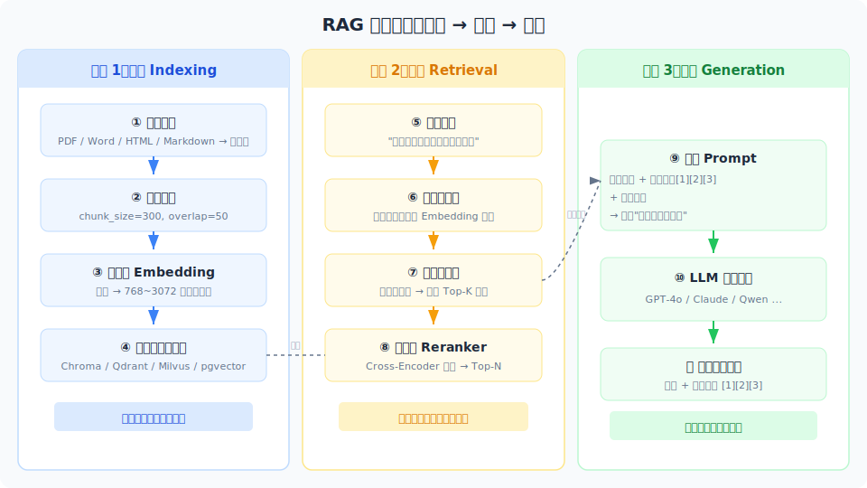

# RAG 概述

> RAG（Retrieval-Augmented Generation）是给 LLM 加外部知识的核心能力——先检索相关文档，再让模型基于这些文档生成答案，解决 LLM 知识过时和幻觉问题。

## 目录

- [LLM 的知识困境](#llm-的知识困境)
- [RAG 的核心思想](#rag-的核心思想)
- [RAG 与微调的区别](#rag-与微调的区别)
- [RAG 的典型应用场景](#rag-的典型应用场景)
- [RAG 的完整流程](#rag-的完整流程)
- [RAG 的关键挑战](#rag-的关键挑战)
- [总结](#总结)
- [参考链接](#参考链接)

你好，我是江小湖。在 [从零实现最小 Agent](../05-agent-loop/05-minimal-agent.md) 中，你实现了一个能调用工具的 Agent。但工具只能获取实时数据（如天气），无法访问私有知识库（如公司文档、个人笔记）。RAG 解决这个核心问题：**让 LLM 基于你的私有知识库回答问题**。

读完本文，你将理解：为什么 LLM 需要 RAG？RAG 的核心流程是什么？什么时候该用 RAG，什么时候不该用？为后续章节的动手实践打好认知基础。

## LLM 的知识困境

LLM 本质上是一个**概率模型**——它通过在海量文本上训练，学会了"看到上文后，下文最可能是什么"。这个机制让它具备了强大的语言理解和生成能力，但也带来了三个绕不开的知识困境：

### 知识过时

LLM 的知识来自训练数据，一旦训练完成，它的知识就**冻结在那一刻**。

举个具体例子：GPT-4 的训练数据截止到 2024 年初。如果你问它"2024 年诺贝尔物理学奖得主是谁"，它要么说不知道，要么会编造一个看似合理但错误的答案。这不是模型不够聪明，而是它的世界里根本没有这条信息。

对于企业应用来说，这个问题更严重——行业政策、产品版本、内部流程每天都在更新，但模型永远停留在过去。

### 缺乏私有知识

LLM 只知道公开互联网上的信息，它不知道你们公司的产品手册、内部 API 文档、员工入职流程、客户历史工单。这些信息从未出现在训练数据中，所以无论模型多大，它都**天然无法回答**涉及这些知识的问题。

比如你问"我们公司的报销流程是什么"，GPT-4 不知道——即使你给它一个亿的参数量，它也不知道。因为"你们公司"这件事从未出现在任何公开数据源中。

### 幻觉

LLM 的底层机制是"预测下一个 token"，不是"检索数据库"。这意味着它会**极其自信地编造**不存在的事实。

典型场景：

- 让它引用论文，它会编造不存在的标题和作者
- 让它写 API 调用示例，它会生成看起来正确但实际不存在的函数名
- 让它回答医疗问题，它会给出看似专业但可能致命的建议

幻觉不是小概率事件——在特定领域（如法律、医疗、金融），幻觉率可以高达 30% 以上。这是直接应用 LLM 最大的风险。

### 为什么传统方案不够

| 方案 | 原理 | 局限 |
|------|------|------|
| **微调** | 将知识"烧"进模型参数 | 成本高（几十到几万美元）、更新慢（需重新训练）、容易灾难性遗忘 |
| **Prompt Engineering** | 把文档塞进上下文窗口 | 窗口有限（即使 200K token 也塞不下一本书）、成本高（长 prompt 费用惊人） |
| **工具调用** | 调用 API 获取实时数据 | 只能访问结构化 API，无法处理非结构化文档（PDF、笔记、邮件） |

这三种方案都有各自的价值，但面对"基于大量私有文档回答问题"这个需求，它们要么太贵，要么太慢，要么根本做不到。RAG 正是为解决这个问题而生的。

## RAG 的核心思想

RAG（Retrieval-Augmented Generation，检索增强生成）的核心思想可以用一句话概括：**先检索，再生成**。

```
用户提问 → 从知识库中检索相关文档 → 把文档和问题一起交给 LLM → LLM 基于文档生成答案
```

### 为什么"先检索，再生成"有效

LLM 有一个重要特性：**如果把答案放在上下文里，它就能正确地"复述"出来**。即使它在训练时从未见过这条信息。

这意味着我们不需要把知识"烧"进模型参数（那是微调的工作），只需要在推理时把相关文档"塞"给模型就行。就像开卷考试——你不需要背下所有知识，只需要知道去哪里找到答案，然后把答案组织好写出来。

### RAG 的三个关键步骤

| 步骤 | 做什么 | 类比 |
|------|--------|------|
| **索引（Indexing）** | 将文档切分成小块，转为向量存入数据库 | 建立图书馆的检索目录 |
| **检索（Retrieval）** | 根据用户问题，找到最相关的文档片段 | 在图书馆中搜索相关书籍 |
| **生成（Generation）** | 将检索结果和问题一起交给 LLM 生成答案 | 阅读相关书籍后组织答案 |

这个过程看似简单，但每一步都有大量的工程细节和优化空间。后续章节会逐步展开。

### 一句话总结 RAG 的价值

> **RAG 让 LLM 从"凭记忆回答"变成"查资料后回答"**——知识可以随时更新，答案可以追溯来源，不需要重新训练模型。

## RAG 与微调的区别

RAG 和微调是两种不同的"给 LLM 加知识"的方法，理解它们的区别是做技术选型的基础：

| 维度 | RAG | 微调 |
|------|-----|------|
| **知识来源** | 外部文档（推理时检索） | 训练数据（训练时烧入） |
| **更新成本** | 低——更新文档重新索引即可 | 高——需重新训练，周期数天到数周 |
| **成本结构** | 推理时成本较高（检索+长上下文） | 训练时成本高，推理时成本低 |
| **可解释性** | 高——可以引用具体文档来源 | 低——黑箱，无法追溯答案来源 |
| **延迟** | 较高（检索通常 100-500ms + 生成） | 较低（仅生成，无额外检索延迟） |
| **幻觉控制** | 较好——答案基于检索结果生成 | 较差——仍可能编造不存在的知识 |
| **适用场景** | 知识密集型问答、需要引用来源 | 风格调整、格式控制、领域术语对齐 |
| **数据隐私** | 好——数据可以不离开本地 | 差——训练数据会融入模型参数 |
| **知识容量** | 大——向量数据库可存百万级文档 | 小——受限于模型参数量和训练成本 |

### 怎么选：决策框架

选择 RAG 还是微调，取决于你遇到的是什么问题：

**优先 RAG 的场景**：

- **知识频繁更新**：政策、产品文档、FAQ 每周都在变，RAG 更新文档即可，无需重新训练
- **需要引用来源**：法律、医疗、金融场景，答案必须可追溯，RAG 天然支持引用原文
- **知识量大**：有几百份文档、上千条规则，RAG 的向量数据库可以轻松承载
- **数据敏感**：企业数据不能外传，RAG 可以本地部署，数据不出服务器

**优先微调的场景**：

- **调整输出风格**：让模型回答更专业、更口语、或遵循特定格式（如 JSON、表格）
- **领域术语对齐**：让模型理解特定行业的术语和表达方式
- **低延迟要求**：不能接受检索延迟，需要毫秒级响应
- **知识量小**：只需要记住几十条核心规则，可以烧进模型参数

**两者结合**：

在实际项目中，RAG 和微调经常一起用。比如：

1. 微调让模型学会"用专业术语回答"（风格调整）
2. RAG 给模型提供最新的产品文档（知识更新）

这是效果最好的方案，但成本也最高——适合对质量要求极高的场景。

## RAG 的典型应用场景

### 企业知识库问答

**场景**：员工需要查询公司制度、产品文档、技术规范。传统方式是翻内部 wiki 或问同事，效率低且容易遗漏。

**RAG 方案**：将公司文档切分后存入向量数据库，员工提问时自动检索相关段落，生成准确答案并附上原文链接。

**价值**：新人入职第一天就能查到所有制度，不需要反复问老员工；制度更新后重新索引即可，所有问题的答案自动更新。

### 智能客服

**场景**：客服团队每天处理几百个用户问题，其中 80% 是重复的（"怎么退货"、"发票怎么开"）。

**RAG 方案**：基于产品手册、FAQ、历史工单构建 RAG 系统，用户提问时自动检索最相关的答案模板，客服确认后一键回复。

**价值**：首次响应时间从几分钟降到几秒；客服处理效率提升 3 倍以上；答案基于官方文档，准确性有保障。

### 个人知识助手

**场景**：你积累了大量笔记、文章、书摘，但想找某条信息时只能全文搜索，效率极低。

**RAG 方案**：将个人笔记和收藏文章索引后，用自然语言提问即可找到相关内容。比如"去年我读过一篇关于 RAG 的文章，作者提到了一个切分策略"。

**价值**：个人知识库变成"第二大脑"，想查什么直接问，不需要翻文件夹。

### 代码助手

**场景**：团队有大量代码库和 API 文档，新成员需要很长时间才能上手。

**RAG 方案**：将代码库、API 文档、设计文档索引后，开发者可以用自然语言提问。比如"我们项目的登录接口在哪个文件"、"这个 API 的参数格式是什么"。

**价值**：新人上手时间从几周缩短到几天；老开发者也能快速找到不熟悉的模块。

### 法律/医疗合规

**场景**：律师需要查阅大量法规和判例，医生需要参考临床指南。这些文档量大、更新频繁、容错率极低。

**RAG 方案**：将法规、指南、判例索引后，专业人士提问时自动检索相关条款，生成答案并标注出处。

**价值**：减少人工查阅时间；答案可追溯到具体条款，降低合规风险。

## RAG 的完整流程

RAG 的完整流程包含三个阶段，每个阶段都有多种策略选择：



```
文档 → 切分 → 向量化 → 存入向量数据库
                ↓
用户问题 → 向量化 → 相似度检索 → 获取相关文档
                ↓
问题 + 文档 → LLM → 生成答案
```

### 索引阶段

索引是 RAG 的基础。这一步的质量直接决定后续检索的准确性。

**1. 文档解析**

原始文档通常是 PDF、Word、HTML、Markdown 等格式，需要先转为纯文本。这一步看起来简单，但实际中充满挑战——PDF 的表格和图片、Word 的格式、网页的广告和导航栏，都会干扰文本提取。

常用工具：

| 工具 | 适用场景 | 特点 |
|------|---------|------|
| PyPDF2 | 简单 PDF | 免费，但复杂排版效果差 |
| Unstructured | 各种格式 | 支持 PDF/Word/HTML/Email，自动检测格式 |
| LlamaParse | 复杂 PDF | LlamaIndex 提供，AI 辅助解析表格和图表 |
| BeautifulSoup | HTML | 轻量，适合网页正文提取 |

**2. 文档切分**

文档需要切成小块（chunk），因为：

- 向量模型对短文本效果更好（通常 100-500 token）
- 检索时需要精确定位到相关段落，而不是返回整篇文档
- LLM 上下文窗口有限，塞太多文档会稀释相关信息

切分策略：

| 策略 | 做法 | 适用场景 |
|------|------|---------|
| 固定长度切分 | 按字数/Token 数切 | 通用，简单可靠 |
| 按段落切分 | 以空行为界 | 结构清晰的文档 |
| 语义切分 | 用 Embedding 检测语义边界 | 高质量要求场景 |
| 递归切分 | 先按大块切，再按小块切 | LangChain 默认，兼顾效率和质量 |

关键参数：

- **chunk_size**：每个片段的大小，通常 200-500 token
- **chunk_overlap**：相邻片段的重叠部分，通常 50-100 token，避免切断语义

**3. 向量化（Embedding）**

将文本片段转为高维向量（通常 768-3072 维）。向量化的质量直接决定检索的准确性——好的 Embedding 模型能让语义相似的文本在向量空间中距离更近。

常用的 Embedding 模型：

| 模型 | 维度 | 特点 |
|------|------|------|
| text-embedding-3-small (OpenAI) | 1536 | 性价比高，适合大多数场景 |
| text-embedding-3-large (OpenAI) | 3072 | 更准确，成本更高 |
| BGE-M3 (BAAI) | 1024 | 开源多语言，支持中文 |
| Cohere Embed v3 | 1024 | 多语言，长文本支持好 |

**4. 向量数据库存储**

将向量和对应的原文片段一起存入向量数据库，支持后续的相似度检索。

常用向量数据库：

| 数据库 | 类型 | 特点 |
|--------|------|------|
| Chroma | 嵌入式 | 轻量，适合开发和原型 |
| Pinecone | 云托管 | 全托管，无需运维 |
| Milvus | 自部署 | 高性能，适合大规模 |
| Weaviate | 混合 | 支持向量+关键词混合检索 |
| pgvector | PostgreSQL 插件 | 如果已有 PG，无需额外组件 |

### 检索阶段

检索是 RAG 的核心环节。检索到的文档质量直接决定最终答案的质量。

**1. 问题向量化**

用**与索引时相同的 Embedding 模型**将用户问题转为向量。这里的关键是"相同的模型"——如果索引用模型 A，检索也必须用模型 A，否则向量空间不一致，检索结果会很差。

**2. 相似度检索**

在向量数据库中计算问题向量与所有文档向量的距离，返回最相似的 Top-K 个片段。

常用的相似度度量：

| 度量 | 原理 | 适用场景 |
|------|------|---------|
| 余弦相似度（Cosine） | 计算向量夹角 | 最常用，适合大多数场景 |
| 内积（Dot Product） | 计算向量点积 | 向量已归一化时等价于余弦 |
| 欧氏距离（L2） | 计算向量距离 | 适合高维稀疏向量 |

Top-K 的选择：K 通常取 3-10。太少可能漏掉相关信息，太多会引入噪声并增加 LLM 成本。

**3. 重排序（Reranking）**

初次检索的结果可能不够精确。重排序模型会对检索结果进行**二次精排**，进一步提高相关性。

工作流程：

```
初次检索 Top-20 → 重排序模型精排 → 取 Top-5 交给 LLM
```

常用重排序模型：

- Cohere Rerank
- BGE-Reranker (BAAI)
- Jina Reranker

重排序会增加 50-200ms 延迟，但能显著提高检索质量，是提升 RAG 效果的"低垂果实"。

### 生成阶段

检索到相关文档后，最后一步是让 LLM 基于这些文档生成答案。

**1. 构造 Prompt**

将检索结果和用户问题组合成一个 Prompt。典型的 Prompt 结构：

```
你是一个知识问答助手。请基于以下参考资料回答用户的问题。

如果参考资料中没有相关信息，请明确告知"我找不到相关信息"，不要编造答案。

---
参考资料：
[1] {检索结果 1 的原文}
[2] {检索结果 2 的原文}
[3] {检索结果 3 的原文}
---

用户问题：{用户的问题}
```

关键设计：

- **明确指令**：告诉模型"只基于参考资料回答"，减少幻觉
- **引用要求**：要求模型标注引用了哪个片段（如 [1]、[2]）
- **兜底策略**：告诉模型"找不到就说找不到"，避免编造

**2. 后处理**

生成的答案可能需要后处理：

- **格式化**：将 Markdown 转为 HTML、添加引用链接
- **来源追溯**：在答案下方显示引用的原文片段
- **事实核查**：用另一个 LLM 检查答案是否忠实于检索结果

## RAG 的关键挑战

RAG 不是万能的，实际应用中会遇到几个关键挑战：

### 检索质量

检索是 RAG 最薄弱的环节。如果检索不到相关文档，后续生成的质量再高也没用。

常见问题：

- **语义鸿沟**：用户的问题和文档的表述方式不同。比如用户问"怎么退货"，但文档里写的是"商品退换流程"。
- **信息分散**：答案分散在多个文档中，单独看任何一个都不完整。
- **噪音干扰**：检索到了看似相关但实际无关的文档，干扰 LLM 的判断。

缓解策略：

- 增加重排序（Reranking）步骤
- 查询改写（Query Rewriting）：用 LLM 将用户问题改写为更适合检索的形式
- 混合检索：结合向量检索和关键词检索

### 切分粒度

切分太粗，检索结果包含太多无关信息，稀释了相关内容；切分太细，丢失了上下文，LLM 无法理解片段的含义。

这是一个需要反复调优的参数，没有通用的最优解。通常从 chunk_size=300, chunk_overlap=50 开始，根据实际效果调整。

### 上下文窗口管理

检索到 5 个文档片段后，每个片段 300 token，加上问题和 Prompt 模板，总共可能 2000-3000 token。如果使用更长的上下文（比如检索 Top-10），成本和延迟都会显著增加。

需要在"检索更多"和"成本/延迟"之间找到平衡。

### 评估困难

RAG 系统的评估比普通 LLM 应用更复杂，因为需要同时评估：

- **检索质量**：是否检索到了相关的文档？（Recall@K、NDCG）
- **生成质量**：答案是否准确？是否忠实于检索结果？
- **端到端质量**：用户是否满意？

没有简单的评估指标，需要结合自动化评估和人工评估。

## 总结

- **RAG** 是"先检索，再生成"的范式，解决 LLM 知识过时和幻觉问题
- **核心价值**：将通用知识与私有知识结合，让答案既准确又可靠
- **三个阶段**：索引（文档→向量）、检索（问题→文档）、生成（文档+问题→答案）
- **与微调的区别**：RAG 更新成本低、可解释性高，适合知识密集型场景
- **关键挑战**：检索质量、切分粒度、上下文管理、评估困难——这些是后续章节要解决的问题

> 下一篇，我们将深入文档切分与向量化——RAG 的基础。如何选择切分策略？Embedding 模型怎么选？向量数据库有哪些？

## 参考链接

- [LangChain — RAG from scratch](https://python.langchain.com/docs/tutorials/rag/) — 从零构建 RAG 的完整教程
- [Pinecone — What is RAG?](https://www.pinecone.io/learn/retrieval-augmented-generation/) — RAG 概念详解
- [LlamaIndex — What is RAG?](https://docs.llamaindex.ai/en/stable/getting_started/concepts/) — LlamaIndex 视角的 RAG 介绍
- [Nvidia — What is Retrieval-Augmented Generation?](https://www.nvidia.com/en-us/glossary/retrieval-augmented-generation/) — 工业界 RAG 实践
- [Google Cloud — RAG](https://cloud.google.com/discover/what-is-retrieval-augmented-generation) — Google 对 RAG 的解读
- [Anthropic — Retrieval Augmented Generation](https://docs.anthropic.com/en/docs/build-with-claude/retrieval-augmented-generation) — Claude 的 RAG 实践
