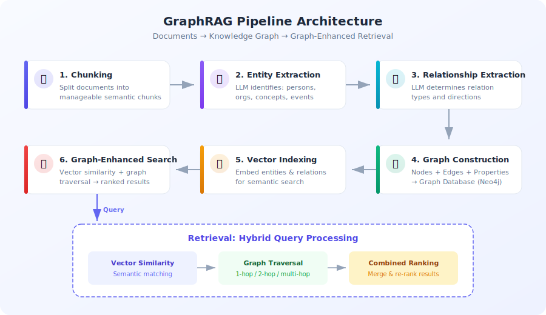
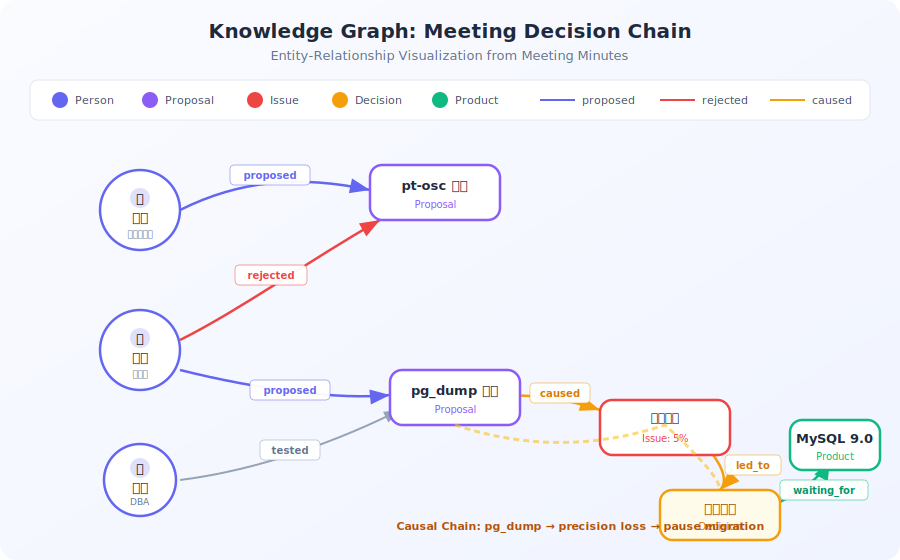

# GraphRAG：知识图谱增强检索

> 前五篇覆盖了 RAG 的完整流程：切分→向量化→检索→重排序→评测。但有一种问题朴素 RAG 搞不定——"根据去年的三次会议纪要，导致项目延期的决策链是什么？"这不是找相关段落，而是跨文档追踪因果关系。GraphRAG 就是为这类问题设计的。

## 目录

- [朴素 RAG 的天花板](#朴素-rag-的天花板)
- [GraphRAG 是什么](#graphrag-是什么)
- [GraphRAG 的工作流水线](#graphrag-的工作流水线)
- [朴素 RAG vs GraphRAG 全景对比](#朴素-rag-vs-graphrag-全景对比)
- [动手实战：Cognee GraphRAG](#动手实战cognee-graphrag)
- [主流 GraphRAG 方案对比](#主流-graphrag-方案对比)
- [总结](#总结)
- [参考链接](#参考链接)

你好，我是江小湖。前五篇文章带你从 [RAG 原理概述](./01-rag-overview.md) 到 [构建完整 RAG 系统](./05-build-rag-system.md)，掌握了朴素 RAG 的全流程。朴素 RAG 能回答"PostgreSQL 支持哪些索引类型"这类问题——找到最相关的文档段落，丢给 LLM 生成答案。但有一类问题它搞不定：**跨文档的因果推理**。这篇文章讲 GraphRAG——给 RAG 加上知识图谱，让检索从"找段落"升级到"找关系"。

## 朴素 RAG 的天花板

朴素 RAG 的核心假设：**答案就在与问题语义最相似的文档段落中**。这个假设在 80% 的场景下成立，但在以下场景会失效：

```
问题："根据去年的三次技术评审会议纪要，导致迁移失败的核心决策链是什么？"

朴素 RAG 的做法：
  1. 向量化问题 "导致迁移失败的核心决策链"
  2. 找语义最相似的文档段落
  3. 可能找到的段落：
     - "张三提议用 pt-osc 做在线迁移"  ← 第 1 次会议
     - "最终决定暂停迁移"                ← 第 3 次会议

朴素 RAG 的局限：
  ✗ 能找到相关段落，但无法理解因果关系
  ✗ 跨文档的信息无法串联（"张三提议" → "李四反对" → "最终暂停"）
  ✗ 回答只能是片段的拼接，无法推理因果链

GraphRAG 的做法：
  1. 预先构建知识图谱：
     张三 → proposed → pt-osc方案
     李四 → rejected → pt-osc方案
     暂停迁移 → caused_by → 精度丢失
     精度丢失 → found_in → 测试结果（会议2）
  2. 图遍历追踪因果链：
     pt-osc → 不支持跨库 → pg_dump替代方案 → 精度丢失5% → 暂停迁移 → MySQL 9.0 → 重新评估
  3. 给出带因果结构的完整回答
```

**朴素 RAG 失效的典型场景**：

| 问题类型 | 朴素 RAG 表现 | GraphRAG 表现 |
|---------|-------------|-------------|
| "X 是什么" | ✅ 找定义段落 | ✅ 同样能做到 |
| "X 和 Y 有什么关系" | ⚠️ 可能找到两段，但无法建立联系 | ✅ 图遍历直接给出关系路径 |
| "哪些决策导致了 Z" | ❌ 找不到"决策"和"结果"的因果链 | ✅ 沿因果边遍历，追踪因果鏈 |
| "从 A 事件到 B 事件发生了什么" | ❌ 碎片化信息，无法串联 | ✅ 时间线 + 因果链双重追踪 |

## GraphRAG 是什么

**GraphRAG = 知识图谱（Knowledge Graph）+ RAG（检索增强生成）**

```text
传统 RAG：文档 → 向量化 → 相似度检索 → LLM 生成
GraphRAG：文档 → 实体/关系提取 → 知识图谱构建 → 图遍历 + 向量检索 → LLM 生成
```

核心区别：GraphRAG 在"检索"步骤中加入了**结构化推理**——不是找相似的段落，而是沿着实体间的**关系路径**（边）进行**图遍历**。

### 三个核心概念

| 概念 | 说明 | 示例 |
|------|------|------|
| **实体（Entity / Node）** | 知识图谱中的节点，代表具体事物 | 张三、PostgreSQL、pt-osc方案 |
| **关系（Relationship / Edge）** | 实体之间的有向连接 | 张三 → proposed → pt-osc方案 |
| **图遍历（Graph Traversal）** | 沿边从一个实体走到另一个 | 张三 → 1-hop: pt-osc → 2-hop: 李四（同级反对者） |

### GraphRAG 的三种检索模式

```
模式 1：实体检索（Entity Lookup）
  → "张三是谁？" → 直接定位到 张三 节点 → 返回其属性和关联实体

模式 2：1-hop 关系检索（Direct Relationship）
  → "张三提出了什么方案？" → 张三 → proposed → pt-osc方案

模式 3：多跳遍历（Multi-hop Traversal）
  → "张三的决策最终导致了什么？"
  → 张三 → proposed → pt-osc方案 → rejected_by → 李四
  → pt-osc方案 → 替代为 → pg_dump方案 → found_issue → 精度丢失 → caused → 暂停迁移
```

## GraphRAG 的工作流水线

```
文档/文本
    │
    ▼ [分块] Chunking
将长文档拆分为可管理的片段
    │
    ▼ [实体提取] Entity Extraction
LLM 识别：人名、组织、技术名词、事件、日期
    │
    ▼ [关系抽取] Relationship Extraction  
LLM 判断实体间的关系类型和方向
    │
    ▼ [图谱构建] Graph Construction
节点 + 边 + 属性 → 图数据库（Neo4j / Kuzu / Ladybug）
    │
    ▼ [索引] Indexing
实体和关系同时向量化，支持语义 + 图遍历混合检索
    │
    ▼ [检索] Graph-enhanced Search
向量相似度 + 1-hop/2-hop 图遍历 → 综合排序
```



### 一个完整的实体-关系提取示例

输入文档：

```
2026-03-15 项目迁移复盘会议
参与人：张三（后端负责人）、李四（架构师）、王五（DBA）

1. 张三提议用 pt-online-schema-change 做在线迁移
2. 李四指出 pt-osc 不支持跨数据库类型，建议改 pg_dump
3. 王五测试后发现 pg_dump 有 5% 精度丢失
4. 最终决定：停止迁移，等待 MySQL 9.0
```

LLM 自动提取的结果：

```json
{
  "entities": [
    {"name": "张三", "type": "Person", "role": "后端负责人"},
    {"name": "李四", "type": "Person", "role": "架构师"},
    {"name": "王五", "type": "Person", "role": "DBA"},
    {"name": "pt-osc方案", "type": "Proposal"},
    {"name": "pg_dump方案", "type": "Proposal"},
    {"name": "精度丢失问题", "type": "Issue", "severity": "5%"},
    {"name": "MySQL 9.0", "type": "Product"},
    {"name": "暂停迁移", "type": "Decision"}
  ],
  "relationships": [
    {"source": "张三", "relation": "proposed", "target": "pt-osc方案"},
    {"source": "李四", "relation": "rejected", "target": "pt-osc方案"},
    {"source": "李四", "relation": "proposed", "target": "pg_dump方案"},
    {"source": "王五", "relation": "tested", "target": "pg_dump方案"},
    {"source": "pg_dump方案", "relation": "caused", "target": "精度丢失问题"},
    {"source": "精度丢失问题", "relation": "led_to", "target": "暂停迁移"},
    {"source": "暂停迁移", "relation": "waiting_for", "target": "MySQL 9.0"}
  ]
}
```



## 朴素 RAG vs GraphRAG 全景对比

| 维度 | 朴素 RAG | GraphRAG |
|------|---------|----------|
| **检索方式** | 向量相似度搜索 | 向量相似度 + 图遍历 |
| **信息组织** | 扁平文档片段 | 结构化实体-关系图 |
| **跨文档推理** | ✗ 不支持 | ✅ 多跳图遍历追踪因果链 |
| **精确查找** | ✅ 语义匹配很准 | ✅ 同样的语义匹配 + 关系约束 |
| **实体关系** | ⚠️ 需要从段落中推断 | ✅ 显式存储为边，直接查询 |
| **构建成本** | 低（仅需分块+向量化） | 高（需 LLM 提取实体和关系） |
| **更新成本** | 低（重新向量化） | 中（图节点和边需要同步更新） |
| **延迟** | 低（< 100ms 检索） | 高（图遍历 + 多跳检索，200ms-1s） |
| **适合数据量** | 1K-100K 文档 | 100-10K 文档（实体密集） |
| **典型场景** | FAQ、知识库搜索、文档问答 | 法律合规、金融投研、医疗诊断 |

## 动手实战：Cognee GraphRAG

Cognee 是目前最成熟的 Python GraphRAG 框架之一，内置完整的实体提取→关系抽取→图谱构建→检索流水线。

### 安装与初始化

```python
# pip install cognee
import cognee
import asyncio

async def graphrag_demo():
    # ========== 1. 初始化 ==========
    # 开发环境用内存模式，生产换 PostgreSQL
    await cognee.prune.prune_data()
    await cognee.prune.prune_system()

    # ========== 2. 添加文档 ==========
    # 支持文本、文件路径、URL
    await cognee.add("""
    项目迁移复盘会议纪要（2026-03-15）

    参与人：张三（后端负责人）、李四（架构师）、王五（DBA）

    背景：PostgreSQL 15 → MySQL 8.0 迁移

    决策过程：
    1. 张三提议用 pt-online-schema-change 做在线迁移
    2. 李四指出 pt-osc 不支持跨数据库类型，建议改 pg_dump → mysql 转换
    3. 王五测试后发现 pg_dump 方案有约 5% 的数据精度丢失
    4. 最终决定：停止迁移，等待 MySQL 9.0 原生 JSONB 支持后再评估

    未解决问题：旧数据的 JSONB 查询语法不兼容
    """)

    await cognee.add("""
    第二次评估会议纪要（2026-06-10）

    参与人：张三、李四

    MySQL 9.0 已发布，原生 JSONB 支持完善。
    李四做了兼容性测试，通过率从 85% 提升到 97%。
    决定：下月初启动第二轮迁移试点。
    """)

    # ========== 3. 构建知识图谱 ==========
    # cognify() 自动执行完整流水线：
    #   分块 → 实体提取 → 关系抽取 → 图谱构建 → 向量化索引
    print("正在构建知识图谱...")
    await cognee.cognify()
    print("知识图谱构建完成！")

    # ========== 4. 简单检索（语义匹配） ==========
    results = await cognee.search("迁移使用什么数据库？")
    print("\n--- 简单检索 ---")
    for r in results:
        print(f"[{r.score:.2f}] {r.content[:100]}...")

    # ========== 5. 因果链推理（GraphRAG 真正的价值） ==========
    results = await cognee.search(
        "数据库迁移失败的根本原因是什么？最终的决策是什么？"
    )
    print("\n--- 因果链推理 ---")
    for r in results:
        print(f"[{r.score:.2f}] {r.content[:200]}...")

    # 返回结果会自动追踪因果链：
    #   pt-osc不支持跨库 → 改用pg_dump → 精度丢失5% → 暂停迁移
    #   → MySQL 9.0发布 → 兼容性97% → 下月启动试点

asyncio.run(graphrag_demo())
```

### 代码解读：cognify() 内部发生了什么

```
await cognee.cognify()  触发以下流水线：

1. 分块（Chunking）
   "项目迁移复盘会议纪要..." → 多个语义块

2. 实体提取（Entity Extraction）
   调用 LLM 识别 → {
     "张三": Person,
     "李四": Person,
     "pt-osc方案": Proposal,
     "精度丢失": Issue,
     "暂停迁移": Decision,
     "MySQL 9.0": Product,
     ...
   }

3. 关系抽取（Relationship Extraction）
   调用 LLM 判断 → [
     张三 --[proposed]--> pt-osc方案,
     李四 --[rejected]--> pt-osc方案,
     pg_dump方案 --[caused]--> 精度丢失,
     精度丢失 --[led_to]--> 暂停迁移,
     ...
   ]

4. 图谱构建（Graph Construction）
   节点 + 边 + 属性 → 写入图数据库

5. 向量索引（Vector Indexing）
   实体和关系的文本描述 → 向量化 → 向量数据库

完成后，search() 会同时使用图遍历和向量检索
```

## 主流 GraphRAG 方案对比

| 方案 | 类型 | 图数据库 | 特点 | 适合场景 |
|------|------|---------|------|---------|
| **Cognee** | Python 框架 | Ladybug (Kuzu) | 一键 cognify()，内置完整流水线 | Python 生态，中大型项目 |
| **Microsoft GraphRAG** | Python 库 | — | 社区摘要 + 分层图谱，微软出品 | 企业级，超大规模文档集 |
| **Neo4j + LangChain** | 组合方案 | Neo4j | 灵活可控，需手动管理图结构 | 已有 Neo4j 基础设施的团队 |
| **LlamaIndex KnowledgeGraphIndex** | LlamaIndex 插件 | 可选 | 与 LlamaIndex 生态深度集成 | LlamaIndex 用户 |
| **手写实现** | 自定义 | 可选 | 完全定制，成本最高 | 有特殊需求和专业团队 |

### 选型建议

```
你的场景是什么？
├── 快速上手、Python 生态 → Cognee
│   cognify() 一键构建，适合原型和生产
├── 微软生态、超大规模 → Microsoft GraphRAG
│   社区摘要算法创新，适合百万级文档
├── 已有 Neo4j → Neo4j + LangChain
│   复用现有基础设施，灵活可控
└── 特殊需求 → 手写实现
    实体提取和关系抽取策略完全定制
```

## 总结

- **朴素 RAG 的天花板是跨文档推理**："X 和 Y 有什么关系""哪些决策导致了 Z"这类问题，向量相似度搜索无法给出因果链。
- **GraphRAG 通过知识图谱突破这个天花板**：实体提取 → 关系抽取 → 图谱构建 → 图遍历检索，让检索从"找段落"升级到"找关系"。
- **构建成本是主要代价**：每条文档都需要 LLM 调用两次（实体提取 + 关系抽取），适合文档量在 100-10K 级别且关系密集的场景。
- **Cognee 是 Python 生态的最佳入口**：`add()` → `cognify()` → `search()`，三步完成 GraphRAG。
- **GraphRAG 和朴素 RAG 不是替代关系**：80% 的场景朴素 RAG 够用，剩下的 20% 需要因果推理时才用到 GraphRAG。

> RAG 的旅程到这里就完结了。你学会了从朴素 RAG 到 GraphRAG 的完整知识图谱。但外部知识只是信息源的一半——Agent 还需要记住自己的经历。进入 [08 — 记忆管理](../08-memory-management/README.md)，学怎么把对话历史、用户偏好、错误教训变成持久记忆。

## 参考链接

- [Cognee GitHub](https://github.com/topoteretes/cognee) — Python GraphRAG 框架，内置完整流水线
- [Microsoft GraphRAG](https://github.com/microsoft/graphrag) — 微软出品，社区摘要 + 分层图谱
- [LangChain GraphCypherQAChain](https://python.langchain.com/docs/integrations/graphs/neo4j_cypher/) — Neo4j + LangChain 集成
- [LlamaIndex Knowledge Graph Index](https://docs.llamaindex.ai/en/stable/examples/index_structs/knowledge_graph/) — LlamaIndex 知识图谱索引
- [GraphRAG 论文](https://arxiv.org/abs/2404.16130) — 微软 GraphRAG 学术论文
