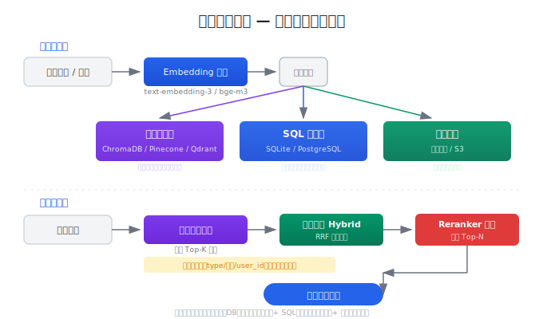
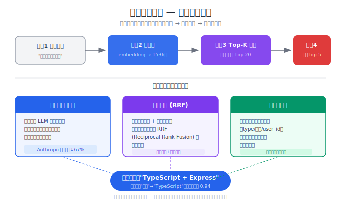

# 记忆存储与检索

> 长期记忆的核心挑战不是"怎么存"，而是"怎么取"。向量数据库、SQL、文件各有优劣，选对存储后端和检索策略，决定了 Agent 能不能在 1000 条记忆中精准找到那 1 条关键信息。

## 目录

- [存储后端选型](#存储后端选型)
- [向量数据库：语义检索的主力](#向量数据库语义检索的主力)
- [SQL 与文件：结构化记忆的补充](#sql-与文件结构化记忆的补充)
- [检索策略：从"能找到"到"找得准"](#检索策略从能找到到找得准)
- [记忆的生命周期管理](#记忆的生命周期管理)
- [总结](#总结)
- [参考链接](#参考链接)

你好，我是江小湖。在 [Agent 记忆三层模型](./01-memory-layers.md) 中，你了解了短期、工作、长期三层记忆的分工。但长期记忆有一个关键问题没有展开：**记忆存在哪里？怎么在需要的时候准确地取出来？** 这篇文章解决核心问题：**存储后端的选型、向量检索的原理、以及如何让记忆检索的准确率从"能用"提升到"可靠"**。

## 存储后端选型

长期记忆有三种主流存储后端，每种适合不同类型的信息：

| 后端 | 适合存储 | 检索方式 | 延迟 | 运维成本 | 代表产品 |
|------|---------|---------|------|---------|---------|
| **向量数据库** | 非结构化文本（对话摘要、事实描述） | 语义相似度 | 10-50ms | 中 | ChromaDB、Pinecone、Qdrant |
| **SQL 数据库** | 结构化数据（用户属性、配置项） | 精确查询 | 1-10ms | 低 | PostgreSQL、SQLite |
| **文件系统** | 大文档（完整对话记录、Markdown 笔记） | 全文搜索 / 路径访问 | 50-200ms | 最低 | 本地文件、S3 |

**选型原则**：不是三选一，而是**组合使用**。

```
用户说"我上次提到的那个数据库问题"

1. 向量检索：搜索语义匹配 → 找到"6月10日讨论了 PostgreSQL 连接池问题"
2. SQL 查询：获取该事件的元数据 → 时间、标签、关联文件路径
3. 文件读取：加载完整的对话记录或笔记
```

**对大多数 Agent 应用**：向量数据库做语义检索 + SQLite 做元数据存储，就够用了。不需要上 Pinecone 或 Qdrant 的分布式集群。

## 向量数据库：语义检索的主力

向量数据库的核心思路：**把文本转化为高维向量，用向量之间的余弦距离衡量语义相似度**。

```python
# 文本 → 向量（Embedding）
from openai import OpenAI
client = OpenAI()

def embed(text: str) -> list[float]:
    """将文本转化为 1536 维向量"""
    response = client.embeddings.create(
        model="text-embedding-3-small",
        input=text
    )
    return response.data[0].embedding

# 存储记忆时：文本 + 向量一起存
memory_text = "用户的项目使用 TypeScript + Express，部署在 AWS"
memory_vector = embed(memory_text)
vector_db.upsert(id="mem_001", text=memory_text, vector=memory_vector)

# 检索记忆时：查询文本也转向量，找最近的 K 条
query = "用户用什么语言开发？"
query_vector = embed(query)
results = vector_db.search(query_vector, top_k=3)
# → 返回 "用户的项目使用 TypeScript + Express..."（余弦相似度 0.89）
```

### 为什么向量检索比关键词搜索好

传统关键词搜索靠文本匹配——"TypeScript"必须出现在文档中才能命中。向量检索靠语义——用户问"用什么语言开发"，即使记忆中没有"语言"这个词，向量空间里"语言"和"TypeScript"是相近的概念。

| 查询 | 关键词搜索 | 向量检索 |
|------|-----------|---------|
| "用户用什么语言" | ❌ 记忆中没有"语言" | ✅ "TypeScript + Express"语义匹配 |
| "数据库出了问题" | ✅ 命中"数据库" | ✅ "PostgreSQL 连接池"语义更精准 |
| "上次他说的偏好" | ❌ "偏好"太泛 | ✅ 按上下文语义匹配到具体偏好描述 |

### 轻量级方案：ChromaDB

对于个人项目或小型 Agent，ChromaDB 是最佳起步——零配置、纯 Python、本地运行：

```python
import chromadb

# 初始化（数据自动持久化到本地文件）
client = chromadb.PersistentClient(path="./memory_db")
collection = client.get_or_create_collection(
    name="agent_memory",
    metadata={"description": "Agent 的长期记忆存储"}
)

# 存储记忆
collection.add(
    ids=["mem_001"],
    documents=["用户偏好函数式编程风格，不喜欢 class 语法"],
    metadatas=[{"type": "preference", "created_at": "2026-06-18"}]
)

# 检索记忆
results = collection.query(
    query_texts=["用户喜欢什么编程范式"],
    n_results=3
)
print(results["documents"][0])
# → ["用户偏好函数式编程风格，不喜欢 class 语法"]
```

### Embedding 模型选择

Embedding 模型决定了向量检索的质量。2026 年主流选择：

| 模型 | 维度 | 价格 | 质量 | 适合场景 |
|------|------|------|------|---------|
| `text-embedding-3-small` (OpenAI) | 1536 | $0.02/1M tokens | 好 | 通用场景，性价比最优 |
| `text-embedding-3-large` (OpenAI) | 3072 | $0.13/1M tokens | 最优 | 高精度需求 |
| `bge-m3` (BAAI, 开源) | 1024 | 免费 | 好 | 本地部署、中文优化 |
| `nomic-embed-text` (Nomic, 开源) | 768 | 免费 | 中 | 资源受限环境 |

**中文场景建议**：`bge-m3` 对中文的语义理解优于 OpenAI 的模型，且免费可本地运行。英文为主的场景用 `text-embedding-3-small` 性价比最高。

## SQL 与文件：结构化记忆的补充

向量数据库擅长"模糊语义检索"，但不擅长精确查询。当你知道要查什么（比如"用户的邮箱"），SQL 比向量检索更直接。

```python
import sqlite3

# 用户档案：结构化信息用 SQL
conn = sqlite3.connect("agent_memory.db")
conn.execute("""
    CREATE TABLE IF NOT EXISTS user_profile (
        user_id TEXT PRIMARY KEY,
        name TEXT,
        role TEXT,
        languages TEXT,  -- JSON 数组
        preferences TEXT, -- JSON 对象
        updated_at TIMESTAMP DEFAULT CURRENT_TIMESTAMP
    )
""")

# 精确查询：用户用什么语言？
cursor = conn.execute(
    "SELECT languages FROM user_profile WHERE user_id = ?", 
    (user_id,)
)
# → '["TypeScript", "Python"]'
```

**文件存储**适合大文本（完整的对话记录、Markdown 笔记），按日期或主题组织：

```
memory/
├── user_profiles/
│   └── user_123.json        # 用户档案
├── conversations/
│   ├── 2026-06-15.md        # 当天的对话摘要
│   └── 2026-06-18.md
└── facts/
    └── project_stack.md     # 项目技术栈（持续更新）
```

### 组合架构示例

```python
class MemorySystem:
    """组合式记忆系统：向量 + SQL + 文件"""
    
    def __init__(self):
        self.vector_db = chromadb.PersistentClient(path="./memory_db")
        self.sql_db = sqlite3.connect("agent_memory.db")
        self.file_store = Path("./memory_files")
    
    def store_memory(self, text: str, memory_type: str, metadata: dict):
        """存储记忆：向量 + 元数据同时写入"""
        # 向量库：存文本，用于语义检索
        self.vector_db.get_collection("memories").add(
            ids=[generate_id(text)],
            documents=[text],
            metadatas=[{"type": memory_type, **metadata}]
        )
        # SQL：存元数据，用于精确查询
        self.sql_db.execute(
            "INSERT INTO memory_log (text, type, created_at) VALUES (?, ?, ?)",
            (text[:200], memory_type, datetime.now())
        )
    
    def retrieve(self, query: str, top_k: int = 5) -> list:
        """检索：向量语义搜索 + 元数据过滤"""
        results = self.vector_db.get_collection("memories").query(
            query_texts=[query],
            n_results=top_k
        )
        return [
            {"text": doc, "metadata": meta}
            for doc, meta in zip(results["documents"][0], results["metadatas"][0])
        ]
```

<p align="center">
  
  <br/>
  <em>图：组合式存储架构 — 向量DB + SQL + 文件系统的写入与检索流水线</em>
</p>

## 检索策略：从"能找到"到"找得准"

向量检索返回 Top-K 结果，但默认的检索质量往往不够用。以下是三种提升准确率的策略：

### 1. 上下文增强检索（Contextual Retrieval）

Anthropic 在 2024 年提出的方法：在存储每条记忆时，用 LLM 为其添加一段上下文说明，让检索时的语义匹配更精准。

```python
def store_with_context(self, memory: str, conversation_context: str):
    """存储记忆前，用 LLM 增强其上下文"""
    # 让 LLM 为记忆添加上下文说明
    enhanced = llm.generate(f"""
    原始记忆：{memory}
    对话上下文：{conversation_context}
    
    请用一句话说明这条记忆的完整含义（包含必要的上下文）：
    """)
    # 例：原始 "数据库用 PostgreSQL"
    # → 增强 "用户张三的项目使用 PostgreSQL 16 作为主数据库，部署在 AWS us-east-1"
    
    self.store_memory(enhanced, "fact", {"original": memory})
```

**效果**：Anthropic 的测试显示，上下文增强后检索失败率降低了 67%。代价是每条记忆存储时多一次 LLM 调用（约 $0.001/条）。

### 2. 混合检索（Hybrid Search）

将向量语义检索和关键词精确搜索结合，用 **RRF（Reciprocal Rank Fusion）** 融合结果：

```python
def hybrid_search(self, query: str, top_k: int = 5) -> list:
    """混合检索：向量 + 关键词，RRF 融合"""
    # 向量检索
    vector_results = self.vector_db.query(query_texts=[query], n_results=top_k * 2)
    
    # 关键词检索（BM25 或简单全文搜索）
    keyword_results = self.bm25_search(query, top_k=top_k * 2)
    
    # RRF 融合：排名越靠前，得分越高
    scores = {}
    for rank, result in enumerate(vector_results):
        scores[result["id"]] = scores.get(result["id"], 0) + 1.0 / (rank + 60)
    for rank, result in enumerate(keyword_results):
        scores[result["id"]] = scores.get(result["id"], 0) + 1.0 / (rank + 60)
    
    # 按融合得分排序，返回 Top-K
    sorted_ids = sorted(scores, key=scores.get, reverse=True)[:top_k]
    return [self.get_by_id(id) for id in sorted_ids]
```

**什么时候用混合检索**：当记忆中包含大量技术术语（如函数名、API 路径）时，纯语义检索容易漏掉精确匹配。混合检索兼顾两者。

### 3. 元数据过滤

在向量检索前先用元数据缩小范围，减少噪声干扰：

```python
# 只搜索特定类型、特定时间段的记忆
results = collection.query(
    query_texts=["用户的数据库配置"],
    n_results=5,
    where={
        "$and": [
            {"type": {"$eq": "fact"}},
            {"created_at": {"$gte": "2026-06-01"}}
        ]
    }
)
```

<p align="center">
  
  <br/>
  <em>图：检索四步流程 + 三种精度提升策略（上下文增强/混合检索/元数据过滤）</em>
</p>

## 记忆的生命周期管理

记忆不是"越多越好"。存了 10000 条记忆，检索时噪声增大、延迟上升、成本增加。你需要一套生命周期管理策略：

### 写入策略：什么值得记住

```python
def should_store(self, conversation: list) -> list:
    """判断对话中哪些信息值得写入长期记忆"""
    # 用 LLM 从对话中提取有价值的信息
    extractable = llm.generate(f"""
    从以下对话中提取值得长期记住的信息（用户偏好、事实、重要决策）。
    不要提取临时的技术问题或一次性请求。
    
    对话：{format_conversation(conversation)}
    
    返回 JSON 数组，每项包含 content（内容）和 type（类型）：
    """)
    return json.loads(extractable)
```

### 更新策略：去重与合并

```python
def store_or_update(self, new_memory: str):
    """存储前检查是否已有相似记忆，有则更新"""
    existing = self.vector_db.query(
        query_texts=[new_memory],
        n_results=1
    )
    
    if existing and existing["distances"][0][0] < 0.1:  # 非常相似
        # 更新而非新增
        old_id = existing["ids"][0][0]
        merged = llm.generate(f"合并这两条记忆为一条：\n旧：{existing['documents'][0][0]}\n新：{new_memory}")
        self.vector_db.update(ids=[old_id], documents=[merged])
    else:
        self.vector_db.add(ids=[generate_id(new_memory)], documents=[new_memory])
```

### 遗忘策略：衰减与清理

```python
def cleanup_old_memories(self, max_age_days: int = 90, min_access: int = 2):
    """清理长期未访问的记忆"""
    old_memories = self.sql_db.execute("""
        SELECT id FROM memory_log 
        WHERE created_at < ? AND access_count < ?
    """, (datetime.now() - timedelta(days=max_age_days), min_access))
    
    for row in old_memories:
        self.vector_db.delete(ids=[row[0]])
        self.sql_db.execute("DELETE FROM memory_log WHERE id = ?", (row[0],))
```

**遗忘不是缺陷，是特性**。人类大脑会自动遗忘不重要的信息来保持高效——Agent 的记忆系统也应该如此。一条 90 天前只被访问过 1 次的记忆，大概率已经过时了。

## 总结

- **三种存储后端组合使用**：向量数据库做语义检索（主力）、SQL 做结构化查询（补充）、文件存大文本（归档）。小项目用 ChromaDB + SQLite 就够了。
- **向量检索优于关键词搜索**：语义匹配能理解"语言"="TypeScript"，关键词搜索不行。Embedding 模型选 `text-embedding-3-small`（英文）或 `bge-m3`（中文）。
- **三种策略提升检索准确率**：上下文增强（Anthropic 实测降低 67% 失败率）、混合检索（语义+关键词 RRF 融合）、元数据过滤（先缩小范围再语义搜索）。
- **记忆需要生命周期管理**：写入时判断"值不值得记"，存储时检查去重，定期清理过期记忆。记忆不是越多越好。
- **先简单后复杂**：从零成本的短期记忆开始，按需引入工作记忆和长期记忆。不要第一天就上分布式向量数据库。

> 了解了记忆的存储和检索机制，下一步是实战：**从零构建一个带记忆的 Agent，把三层记忆、存储后端、检索策略全部落地**。请继续阅读 [跨会话记忆实践](./03-cross-session-memory.md)。

## 参考链接

- [Anthropic — Contextual Retrieval](https://www.anthropic.com/news/contextual-retrieval)
- [ChromaDB Documentation](https://docs.trychroma.com/)
- [OpenAI Embeddings Guide](https://platform.openai.com/docs/guides/embeddings)
- [BGE-M3 — Multilingual Embedding Model](https://huggingface.co/BAAI/bge-m3)
- [Qdrant — Vector Database](https://qdrant.tech/)
- [Reciprocal Rank Fusion — Wikipedia](https://en.wikipedia.org/wiki/Learning_to_rank#Reciprocal_rank_fusion)
