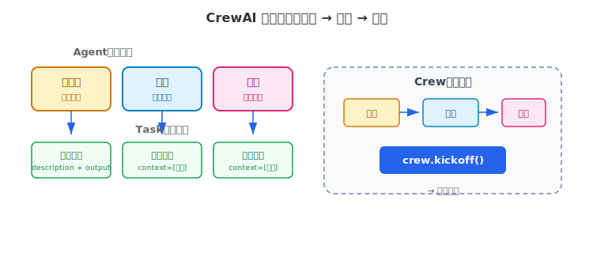
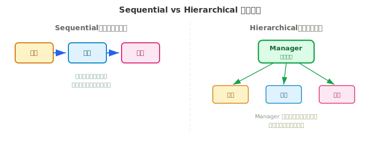

# CrewAI 详解

> 用角色扮演的方式组织多个 Agent 协作——定义角色、分配任务、组建团队，让不同专长的 Agent 各司其职完成复杂任务。

## 目录

- [为什么需要多 Agent 协作](#为什么需要多-agent-协作)
- [核心概念](#核心概念)
  - [Agent：角色定义](#agent角色定义)
  - [Task：任务描述](#task任务描述)
  - [Crew：团队组装](#crew团队组装)
- [执行模式](#执行模式)
  - [Sequential：顺序流水线](#sequential顺序流水线)
  - [Hierarchical：层级委派](#hierarchical层级委派)
- [工具集成](#工具集成)
- [构建一个内容创作团队](#构建一个内容创作团队)
- [CrewAI 与 LangGraph](#crewai-与-langgraph)
- [总结](#总结)
- [参考链接](#参考链接)

你好，我是江小湖。前面两篇我们深入了 LangGraph——用状态图精确控制单个 Agent 的流程。但有些任务天然适合多人协作：研究员搜集资料、作家撰写文章、编辑审核质量。一个人干不如一个团队干。

CrewAI 就是为这种场景设计的。它用"角色扮演"的方式定义多个 Agent，让它们按各自的角色和专长协作完成任务。当前版本 1.14.7，读完本文你将能用 CrewAI 组建一个多 Agent 协作团队。

## 为什么需要多 Agent 协作

单个 Agent 处理简单任务没问题——调用工具、生成回答、返回结果。但当任务变得复杂时，单 Agent 会遇到瓶颈：

**上下文过载**。一个 Agent 同时承担研究、写作、审核三种角色，System Prompt 会变得臃肿，LLM 的注意力被分散，每个角色都做不好。

**缺乏专业化**。让同一个 Agent 既搜集数据又分析数据，不如让一个专门的"研究员"搜集、一个专门的"分析师"分析——各自的 Prompt 更聚焦，输出质量更高。

**无法并行**。单 Agent 只能顺序执行，而多 Agent 可以同时工作——研究员和分析师并行作业，最后汇总结果。

CrewAI 的解决思路很直接：**把复杂任务拆成多个角色，每个角色由一个专门的 Agent 扮演，它们组成团队（Crew）协作完成任务**。

## 核心概念

CrewAI 围绕三个核心概念构建：**Agent**（角色）、**Task**（任务）、**Crew**（团队）。

<p align="center">
  
  <br/>
  <em>CrewAI 协作模式：角色 → 任务 → 团队</em>
</p>

### Agent：角色定义

Agent 是团队中的一个成员，通过三个属性定义其角色：

```python
from crewai import Agent

researcher = Agent(
    role="AI 技术研究员",          # 角色：你是做什么的
    goal="搜集最新 AI 技术动态",     # 目标：你要达成什么
    backstory="你是一位资深技术研究员，擅长追踪前沿论文和行业报告。",
    verbose=True,                   # 输出详细执行过程
    llm="openai/gpt-4o",            # 使用的模型
)
```

三个核心属性的作用：

- **`role`**：Agent 的身份标签。影响 LLM 理解自己的职责范围
- **`goal`**：Agent 的工作目标。决定 Agent 在执行时关注什么
- **`backstory`**：Agent 的背景故事。提供更丰富的上下文，影响 Agent 的表达风格和专业深度

**设计原则**：`role` 要简洁（一个职位名称），`goal` 要具体（可衡量的目标），`backstory` 要提供专业上下文（几年经验、擅长什么）。模糊的角色定义会导致模糊的输出。

### Task：任务描述

Task 定义了 Agent 需要完成的具体工作：

```python
from crewai import Task

research_task = Task(
    description="调研 2026 年 AI Agent 领域的三大技术突破，每个突破提供具体案例。",
    expected_output="一份包含三大突破的结构化报告，每个突破有标题、描述和案例。",
    agent=researcher,               # 指派给哪个 Agent
)
```

**`description`** 告诉 Agent 要做什么，**`expected_output`** 告诉 Agent 输出应该长什么样。两者都很重要：`description` 不明确，Agent 不知道该做什么；`expected_output` 不明确，Agent 的输出格式和质量无法控制。

Task 还支持 **`context`** 参数——把其他 Task 的输出作为当前 Task 的输入：

```python
writing_task = Task(
    description="基于研究报告，撰写一篇公众号文章。",
    expected_output="一篇 1500 字的技术科普文章。",
    agent=writer,
    context=[research_task],        # 依赖 research_task 的输出
)
```

### Crew：团队组装

Crew 把 Agent 和 Task 组合在一起，定义团队的执行方式：

```python
from crewai import Crew, Process

crew = Crew(
    agents=[researcher, writer, editor],
    tasks=[research_task, writing_task, review_task],
    process=Process.sequential,     # 执行模式
    verbose=True,
)

# 启动团队
result = crew.kickoff()
print(result)
```

`process` 参数决定任务的执行顺序，有两种模式：**Sequential**（顺序执行）和 **Hierarchical**（层级委派），下一节详解。

## 执行模式

<p align="center">
  
  <br/>
  <em>Sequential 顺序流水线 vs Hierarchical 层级委派</em>
</p>

### Sequential：顺序流水线

**Sequential 模式下，Task 按列表顺序依次执行**，每个 Task 的输出自动传递给下一个 Task：

```
Task 1（研究员）→ Task 2（作家）→ Task 3（编辑）→ 最终输出
```

```python
crew = Crew(
    agents=[researcher, writer, editor],
    tasks=[research_task, writing_task, review_task],
    process=Process.sequential,
)
```

适合**流水线式**的工作流：前一步的输出是后一步的输入，角色之间是上下游关系。典型场景：研究 → 写作 → 审核、数据采集 → 分析 → 报告生成。

### Hierarchical：层级委派

**Hierarchical 模式下，一个 Manager Agent 负责分配和协调任务**。它根据每个 Agent 的角色决定谁来做哪件事，类似公司里的团队主管：

```python
crew = Crew(
    agents=[researcher, writer, editor],
    tasks=[research_task, writing_task, review_task],
    process=Process.hierarchical,
    manager_llm="openai/gpt-4o",    # Manager 使用的模型
)
```

Manager Agent 会：

1. 分析所有 Task 的要求
2. 根据每个 Agent 的角色匹配最合适的执行者
3. 委派任务并收集结果
4. 判断是否需要补充或修正

适合**任务之间有依赖但顺序不固定**的场景：Manager 根据实际情况动态调度，而不是机械地按列表顺序执行。

**选型建议**：流程固定的工作流用 Sequential，需要灵活调度的复杂任务用 Hierarchical。

## 工具集成

CrewAI 支持给 Agent 分配工具，让 Agent 能执行搜索、读写文件等操作。

### 内置工具

安装工具包后，可以直接使用一系列预置工具：

```bash
pip install 'crewai[tools]'
```

```python
from crewai_tools import SerperDevTool, FileReadTool, WebsiteSearchTool

# 网络搜索
search_tool = SerperDevTool()

# 读取文件
file_tool = FileReadTool()

# 搜索网站内容
web_tool = WebsiteSearchTool()

# 分配给 Agent
researcher = Agent(
    role="研究员",
    goal="搜集最新技术资料",
    backstory="你是一位资深技术研究员。",
    tools=[search_tool, web_tool],  # Agent 可以使用的工具
)
```

内置工具自带错误处理和缓存机制——相同的查询不会重复执行。

### 自定义工具

用 `@tool` 装饰器可以快速创建自定义工具：

```python
from crewai.tools import tool

@tool("字数统计")
def word_count(text: str) -> int:
    """统计文本字数"""
    return len(text)

# 分配给 Agent
editor = Agent(
    role="编辑",
    tools=[word_count],
)
```

对于更复杂的工具，可以继承 `BaseTool` 类：

```python
from crewai.tools import BaseTool

class DatabaseQueryTool(BaseTool):
    name: str = "数据库查询"
    description: str = "执行 SQL 查询并返回结果"

    def _run(self, query: str) -> str:
        # 执行查询逻辑
        return f"查询结果：{query}"
```

## 构建一个内容创作团队

把前面的概念组合起来，构建一个三角色的内容创作团队：研究员搜集资料、作家撰写文章、编辑审核质量。

先定义三个 Agent：

```python
from crewai import Agent, Task, Crew, Process

researcher = Agent(
    role="技术研究员",
    goal="搜集 AI Agent 领域的最新技术动态和案例",
    backstory="你是一位有 5 年经验的技术研究员，擅长追踪论文和行业报告。",
    tools=[SerperDevTool()],
    llm="openai/gpt-4o",
)

writer = Agent(
    role="技术作家",
    goal="将技术信息转化为通俗易懂的科普文章",
    backstory="你是一位专业科技作者，文风亲切，擅长用类比解释复杂概念。",
    llm="openai/gpt-4o",
)

editor = Agent(
    role="内容编辑",
    goal="确保文章质量：事实准确、逻辑清晰、无错别字",
    backstory="你是一位严谨的内容编辑，有 10 年审稿经验。",
    llm="openai/gpt-4o",
)
```

接下来定义三个 Task，用 `context` 建立依赖关系：

```python
research_task = Task(
    description="调研 AI Agent 框架的最新发展，重点关注 LangGraph 和 CrewAI 的对比。",
    expected_output="一份包含关键对比点的研究报告（500 字以内）。",
    agent=researcher,
)

writing_task = Task(
    description="基于研究报告，撰写一篇面向开发者的技术科普文章。",
    expected_output="一篇 1200 字的文章，包含引言、对比分析和结论。",
    agent=writer,
    context=[research_task],
)

review_task = Task(
    description="审核文章：检查事实准确性、逻辑连贯性、语言质量。",
    expected_output="审核后的终稿 + 修改说明（列出改了什么、为什么改）。",
    agent=editor,
    context=[writing_task],
)
```

最后组装 Crew 并运行：

```python
crew = Crew(
    agents=[researcher, writer, editor],
    tasks=[research_task, writing_task, review_task],
    process=Process.sequential,
    verbose=True,
)

result = crew.kickoff()
print(result)
```

**执行流程**：研究员先搜集资料 → 作家基于资料写文章 → 编辑审核并修改。每个环节的输入是上一个环节的输出，`context` 参数自动处理了这个传递过程。

## CrewAI 与 LangGraph

两个框架解决不同的问题，经常可以互补：

| 维度 | CrewAI | LangGraph |
|------|--------|-----------|
| **核心抽象** | 角色 + 任务 + 团队 | 状态 + 节点 + 边 |
| **设计视角** | 团队协作（谁做什么） | 流程控制（先做什么后做什么） |
| **上手难度** | 低（定义角色即可） | 中（需要理解状态图） |
| **流程控制** | 有限（顺序或层级） | 精细（条件分支、循环、并行） |
| **持久化** | 有限 | 原生支持（Checkpoint） |
| **HITL** | 有限 | 原生支持（interrupt） |
| **多 Agent** | 原生支持 | 支持但需手动编排 |

**什么时候用 CrewAI**：

- 任务可以自然拆分为多个角色
- 流程是线性的或层级式的
- 快速原型，不想写太多代码
- 需要 Agent 之间自然协作（而不是手动编排消息传递）

**什么时候用 LangGraph**：

- 流程有复杂的分支和循环
- 需要中断恢复和人类审批
- 对执行流程需要精确控制
- 需要状态持久化和可观测性

**组合使用**：CrewAI 管理"谁做什么"，LangGraph 管理"怎么流转"。比如用 CrewAI 定义角色团队，用 LangGraph 编排这些团队之间的协作流程。

## 总结

- **CrewAI 的核心思路**：把复杂任务拆成多个角色（Agent），每个角色承担一个任务（Task），组成团队（Crew）协作
- **三件套**：Agent 定义角色（role/goal/backstory），Task 定义工作（description/expected_output），Crew 定义团队（agents/tasks/process）
- **两种执行模式**：Sequential 按顺序执行，Hierarchical 由 Manager Agent 动态调度
- **工具集成**：内置搜索、文件读写等工具，支持 `@tool` 快速自定义
- **与 LangGraph 的关系**：CrewAI 管"谁做什么"，LangGraph 管"怎么流转"，可以组合使用
- **适合场景**：多角色协作、流水线式工作流、快速原型

> 本章介绍了 Agent 框架的选型和使用。接下来请阅读 [10 — 扩展协议与标准](../10-protocols/README.md)，了解 Agent 生态的连接标准。

## 参考链接

- [CrewAI 官方文档](https://docs.crewai.com/) — 核心概念、API 参考和教程
- [CrewAI GitHub](https://github.com/crewAIInc/crewAI) — 源码、示例和社区
- [CrewAI Tools](https://docs.crewai.com/concepts/tools) — 内置工具和自定义工具指南
- [Building Effective Agents](https://www.anthropic.com/engineering/building-effective-agents) — Anthropic 的 Agent 设计模式参考
