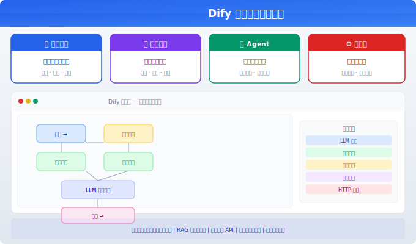

# Dify 详解

> Dify 是国内最火的低代码 AI 应用平台——用可视化界面构建 Agent、RAG 知识库和工作流，零代码门槛，支持国产模型。

## 目录

- [Dify 是什么](#dify-是什么)
- [核心概念](#核心概念)
- [工作流编排](#工作流编排)
- [RAG 知识库](#rag-知识库)
- [API 集成](#api-集成)
- [支持的模型](#支持的模型)
- [Dify vs 代码框架](#dify-vs-代码框架)
- [总结](#总结)
- [参考链接](#参考链接)

你好，我是江小湖。前面几篇我们学了 LangChain、LangGraph、CrewAI 这些代码框架。但不是所有团队都有开发能力——产品经理想自己搭个 AI 问答机器人，运营想快速做个内容生成工具，这时候就需要 Dify 这样的低代码平台。

读完本文，你将理解 Dify 的核心概念、能够用 Dify 搭建一个 AI 应用、知道什么时候选 Dify、什么时候选代码框架。

## Dify 是什么

Dify 是一个开源的 AI 应用开发平台，提供可视化的界面来构建基于 LLM 的应用。它的核心理念是**让非技术人员也能搭建 AI 应用**，同时提供足够的灵活性让技术人员深度定制。

### 平台组成

| 组件 | 说明 |
|------|------|
| **可视化工作流** | 拖拽式构建 AI 工作流 |
| **RAG 引擎** | 内置知识库管理，支持多种文档格式 |
| **Prompt 管理** | 可视化编辑和管理 Prompt 模板 |
| **模型管理** | 统一接口对接多家模型提供商 |
| **API 发布** | 一键将应用发布为 API |
| **监控面板** | 查看调用量、成本、日志 |

### 部署方式

| 方式 | 说明 |
|------|------|
| **Dify Cloud** | 官方托管，注册即用，适合快速验证 |
| **社区版** | 开源自部署，适合内部使用 |
| **企业版** | 商业版本，支持私有化部署、安全审计 |

部署社区版：

```bash
git clone https://github.com/langgenius/dify.git
cd dify/docker
cp .env.example .env
docker compose up -d
```

启动后访问 `http://localhost/install` 完成初始化。

## 核心概念

### 应用类型

Dify 支持四种应用类型：

| 类型 | 说明 | 适用场景 |
|------|------|----------|
| **聊天助手** | 多轮对话的聊天机器人 | 客服、问答 |
| **文本生成** | 单次文本生成任务 | 文案、翻译、摘要 |
| **Agent** | 基于工具调用的自主 Agent | 需要调用外部工具的任务 |
| **工作流** | 多步骤编排的复杂流程 | 业务流程自动化 |

### 关键组件

| 组件 | 说明 |
|------|------|
| **模型** | LLM 提供商配置（OpenAI、通义千问、智谱等） |
| **Prompt 模板** | 定义 AI 的行为和输出格式 |
| **上下文** | 知识库检索结果的注入 |
| **工具** | 外部 API 调用（内置 50+ 工具） |
| **变量** | 在工作流中传递的数据 |

<p align="center"><br/><em>图：Dify 四种应用类型与工作台界面示意</em></p>

## 工作流编排

Dify 的核心能力是**可视化工作流**——用拖拽的方式构建多步骤的 AI 流程。

<div align="center">

</div>

### 节点类型

| 节点 | 功能 |
|------|------|
| **开始** | 定义输入变量 |
| **LLM** | 调用大模型生成内容 |
| **知识检索** | 从知识库中检索相关文档 |
| **问题分类** | 根据用户输入分类路由 |
| **条件分支** | if-else 逻辑判断 |
| **变量赋值** | 设置变量值 |
| **代码执行** | 运行 Python/JS 代码 |
| **HTTP 请求** | 调用外部 API |
| **迭代** | 循环处理列表数据 |
| **结束** | 定义输出 |

### 构建一个客服工作流

```
开始 → 问题分类（售后/咨询/投诉）
         ├── 售后 → 知识检索（售后文档）→ LLM（生成回答）→ 结束
         ├── 咨询 → 知识检索（产品文档）→ LLM（生成回答）→ 结束
         └── 投诉 → LLM（安抚情绪 + 记录工单）→ HTTP（创建工单）→ 结束
```

在界面上：

1. 拖入"问题分类"节点，配置分类规则
2. 为每个分支拖入"知识检索"节点，关联对应的知识库
3. 为每个分支拖入"LLM"节点，配置 Prompt
4. 连接节点，定义流转逻辑
5. 点击"发布"，即可通过 API 调用

### 代码节点

当可视化节点不够用时，可以用代码节点嵌入自定义逻辑：

```python
# 代码节点示例：提取关键词
import re

def main(query: str) -> dict:
    # 简单的关键词提取
    keywords = re.findall(r'[\u4e00-\u9fa5a-zA-Z]+', query)
    return {"keywords": keywords[:5]}
```

代码节点支持 Python 和 JavaScript，可以调用外部库，处理复杂的数据转换。

## RAG 知识库

Dify 内置了完整的 RAG 引擎，不需要写代码就能搭建知识库问答系统。

### 创建知识库

1. 上传文档（支持 PDF、Word、Markdown、TXT、网页等）
2. 选择切分策略（自动/手动）
3. 选择 Embedding 模型
4. 等待索引完成

### 切分策略

| 策略 | 说明 |
|------|------|
| **自动** | Dify 自动选择切分方式 |
| **自定义** | 手动设置分隔符、chunk 大小、重叠量 |
| **父子关系** | 保留文档的层级结构 |

### 检索模式

| 模式 | 说明 |
|------|------|
| **向量检索** | 基于语义相似度 |
| **全文检索** | 基于关键词匹配 |
| **混合检索** | 向量 + 全文，效果最好 |
| **多路召回** | 多种检索策略并行，合并结果 |

### 知识库与工作流集成

在工作流中添加"知识检索"节点，选择知识库，检索结果会自动注入到后续的 LLM 节点中。

## API 集成

Dify 的应用发布后，可以通过 API 调用：

```python
import requests

# 聊天助手 API
response = requests.post(
    "https://api.dify.ai/v1/chat-messages",
    headers={
        "Authorization": "Bearer YOUR_API_KEY",
        "Content-Type": "application/json",
    },
    json={
        "inputs": {},
        "query": "什么是 RAG？",
        "response_mode": "blocking",
        "user": "user-123",
    },
)

print(response.json()["answer"])
```

### 流式输出

```python
response = requests.post(
    "https://api.dify.ai/v1/chat-messages",
    headers={...},
    json={
        "query": "什么是 RAG？",
        "response_mode": "streaming",  # 流式
        "user": "user-123",
    },
    stream=True,
)

for line in response.iter_lines():
    if line:
        print(line.decode())
```

### 集成到现有系统

Dify 的 API 可以集成到任何系统中：

- **Web 前端**：嵌入聊天组件
- **企业微信/钉钉**：通过 Webhook 对接
- **内部系统**：调用 API 实现 AI 功能

## 支持的模型

Dify 支持几乎所有主流模型提供商：

| 提供商 | 模型 |
|--------|------|
| OpenAI | GPT-4o, GPT-4, GPT-3.5 |
| Azure OpenAI | 同上 |
| 通义千问 | Qwen-Max, Qwen-Plus |
| 智谱 AI | GLM-4, GLM-3 |
| 百度文心 | ERNIE-4, ERNIE-3.5 |
| Anthropic | Claude 3.5, Claude 3 |
| Google | Gemini Pro, Gemini Ultra |
| 本地模型 | Ollama, vLLM |

**国产模型支持**：这是 Dify 相比 LangChain/CrewAI 的一大优势——开箱即用支持通义千问、智谱、文心等国产模型，不需要写适配代码。

## Dify vs 代码框架

| 维度 | Dify | LangChain/LangGraph |
|------|------|---------------------|
| **开发方式** | 可视化拖拽 | 代码编写 |
| **学习曲线** | 极低（小时级上手） | 中等（天级上手） |
| **灵活性** | 中等（受限于节点类型） | 非常高（任意定制） |
| **多 Agent** | 有限支持 | 原生支持 |
| **HITL** | 支持 | 原生支持 |
| **国产模型** | 开箱即用 | 需要适配 |
| **RAG** | 内置，零配置 | 需要自己搭建 |
| **API 发布** | 一键发布 | 需要自己封装 |
| **团队协作** | 多人协作编辑 | 代码版本控制 |
| **生产就绪度** | 高 | 高 |

### 什么时候选 Dify

- **非技术团队**：产品经理、运营想自己搭建 AI 应用
- **快速验证**：需要在几小时内验证一个想法
- **国产模型**：团队主要用通义千问、智谱等国产模型
- **RAG 问答**：需求是简单的知识库问答，不需要复杂流程
- **内部工具**：给公司内部用的 AI 工具，不需要复杂定制

### 什么时候不用 Dify

- **复杂 Agent**：需要多 Agent 协作、复杂状态管理
- **深度定制**：需要自定义执行流程、特殊并发模型
- **极致性能**：对延迟和吞吐量有极致要求
- **完全控制**：需要控制每一个执行细节

**经验法则**：如果你的 AI 应用能在 Dify 的工作流节点类型内实现，用 Dify 更快。如果需要超出节点类型的能力，用代码框架。

## 总结

- **Dify** 是国内最火的低代码 AI 应用平台，零代码门槛，支持国产模型
- **核心能力**：可视化工作流、RAG 知识库、Prompt 管理、API 发布
- **应用类型**：聊天助手、文本生成、Agent、工作流
- **优势**：国产模型开箱即用、RAG 零配置、一键发布 API
- **适用场景**：非技术团队、快速验证、国产模型、简单 RAG 问答
- **不适用**：复杂 Agent、深度定制、极致性能

> 下一篇，我们将介绍 OpenAI Agents SDK 和 Google ADK——两个厂商各自的官方 Agent 框架。

## 参考链接

- [Dify Documentation](https://docs.dify.ai/) — Dify 官方文档
- [Dify GitHub](https://github.com/langgenius/dify) — 源码
- [Dify API Reference](https://docs.dify.ai/guides/application-publishing/developing-with-apis) — API 文档
- [Dify Community](https://community.dify.ai/) — 社区论坛
