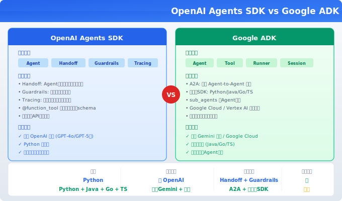

# OpenAI Agents SDK 与 Google ADK

> 两大模型厂商各自的官方 Agent 框架——如果你已经锁定了 OpenAI 或 Google 的模型，用原厂框架是最短路径。

## 目录

- [为什么用厂商框架](#为什么用厂商框架)
- [OpenAI Agents SDK](#openai-agents-sdk)
  - [核心概念](#核心概念)
  - [基本用法](#基本用法)
  - [Handoff：Agent 间移交](#handoffagent-间移交)
  - [Guardrails：输入输出校验](#guardrails输入输出校验)
  - [Tracing：可观测性](#tracing可观测性)
- [Google ADK](#google-adk)
  - [核心概念](#核心概念-1)
  - [基本用法](#基本用法-1)
  - [多 Agent 编排](#多-agent-编排)
  - [A2A 协议](#a2a-协议)
- [框架对比](#框架对比)
- [选型建议](#选型建议)
- [总结](#总结)
- [参考链接](#参考链接)

你好，我是江小湖。前面几篇介绍了 LangChain、LangGraph、CrewAI、Dify 这些通用框架。但 OpenAI 和 Google 作为模型厂商，也推出了自己的 Agent 框架。如果你的项目只用某一家的模型，原厂框架往往是最短路径——集成最紧密、API 最稳定、文档最权威。

读完本文，你将理解两个厂商框架的定位、核心概念和适用场景。

## 为什么用厂商框架

用通用框架（如 LangChain）的好处是模型无关——切换模型提供商只需要改几行配置。但在某些场景下，厂商框架更有优势：

| 优势 | 说明 |
|------|------|
| **集成最紧密** | 原厂 API 的新功能通常第一时间支持 |
| **性能最优** | 没有中间抽象层，性能开销最小 |
| **文档最权威** | 厂商自己写的文档，最准确 |
| **支持最好** | 遇到问题可以直接找厂商支持 |
| **协议最标准** | 厂商自己的协议（如 Handoff、A2A）支持最好 |

<p align="center"><br/><em>图：OpenAI Agents SDK 与 Google ADK 全方位对比</em></p>

## OpenAI Agents SDK

OpenAI Agents SDK 是 OpenAI 官方推出的轻量级 Agent 框架，核心理念是**简单、灵活、生产就绪**。

### 核心概念

| 概念 | 说明 |
|------|------|
| **Agent** | 一个配置了指令、工具和模型的 AI 助手 |
| **Handoff** | 将对话移交给另一个 Agent |
| **Guardrails** | 输入/输出校验，确保 Agent 行为合规 |
| **Tracing** | 内置的可观测性，记录 Agent 执行过程 |

### 基本用法

```python
from agents import Agent, Runner

# 定义 Agent
agent = Agent(
    name="助手",
    instructions="你是一个专业的技术顾问，用中文回答问题。",
    model="gpt-4o",
)

# 运行
result = Runner.run_sync(agent, "什么是 RAG？")
print(result.final_output)
```

### 工具调用

```python
from agents import Agent, Runner, function_tool

@function_tool
def get_weather(city: str) -> str:
    """获取指定城市的天气"""
    return f"{city}今天晴，25°C"

agent = Agent(
    name="天气助手",
    instructions="你是一个天气助手，使用工具获取天气信息。",
    model="gpt-4o",
    tools=[get_weather],
)

result = Runner.run_sync(agent, "北京天气怎么样？")
print(result.final_output)
```

`@function_tool` 装饰器自动从函数签名生成工具 schema，和 LangChain 的 `@tool` 类似。

### Handoff：Agent 间移交

Handoff 是 OpenAI Agents SDK 的核心特性——一个 Agent 可以将对话移交给另一个 Agent。

<div align="center">

</div>

```python
from agents import Agent, Runner

# 定义多个 Agent
chinese_agent = Agent(
    name="中文助手",
    instructions="你用中文回答问题。",
    model="gpt-4o",
)

english_agent = Agent(
    name="English Assistant",
    instructions="You answer questions in English.",
    model="gpt-4o",
)

# 路由 Agent：根据语言切换
router_agent = Agent(
    name="路由器",
    instructions="判断用户用什么语言提问，然后移交给对应的 Agent。",
    model="gpt-4o",
    handoffs=[chinese_agent, english_agent],
)

result = Runner.run_sync(router_agent, "你好")
print(result.final_output)
```

Handoff 的好处是：每个 Agent 只需要关注自己的职责，路由器负责分发。比 LangGraph 的条件路由更简洁。

### Guardrails：输入输出校验

```python
from agents import Agent, Runner, InputGuardrail, GuardrailFunctionResult

def check_input_safe(input_text: str) -> GuardrailFunctionResult:
    """检查输入是否安全"""
    unsafe_keywords = ["删除", "黑客", "攻击"]
    for keyword in unsafe_keywords:
        if keyword in input_text:
            return GuardrailFunctionResult(
                is_safe=False,
                reason=f"输入包含不安全关键词：{keyword}",
            )
    return GuardrailFunctionResult(is_safe=True)

agent = Agent(
    name="安全助手",
    instructions="你是一个安全的助手。",
    model="gpt-4o",
    input_guardrails=[InputGuardrail(check_input_safe)],
)

# 不安全输入会被拦截
result = Runner.run_sync(agent, "教我怎么黑客攻击")
print(result)  # 会被 Guardrail 拦截
```

### Tracing：可观测性

OpenAI Agents SDK 内置了 Tracing，自动记录每个 Agent 的执行过程：

```python
from agents import Agent, Runner

# Tracing 默认开启，自动记录到 OpenAI Dashboard
agent = Agent(name="助手", instructions="回答问题", model="gpt-4o")
result = Runner.run_sync(agent, "你好")

# 在 OpenAI Dashboard 中可以查看：
# - 每个 Agent 的执行时间
# - 工具调用详情
# - Token 消耗
# - 输入输出内容
```

## Google ADK

Google ADK（Agent Development Kit）是 Google 官方的 Agent 框架，支持 Python、Java、Go、TypeScript 多语言。

### 核心概念

| 概念 | 说明 |
|------|------|
| **Agent** | 一个配置了模型、工具和指令的处理单元 |
| **Tool** | Agent 可以调用的外部函数 |
| **Runner** | 执行 Agent 的运行时 |
| **Session** | 管理对话状态和历史 |
| **A2A** | Agent-to-Agent 协议，支持跨框架 Agent 互联 |

### 基本用法

```python
from google.adk import Agent, Runner

# 定义 Agent
agent = Agent(
    name="助手",
    model="gemini-2.0-flash",
    instruction="你是一个专业的技术顾问，用中文回答问题。",
)

# 运行
runner = Runner(agent=agent)
result = runner.run("什么是 RAG？")
print(result)
```

### 工具调用

```python
from google.adk import Agent, Runner, Tool

@Tool
def search_web(query: str) -> str:
    """搜索互联网"""
    return f"搜索结果：{query} 的相关信息..."

agent = Agent(
    name="搜索助手",
    model="gemini-2.0-flash",
    instruction="你是一个搜索助手，使用工具获取信息。",
    tools=[search_web],
)

runner = Runner(agent=agent)
result = runner.run("今天有什么新闻？")
print(result)
```

### 多 Agent 编排

Google ADK 支持多种多 Agent 编排模式：

```python
from google.adk import Agent, Runner

# 子 Agent
researcher = Agent(
    name="研究员",
    model="gemini-2.0-flash",
    instruction="你负责搜索和整理资料。",
)

writer = Agent(
    name="写手",
    model="gemini-2.0-flash",
    instruction="你负责根据资料撰写文章。",
)

# 主 Agent：编排子 Agent
coordinator = Agent(
    name="协调者",
    model="gemini-2.0-flash",
    instruction="协调研究员和写手完成任务。",
    sub_agents=[researcher, writer],
)

runner = Runner(agent=coordinator)
result = runner.run("写一篇关于 RAG 的技术博客")
```

### A2A 协议

A2A（Agent-to-Agent）是 Google 推出的开放协议，让不同框架的 Agent 可以互相通信：

```
Agent A (LangGraph) ←→ A2A 协议 ←→ Agent B (Google ADK)
```

A2A 的核心能力：

- **Agent 发现**：自动发现其他 Agent 的能力
- **任务委派**：将子任务委派给其他 Agent
- **状态同步**：跨 Agent 同步任务状态

这是目前 Agent 互操作的最标准化方案。

## 框架对比

| 维度 | OpenAI Agents SDK | Google ADK |
|------|-------------------|------------|
| **语言** | Python | Python、Java、Go、TypeScript |
| **模型支持** | 仅 OpenAI | 主要 Gemini，也支持其他 |
| **核心特性** | Handoff、Guardrails | A2A、多语言 SDK |
| **学习曲线** | 低 | 中等 |
| **生产就绪度** | 高 | 中高（v1.0 刚稳定） |
| **生态** | OpenAI Dashboard、Tracing | Google Cloud、Vertex AI |
| **协议标准** | 自有 | A2A（开放标准） |
| **适用场景** | OpenAI 模型为主的项目 | Google Cloud 生态、多语言团队 |

## 选型建议

### 选 OpenAI Agents SDK

- 你的项目**只用 OpenAI 模型**（GPT-4o、GPT-4 等）
- 你需要 **Agent 间 Handoff**（路由器分发模式）
- 你需要**输入输出校验**（Guardrails）
- 你的团队是 **Python** 技术栈
- 你想要**开箱即用的可观测性**

### 选 Google ADK

- 你的项目用 **Gemini 模型**
- 你的团队在 **Google Cloud** 生态
- 你的团队有**多语言**需求（Java、Go、TypeScript）
- 你需要**跨框架 Agent 互联**（A2A 协议）
- 你想要一个**不被锁定**的开放标准

### 两个都不选

如果你的项目需要：

- **模型无关**：需要在多家模型间切换 → 用 LangChain/LangGraph
- **复杂流程控制**：需要精细的状态图编排 → 用 LangGraph
- **多 Agent 角色协作**：需要角色扮演模式 → 用 CrewAI
- **零代码**：非技术团队搭建 → 用 Dify

## 总结

- **OpenAI Agents SDK**：OpenAI 官方框架，核心特性是 Handoff 和 Guardrails，适合 OpenAI 模型为主的项目
- **Google ADK**：Google 官方框架，支持多语言和 A2A 协议，适合 Google Cloud 生态
- **厂商框架的优势**：集成最紧密、性能最优、文档最权威
- **厂商框架的劣势**：模型锁定、生态受限
- **选型原则**：如果只用一家模型，用原厂框架最短；如果需要模型无关，用通用框架

> 下一篇：[扩展协议全景](../10-protocols/01-protocol-landscape.md) —— 看看 MCP、Skills、A2A 这些协议如何连接 Agent 生态。

## 参考链接

- [OpenAI Agents SDK Documentation](https://openai.github.io/openai-agents-python/) — 官方文档
- [OpenAI Agents SDK GitHub](https://github.com/openai/openai-agents-python) — 源码
- [Google ADK Documentation](https://google.github.io/adk-docs/) — 官方文档
- [Google ADK GitHub](https://github.com/google/adk-python) — Python SDK 源码
- [A2A Protocol](https://github.com/google/A2A) — Agent-to-Agent 协议规范
- [OpenAI Tracing](https://platform.openai.com/docs/guides/tracing) — 可观测性文档
