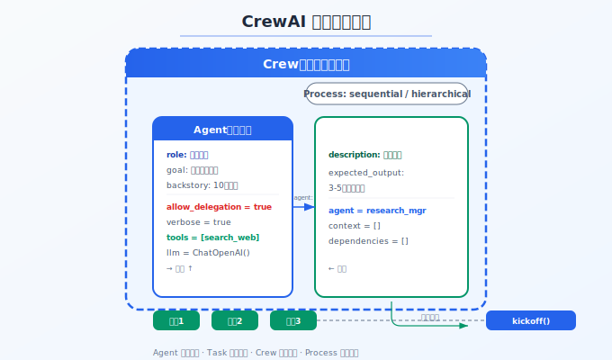

# CrewAI 实战：研究团队

> 前两篇讲理论，这篇动手。用 CrewAI 框架搭建一个多角色研究团队——有组长、有研究员、有写手，看角色设计、任务分解和协作编排在真实代码中怎么落地。

## 目录

- [前置阅读](#前置阅读)
- [场景设定](#场景设定)
- [环境准备](#环境准备)
- [定义 Agent 角色](#定义-agent-角色)
- [定义任务](#定义任务)
- [组建 Crew 并执行](#组建-crew-并执行)
- [运行与结果](#运行与结果)
- [扩展：接入 MCP 工具](#扩展接入-mcp-工具)
- [总结](#总结)
- [参考链接](#参考链接)

你好，我是江小湖。前两篇讲了架构模式和角色设计，但纸上得来终觉浅——本文用 **CrewAI** 框架搭建一个真实的"研究团队"多 Agent 系统。CrewAI 在 [CrewAI 详解](../09-framework/05-crewai.md) 中已经做过概览，本文深入实战。

## 前置阅读

本文假设你了解 CrewAI 的基本概念（Agent、Task、Crew、Process）。如果不熟悉，建议先看 [CrewAI 详解](../09-framework/05-crewai.md) 前两节。

## 场景设定

我们要搭建一个"行业研究团队"：用户给出一个研究主题，三个 Agent 角色协作完成研究报告。

- **研究组长**：接收指令、拆解任务、把控方向
- **研究员**：收集和分析资料
- **报告写手**：将研究结果写成结构化报告

## 环境准备

```bash
pip install crewai
```

验证安装：

```python
from crewai import Agent, Task, Crew, Process
print("CrewAI 就绪")
```

## 定义 Agent 角色

每个 Agent 需要明确的角色（role）、目标（goal）和背景故事（backstory）。

```python
from crewai import Agent

# 研究组长：负责管理和协调
research_manager = Agent(
    role="研究组长",
    goal="高效管理研究项目，确保研究方向和输出质量",
    backstory="你是一位资深的行业研究经理，擅长将复杂问题拆解为可执行的研究任务，"
              "并协调团队高效完成。你有 10 年的技术咨询经验。",
    verbose=True,
    allow_delegation=True,
)

# 研究员：负责资料收集和分析
researcher = Agent(
    role="研究员",
    goal="收集和分析相关技术资料，提炼关键发现",
    backstory="你是一名技术研究员，精通信息检索和数据分析。善于从大量信息中"
              "提取有价值的洞察。关注技术趋势和行业动态。",
    verbose=True,
)

# 报告写手：负责报告撰写
report_writer = Agent(
    role="报告写手",
    goal="将研究结果写成清晰、结构化的技术报告",
    backstory="你是一名技术写作专家，擅长将复杂的技术信息转化为结构化、易懂的报告。"
              "你的报告逻辑清晰、论据充分、语言精准。",
    verbose=True,
)
```

**关键设计**：`allow_delegation=True` 让研究组长可以把子任务委托给研究员和报告写手。这是 Orchestrator/Worker 模式在 CrewAI 中的实现方式。

## 定义任务

有了角色之后，定义每个角色要执行的任务：

```python
from crewai import Task

# 研究组长的任务：制定研究计划
plan_task = Task(
    description="制定研究计划：分析「{topic}」的技术生态、核心概念和发展趋势。"
                "明确研究方向、关键问题和预期产出。",
    expected_output="一个 3-5 点的研究计划大纲，包括研究方向、关键问题和预期产出",
    agent=research_manager,
)

# 研究员的任务：执行研究
research_task = Task(
    description="按照研究计划执行资料收集和分析。重点关注：\n"
                "1. 最新技术动态和趋势\n"
                "2. 核心概念和架构\n"
                "3. 主要厂商和实践案例\n"
                "4. 技术优劣和适用场景",
    expected_output="完整的研究笔记，包含关键发现、数据来源和初步分析",
    agent=researcher,
)

# 报告写手的任务：撰写报告
write_task = Task(
    description="基于研究结果撰写结构化报告。报告包含：\n"
                "1. 摘要和执行摘要\n"
                "2. 技术背景和概述\n"
                "3. 核心发现和深度分析\n"
                "4. 趋势预测和建议\n"
                "5. 参考来源",
    expected_output="一份格式规范的 Markdown 研究报告",
    agent=report_writer,
)
```

## 组建 Crew 并执行

<p align="center">
  
  <br/><em>图：CrewAI Agent-Task-Crew-Process 组件关系</em>
</p>

将 Agent 和 Task 组合成 Crew，指定执行流程：

```python
from crewai import Crew, Process

research_crew = Crew(
    agents=[research_manager, researcher, report_writer],
    tasks=[plan_task, research_task, write_task],
    process=Process.sequential,  # 按顺序执行
    verbose=True,
)
```

`Process.sequential` 表示任务按顺序执行：先制定计划 → 再执行研究 → 最后写报告。CrewAI 也支持 `Process.hierarchical`，让研究组长动态分配任务。

执行研究：

```python
result = research_crew.kickoff(inputs={"topic": "2026 年 MCP 协议发展现状"})
print(result)
```

整个执行过程中，CrewAI 自动处理 Agent 之间的消息传递和上下文共享。研究组长制定计划后，结果自动传递给研究员；研究员完成研究后，结果自动传递给报告写手。

## 运行与结果

<div align="center">
  
</div>

CrewAI 在执行过程中会产生详细的日志，展示每个 Agent 的思考过程：

```
[研究组长] 正在制定研究计划...
[研究组长] 任务拆解完成，开始执行
[研究员] 收到研究任务，开始收集资料...
[研究员] 发现 5 个关键信息源...
[报告写手] 收到研究笔记，开始撰写报告...
[报告写手] 报告完成，共 3 个章节 1200 字
```

最终输出是一份结构化的 Markdown 研究报告。

## 扩展：接入 MCP 工具

CrewAI 支持 Agent 使用工具。通过 MCP 协议，Agent 可以调用外部数据源：

```python
from crewai.tools import tool
import httpx

@tool("搜索工具")
def search_web(query: str) -> str:
    """搜索网络获取最新信息。"""
    response = httpx.get(f"https://api.example.com/search?q={query}")
    return response.text

# 给研究员配上网搜索能力
researcher_with_tools = Agent(
    role="研究员",
    goal="收集和分析相关技术资料",
    tools=[search_web],
    verbose=True,
)
```

研究员现在可以在研究中实时搜索网络，而不只是依赖 LLM 的内部知识。

## 总结

- **CrewAI 的三要素**：Agent（角色）、Task（任务）、Crew（编排）——定义清楚这三样，系统就搭好了
- **Orchestrator/Worker 模式落地**：研究组长（allow_delegation=true）+ 研究员 + 报告写手
- **顺序执行 Process.sequential**：Plan → Research → Write，上一个任务的输出自动传入下一个
- **工具扩展**：通过 MCP 或自定义 tool 让 Agent 具备实时信息获取能力
- **20 行定义角色，30 行定义任务，5 行执行**——CrewAI 让多 Agent 系统的搭建门槛极低

> 下一篇 [LangGraph 实战：工作流编排](./04-langgraph-workflow.md)——如果 CrewAI 的线性流程不够用，LangGraph 的状态图给你完全的控制力。

## 参考链接

- [CrewAI Documentation](https://docs.crewai.com/)
- [CrewAI — Processes](https://docs.crewai.com/core-concepts/Processes/)
- [CrewAI — Tools](https://docs.crewai.com/core-concepts/Tools/)
