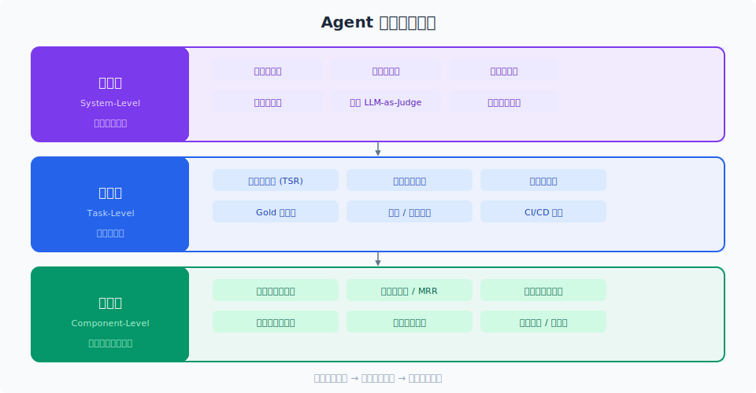

# Agent 评测方法

> 没有评测的 Agent 只是 demo。三层评测体系——组件级、任务级、系统级——帮你从"感觉还行"走向"我知道它行"。

## 目录

- [为什么 Agent 评测很难](#为什么-agent-评测很难)
- [三层评测体系](#三层评测体系)
- [组件级评测](#组件级评测)
- [任务级评测](#任务级评测)
- [系统级评测](#系统级评测)
- [评测集构建](#评测集构建)
- [评测自动化](#评测自动化)
- [总结](#总结)
- [参考链接](#参考链接)

你好，我是江小湖。前 11 章我们一直在教你怎么"造"Agent——从 LLM 基础到工具调用到多 Agent 协作。但从 demo 到生产，**评测是最容易被跳过的关键一环**。

没有评测，你无法回答三个最基本的问题：这个 Agent 变好了还是变差了？能上线吗？用户遇到问题是谁的锅？

## 为什么 Agent 评测很难

传统 NLP 评测有标准答案——翻译有 BLEU、摘要有 ROUGE。但 Agent 的评测面临几个独特的挑战：

**非确定性输出**。同样的输入，LLM 每次生成可能不同。工具调用参数可能等价但表达不同。**结果正确但路径不同**算成功还是失败？

**多步依赖**。一个 5 步的任务，第 2 步偏了一点，第 5 步可能完全偏离。**中间步骤的质量**比最终结果更难评判。

**环境耦合**。Agent 的行为依赖工具返回、检索结果、外部 API 状态。同样的代码，今天能跑通明天可能挂——问题在 Agent 还是环境？

**主观性强**。用户问"帮我分析一下这份财报"，"分析得好不好"没有客观标准。

## 三层评测体系

<p align="center">
  
</p>

我们推荐将评测拆为三个层次，**每层回答不同问题**：

| 层次 | 评测对象 | 回答的问题 |
|------|---------|-----------|
| 组件级 | 工具调用、检索、记忆 | 每个零件好不好用？ |
| 任务级 | 端到端任务完成率 | 整体任务能不能完成？ |
| 系统级 | 成本、延迟、用户留存 | 上线后跑不跑得动？ |

从下往上：**组件级最先做，任务级定期跑，系统级持续盯**。

## 组件级评测

组件的质量直接决定了 Agent 的上限。**每个组件都应该有独立的评测集**。

### 工具调用准确率

最常见的评测维度。对于一个包含 N 个工具的系统，你需要确认：

- **工具选择正确率**：该调哪个工具就调哪个
- **参数填充准确率**：参数名和值都正确
- **调用顺序正确率**：多步工具调用顺序合理

例如，一个日历 Agent 有 `create_event`、`query_events`、`cancel_event` 三个工具。测试用例可以写：

```
输入："帮我查一下明天下午3点有没有会"
预期工具：query_events
预期参数：{"start_time": "明天14:00", "end_time": "明天18:00"}
```

对每个用例，**工具选择 + 参数填充都正确才算通过**。

### 检索质量

如果 Agent 依赖 RAG，需要单独评测检索模块：

- **命中率 (Hit Rate)**：正确答案是否在 Top-K 结果中
- **MRR (Mean Reciprocal Rank)**：正确答案排在第几位
- **上下文精炼度**：检回来的内容有多少是真正有用的

### 记忆读写

评测 Agent 是否能正确读取和写入记忆：

- **关键信息提取率**：对话中的关键实体是否被正确记忆
- **记忆冲突检测**：写入新信息是否与旧记忆矛盾
- **检索延迟**：记忆量从 100 涨到 10 万，检索速度是否达标

## 任务级评测

任务级评测关注 **Agent 完成实际任务的能力**。这是最接近用户体感的指标。

### 任务完成率 (Task Success Rate, TSR)

最简单的定义：**用例预期结果是否达成**。但"成功"有细粒度：

| 等级 | 定义 | 示例 |
|------|------|------|
| 完全成功 | 所有目标完美达成 | 订好了机票+酒店，价格对，时间对 |
| 部分成功 | 主要目标达成，细节有偏差 | 订好了票但时间错了 1 小时 |
| 失败 | 主要目标未达成 | 没订到票，或者订错了目的地 |

**部分成功是 Agent 评测独有的概念**。传统软件要么成功要么失败，但 Agent 经常"大体做对了但有瑕疵"。建议使用 **0-1 分制或 0-5 分量表**，而不是二元判定。

### 轨迹质量 (Trajectory Quality)

即使任务完成了，"怎么完成"也很重要。**轨迹 (Trajectory)** 是指 Agent 从输入到输出的完整执行路径：

- **步骤数**：是否用了不必要的步骤
- **工具调用效率**：是否反复调用同一个工具
- **错误恢复能力**：遇到错误后能否自主纠正
- **循环次数**：是否陷入了重复执行同一操作的死循环

一个 3 步完成任务的 Agent，优于一个 10 步但同样完成任务的 Agent——**效率和有效性同样重要**。

### 鲁棒性测试

改变输入的细微之处，观察 Agent 是否还能正确工作：

- **措辞变化**：同一意思的不同表述
- **噪声输入**：带拼写错误、语气词的输入
- **边界情况**：空输入、超长输入、缺失必要信息
- **对抗输入**：prompt injection、角色扮演企图

## 系统级评测

系统级评测关注 **生产环境下的表现**，通常通过线上监控和用户反馈来实现。

- **用户留存率**：用户是否持续使用
- **任务重试率**：用户是否频繁重试同一任务
- **人工介入率**：多少比例的任务需要人工接手
- **用户满意度**：点赞/踩、满意/不满意反馈

这些指标**不能直接指导开发**（告警了也不知道改哪里），但它们是最终的决策依据——组件级和任务级都好的系统，系统级大概率不差。

## 评测集构建

好的评测集比好的模型更难攒。以下是三种常用构建策略：

### Golden Dataset（黄金数据集）

人工编写的标准测试用例，**每个用例包含输入、预期执行轨迹、预期输出**。它最可靠，但人力成本最高。

编写黄金数据集的要点：

- **覆盖所有核心流程**：每个主要用户路径至少 3-5 个用例
- **包含边界情况**：空输入、异常值、极限值
- **包含失败路径**：工具返回错误时 Agent 应该怎么反应
- **定期更新**：新功能上线后补充对应的用例

### 回归测试集

从生产日志中定期抽取真实用例，人工标注后加入评测集。它能**自动保持与现实场景的同步**。

一个推荐的节奏：

```
每周一：从上周日志中抽样 50 条未标注对话
周二-周三：人工标注（正确轨迹 + 最终评分）
周四：加入评测集
周五：运行全量评测，对比指标变化
```

### 对抗性测试集

专门针对系统性弱点的用例集合。发现某一类问题后，**立即写成用例加入评测集**，防止回归。

例如，发现 Agent 在时区转换上经常出错，就写 20 个时区相关的用例，工具选择、参数、结果都标注好。

## 评测自动化

评测不应该是一个月一次的"大考"。**每次代码变更都应该自动跑评测**。

### CI/CD 集成

在 CI 流水线中加入评测步骤：

```
# 伪代码
on pull_request:
  1. 构建 Agent
  2. 运行组件级评测集 (500 个用例)
  3. 运行核心任务评测集 (200 个用例)
  4. 对比指标 vs main 分支
  5. 如果核心 TSR 下降 > 2% -> 告警
```

### 持续监控

生产环境部署后，持续采集指标：

- **在线评测**：用 LLM-as-Judge 对生产对话实时评分
- **异常检测**：TSR 突然下降、步骤数突然增多
- **漂移检测**：用户输入分布变化、工具调用模式变化

## 总结

评测是 Agent 工程的"基础设施"，不是"可有可无的加分项"。**没有评测，你无法判断一个改动是优化还是退化**。

从组件级开始，逐步建立任务级和系统级评测；从黄金数据集开始，逐步加入回归测试和对抗测试；从手动运行开始，逐步走向 CI/CD 自动化。

**下一篇**：LLM-as-Judge——用 LLM 做自动评分器。

## 参考链接

- [Anthropic — Evaluating AI Agents](https://www.anthropic.com/engineering/evaluating-ai-agents)
- [LangSmith Evaluation Concepts](https://docs.smith.langchain.com/evaluation/concepts)
- [OpenAI Evals Framework](https://github.com/openai/evals)
- [Google — Evaluating Gen AI Applications](https://cloud.google.com/vertex-ai/generative-ai/docs/models/evaluation)
- [Microsoft — Evaluation of AI Agents](https://learn.microsoft.com/en-us/ai/playbook/technology-guidance/generative-ai/working-with-llms/evaluating-ai-agents)
- [Ragas — Evaluation for RAG pipelines](https://docs.ragas.io/)
