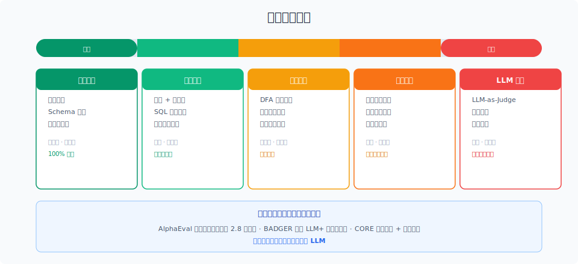

# 评测体系与指标

> 没有评测的 Agent 只是 demo。三层评测体系 + 四个核心概念，帮你从"感觉还行"走向"我知道它行"。

## 目录

- [为什么需要评测](#为什么需要评测)
- [三层评测体系](#三层评测体系)
- [评测集的四种类型](#评测集的四种类型)
- [核心指标定义](#核心指标定义)
- [评测流程](#评测流程)
- [总结](#总结)
- [参考链接](#参考链接)

你好，我是江小湖。从 [Agent 框架概述与选型](../10-framework/01-framework-overview.md) 到 [多 Agent 架构模式](../12-multi-agent/01-architecture-patterns.md)，前面的章节一直在学怎么"造"Agent。但到了生产阶段，你会发现最缺的不是"怎么做得更好"，而是**"怎么知道它好不好"**。

评测就是回答这个问题的基础设施。

## 为什么需要评测

评测回答的其实是一个问题：**这个 Agent 能上线吗？**

没有评测，你只能凭"感觉"做决策——"看起来不错"就上线，"好像变差了"就回滚。这在一两个功能时还能应付，但当你的系统有 10 个工具、5 个 prompt 模板、3 个模型可选时，**感觉失效了**。

评测存在的三个核心价值：

**决策有依据**。该不该上线、该不该换模型、改 prompt 是变好还是变差——这些问题只有数据能回答。评测给你的是量化指标，不是主观感受。

**回归可感知**。最危险的不是"改坏了"，而是"改坏了但没发现"。一个 prompt 改动可能让主要场景变好、边缘场景变差。没有评测，你只会看到变好的部分。

**问题可定位**。用户投诉时，你需要区分是模型问题、prompt 问题、工具问题还是检索问题。评测集里不同维度的指标帮你快速缩小范围。

### Agent 评测的难点

理解评测必要性的同时，也要知道 Agent 评测为什么比传统软件难：

**非确定性输出**。同样的输入，LLM 每次生成可能不同。工具调用参数等价但表达不同。结果正确但路径不同——二元判定失效了。

**多步依赖**。一个 5 步的任务，第 2 步偏了一点，第 5 步可能完全偏离。中间步骤的质量比最终结果更难评判。

**环境耦合**。Agent 的行为依赖工具返回、检索结果、外部 API 状态。同样的代码，今天能跑通明天可能挂——问题是 Agent 还是环境？

因为有这些难点，所以更需要评测。**不是因为评测好做才做，而是因为不好做才必须做**。

## 三层评测体系

<p align="center">
  
</p>

评测应该分层进行，**每层解决不同的问题**：

| 层次 | 评测对象 | 回答的问题 | 谁关注 |
|------|---------|-----------|--------|
| 组件级 | 工具调用、检索、记忆 | 每个零件好不好用？ | 开发者 |
| 任务级 | 端到端任务完成率 | 用户任务能不能完成？ | 产品经理 |
| 系统级 | 成本、延迟、用户留存 | 上线后稳不稳定？ | 运维 / 管理者 |

**从下往上建立**：组件级最先做（每次提交都跑），任务级定期跑（每日），系统级持续盯（实时监控）。

## 评测方法的谱系

业界评测不是只用 LLM-as-Judge，而是**多范式组合**。从最确定到最灵活，评测方法可以分为五类：

<p align="center">
  
</p>

| 方法 | 原理 | 速度 | 可靠性 | 适用场景 | 代表实践 |
|------|------|------|--------|---------|---------|
| **代码检查** | 精确匹配、Schema 校验、正则 | 微秒级 | 100% 确定 | 工具参数格式、JSON 结构、枚举值校验 | 类型检查、json-schema |
| **执行验证** | 实际运行输出并检查结果 | 秒级 | 确定（环境可控） | 代码生成（编译+跑测试）、SQL 执行结果比对 | BADGER 混合执行准确率 |
| **形式验证** | DFA 建模合法路径、规则引擎 | 毫秒级 | 高（数学保证） | 工具调用顺序、安全约束、合规检查 | CORE 路径正确性度量 |
| **参考比对** | 对比 Agent 轨迹与预期路径 | 秒级 | 中（依赖参考质量） | 多步任务流程验证、轨迹效率评估 | LangSmith 轨迹比对 |
| **LLM 评分** | 用模型评估模型输出质量 | 秒级 | 低-中（需校准） | 开放式回答、主观质量、部分成功判定 | LLM-as-Judge、G-Eval |

**工业界的最佳实践是混合使用**。AlphaEval（来自 7 家企业的生产评测框架）为每个任务组合平均 2.8 种评测范 paradigm，一个典型场景可能是：

```
用户输入 → 代码检查（参数格式）→ 执行验证（API 返回码）→ LLM 评分（回答质量）
```

关键原则：**能用确定性方法就不用 LLM**。代码检查 100% 可靠、零成本；LLM 评分有偏差、有成本。LLM 只应该用来覆盖确定性方法覆盖不了的部分。

## 评测集的四种类型

### 1. 黄金数据集 (Golden Dataset)

人工编写的标准测试用例，**每个用例包含输入、预期执行轨迹、预期输出**。最可靠，但人力成本最高。

编写要点：

- 每个核心用户路径至少 3-5 个用例
- 包含边界情况：空输入、异常值、极限值
- 包含失败路径：工具返回错误时 Agent 应该怎么反应
- 新功能上线后补充对应用例

### 2. 回归测试集

从生产日志中定期抽取真实用例，人工标注后加入评测集。它能自动保持与现实场景的同步。

推荐的节奏：

```
每周一：从上周日志中抽样 50 条未标注对话
周二-周三：人工标注（正确轨迹 + 最终评分）
周四：加入评测集
周五：运行全量评测，对比指标变化
```

### 3. 对抗测试集

针对系统性弱点的用例集合。发现某一类问题后，立即写成用例加入评测集，防止回归。

例如：发现 Agent 在时区转换上经常出错，就写 20 个时区相关的用例，工具选择、参数、结果都标注好。

### 4. 空跑测试集 (Smoke Test)

最少量的核心用例（10-20 个），覆盖最基本的主流程。每次部署前必须通过，否则阻断上线。

空跑集应该是黄金数据集的子集——最核心、最稳定的那些用例。

## 核心指标定义

### 组件级指标

**工具调用准确率**：

```
工具选择正确率 = 选对工具的调用次数 / 总调用次数
参数填充准确率 = 参数完全正确的调用次数 / 总调用次数
调用顺序正确率 = 顺序正确的任务数 / 总任务数
```

评估时有三个层次：工具选对、参数填对、顺序用对。**三个都对才算该次调用通过**。

**检索质量**：

```
命中率@K = 正确答案出现在 Top-K 中的查询数 / 总查询数
MRR = 平均 (1 / 正确答案的排名位置)
```

命中率回答"找没找到"，MRR 回答"排得靠不靠前"。

### 任务级指标

**任务完成率 (Task Success Rate)**：

细粒度评分比二元判定更有用：

| 等级 | 分值 | 定义 |
|------|------|------|
| 完全成功 | 1.0 | 所有目标完美达成 |
| 部分成功 | 0.5 | 主要目标达成，细节有偏差 |
| 失败 | 0.0 | 主要目标未达成 |

**轨迹质量**：

```
轨迹效率 = 实际步骤数 / 最优步骤数
数值越接近 1，效率越高。
```

轨迹质量还包含：错误恢复能力（遇到错误后能否自主纠正）、循环检测（是否陷入死循环）。

### 系统级指标

```
用户留存率 = 次日/7日/30日留存用户数 / 首日用户数
人工介入率 = 需要人工介入的会话数 / 总会话数
用户满意度 = 好评数 / (好评数 + 差评数)
```

系统级指标**不能直接指导开发**（告警了也不知道改哪里），但它们是最终的决策依据。

## 评测流程

一个健康的评测流程应该是这样的：

```
日常开发:
  git push → CI 自动运行组件级评测（500 用例）
  → 结果对比 main 分支
  → TSR 下降 > 2% → 阻断合并

每日:
  自动运行全量评测集
  发送评测报告到团队群

每周:
  从生产日志抽样标注
  补充评测集

每月:
  全量回归测试
  更新性能基线
  对抗测试集扩充
```

评测不是一次性工作，而是**持续投入的基础设施**。评测集和代码一样需要维护。

## 总结

评测是 Agent 工程的"基础设施"，不是"可有可无的加分项"。

核心要点：三层体系（区分层次）、四种评测集（黄金/回归/对抗/空跑）、核心指标（每个组件可量化）、持续流程（日常开发到月度回归）。

**下一篇**：[确定性评测方法](02-deterministic-evaluation.md)——先用确定性的方法把 80% 的评测搞定。

## 参考链接

- [Anthropic — Evaluating AI Agents](https://www.anthropic.com/engineering/evaluating-ai-agents)
- [LangSmith Evaluation Concepts](https://docs.smith.langchain.com/evaluation/concepts)
- [Google — Evaluating Gen AI Applications](https://cloud.google.com/vertex-ai/generative-ai/docs/models/evaluation)
- [Microsoft — Evaluation of AI Agents](https://learn.microsoft.com/en-us/ai/playbook/technology-guidance/generative-ai/working-with-llms/evaluating-ai-agents)
- [Ragas — Evaluation for RAG pipelines](https://docs.ragas.io/)
