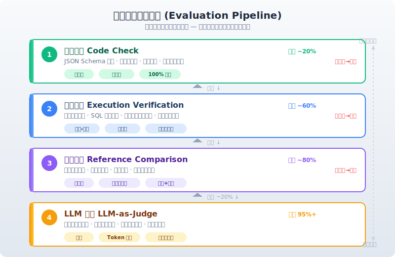
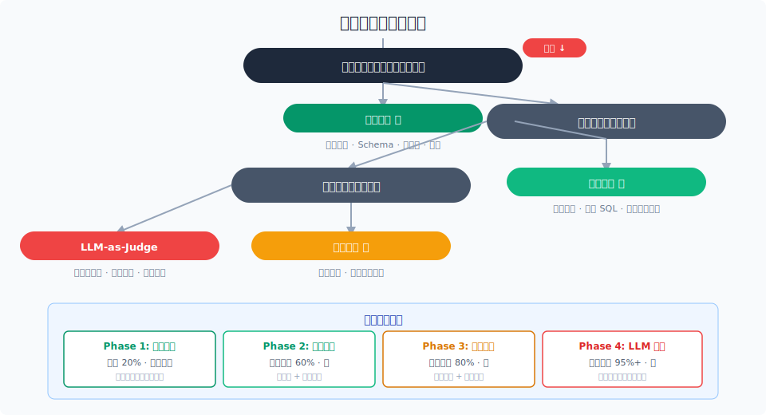

# 确定性评测方法

> LLM-as-Judge 不是默认选项。能用代码检查就别用 LLM，能用执行验证就别靠感觉。确定性方法 100% 可靠、零成本、可复现——把 LLM 留给它真正擅长的场景。

## 目录

- [为什么确定性方法优先](#为什么确定性方法优先)
- [代码检查](#代码检查)
- [执行验证](#执行验证)
- [参考比对](#参考比对)
- [混合方法](#混合方法)
- [方法选型指南](#方法选型指南)
- [总结](#总结)
- [参考链接](#参考链接)

你好，我是江小湖。上一篇文章的评测方法谱系里，五种方法从确定到灵活排列。本文深入前三种——**代码检查、执行验证、参考比对**——它们共同的特点是：确定、可复现、低成本。

在引入 LLM 之前，先用这些方法把能确定的部分确定下来。

## 为什么确定性方法优先

确定性方法和 LLM 评分的核心区别：

| 维度 | 确定性方法 | LLM 评分 |
|------|-----------|---------|
| 结果是否可复现 | 100% 一致 | 每次可能不同 |
| 执行成本 | 微秒-毫秒级 | 秒级 + token 费用 |
| 维护成本 | 低（写一次跑永久） | 高（需持续校准） |
| 误判率 | 0%（设计正确的前提下） | 需人类校验 |
| 表达能力 | 有限的模式匹配 | 无限的语义理解 |

**原则很简单：能用确定性的地方，绝不引入 LLM。** 不是因为 LLM 不好，而是因为确定性方法更便宜、更快、更可靠。LLM 应该只用来覆盖确定性方法覆盖不了的空白。

### 一个典型的评测流水线

```
Agent 输出
  │
  ├─ ① 代码检查（微秒）
  │   参数格式、JSON schema、枚举值 → 不通过则直接失败
  │
  ├─ ② 执行验证（毫秒-秒）
  │   运行代码、执行 SQL、调用 API → 检查结果
  │
  ├─ ③ 参考比对（毫秒）
  │   轨迹是否匹配预期路径、状态是否正确
  │
  └─ ④ LLM 评分（秒）
     仅当以上都无法判断时才启用
```

<p align="center">
  
</p>

## 代码检查

代码检查是最基础的确定性方法——**用代码验证代码**。

### 适用场景

- 工具调用参数格式是否正确（参数名、类型、是否必填）
- Agent 输出是否符合指定的 JSON Schema
- 枚举值是否在允许范围内
- 工具调用顺序是否符合基本约束

### 常见检查模式

**Schema 校验**（最常用）：

```python
from jsonschema import validate

# 定义工具参数的预期 schema
tool_schema = {
    "type": "object",
    "required": ["order_id", "reason"],
    "properties": {
        "order_id": {"type": "string", "pattern": "^ORD-\\d+$"},
        "reason": {"type": "string", "maxLength": 200}
    }
}

# 验证 Agent 的工具调用参数
def check_tool_call(tool_call: dict) -> bool:
    try:
        validate(instance=tool_call["arguments"], schema=tool_schema)
        return True
    except:
        return False
```

**枚举值检查**：

```python
VALID_STATUSES = ["pending", "shipped", "delivered", "cancelled"]

def check_status_param(status: str) -> bool:
    return status in VALID_STATUSES
```

**顺序约束检查**：

```
规则：cancel_order 之前必须先调用 query_order
检查：Agent 的调用序列中，cancel_order 的 trace_id
      是否与之前 query_order 返回的 order_id 匹配
```

### 代码检查的局限

代码检查只能验证"格式对不对"，不能验证"内容对不对"。参数格式正确但内容错误（如查错了订单），代码检查发现不了——这需要执行验证或 LLM 评分。

## 执行验证

执行验证比代码检查更进一步——**实际运行 Agent 的操作，并检查运行结果**。

### 适用场景

- Agent 生成了代码 → 编译并跑测试
- Agent 生成了 SQL → 在测试数据库上执行并比对结果
- Agent 调用了工具 → 检查工具返回的状态码和数据
- Agent 修改了状态 → 检查状态变更是否符合预期

### 代码执行验证

```python
# Agent 生成了一段 Python 代码
code = agent_generated_code

# 在沙箱中执行并验证结果
def verify_code(code: str, test_cases: list) -> dict:
    results = []
    for input_data, expected in test_cases:
        try:
            # 在隔离沙箱中执行
            output = sandbox_execute(code, input_data)
            passed = output == expected
            results.append({"passed": passed, "output": output})
        except Exception as e:
            results.append({"passed": False, "error": str(e)})
    return {
        "pass_rate": sum(r["passed"] for r in results) / len(results),
        "results": results
    }
```

关键：**必须在沙箱中执行**，防止 Agent 生成的恶意代码影响宿主系统。沙箱策略参考 [访问控制与沙箱执行](../15-safety/02-access-control-and-sandbox.md)。

### SQL 执行验证

```
Agent 生成: SELECT * FROM orders WHERE user_id = 'usr_123'

验证:
  1. 在测试数据库副本上执行该 SQL
  2. 检查结果集的 schema（列名、类型）是否符合预期
  3. 可选：比对结果与"标准 SQL"的结果是否一致
```

SQL 验证的挑战是"语义等价"——`SELECT *` 和 `SELECT id, status, amount` 可能返回相同的数据。这时候可以用 LLM 判断语义等价（混合方法）。

### 工具结果验证

```python
def verify_tool_result(tool_name: str, params: dict, result: dict) -> bool:
    if tool_name == "query_order":
        # 验证返回的订单 ID 与查询参数一致
        return result.get("order_id") == params.get("order_id")
    elif tool_name == "send_email":
        # 验证发送成功
        return result.get("status") == "sent"
    # ...
```

## 参考比对

参考比对将 Agent 的执行轨迹或最终状态与"预期路径"做对比。

### 适用场景

- 验证 Agent 是否按照预期流程执行（先查再改、先确认再提交）
- 验证最终状态是否正确（数据库状态、文件状态）
- 检测"绕路"（步骤多了但结果对了）

### 轨迹比对

每个评测用例可以包含一个**预期轨迹**：

```json
{
  "input": "帮我取消订单 ORD-123",
  "expected_trajectory": [
    {"tool": "query_order", "params": {"order_id": "ORD-123"}},
    {"tool": "cancel_order", "params": {"order_id": "ORD-123", "reason": "user_request"}}
  ],
  "expected_final_state": {
    "order_status": "cancelled"
  }
}
```

比对模式有几种：

**精确匹配**：调用序列、参数、顺序完全一致。最严格，适合确定性流程。

**子序列匹配**：Agent 的轨迹包含预期序列即可，允许中间有额外步骤。适合灵活的 Agent 行为。

**无序匹配**：Agent 调用了所有预期的工具即可，不要求顺序。适合工具间无依赖的场景。

LangSmith 和 Vertex AI 原生支持这些比对模式。

### 状态比对

对于涉及状态变更的任务（如订单管理、配置修改），比对最终状态比比对轨迹更可靠：

```
场景：用户要求将订单 ORD-123 的收货地址从"旧地址"改为"新地址"

验证：
  步骤 1: 记录执行前的状态（order.123.address = "旧地址"）
  步骤 2: Agent 执行
  步骤 3: 检查执行后的状态（order.123.address = "新地址"？）
```

这种"前后状态比对"完全确定、零成本，不依赖 LLM。

### 状态比对 vs 轨迹比对

| 维度 | 轨迹比对 | 状态比对 |
|------|---------|---------|
| 验证对象 | Agent 的"行为" | 系统的"结果" |
| 是否关注过程 | 是 | 否 |
| 适合场景 | 流程合规性验证 | 结果正确性验证 |
| 实现复杂度 | 需记录轨迹 | 需记录前后状态快照 |
| Bypass 风险 | Agent 可以"假装做了" | Agent 无法绕过 |

**建议两者结合**：状态比对保证结果正确，轨迹比对保证过程合规。

## 混合方法

实际工业界用得最多的是**混合方法**——用确定性方法做基础校验，用 LLM 处理确定性方法覆盖不了的边缘情况。

### BADGER：混合执行准确率

Merkle 提出的 BADGER 框架（2026）是最好的实践案例。它解决的问题是：SQL 执行结果比对时，列名别名（`total` vs `total_amount`）、数值精度（`100.00` vs `100`）会导致确定性比对误报。

BADGER 的做法：

```
第一步（LLM）：分析 SQL 的列别名、数值精度，生成"对齐元数据"
第二步（确定）：基于对齐元数据做严格的行级数值比对

结果：Cohen's κ = 0.717（与人类高度一致），优于纯确定性方案的 0.395
```

这种"LLM 辅助分析 + 确定性执行"的模式可以参考：

```
格式问题（列名、精度） → LLM 分析对齐方式
数值比对 → 确定性代码执行
安全检查 → 确定性规则执行
```

### 实践中如何组合

以一个订单 Agent 的评测为例，完整的评测流水线：

```
用例: "帮我取消订单 ORD-123"
Agent 执行完成

1️⃣ 代码检查 (微秒)
   └── 检查 cancel_order 参数格式：order_id 格式正确 ✅

2️⃣ 执行验证 (毫秒)
   └── 检查工具返回：cancel_order 返回 status=success ✅
   └── 检查数据库：orders.ORD-123.status = "cancelled" ✅

3️⃣ 参考比对 (毫秒)
   └── 轨迹是否包含 query_order → cancel_order ✅
   └── 最终状态是否匹配预期 ✅

4️⃣ LLM 评分 (秒) — 仅检查"回答质量"
   └── Agent 回答："已为您取消订单 ORD-123" — 是否友好清晰？
   └── ⚠️ 这一步实际上也可以省略——用户只需要知道取消了
```

前三步已经覆盖了 90% 的验证需求。LLM 只需要关注那 10% 的"回答好不好"。

## 方法选型指南

### 决策树

当需要为一个评测指标选择评测方法时，按以下顺序判断：

<p align="center">
  
</p>

### 各方法的投入产出

| 方法 | 实现成本 | 维护成本 | 覆盖范围 | 推荐指数 |
|------|---------|---------|---------|---------|
| 代码检查 | 低 | 极低 | 窄（格式仅格式） | ⭐⭐⭐⭐⭐ |
| 执行验证 | 中（需沙箱） | 低 | 中（可验证正确性） | ⭐⭐⭐⭐ |
| 参考比对 | 中（需标注轨迹） | 中（轨迹需维护） | 中-宽 | ⭐⭐⭐⭐ |
| 混合方法 | 高（需设计流程） | 中 | 宽 | ⭐⭐⭐ |
| LLM 评分 | 低（写 prompt） | 高（需持续校准） | 最宽 | ⭐⭐⭐ |

**建议的投入顺序**：

```
Phase 1: 代码检查（先做，做最基础的格式校验）→ 覆盖 20% 场景
Phase 2: 执行验证（做沙箱，验证工具返回和状态）→ 覆盖 60% 场景
Phase 3: 参考比对（标注轨迹，验证流程合规）→ 覆盖 80% 场景
Phase 4: LLM 评分 + 混合方法 → 覆盖 95%+ 场景
```

## 总结

确定性评测方法应该是你的默认选择。**代码检查做格式验证，执行验证做结果验证，参考比对做流程验证**——这三层帮你覆盖 80% 的评测需求。

剩下的 20% 再交给 LLM-as-Judge。

核心要点：确定性方法优先（便宜、快、可靠）→ 混合方法补充（LLM 辅助 + 确定执行）→ 纯 LLM 兜底（只覆盖开放场景）。

**下一篇**：[LLM-as-Judge：用 LLM 做自动评测](03-llm-as-judge.md)——确定性方法覆盖不了的场景，交给 LLM。

## 参考链接

- [BADGER: Hybrid Execution Accuracy](https://arxiv.org/html/2606.02109v1) — LLM-assisted + deterministic scoring
- [CORE: Full-Path Evaluation via DFA](https://arxiv.org/pdf/2509.20998) — formal path verification
- [AlphaEval: Production-Grounded Benchmark](https://arxiv.org/abs/2604.12162) — multi-paradigm evaluation
- [Layer-Isolated Evaluation](https://arxiv.org/html/2606.11686) — deterministic per-layer harness
- [LangSmith Trajectory Comparison](https://docs.smith.langchain.com/evaluation/)
- [PAE: Procedure-Aware Evaluation](https://arxiv.org/pdf/2603.03116) — detecting corrupt success
