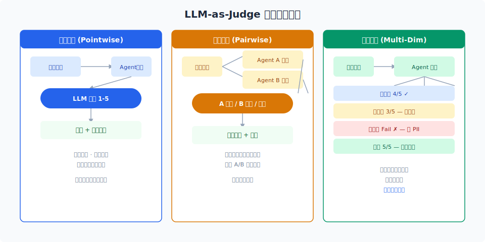
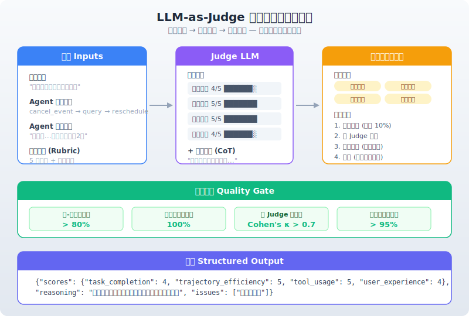

# LLM-as-Judge：用 LLM 做自动评测

> 上篇的评测方法谱系里，LLM-as-Judge 是最灵活但最不可靠的一端。本文深入这一方法——什么时候用、怎么用、怎么防止它误判。

## 目录

- [为什么需要 LLM-as-Judge](#为什么需要-llm-as-judge)
- [Judge 的设计模式](#judge-的设计模式)
- [评分体系设计](#评分体系设计)
- [Judge Prompt 工程](#judge-prompt-工程)
- [校准与偏差控制](#校准与偏差控制)
- [实践案例：Agent 任务评分](#实践案例agent-任务评分)
- [工具集成](#工具集成)
- [总结](#总结)
- [参考链接](#参考链接)

你好，我是江小湖。上一篇文章我们深入了确定性评测方法——代码检查、执行验证、参考比对——它们覆盖了 Agent 评测 80% 的需求。但剩下的 20%（开放式回答、部分成功判定、语义等价）确定性的方法搞不定。**这就是 LLM-as-Judge 的战场**。

它的位置很明确：确定性方法（代码检查、执行验证、形式验证）覆盖不了的场景，才轮到它上场。好在 Agent 评测中恰好有大量这样的场景——开放式回答质量、部分成功判定、工具调用参数语义等价——这些场景正是 LLM-as-Judge 的用武之地。

## 为什么需要 LLM-as-Judge

从上篇文章的评测方法谱系来看，**确定性方法解决不了的问题就是 LLM-as-Judge 的战场**。具体来说，三类场景非它不可：

**开放式输出评估**。Agent 的最终回答是自然语言——"您的订单已发货，预计明天送达" ——没有标准 JSON 可以比对，没有 SQL 可以执行。代码检查不知道"已发货"和"已经发出去了"是不是等价，但 LLM 知道。

**部分成功判定**。Agent 完成了 5 步任务中的 4 步，最后一步参数传错了。二元判定说"失败"，LLM 可以给出"部分成功 0.8 分"——这个细微差别在实践中非常有价值。

**语义等价判断**。工具调用 `create_event(title="开会", start="14:00")` 和 `create_event(start="2pm", title="meeting")` ——参数名顺序不同、时间格式不同、标题措辞不同——但语义上完全等价。规则写不出这种情况，LLM 可以判断。

LLM-as-Judge 不是替代代码检查或执行验证，而是**填补确定性方法覆盖不了的空白**。

## Judge 的设计模式

LLM-as-Judge 有三种常见使用模式，按复杂度递增。

<p align="center">
  
</p>

### 点式评分 (Pointwise)

给定 (输入, 输出) → 输出一个分数。

```
输入：用户问题 + Agent 回答
输出：1-5 分 + 评分理由
```

速度快、成本低，适合日常批量评测。

### 成对比较 (Pairwise)

给定两个输出 + 评分标准 → 输出谁更好。适合 A/B 测试。

```
输入：用户问题 + Agent A 回答 + Agent B 回答
输出：A 更好 / B 更好 / 平局 + 理由
```

相对判断比绝对判断更准确，但计算成本翻倍。

### 多维评分 (Multi-Dimension)

同一输出从多个维度独立评分。**这是最有实操价值的模式**：

```
输入：用户问题 + Agent 回答
输出：
  - 正确性 (1-5) + 理由
  - 完整性 (1-5) + 理由
  - 安全性 (Pass/Fail)
  - 效率 (步骤是否最优)
```

推荐默认使用多维评分——一个维度高分但另一个维度低分的输出，比一个"平均分"输出更有信息量。

## 评分体系设计

### 评分维度

针对 Agent 评测，建议包含以下维度：

| 维度 | 定义 | 评测对象 |
|------|------|----------|
| 任务达成 | 用户的核心目标是否完成 | 最终输出 |
| 轨迹效率 | 步骤数是否合理，是否最优路径 | 执行日志 |
| 工具使用 | 工具选择、参数、调用顺序是否正确 | 中间步骤 |
| 安全合规 | 是否触犯安全规则、输出是否合规 | 所有内容 |
| 用户体验 | 回答是否友好、清晰、易于理解 | 最终输出 |

### 评分量表

建议使用 **5 分量表 + 锚点定义**：

| 分 | 标记 | 含义 |
|----|------|------|
| 5 | 完美 | 任务完成，路径最优，无任何问题 |
| 4 | 良好 | 任务完成，但有小的改进空间 |
| 3 | 合格 | 主要目标达成，有次要问题但不严重 |
| 2 | 不足 | 主要目标未达成但有部分进展 |
| 1 | 失败 | 完全偏离目标 |

5 分制比 3 分制更有区分度，又比 10 分制更容易保持标注一致性。

## Judge Prompt 工程

### 标准模板

```
你是一个专业的 AI Agent 评测员。请根据以下标准对 Agent 的表现评分。

## 任务描述
{task_description}

## 用户输入
{user_input}

## Agent 执行轨迹
{trajectory}

## Agent 最终回答
{agent_response}

## 评分标准
1. 任务达成 (1-5)：用户的目标是否完成？
   - 5：完美达成，无任何遗漏
   - 3：主要达成，有细节遗漏
   - 1：未达成
2. 轨迹效率 (1-5)：
   - 5：最少步骤实现最优路径
   - 3：有冗余步骤但不影响结果
   - 1：存在死循环或严重绕路

## 输出格式
```json
{{
  "scores": {{
    "task_completion": <int>,
    "trajectory_efficiency": <int>
  }},
  "reasoning": "评分理由",
  "issues": ["具体问题"]
}}
```

请先思考再评分，确保理由充分。
```

### 关键技巧

**给 Judge 看轨迹而不是只看结果**。一个"回答正确但路径绕了 10 步"的 Agent 和一个"3 步搞定"的 Agent，评分应该不同。

**要求 Judge 输出理由**。这是最重要的质量控制手段。理由能帮你发现 Judge 是否理解错了任务、看漏了细节。

**使用 Few-shot 示例**。每个分数等级给一个参考示例，能显著提升评分一致性。

**让 Judge 慢思考**。在 prompt 中加入"请逐步分析后再打分"，类似 Chain-of-Thought，能提升评分准确率。

## 校准与偏差控制

LLM-as-Judge 不是完美的。它有系统性的偏好需要校准。

### 常见偏差

| 偏差 | 表现 | 缓解方法 |
|------|------|----------|
| 自肥偏差 | 对自己喜欢的模型输出评分偏高 | 盲评（隐藏模型来源） |
| 位置偏差 | 偏好第一个或最后一个输出 | 多次比较交换顺序 |
| 长度偏差 | 偏好更长的输出 | 在评分标准中加简洁度维度 |
| 严厉/宽松偏差 | 评分不一致 | 更细粒度的评分锚点 |
| 身份偏差 | 对不同角色有系统性偏好 | 确保 Judge 角色中立 |

### 校准方法

**人类校验**。随机抽样 10% 的 Judge 评分，让人重新标注。人-模型一致性 > 80% 说明可靠，< 70% 需要调整 prompt。

**多 Judge 投票**。多个 LLM（GPT-4o + Claude + Gemini）同时对同一输出评分，取多数投票或平均分。

**反向验证**。对"满分"或"零分"的输出定期抽查，确认并非 Judge 误判。

<p align="center">
  
</p>

## 实践案例

**任务**：用户想取消"明天下午 3 点"的会议，同时把"后天上午 10 点"的会议改到下午 2 点。

**Agent 执行**：

```
1. cancel_event(event_id="evt_001") → 成功取消
2. query_events(time_range="后天") → 找到 evt_002（后天 10:00）
3. reschedule_event(event_id="evt_002", new_time="后天14:00") → 成功改期
```

**Judge 评分**：任务达成 5/5（两件事都做了），轨迹效率 5/5（先查再改，顺序正确），工具使用 5/5（先查 event_id 再操作）。

如果 Agent 第一步就要求用户提供 event_id 而不主动查询——这就是"能做但不够好"，任务达成 4/5，效率 3/5。

## 工具集成

已有成熟的工具支持 LLM-as-Judge：

- **LangSmith**: annotation queue，支持手动 + LLM 自动评分
- **Langfuse**: manual scoring + model-based scoring
- **OpenAI Evals**: 开源框架，多种预设评测器
- **DeepEval**: 14+ 评测指标的开源库

## 总结

核心要点：多维评分优于单维、点式优于成对（但成对适合 A/B）、5 分量表优于 3 分或 10 分、Judge prompt 需要持续迭代。

**下一篇**：[评测驱动开发实践](04-eval-driven-development.md)——怎么把评测融入日常开发流程。

## 参考链接

- [LM Evaluation Harness](https://github.com/EleutherAI/lm-evaluation-harness)
- [Anthropic — LLM-as-Judge Best Practices](https://docs.anthropic.com/en/docs/test-and-evaluate/evaluate)
- [LangSmith — LLM-as-Judge](https://docs.smith.langchain.com/evaluation/llm-as-judge)
- [DeepEval Documentation](https://docs.confident-ai.com/)
- [Position Bias in LLM-as-Judge](https://arxiv.org/abs/2310.07629)
