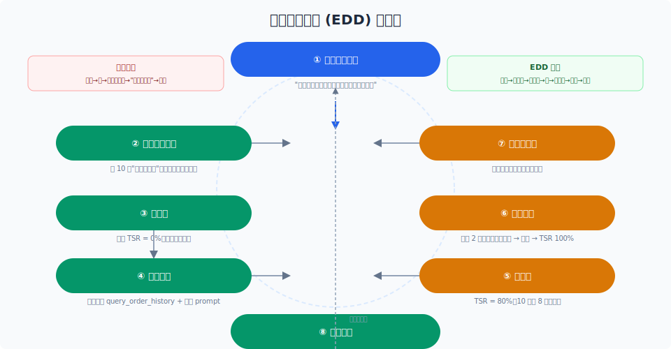
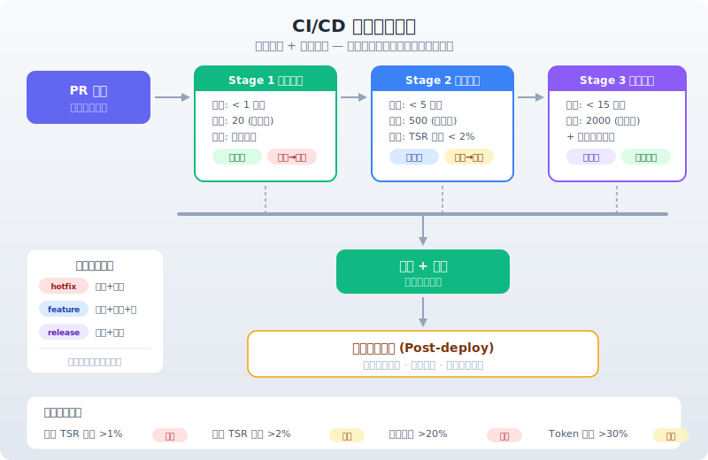

# 评测驱动开发实践

> 先写评测，再写代码。评测驱动开发 (EDD) 让每一次变更都有明确的"好不好"的判断标准——就像 TDD 让代码有测试一样。

## 目录

- [什么是评测驱动开发](#什么是评测驱动开发)
- [EDD 的工作流程](#edd-的工作流程)
- [评测集即规范](#评测集即规范)
- [CI/CD 门禁设计](#cicd-门禁设计)
- [回归测试策略](#回归测试策略)
- [A/B 测试实践](#a-b-测试实践)
- [评测集的持续维护](#评测集的持续维护)
- [总结](#总结)
- [参考链接](#参考链接)

你好，我是江小湖。前三篇文章建立了"评测什么"（体系与指标）、"确定性怎么评"（代码检查/执行验证/参考比对）和"灵活怎么评"（LLM-as-Judge）。但评测要真正发挥作用，不能只是"写完了跑一下"——**它应该驱动你的开发流程**。

就像 TDD（测试驱动开发）改变了代码的质量文化一样，**EDD（评测驱动开发）** 改变的是 Agent 的质量文化。

## 什么是评测驱动开发

评测驱动开发 (Eval-Driven Development) 的核心思想是：**在修改 Agent 行为之前，先定义"什么是好的"**。

<p align="center">
  
</p>

传统开发模式：

```
接到需求 → 改 prompt / 加工具 → 跑几个例子看看 → "看起来不错" → 上线
```

EDD 模式：

```
接到需求 → 写评测用例 → 跑基准线 → 改代码 → 跑评测 → 达标 → 上线
```

两者的区别：传统模式靠"感觉"判断好坏，EDD 靠"数据"判断好坏。

### 为什么 Agent 特别需要 EDD

Agent 开发的特殊性让 EDD 比 TDD 更加必要：

**LLM 是非确定性的**。改了 prompt，你以为会变好，但可能在某些场景下变差。没有评测集，你只会注意到"变好的部分"，忽略"变差的部分"。

**回归风险高**。改了一个工具的描述，可能影响完全不相干的另一个功能。评测集是发现这种"意外副作用"的唯一手段。

**改进方向不明确**。没有评测基线，你无法判断"换一个模型"到底是变好了还是变差了。

## EDD 的工作流程

### 一个典型的 EDD 循环

```
1. 定义变更目标
   "用户反馈 Order Agent 查不到历史订单"
   ↓
2. 编写评测用例
   写 10 个"查询历史订单"的用例，包含不同措辞、不同时间范围
   ↓
3. 跑基线
   当前 Agent 在这些用例上 TSR = 0%（因为功能缺失）
   ↓
4. 实现变更
   新增 query_order_history 工具，更新 prompt
   ↓
5. 跑评测
   TSR = 80%（10 个用例中 8 个通过）
   ↓
6. 迭代优化
   分析失败的 2 个用例 → 发现是时间格式问题 → 修复
   → TSR = 100%
   ↓
7. 跑全量回归
   确认变更没有影响其他功能
   ↓
8. 合并上线
```

### 基线 (Baseline) 的重要性

**没有基线，就没有改进**。基线是你做任何变更之前的评测指标值。

基线应该在以下时机建立：

- 新 Agent 上线前：建立初始基线
- 每次重大变更前：建立当前基线
- 每周自动：建立周基线（用于漂移检测）

基线数据应该持久化存储，便于回溯：

```
2026-06-01 | main | TSR 92.3% | 组件级 96.1% | 成本 ¥342/日
2026-06-08 | main | TSR 93.1% | 组件级 96.5% | 成本 ¥338/日
2026-06-15 | feat/history | TSR 91.8% | 组件级 95.2% | 成本 ¥356/日
```

## 评测集即规范

在 EDD 中，**评测集不只是测试数据，它是行为的"可执行规范"**。

### 从需求到评测用例

自然语言需求 → 评测用例。例如：

```
需求: "用户取消订单后应该能收到确认邮件"

评测用例:
  输入: "帮我把订单 ORD-123 取消掉"
  期望轨迹:
    1. cancel_order(order_id="ORD-123") → 成功
    2. send_email(user_id="usr_456", template="cancel_confirmation") → 成功
  期望结果: 订单已取消 + 确认邮件已发送
```

这个评测用例就是需求的形式化表达。"通过"的标准非常明确——Agent 必须同时调用两个工具，顺序正确，参数正确。

### 行为驱动开发 (BDD) 风格

可以借鉴 BDD 的 Given-When-Then 格式来组织评测用例：

```
Feature: 订单取消

Scenario: 正常取消订单
  Given: 用户有一个未发货的订单 ORD-123
  When: 用户说"帮我把订单 ORD-123 取消掉"
  Then: Agent 调用 cancel_order 成功
  And: Agent 调用 send_email 发送确认通知
  And: Agent 回复"已取消，确认邮件已发送"

Scenario: 已发货订单取消
  Given: 用户有一个已发货的订单 ORD-456
  When: 用户说"取消订单 ORD-456"
  Then: Agent 告知"已发货的订单无法取消，请联系客服"
  And: Agent 不调用任何修改工具
```

这种格式对产品经理也非常友好——他们可以直接写场景，开发者翻译为评测用例。

## CI/CD 门禁设计

评测驱动开发的最终体现是 CI/CD 门禁。

### 分级门禁

```
┌─ PR 提交
│
├── Stage 1: 快速检查 (< 1 分钟)
│   ├── 空跑评测集 (20 用例)
│   └── 全部通过 → 继续 | 失败 → 阻断
│
├── Stage 2: 组件级评测 (< 5 分钟)
│   ├── 组件级评测集 (500 用例)
│   ├── TSR 不下降 > 2% → 继续
│   └── TSR 下降 > 2% → 告警（不阻断，标记审查）
│
├── Stage 3: 完整评测 (< 15 分钟)
│   ├── 全量评测集 (2000 用例)
│   ├── 性能基线对比
│   └── 报告生成
│
└── 合并后: 生产评测
    ├── 在线评测启动
    └── 漂移检测
```

<p align="center">
  
</p>

### 门禁阈值设置

阈值决定了你的"质量敏感度"：

| 指标 | 严格模式 | 宽松模式 | 说明 |
|------|---------|---------|------|
| 核心 TSR 下降 | > 1% 阻断 | > 5% 阻断 | 核心用例不能降 |
| 全量 TSR 下降 | > 2% 告知 | > 5% 告知 | 允许小幅波动 |
| 延迟增加 | > 20% 阻断 | > 50% 阻断 | 性能回归 |
| Token 增加 | > 30% 告知 | > 50% 告知 | 成本回归 |

建议新项目先用宽松模式跑通流程，逐步收紧到严格模式。

## 回归测试策略

### 分层回归

```
每日回归:
  组件级评测 (500 用例) → 自动运行，发送报告
  目标: 快速发现退化

每周回归:
  全量评测 (2000 用例) → 自动运行，人工审查
  目标: 全面质量检查

发布回归:
  全量评测 + 对抗测试 + 性能基线
  目标: 上线前的最终确认
```

### 回归触发

不是每次提交都需要跑全量评测。推荐策略：

```
hotfix (紧急修复): 只跑空跑集 + 组件集
feature (新功能): 跑空跑集 + 组件集 + 新用例
release (发布): 跑全量评测集 + 性能基线
```

## A/B 测试实践

评测也可以在开发阶段做 A/B 对比。

### 在线 A/B

```
用户 50% → Agent A (当前版本)
用户 50% → Agent B (实验版本)

对比指标:
  - 任务完成率
  - 用户满意度
  - 人工介入率
  - 平均处理时间

运行时间: 至少 3-7 天
决策: 统计显著 → 选择胜出版本全量上线
```

### 离线 A/B

用同一个评测集对比两个版本：

```
评测集: 1000 个用例
Agent A (main): TSR 92.3%
Agent B (experiment): TSR 94.1%  ✓

逐用例分析:
  - A 对 B 都对的: 876 个
  - A 错 B 对的: 87 个 (改进点)
  - A 对 B 错的: 28 个 (回归点)
  - 都错的: 9 个 (共同弱点)
```

逐用例分析比单纯看总分更有价值——它告诉你改进到底改对了什么、又意外破坏了什么。

## 评测集的持续维护

评测集不是一次写完就完事的。它和代码一样需要维护。

### 评测集腐烂

评测集会随时间"腐烂"：

- 用例对应的功能已下线 → 用例失效
- 用户输入模式已变化 → 用例不再代表真实场景
- Agent 能力提升 → 用例太简单，失去区分度

### 维护节奏

```
每周:
  - 从生产日志补充新用例（人工标注 20-50 条）
  - 删除已失效的用例

每月:
  - 重新标注评测集（确保标注一致性）
  - 分析"所有 Agent 都对的用例"→ 考虑降级或删除
  - 分析"所有 Agent 都错的用例"→ 确认是否需要修复

每季度:
  - 评测集全面审查
  - 更新对抗测试集
  - 更新性能基线
```

### 评测集大小

评测集不是越大越好。更小、更精的评测集比大而全的评测集更好维护：

```
核心评测集: 50-100 用例（空跑用，覆盖主流程）
组件评测集: 200-500 用例（覆盖每个组件的边界）
全量评测集: 1000-3000 用例（覆盖所有已知场景）
对抗评测集: 100-200 用例（覆盖已知弱点）
```

如果你的评测集超过 5000 用例，考虑优先级分层——不是所有 PR 都需要跑全量。

## 总结

评测驱动开发的核心思想：**先定义"什么是好的"，再判断"改得好不好"**。

EDD 的四个关键实践：评测集即规范（需求形式化为用例）、CI/CD 门禁（质量阈值阻断回归）、基线对比（没有基线就没有改进）、持续维护（评测集和代码一样需要维护）。

**下一篇**：[生产环境评测实践](05-production-evaluation.md)——上线之后的评测怎么做。

## 参考链接

- [TDD — Test-Driven Development](https://en.wikipedia.org/wiki/Test-driven_development)
- [BDD — Behavior-Driven Development](https://en.wikipedia.org/wiki/Behavior-driven_development)
- [Google — CI/CD for ML](https://cloud.google.com/architecture/mlops-continuous-delivery-and-automation-pipelines-in-machine-learning)
- [Stripe — Evaluating AI Features](https://stripe.com/blog/evaluating-ai-features)
- [Eval-Driven Development (Anthropic)](https://docs.anthropic.com/en/docs/build-with-claude/eval-driven-development)
