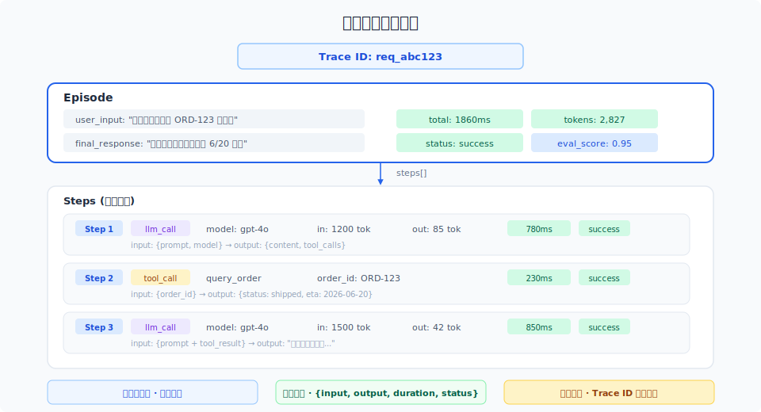

# 可观测性设计原则

> Agent 系统不是传统软件。日志、指标、追踪——可观测性的三支柱在 Agent 语境下有新的含义和优先级。本文帮你在选工具之前先想清楚：到底要看什么。

## 目录

- [为什么 Agent 需要不同的可观测性](#为什么-agent-需要不同的可观测性)
- [三支柱模型在 Agent 系统中的适用性](#三支柱模型在-agent-系统中的适用性)
- [设计原则](#设计原则)
- [工具选型](#工具选型)
- [一个统一的追踪数据模型](#一个统一的追踪数据模型)
- [总结](#总结)
- [参考链接](#参考链接)

你好，我是江小湖。[评测体系与指标](../12-eval/01-evaluation-system.md) 解决了"怎么评测 Agent"和"评测什么指标"的问题。但评测只告诉你"好不好"，不告诉你"为什么不好"。

一个典型的场景：TSR 从 92% 降到了 85%。评测告诉你"降了"，但**为什么降了**——是模型今天不稳定、某个工具改了接口、prompt 改坏了、还是今天用户问的问题刚好都是高难度？

这就是可观测性要回答的问题。

## 为什么 Agent 需要不同的可观测性

传统软件的可观测性核心是**确定性错误排查**——500 错误、数据库超时、内存溢出——错误类型有限，根因通常单一。

Agent 系统的排查难度完全不同：

**错误是非确定性的**。同样的输入，昨天能处理今天不能。没有明确的异常抛出，只是 Agent 说了一句"我无法完成这个请求"——这算不算错误？算，但没有任何错误码。

**问题跨多个环节**。一个失败的 Agent 请求，可能是意图识别错了、工具参数传错了、检索没召回相关内容、LLM 被无关上下文干扰了、或者 prompt 指令不够清晰。五个不同的根因，表现为同一个用户可见的"失败"。

**质量随时间漂移**。LLM 模型会升级降级、外部 API 会改接口、用户输入模式会变化。传统软件的"版本锁定"在 Agent 系统里不成立——依赖的每一个外部组件都可能在没有通知你的情况下发生变化。

这些特性决定了 Agent 的可观测性不能直接借用传统方案——它需要自己的设计原则。

## 三支柱模型在 Agent 系统中的适用性

传统可观测性有三根支柱：日志 (Logs)、指标 (Metrics)、追踪 (Traces)。对于 Agent 系统，它们的优先级和含义都不同。

<p align="center">
  
</p>

### 日志 (Logs)：退居次要

传统软件排查问题时，第一反应是"看日志"。但在 Agent 系统中，**日志不再是第一排查手段**。原因：

- Agent 的每一步输出都是自然语言，写入日志就是大量非结构化文本
- 一个请求的完整日志分散在多行、多文件、多服务中，关联困难
- LLM 的 prompt 和响应动辄数千 token，日志存储成本剧增

日志在 Agent 系统中最适合的场景是**记录错误和异常事件**（工具调用失败、网络超时、认证错误），而不是记录每个请求的完整行为。

### 指标 (Metrics)：保留，但重新定义

指标仍然是必不可少的——系统的请求量、延迟分布、错误率都需要指标来告警。但在 Agent 系统中需要补充新的指标类型：

- **语义指标**：任务完成率、检索命中率（不是 HTTP 层面的错误率，而是"用户任务"层面的成功率）
- **成本指标**：每请求 token 数、每请求成本、成本按功能/模型/用户的分布
- **质量指标**：用户满意度评分、人工介入率、重试率

### 追踪 (Traces)：第一优先

对于 Agent 系统，**追踪是最重要的支柱**。一个 Trace 自动关联了一个请求的所有环节——从用户输入到每一步 LLM 调用、工具调用、检索、决策——天然解决了传统日志的关联问题。

调查一个 Agent 失败时，你需要的不是一个错误堆栈，而是一个完整的 Trace：看到了什么 prompt、做了哪些工具调用、每次调用的输入输出是什么。

**追踪是 Agent 可观测性的基石。先做追踪，再考虑日志和指标。**

## 设计原则

### 原则一：以 Episode 为追踪单位

Agent 的一次完整交互——从用户输入到最终响应——称为一个 Episode。一个 Episode 对应一个 Trace。

```
Episode: 用户请求 → Agent 执行循环 → 最终响应
                  ↕
            Trace (一次完整的追踪)
```

一个 Episode 内可能有多轮 Agent 循环（观察-思考-行动），每一轮称为一个 Step。每个 Step 内又包含 LLM 调用、工具调用、检索等 Action。

这种结构化的追踪数据模型是 Agent 可观测性的核心——不是把日志打散，而是把 Agent 的执行过程建模为有层次的树形结构。

### 原则二：自动插桩，零侵入

埋点应该是框架层的职责，不是业务代码的职责。

```
❌ 业务代码中手动写 span
    def my_function():
        tracer.start_span("step1")
        ...
        tracer.end_span()
        tracer.start_span("step2")
        ...

✅ 框架层自动插桩
    @observe()
    def my_agent():
        # 函数调用、参数、返回值、耗时自动记录
        step1()
        step2()
```

如果使用 LangGraph、CrewAI、AutoGen 等框架，这些框架已经内置了追踪支持。如果是自建框架，应该提供一个装饰器或中间件统一完成插桩。

### 原则三：始终记录输入输出

这是最重要的实操原则。**总是记录每次 LLM 调用的完整 prompt 和完整响应，以及每次工具调用的参数和返回结果。**

不放心的数据就是没用的数据。当你排查一个奇怪的问题时，最有可能的情况是——"当时 LLM 收到的 prompt 里有一个你没想到的上下文干扰"。如果你没有记录当时到底发了什么给 LLM，你永远无法确认这个假设。

存储成本可以通过采样和保留策略控制，但任何时候排查问题，都需要能查到特定 Trace 的完整数据。

### 原则四：分层的采样策略

不是所有请求都值得全量追踪。分层采样：

```
失败请求: 100% 采样 (最重要的学习数据)
高价值用户: 100% 采样
新功能流量: 100% 采样 (上线前 3 天)
正常请求: 1-10% 采样
```

采样策略的关键：**失败请求一定要 100% 抓到**。如果采样率不够高导致错过了失败 Trace，你就失去了可观测性的核心价值。

### 原则五：把成本当信号，不只当账单

Agent 的 token 消耗不是事后账单，而是**实时的质量信号**：

- Token 消耗异常增长 → Agent 可能陷入了死循环
- 输入 token 暴增 → 上下文管理出了问题
- 工具调用次数翻倍 → 可能 LLM 决策逻辑变了

成本数据应该和性能数据在同一张仪表盘上，而不是在月底的财务报表里。

## 工具选型

### 主流工具对比

| 工具 | 定位 | 部署方式 | 定价 | 最适合 |
|------|------|---------|------|--------|
| LangFuse | Agent 追踪 + 评测 | 自托管 / 云 | 社区版免费 | 需要自建、数据隐私要求高 |
| LangSmith | 全链路 Agent 平台 | 云 | 按量付费 | 使用 LangChain/LangGraph 生态 |
| OpenTelemetry | 通用追踪标准 + SDK | 自托管 | 免费 | 已有 OTel 基础设施的团队 |
| Arize Phoenix | LLM 可观测性 | 自托管 / 云 | 开源免费 | 需要 LLM 调试可视化 |
| Weights & Biases | ML 实验追踪 | 云 | 团队版付费 | 已有 ML 实验管理需求 |

### 选型决策

```
你的团队是否已有 OpenTelemetry 基础设施？
  ├── 是 → OTel (与现有系统统一)
  └── 否
      └── 是否使用 LangChain/LangGraph？
          ├── 是 → LangSmith (原生集成, 开箱即用)
          └── 否
              └── 数据隐私要求高吗？
                  ├── 是 → LangFuse 自托管
                  └── 否 → LangFuse Cloud 或 Phoenix
```

**对于大多数团队，推荐从 LangFuse 开始**。它有成熟的 Agent 追踪模型、支持自托管、社区活跃。随着规模增长，可以逐步引入 OTel 作为统一的数据采集层，将 LangFuse 作为可视化方案之一。

## 一个统一的追踪数据模型

无论选择哪个工具，追踪数据都应该遵循统一的数据模型。这个模型决定了你能回答什么问题。

```json
{
  "trace_id": "req_abc123",
  "episode": {
    "user_input": "帮我查一下订单 ORD-123 的状态",
    "final_response": "您的订单 ORD-123 已发货，预计 6 月 20 日送达",
    "steps": [
      {
        "step_index": 1,
        "type": "llm_call",
        "input": {"prompt": "...", "model": "gpt-4o"},
        "output": {"content": "...", "tool_calls": [...]},
        "tokens": {"input": 1200, "output": 85},
        "duration_ms": 780,
        "status": "success"
      },
      {
        "step_index": 2,
        "type": "tool_call",
        "name": "query_order",
        "input": {"order_id": "ORD-123"},
        "output": {"status": "shipped", "eta": "2026-06-20"},
        "duration_ms": 230,
        "status": "success"
      },
      {
        "step_index": 3,
        "type": "llm_call",
        "input": {"prompt": "...", "model": "gpt-4o"},
        "output": {"content": "您的订单已发货..."},
        "tokens": {"input": 1500, "output": 42},
        "duration_ms": 850,
        "status": "success"
      }
    ],
    "total_duration_ms": 1860,
    "total_tokens": 2827,
    "status": "success",
    "eval_score": 0.95
  }
}
```

<p align="center">
  
</p>

这个模型的三个关键设计：

**步骤序列化**。Episode 包含一个有序的 Step 列表，每个 Step 都有 type、input、output、duration、status。你可以在 UI 中一帧一帧地回放 Agent 的执行过程。

**统一字段结构**。无论是 LLM 调用还是工具调用，都使用统一的 `{input, output, duration_ms, status}` 结构。这让聚合分析更容易——你可以按 type + status 聚合，也可以按 duration 排序找瓶颈。

**评测结果关联**。Trace 数据可以关联评测得分。离线评测、用户反馈、LLM-as-Judge 在线评分——所有"这个请求好不好"的信号都关联到同一个 Trace ID 上。当你发现一个请求评分很低时，点开 Trace 就能看到完整的执行过程。

## 总结

Agent 可观测性和传统可观测性有本质区别——**追踪是第一优先，日志退居次要，指标需要重新定义**。

五个设计原则：Episode 级追踪（有层次的数据模型）、自动插桩（框架层职责）、全量记录输入输出（排查问题的底线保障）、分层采样（失败 100%、正常抽样）、成本即信号（实时质量监控而非事后账单）。

工具选型上，大多数团队从 LangFuse 开始最稳妥。无论选什么工具，核心是建立统一的追踪数据模型。

**下一篇**：[全链路追踪实现](02-tracing-implementation.md)——把设计原则落地为代码。

## 参考链接

- [Observability for LLM Applications — Arize AI](https://arize.com/blog/observability-for-llm-applications/)
- [OpenTelemetry GenAI Semantic Conventions](https://opentelemetry.io/docs/specs/semconv/gen-ai/)
- [LangFuse Documentation](https://langfuse.com/docs)
- [LangSmith Tracing Concepts](https://docs.smith.langchain.com/tracing)
- [Monitoring and Observability for AI Agents — Honeycomb](https://www.honeycomb.io/blog/observing-llm-agents)
- [The Three Pillars of Observability — SIG](https://www.oreilly.com/library/view/distributed-systems-observability/9781492033431/)
