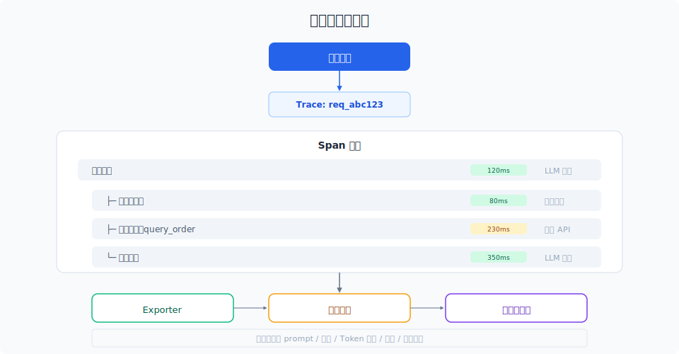

# 可观测性与全链路追踪

> 没有追踪的系统是一个黑箱。全链路追踪让你看到 Agent 的每一步——从用户输入到 LLM 调用到工具返回——而不是对着最终输出猜问题。

## 目录

- [为什么 Agent 需要可观测性](#为什么-agent-需要可观测性)
- [核心概念](#核心概念)
- [追踪架构](#追踪架构)
- [关键追踪点](#关键追踪点)
- [工具对比](#工具对比)
- [调试方法论](#调试方法论)
- [生产环境最佳实践](#生产环境最佳实践)
- [总结](#总结)
- [参考链接](#参考链接)

你好，我是江小湖。上一章解决了"Agent 好不好"和"谁来评"的问题。但当你发现指标变差了，**怎么知道是哪个环节出了问题？**

这就是可观测性 (Observability) 的战场。不是简单的日志，而是让系统的内部状态——每一步的输入、输出、耗时、代价——对开发者完全透明。

## 为什么 Agent 需要可观测性

传统软件的错误通常是确定性的：参数非法就会抛异常。Agent 的错误是**分布式的、不确定的、跨多个环节的**。一个典型故障排查场景：

> 用户问"帮我分析 Q3 财报"，Agent 回答了一堆"抱歉我无法完成"。
>
> 是意图识别错了？工具没找到？LLM 吃不住了？检索没召回？prompt 写坏了？还是模型今天抽风？
>
> **没有 Trace，你只能猜。**

Agent 的可观测性需要回答四个问题：

| 问题 | 不追踪时的局面 | 有追踪时的答案 |
|------|---------------|---------------|
| 哪个环节失败？ | 看日志大海捞针 | 直接看失败 span |
| 为什么 LLM 返回这个？ | 不知道输入了什么 | 看到完整 prompt + 响应 |
| 这一步为什么慢？ | 只知道总耗时长 | 看到每一步耗时分布 |
| Token 花在哪了？ | 不知道 | 每个 LLM 调用的 token 数 |

## 核心概念

### Trace（追踪）

一条 Trace 代表一次完整的 Agent 执行过程——从用户请求到最终响应。它由多个 Span 组成。

### Span（跨度）

Span 是 Trace 的基本单位，代表一个**有开始和结束的操作**。每个 Span 包含：

- **名称**：操作描述（如 "search_web"、"llm_call"）
- **时间**：开始时间、结束时间、耗时
- **属性**：输入、输出、元数据
- **状态**：成功、失败、错误信息
- **父子关系**：哪个 Span 调用了我，我调用了哪些 Span

一个典型的 Agent Trace 结构：

```
Trace: "用户请求：查询订单状态"
├── Span: 意图识别 (LLM 调用)
│   ├── 输入：用户消息 + system prompt
│   └── 输出：{"intent": "query_order", "params": {...}}
├── Span: 工具调用 — query_order
│   ├── 输入：order_id="ORD-123"
│   ├── 输出：{"status": "shipped", "eta": "2026-06-20"}
│   └── 耗时：230ms
├── Span: 回答生成 (LLM 调用)
│   ├── 输入：工具返回 + 对话历史
│   ├── 输出：用户的订单已发货，预计 6 月 20 日送达
│   └── 耗时：850ms
└── Span: 最终响应返回用户
```

## 追踪架构

<p align="center">
  
</p>

### 数据流

```
Agent 代码 → SDK 埋点 → 本地缓冲 → Exporter → 后端存储 → 查询/可视化
```

埋点应该做到**零侵入、零成本**——尽可能通过拦截器、中间件、装饰器自动完成，而不是在业务代码中手动打日志。

### 关联 ID (Correlation ID)

**追踪的核心是一个贯穿全流程的 Trace ID**。从用户输入入口生成，透传到每一个子调用——LLM 请求的 header、工具调用的上下文、缓存的 key——最终响应返回时也带上这个 ID。

当用户投诉"刚才那个回答不对"，你只需要看这个 Trace ID 对应的完整追踪数据。

## 关键追踪点

每个 Agent 系统都应该追踪以下关键节点：

### 1. LLM 调用

记录的信息：

- **完整 prompt**（system + user + history）
- **LLM 响应全文**（包括 tool_calls 等结构化输出）
- **token 数**（输入、输出、总消耗）
- **模型版本**（gpt-4o-2026-05-01 vs gpt-4o-mini）
- **耗时**（TTFT + 总耗时）
- **参数**（temperature、top_p、stop sequences）

> **始终记录完整 prompt 和响应**。这是调试的最高价值数据。考虑存储成本和隐私问题，可以设置保留期限（如 7 天）和自动脱敏。

### 2. 工具调用

记录的信息：

- **工具名 + 参数**：调了哪个工具，传了什么参数
- **工具返回**：API 返回的原始数据
- **工具错误**：错误码、错误信息、是否自动重试
- **耗时**：从发起调用到收到返回
- **工具版本**：API 版本号或 schema 版本

### 3. 检索/记忆

记录的信息：

- **查询向量/文本**：检索的原始 query
- **Top-K 结果**：返回的文档内容和分数
- **检索策略**：用了 vector search、keyword search 还是 hybrid
- **得分分布**：第一名的分数和第十名的分数（如果差距太小，说明检索质量不够好）

### 4. 决策节点

Agent 内部所有"判断"点都值得记录：

- **是否触发工具调用**：LLM 选择了哪个工具
- **是否触发人工介入**：什么条件下触发了 handoff
- **是否中止执行**：什么条件下 Agent 决定不再继续
- **路由决策**：多 Agent 场景下，任务分派给了哪个子 Agent

## 工具对比

目前主流的 Agent 可观测性工具有三个阵营：

| 工具 | 核心优势 | 适合场景 |
|------|---------|---------|
| LangFuse | 开源自托管、隐私优先、成本低 | 团队自建监控体系 |
| LangSmith | LangChain 生态、评测能力强 | 使用 LangChain/LangGraph 的项目 |
| OpenTelemetry | 通用标准、与基础设施打通 | 已有 OTel 基础设施的团队 |

### LangFuse 实践

LangFuse 是目前社区最流行的开源方案。集成方式：

```python
from langfuse.decorators import observe

@observe()
def my_agent(user_input: str):
    result = llm_call(user_input)
    tool_result = call_tool(result)
    return final_response(tool_result)
```

一个 `@observe` 装饰器就能完成基础追踪。它自动捕获函数调用链、参数和返回值、执行耗时和错误信息、LLM 调用的 token 数和模型名。

### OpenTelemetry

对于已经接入 OTel 的团队，OTel 的 LLM 语义约定 (Semantic Conventions) 值得关注。标准化的属性名让 Agent 追踪数据和分布式系统追踪数据**统一在一个仪表盘上**：

```python
from opentelemetry import trace

tracer = trace.get_tracer("agent")
with tracer.start_as_current_span("llm_call") as span:
    span.set_attribute("gen_ai.request.model", "gpt-4o")
    span.set_attribute("gen_ai.response.usage.input_tokens", 150)
    span.set_attribute("gen_ai.response.usage.output_tokens", 42)
    span.set_attribute("gen_ai.system", "openai")
```

## 调试方法论

有了全链路追踪之后，调试 Agent 就变得有章可循了。

### 故障定位流程

当一个任务失败时，按照以下顺序排查：

**第一步：看错误类型**

```mermaid
flowchart TD
    A[任务失败] --> B{Span 状态}
    B -->|"有 Error Span"| C[定位到具体失败环节]
    B -->|"全部 Success"| D[Agent "以为成功了"]
    C --> E[工具错误→检查 API/参数]
    C --> F[LLM 错误→检查 model/format]
    C --> G[超时→检查耗时分布]
    D --> H{结果质量}
    H -->|"LLM 输出差"| I[优化 prompt / 换模型]
    H -->|"检索内容不对"| J[优化检索策略 / chunk 方式]
```

**第二步：看耗时分布**

- **LLM 调用占 >80% 总时间**：正常，考虑换更快的模型
- **工具调用占 >50% 总时间**：外部 API 慢了，考虑加缓存或超时
- **检索占 >30% 总时间**：向量数据库响应慢了，考虑优化索引

**第三步：看 LLM 输入输出**

总是先看 LLM 的完整输入 prompt——**80% 的问题在这里暴露**：指令没有说清楚、格式要求被忽略了、示例不符合实际场景、上下文太长导致模型「遗忘」了早期指令。

### 典型故障模式

| 现象 | 可能的根因 | 看什么数据 |
|------|-----------|-----------|
| Agent 说"我做不到" | prompt 限制了能力或工具描述不充分 | LLM 的 input prompt |
| Agent 重复调用同一工具 | 上下文窗口限制或缺乏终止条件 | 工具调用链 Span |
| Agent 回答与上下文矛盾 | 检索结果中无关信息干扰 | 检索 Top-K 结果 |
| Agent 突然变"笨"了 | 新版 system prompt 意外覆盖了旧版 | prompt 的版本历史 |
| Agent 响应越来越慢 | 对话历史过长导致 LLM 处理变慢 | 每次 LLM 调用的输入 token 数 |

## 生产环境最佳实践

### 采样策略

- **所有失败请求**：采样率 100%
- **新功能请求**：采样率 100%（上线前 3 天）
- **正常请求**：采样率 1-10%
- **性能追踪**：随机采样，保持客观性

### 保留策略

- **全量数据**：保留 7 天
- **失败请求**：保留 30 天
- **评测集相关**：保留 90 天（用于回归评测）

### 脱敏

追踪数据中可能包含用户 PII（电话号码、地址等）。建议在埋点层做自动脱敏：

```
用户输入："帮我关掉 13800138000 的手机套餐"
脱敏后 "帮我关掉 [PHONE] 的手机套餐"
```

LLM 的 prompt 中也包含用户输入，同样需要脱敏。**不脱敏的追踪系统本身就是隐私风险**。

## 总结

没有可观测性，Agent 就是黑箱。全链路追踪让你**从猜问题变成看数据**，调试效率提升一个数量级。

核心原则：Trace ID 贯穿全流程、每个 LLM 调用记录完整 prompt+响应、用采样策略控制成本、建立标准化的故障定位流程。

**下一篇**：[成本监控与性能优化](02-cost-monitoring.md)——当 Agent 跑起来之后，怎么让它在预算内高效运行。

## 参考链接

- [LangFuse Documentation](https://langfuse.com/docs)
- [LangSmith Tracing](https://docs.smith.langchain.com/tracing)
- [OpenTelemetry GenAI Semantic Conventions](https://opentelemetry.io/docs/specs/semconv/gen-ai/)
- [Arize AI — LLM Observability](https://arize.com/llm-observability/)
- [Weights & Biases — LLM Trace](https://wandb.ai/site/solutions/llm-monitoring)
- [Phoenix by Arize](https://github.com/Arize-AI/phoenix)
