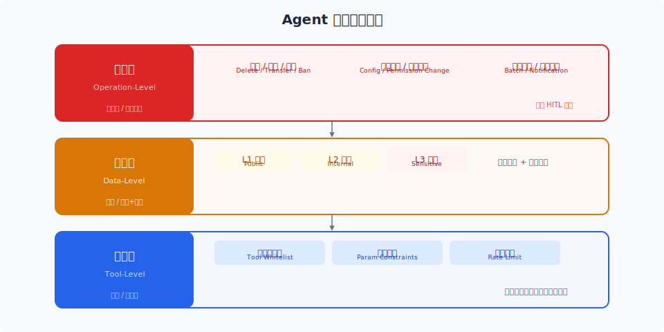

# 访问控制与沙箱执行

> Agent 的权限管理不是"要不要给"，而是"最小给多少"。沙箱执行确保即使 Agent 被攻破，伤害范围也控制在最小。

## 目录

- [Agent 权限模型](#agent-权限模型)
- [权限分层设计](#权限分层设计)
- [工具级权限](#工具级权限)
- [数据级权限](#数据级权限)
- [操作级权限](#操作级权限)
- [沙箱执行](#沙箱执行)
- [代码执行沙箱](#代码执行沙箱)
- [文件系统隔离](#文件系统隔离)
- [网络隔离](#网络隔离)
- [权限审计](#权限审计)
- [总结](#总结)
- [参考链接](#参考链接)

你好，我是江小湖。上一篇文章解决了"攻击者能不能骗 Agent"的问题。但即使 Agent 被攻破了，**一个设计良好的权限系统可以让攻击者做不了什么**。

## Agent 权限模型

### 传统权限 vs Agent 权限

| 维度 | 传统系统 | Agent 系统 |
|------|---------|-----------|
| 执行主体 | 固定用户/角色 | LLM 动态决策 |
| 权限判断时机 | 静态配置 | 运行时动态判断 |
| 权限粒度 | URL/方法级别 | 工具/参数/数据级别 |
| 风险特征 | 可预测 | 不可预测 |
| 审计难度 | 低 | 高 |

### 核心原则

**最小权限 (Least Privilege)**：Agent 默认没有任何权限，只为明确需要的能力授予权限。

**纵深防御 (Defense in Depth)**：权限不是"一层墙"，而是多层防线。

**可审计 (Auditable)**：每一次权限使用都记录在案。

## 权限分层设计

<p align="center">
  
</p>

```
操作级权限（最严格）
  └── 删除、修改配置、转账等 → 需要人工审批

数据级权限（中等）
  └── 读/写特定数据范围 → 按用户维度、数据敏感度分级

工具级权限（基础）
  └── 能调用哪些工具 → 每个工具独立授权
```

## 工具级权限

### 工具清单管理

每个 Agent 上线前，必须维护一个显式的工具清单，**白名单模式**——不在列表中的工具不可用。

```yaml
agent: customer-service
allowed_tools:
  - query_order
  - check_shipping
  - update_address
  - cancel_order        # 需要审批

restricted_tools:
  - delete_user         # ❌
  - execute_sql         # ❌
```

### 参数级约束

```json
{
  "tool": "query_order",
  "allowed_params": {
    "order_id": "*",
    "user_id": "{caller_id}"   # 只能查自己的
  }
}
```

### 调用频率限制

| 工具 | 每用户/分钟 | 每用户/小时 |
|------|-----------|-----------|
| query_order | 30 | 200 |
| cancel_order | 2 | 10 |

## 数据级权限

### 用户维度隔离

多租户：每个用户的向量数据库索引分离；检索时自动附加 `user_id` 过滤条件。

### 数据敏感度分级

| 级别 | 定义 | 示例 | 访问要求 |
|------|------|------|---------|
| L1 公开 | 无敏感信息 | 产品目录 | 无限制 |
| L2 内部 | 一般敏感 | 订单记录 | 用户身份认证 |
| L3 敏感 | 高度敏感 | 支付信息 | 特定 Agent + 人工审批 |

### 数据脱敏

系统层自动脱敏，不依赖 Agent 自觉：

```
Agent 内部看到: "13800138000"
Agent 回答中呈现: "138****8000"
```

## 操作级权限

### 操作分级

| 等级 | 定义 | 示例 | 控制方式 |
|------|------|------|---------|
| 读取 | 无副作用 | 查订单 | 自动执行 |
| 写入 | 可逆 | 更新草稿 | 自动 + 审计 |
| 变更 | 不可逆 | 取消订单 | 人工审批 |
| 高危 | 高影响 | 转账 | 人工 + 双人确认 |

### Human-in-the-Loop 审批

```
Agent: "用户申请取消订单 ORD-123"
系统: "取消订单需要审批，已通知人工"
人工审批: "同意"
Agent: 执行取消操作
```

关键点：超时机制、独立审批通道（IM/邮件）、审计追踪、紧急回滚。

## 沙箱执行

### 沙箱级别

| 类型 | 隔离强度 | 性能开销 | 适用场景 |
|------|---------|---------|---------|
| 进程级 | 低 | 低 | 脚本执行 |
| 容器级 | 中 | 中 | 代码执行 |
| 虚拟机级 | 高 | 高 | 不可信代码 |

### 安全策略

```yaml
sandbox:
  network: isolated
  filesystem: ephemeral
  cpu_limit: 1
  memory_limit: 512MB
  timeout: 60s
  allowed_imports: [pandas, numpy, json]
  blocked_imports: [os, subprocess, socket, requests]
```

### 无状态沙箱

每次代码执行后自动销毁，不保留任何状态。数据通过 input/output 接口传递。

### 文件系统隔离

```
Agent 工作目录: /tmp/agent-data/{session_id}/
  ├── input/    只读
  ├── output/   写后读
  └── workspace/ 临时读写

系统文件: 不可访问
其他用户文件: 不可访问
```

### 网络隔离

出站默认禁止，入站默认禁止，按需白名单开放。

## 权限审计

```json
{
  "timestamp": "2026-06-18T10:00:00Z",
  "trace_id": "req_abc123",
  "user_id": "user_456",
  "agent_id": "customer-service-v3",
  "action": "call_tool",
  "tool": "cancel_order",
  "params": {"order_id": "ORD-123"},
  "decision": "need_approval",
  "approver": "admin_789",
  "result": "approved"
}
```

审计日志使用 append-only 存储，Agent 自身无权访问和修改。

## 总结

权限控制和沙箱执行是 Agent 安全的两道实体防线。**权限控制限制"能做什么"，沙箱限制"能做到什么程度"**。

**下一篇**：[输出过滤与人工审批](03-output-and-human-in-loop.md)——关注 Agent 的输出安全和人工介入流程。

## 参考链接

- [OWASP — LLM Access Control](https://owasp.org/www-project-top-10-for-large-language-model-applications/)
- [Anthropic — Tool Use Safety](https://docs.anthropic.com/en/docs/build-with-claude/tool-use)
- [Firecracker MicroVM](https://firecracker-microvm.github.io/)
- [gVisor — Container Security](https://gvisor.dev/)
