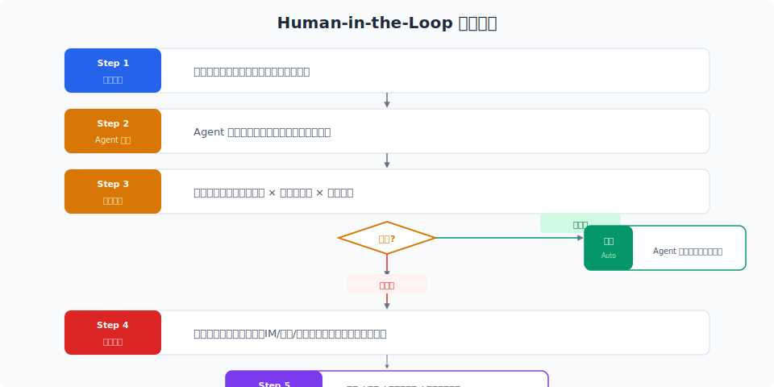

# 输出过滤与人工审批

> Agent 的输入可以过滤，权限可以控制，但最终用户看到的是 Agent 的输出——这里出问题，前面的防御就白做了。输出过滤 + 人工审批是最后两道门。

## 目录

- [为什么输出过滤很重要](#为什么输出过滤很重要)
- [输出过滤的类型](#输出过滤的类型)
- [过滤实现策略](#过滤实现策略)
- [幻觉检测](#幻觉检测)
- [Human-in-the-Loop 审批机制](#human-in-the-loop-审批机制)
- [审批流程设计](#审批流程设计)
- [紧急回滚](#紧急回滚)
- [安全事件的响应流程](#安全事件的响应流程)
- [总结](#总结)
- [参考链接](#参考链接)

你好，我是江小湖。前两篇文章建立了一个逐步收紧的防御体系：先防止注入，再限制权限，最后用沙箱兜底。但即使这些都做到了，**Agent 的输出仍然可能出问题**——幻觉、敏感内容、错误的决策。

输出过滤和人工审批是 Agent 安全的两道"最后防线"。

## 为什么输出过滤很重要

**防止敏感信息外泄**。Agent 在回复中可能无意透露了其他用户的信息、内部 API 详情、模型本身的 system prompt。

**防止有害内容**。LLM 的输出可能包含偏见、歧视、不当建议。

**维护用户信任**。一个自信满满的错误回答（幻觉）对用户信任的损害，比一个"我不知道"的回答严重得多。

## 输出过滤的类型

### 敏感信息过滤

```json
{
  "sensitive_patterns": [
    {"type": "api_key", "pattern": "[A-Za-z0-9]{32,}"},
    {"type": "phone", "pattern": "1[3-9]\\d{9}"},
    {"type": "id_card", "pattern": "\\d{18}[\\dXx]"}
  ]
}
```

**替换而非阻断**：`"13800138000" → "138****8000"`。

### 有害内容过滤

仇恨言论、暴力内容、不当建议、诱导提示。

### 事实性检查

对可验证的事实做自动化验证——把 Agent 回答发回给 LLM 做快速验证。对不可验证的分析性回答，标记为「未验证」。

## 过滤实现策略

### 过滤层级

```
Layer 1: 正则/模式匹配 → 微秒级 → 手机号、邮箱、API Key
Layer 2: 内容分类器 → 毫秒级 → 仇恨言论、暴力
Layer 3: LLM 验证 → 秒级 → 事实性检查（仅高风险时启用）
```

### 过滤时机

```
Agent 生成回复 → L1 过滤 → 命中？→ 脱敏
  → L2 过滤 → 命中？→ 阻断 + 记录审计
  → L3（仅高危）→ 命中？→ 触发人工审批
  → 输出给用户
```

### 过滤结果的处理

| 结果 | 动作 | 用户看到的 |
|------|------|-----------|
| 安全 | 正常输出 | Agent 的回答 |
| 敏感内容 | 自动脱敏 | 脱敏后的回答 |
| 有害内容 | 阻断输出 | "抱歉，我无法回答" |
| 高风险 | 触发审批 | "等待人工确认" |

## 幻觉检测

**置信度评分**：让 LLM 对自己的回答做置信度评估，低于阈值的追加免责声明或触发人工审核。

**引用验证**：对引用来源的回答，验证引用是否真实存在。

**RAG 自查**：用答案作为 query 再检索一次，看检索结果是否支持答案内容。

## Human-in-the-Loop 审批机制

### 何时需要 HITL

- 高危工具调用：删除用户、批量操作
- 高影响决策：退款、赔偿
- 不可逆操作：删除数据、修改权限
- 低置信度高风险：Agent 没信心但操作影响大

### HITL 的模式

```
模式 1: 先审后执 (Pre-Approval) → 最安全，高延迟
模式 2: 先执后审 (Post-Approval) → 最灵活，有风险
模式 3: 监督模式 (Supervised) → 实时干预
```

## 审批流程设计

<p align="center">
  
</p>

### 审批通知

通过独立渠道（IM/邮件/系统）发送，包含：上下文、风险说明、决策选项、超时时间。

### 审批超时

```
普通操作: 5 分钟 → 拒绝
紧急操作: 1 分钟 → 转第二审批人
高风险操作: 永不自动批准
```

### 审批日志

```json
{
  "approval_id": "appr_789",
  "trace_id": "req_abc123",
  "requested_action": "cancel_order ORD-123",
  "risk_score": 65,
  "approver": "admin_789",
  "decision": "approved",
  "note": "用户身份验证通过"
}
```

## 紧急回滚

**在设计工具时就应该考虑回滚**：

```
# 好的设计：软删除 + 延时清除
deactivate_user(user_id) → 7 天内可恢复
```

每个工具对应撤销操作：

| 操作 | 撤销操作 | 撤销窗口 |
|------|---------|---------|
| 更新订单 | 版本回退 | 24 小时 |
| 删除用户 | 软删除恢复 | 7 天 |
| 修改配置 | 配置回退 | 30 天 |

## 安全事件的响应流程

```
1. 检测 → 告警触发
2. 评估 → 影响范围？
3. 阻断 → 暂停服务或限制权限
4. 取证 → 导出审计日志
5. 修复 → 更新防御策略
6. 复盘 → 改进体系
7. 通知 → 通知受影响用户
```

### 告警分级

| 级别 | 定义 | 响应 | 方式 |
|------|------|------|------|
| P0 | 敏感数据泄露 / 系统被攻破 | 立即 | 暂停服务 + 全组响应 |
| P1 | 成功注入 / 越权操作 | 15 分钟 | 隔离 Agent |
| P2 | 注入被拦截 | 4 小时 | 评估防御 |
| P3 | 误报 | 24 小时 | 下次迭代修复 |

## 总结

```
┌─ 输入层: Prompt 注入检测 + 指令隔离
├─ 执行层: 权限控制 + 沙箱
└─ 输出层: 输出过滤 + 人工审批 + 回滚
```

**下一篇**：[安全实现：构建纵深防御系统](04-security-implementation.md)——把前三篇的理论落地为代码。

## 参考链接

- [OWASP — LLM Output Handling](https://owasp.org/www-project-top-10-for-large-language-model-applications/)
- [Anthropic — Hallucination Detection](https://docs.anthropic.com/en/docs/build-with-claude/reduce-hallucinations)
- [NIST — AI Risk Management Framework](https://www.nist.gov/artificial-intelligence/executive-order-safe-secure-and-trustworthy-artificial-intelligence)
- [Google — Human-in-the-Loop for AI](https://cloud.google.com/architecture/human-in-the-loop)
- [Microsoft — Responsible AI Practices](https://www.microsoft.com/en-us/ai/responsible-ai)
