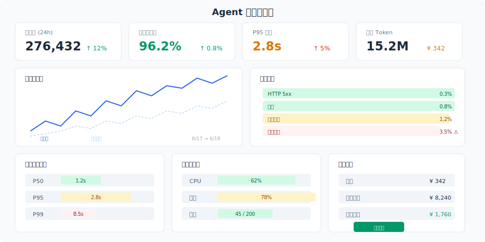

# 监控运维与项目文档

> 上线只是开始。监控让系统持续健康，文档让团队持续交付。**没有文档的系统是一个"只有你会修"的系统。**

## 目录

- [生产监控体系](#生产监控体系)
- [告警策略](#告警策略)
- [运维手册](#运维手册)
- [项目文档体系](#项目文档体系)
- [技术文档](#技术文档)
- [用户文档](#用户文档)
- [写在最后](#写在最后)
- [参考链接](#参考链接)

你好，我是江小湖。前两篇文章覆盖了架构设计、API 服务化和部署方案。系统上线后，真正的挑战才开始——**如何确保系统持续稳定运行，以及后来者如何接手这个系统**。

本文分为两部分：监控运维（让系统持续健康）和项目文档（让知识可以传承）。

## 生产监控体系

<p align="center">
  
</p>

### 四类黄金指标 (Four Golden Signals)

Google SRE 推荐的四个核心监控维度，对于 Agent 系统同样适用：

**延迟 (Latency)**。请求处理时间，区分成功和失败的延迟：

```
Agent 响应时间:
  P50: 1.2s    ← 典型用户体验
  P95: 3.8s    ← 慢请求边界
  P99: 8.5s    ← 异常值（可能有问题）
```

重点关注 P95 和 P99——大多数用户感觉"流畅"还是"慢"，取决于尾部延迟。

**流量 (Traffic)**。系统的请求量：

```
请求量: 3.2 请求/秒（日均 27 万）
并发连接: 45
用户数: 1.2 万 DAU
```

流量趋势比绝对值更重要——突然下降可能表示系统不可用，突然上升可能表示被攻击。

**错误 (Errors)**。请求失败的比例：

```
错误类型:
  - HTTP 5xx: 0.3%（服务端错误）
  - 超时: 0.8%（外部依赖慢）
  - 工具错误: 1.2%（外部 API 失败）
  - LLM 错误: 0.1%（模型异常）
  - 任务失败: 3.5%（Agent 逻辑错误）
```

**任务失败率是最重要的 Agent 专属指标**——它反映的是"用户任务没完成"，而不仅仅是"系统没报错"。

**饱和度 (Saturation)**。系统资源使用程度：

```
CPU: 62%
内存: 78%
并发请求: 45 / 上限 200
队列深度: 12
```

饱和度接近 80% 时就应该考虑扩容。

### Agent 专属监控指标

除了通用指标，Agent 系统还需要关注：

```
Token 消耗:
  - 日均: 1500 万 token
  - 每请求: 平均 4500 token
  - 输入输出比: 3.2:1

LLM 调用:
  - 每请求次数: 平均 3.5 次
  - 工具调用率: 67%（多少请求调用了工具）
  - 缓存命中率: 22%

用户反馈:
  - 满意度评分: 4.2/5
  - 人工介入率: 2.3%
  - 用户重试率: 1.8%
```

### 监控工具栈

推荐的开源监控栈：

```
指标采集: Prometheus + 自定义 exporter
日志: Loki 或 Elasticsearch
链路追踪: Tempo 或 Jaeger
可视化: Grafana
告警: AlertManager
```

一个 Grafana 仪表盘至少包含以下面板：

- **请求量**（折线图，按 API 维度分组）
- **响应时间**（P50/P95/P99 折线图）
- **错误率**（堆叠面积图，按错误类型分组）
- **Token 消耗**（每日趋势 + 累计）
- **任务完成率**（时间序列，最关键的指标）
- **资源利用率**（CPU/内存/并发数）
- **用户满意度**（每日评分趋势）

## 告警策略

### 告警分级

| 级别 | 定义 | 响应 | 通知方式 |
|------|------|------|---------|
| P0 | 服务不可用 | 立即 | 电话 + 即时消息 |
| P1 | 核心功能受损 | 15 分钟 | 即时消息 |
| P2 | 非核心功能异常 | 2 小时 | 邮件 |
| P3 | 预警信息 | 24 小时 | 邮件 / 仪表盘 |

### 告警规则示例

```yaml
# P0 规则
- alert: ServiceDown
  expr: up{job="agent-engine"} == 0
  for: 1m
  severity: critical

- alert: HighErrorRate
  expr: rate(http_requests_errors_total[5m]) / rate(http_requests_total[5m]) > 0.05
  for: 3m
  severity: critical

# P1 规则
- alert: HighLatency
  expr: histogram_quantile(0.95, rate(http_request_duration_seconds_bucket[5m])) > 5
  for: 5m
  severity: warning

- alert: TaskFailureRate
  expr: rate(agent_task_failures_total[30m]) / rate(agent_task_total[30m]) > 0.1
  for: 5m
  severity: warning

# P2 规则
- alert: TokenSpike
  expr: rate(agent_tokens_total[1h]) / rate(agent_tokens_total[24h]) > 2
  for: 10m
  severity: info

- alert: BudgetWarning
  expr: daily_cost > daily_budget * 0.8
  for: 1h
  severity: info
```

### 告警响应

每个告警都应该有对应的 **Runbook（运维手册）**：

```markdown
# Runbook: HighErrorRate

## 检查步骤
1. 登录 Grafana，查看错误分布 → 是哪个 API 错误最多？
2. 查看最近的部署记录 → 是否有最近变更？
3. 查看 LLM/Tool 面板 → 是内部错误还是外部依赖？

## 常见原因及处理
| 错误模式 | 可能原因 | 处理方式 |
|---------|---------|---------|
| 全是 5xx | 服务内部错误 | 检查日志、回滚最近部署 |
| 全是超时 | 外部依赖慢 | 检查 Redis/数据库/LLM 状态 |
| 全是工具错误 | 外部 API 不可用 | 联系外部 API 负责人 |
| Agent 任务失败 | prompt 或逻辑问题 | 检查最近 prompt 变更 |

## 升级流程
- 15 分钟内未恢复 → 通知 Tech Lead
- 30 分钟内未恢复 → 全组响应
```

## 运维手册

每个 Agent 系统都应该有一份运维手册（Runbook），至少包含：

```
RUNBOOK.md
├── 系统架构图
├── 服务依赖关系
├── 启动/停止/重启步骤
├── 常见故障排查流程
├── 数据备份与恢复
├── 扩容流程
└── 紧急联系人
```

## 项目文档体系

项目文档不只是 README——它是一整套文档体系，服务不同角色：

```
docs/
├── README.md                # 项目概述（给所有人看）
├── ARCHITECTURE.md          # 架构设计（给开发者看）
├── API.md                   # API 文档（给集成方看）
├── DEPLOYMENT.md            # 部署文档（给运维看）
├── EVALUATION.md            # 评测报告（给管理层看）
├── SECURITY.md              # 安全策略（给安全审计看）
├── CONTRIBUTING.md          # 贡献指南（给贡献者看）
└── CHANGELOG.md             # 变更日志（给所有人看）
```

### README

README 是项目的门面，回答四个问题：

```markdown
# Agent 项目名

## 简介
一句话说清楚项目是干什么的。

## 核心能力
- 能力 1：...
- 能力 2：...
- 能力 3：...

## 快速开始
```bash
# 3 步跑起来
git clone ...
docker compose up
curl http://localhost:8000/health
```

## 技术栈
- 语言：Python 3.12
- 框架：FastAPI + LangGraph
- 模型：GPT-4o / Claude Opus 4
- 存储：PostgreSQL + Redis + Qdrant
```

### ARCHITECTURE.md

包含：

- **系统架构图**（清晰的高层架构，标注组件间关系）
- **数据流图**（一个请求从进入系统到返回的完整路径）
- **关键设计决策**（为什么选 A 而不是 B）
- **已知限制**（当前版本的局限性和未来的改进方向）

### CHANGELOG.md

每次变更都记录：

```markdown
# Changelog

## [1.2.0] - 2026-06-18
### 新增
- 新增订单查询工具
- 支持流式响应（SSE）

### 变更
- 升级 LangGraph 到 0.3.0
- 优化上下文管理策略（减少 30% token 消耗）

### 修复
- 修复时区处理错误
- 修复审批超时未正确处理
```

## 技术文档

### 架构决策记录 (ADR)

对于重要技术决策，使用 ADR 格式记录：

```markdown
# ADR-001：使用 LangGraph 作为 Agent 编排框架

**状态**：已接受  
**日期**：2026-06-01

## 背景
需要选择 Agent 执行引擎

## 决策
使用 LangGraph 作为核心编排框架

## 理由
1. 社区最活跃，文档最完善
2. 原生支持状态图、条件分支、循环
3. 团队成员已有使用经验

## 替代方案
- CrewAI：更适合固定团队结构，动态任务支持不足
- 自研引擎：灵活性高但开发成本太大

## 影响
- 正面：加速开发，团队效率提升
- 负面：引入框架依赖，版本升级需要关注 breaking changes
```

ADR 最大的价值不是记录"我们做了什么"，而是**记录"我们为什么这么做"**——几个月后回头看，你还能知道做这个决策的上下文。

## 用户文档

### API 文档

使用 OpenAPI/Swagger 自动生成（FastAPI 内置支持）：

```
启动服务后：http://localhost:8000/docs
```

API 文档应该包含：

- 每个接口的请求和响应示例
- 错误码和典型错误场景
- 限流策略说明
- 认证方式说明

### 常见问题 (FAQ)

收集生产环境中用户常见的问题和对应的解决方法，随着系统运行持续补充。

## 写在最后

### 旅程回顾

让我们回到起点，回顾这 14 章的旅程：

```
第 00 章  全景与路线 → Agent 是什么，蓝图
第 01 章  LLM 基础    → Token、注意力、能力边界
第 02 章  模型访问    → API 调用、模型选型、本地部署
第 03 章  Prompt 工程 → 设计模式、结构化输出、System Prompt
第 04 章  工具调用    → Function Calling、MCP 实战
第 05 章  Agent 循环  → 感知-思考-行动
第 06 章  上下文工程  → 窗口管理、压缩、隔离
第 07 章  RAG 流水线  → 文档处理、检索策略、GraphRAG
第 08 章  记忆管理    → 短期/长期、Mem0/Letta/Zep/Cognee
第 09 章  框架    → LangChain/LangGraph/CrewAI/Dify/OAI SDK/ADK
第 10 章  扩展协议    → MCP/A2A/ACP/ANP/Skills
第 11 章  多 Agent   → 架构模式、角色设计、CrewAI/LangGraph 实践
第 12 章  评测与可观测 → 三层评测、LLM-as-Judge、Tracing、成本
第 13 章  安全与治理 → Prompt 注入、权限控制、沙箱、HITL
第 14 章  产品交付 → 架构设计、部署、监控、文档
```

从"LLM 是什么"到"多 Agent 生产系统部署"，这条路很长。但走到这里，你已经掌握了构建一个生产级 Agent 系统所需的全栈知识。

### 下一步

Agent 技术仍在飞速发展。保持学习的建议：

- **动手**：最好的学习方式是做一个小项目——哪怕只是一个 100 行的 MCP Server
- **关注社区**：LangChain、Anthropic、OpenAI 的官方博客
- **持续重构**：你现在写的不对，但你写的东西让你知道什么是对的
- **分享**：教别人是最好的学习方式

感谢你一路走到这里。我是江小湖，我们下一个项目见。

## 参考链接

- [Google SRE Book](https://sre.google/sre-book/table-of-contents/)
- [Prometheus Documentation](https://prometheus.io/docs/)
- [Grafana Dashboards](https://grafana.com/grafana/dashboards/)
- [FastAPI Documentation](https://fastapi.tiangolo.com/)
- [ADR — Architecture Decision Records](https://adr.github.io/)
- [Keep a Changelog](https://keepachangelog.com/)
