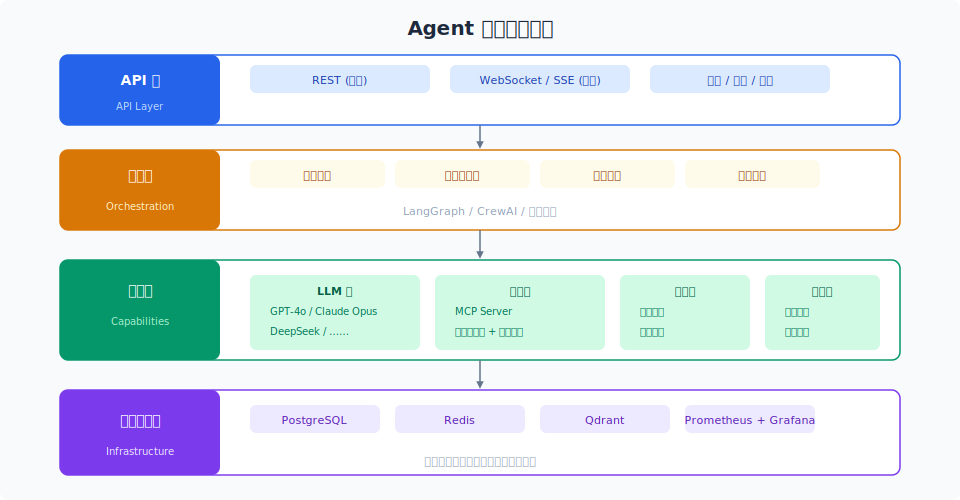

# 架构设计与 API 服务化

> 13 章的知识，最终凝结为一个可部署的 Agent 系统。架构设计决定系统的天花板，API 服务化决定系统的可访问性。

## 目录

- [架构设计原则](#架构设计原则)
- [参考架构](#参考架构)
- [Agent 核心引擎](#agent-核心引擎)
- [API 层设计](#api-层设计)
- [流式响应 (SSE)](#流式响应-sse)
- [状态管理](#状态管理)
- [扩展性设计](#扩展性设计)
- [总结](#总结)
- [参考链接](#参考链接)

你好，我是江小湖。欢迎来到最后一章。前 14 章我们走过了从 LLM 基础到 Agent 安全的全部过程。**现在，是时候把这些知识变成一个真正可部署的系统了。**

本文从架构设计和 API 层切入——这是 Agent 服务化最核心的两个决策点。

## 架构设计原则

### 分层分离

一个生产级 Agent 系统应该至少分为四层：

```
用户界面层 (UI/API) — 与用户交互的入口
    │
编排层 (Orchestration) — Agent 逻辑、任务调度、状态管理
    │
能力层 (Capabilities) — LLM、工具、检索、记忆
    │
基础设施层 (Infrastructure) — 存储、缓存、计算
```

每层独立部署、独立扩展、独立演进。**下层不依赖上层**。

### 无状态优先

Agent 的核心执行引擎应该是无状态的——所有状态存储在外部：

- 对话历史 → 数据库 / Redis
- 记忆 → 持久化存储
- 会话状态 → 缓存
- 配置 → 配置中心

**状态越少，运维越简单。**

### 优雅降级

任何外部依赖都可能不可用。每个外部调用都要有 fallback 和 timeout：

```
LLM 不可用 → 切换到备用模型 / 返回缓存
向量数据库不可用 → 切换到关键词搜索
工具 API 不可用 → 告知用户功能暂不可用
```

## 参考架构

<p align="center">
  
</p>

## Agent 核心引擎

### 执行循环

```python
async def agent_loop(request: UserRequest) -> AsyncGenerator[Event, None]:
    context = await build_context(request)
    while not should_stop(context):
        response = await llm_call(context)
        if response.has_tool_calls:
            for tool_call in response.tool_calls:
                result = await execute_tool(tool_call)
                context.add_tool_result(result)
                yield Event("tool_result", tool_call.name, result)
            continue
        yield Event("response", response.text)
        break
```

### 事件驱动

推荐使用事件驱动架构，每个 Agent 步骤发出事件，用于前端实时显示进度、审计日志、性能监控。

### 错误处理

```python
async def safe_llm_call(context, max_retries=3):
    for attempt in range(max_retries):
        try:
            return await primary_llm(context)
        except RateLimitError:
            if attempt == max_retries - 1:
                return await fallback_llm(context)
            await asyncio.sleep(2 ** attempt)
        except TimeoutError:
            continue
        except APIError as e:
            if e.is_transient:
                continue
            raise
```

## API 层设计

### 同步 API

```
POST /api/v1/agent/chat
{
  "user_id": "usr_123",
  "session_id": "sess_456",
  "message": "帮我查一下最近的订单",
  "stream": false
}

→ 响应:
{
  "response": "您最近的订单是 ORD-789",
  "metadata": {"latency_ms": 2340, "tokens_used": 1250}
}
```

### API 设计原则

**版本化**：`/v1/agent/chat`

**幂等性**：关键操作提供 `idempotency_key` 防止重复执行。

**限流**：API 网关层按用户维度：30 请求/分钟/用户，1000 请求/分钟/全局。

**统一响应格式**：

```json
{
  "code": 0,
  "message": "success",
  "data": { ... },
  "request_id": "req_abc123"
}
```

## 流式响应 (SSE)

Agent 的思考过程往往是多步的，**流式响应是生产级 Agent 的标配**。

```
POST /api/v1/agent/chat/stream

→ SSE 流:
data: {"type": "status", "content": "正在分析您的问题..."}
data: {"type": "tool_call", "tool": "query_order", "params": {...}}
data: {"type": "tool_result", "result": {...}}
data: {"type": "text", "content": "您最近的订单是 ORD-789"}
data: {"type": "done"}
```

心跳：长时间运行需要心跳机制。中断：用户可以取消正在运行的 Agent。

## 状态管理

### 会话管理

```json
{
  "id": "sess_456",
  "user_id": "usr_123",
  "messages": [...],
  "status": "active",
  "expires_at": "..."
}
```

会话 TTL：活跃 24h，已完成 7d，审批中 1h。

### 上下文管理

```
短期: 最近 10 轮对话（始终在上下文中）
中期: 最近 20 轮对话摘要（超出短期时使用）
长期: 用户画像 + 长期记忆（按需注入）
```

## 扩展性设计

### 水平扩展

Agent 引擎无状态，可水平扩展。通过 Redis 共享会话数据和缓存。

### 异步任务队列

耗时操作（批量处理、定时任务）使用消息队列：RabbitMQ / Redis Streams。

### 插件机制

```python
class ToolPlugin(ABC):
    @abstractmethod
    async def execute(self, params: dict) -> ToolResult: ...
    @abstractmethod
    def get_schema(self) -> dict: ...

register_tool("query_order", QueryOrderTool())
```

## 总结

核心要点：分层分离 → 无状态引擎 → 流式响应 (SSE) → 错误处理链 → 插件化工具。

**下一篇**：[部署方案](02-deployment.md)——Docker 容器化、CI/CD、环境管理。

## 参考链接

- [FastAPI Documentation](https://fastapi.tiangolo.com/)
- [Server-Sent Events (MDN)](https://developer.mozilla.org/en-US/docs/Web/API/Server-sent_events)
- [12-Factor App](https://12factor.net/)
- [Anthropic — Building Production Agents](https://docs.anthropic.com/en/docs/build-with-claude/agent-patterns)
