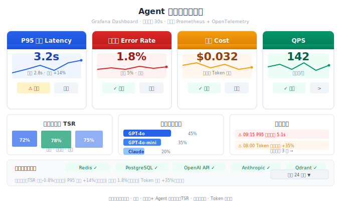
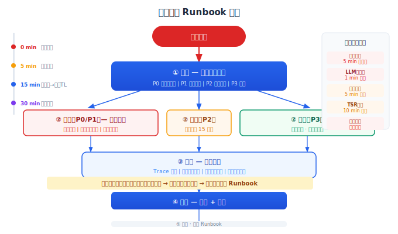

# Agent 运维实战

> 上线不是结束，是运维的开始。Agent 系统比传统系统多了一层"逻辑健康"的运维维度——不仅要关注服务器稳不稳定，还要关注 Agent 聪不聪明。

## 目录

- [Agent 运维的特殊性](#agent-运维的特殊性)
- [日常巡检](#日常巡检)
- [故障响应](#故障响应)
- [灾难恢复](#灾难恢复)
- [运维手册 (Runbook)](#运维手册-runbook)
- [总结](#总结)
- [参考链接](#参考链接)

你好，我是江小湖。前文解决了"怎么让系统跑起来"。但系统上线后，真正的挑战才开始——**怎么确保它持续稳定运行，出问题了怎么快速恢复**。

## Agent 运维的特殊性

传统后端运维关注三个维度：**可用性**（服务 up/down）、**性能**（延迟/吞吐量）、**容量**（资源使用率）。Agent 系统多了一个维度——**逻辑健康**：

```
传统维度:
  ┌── 服务是否可用？  → 健康检查
  ├── 响应是否够快？  → P95 延迟
  └── 资源够不够用？  → CPU/内存

Agent 新增维度:
  ┌── Agent 还聪明吗？  → TSR / 用户满意度
  ├── 成本还在预算内吗？ → Token 消耗 / 每请求成本
  └── 工具调用对了吗？  → 工具准确率 / 异常调用模式
```

**服务 200 OK 不代表 Agent 正常工作。** Agent 可能返回了"对不起我做不到"但 HTTP 状态码是 200。传统运维监控不到这种"逻辑上的故障"。

## 日常巡检

### 巡检清单

```
每日巡检（自动，5 分钟）:
  ├── [ ] 任务完成率 vs 前一天（环比 < -2% 告警）
  ├── [ ] P95 延迟是否在基线内（环比 < +20%）
  ├── [ ] 错误率是否异常（绝对值 < 5%）
  ├── [ ] 外部依赖状态（LLM API / 工具 API）
  ├── [ ] Token 消耗 vs 预期（环比 < +30%）
  └── [ ] 关键指标的 7 日趋势（连续下降 3 天告警）

每周巡检（半自动，15 分钟）:
  ├── [ ] 预算消耗进度（月预算使用率）
  ├── [ ] 用户满意度评分趋势
  ├── [ ] 评测集指标 vs 基线（TSR、工具准确率）
  ├── [ ] 安全日志检查（注入尝试数量、模式）
  └── [ ] 慢查询分析（Trace 中耗时 > P99 的请求）

每月巡检（手动，30 分钟）:
  ├── [ ] 容量评估（是否需要扩容）
  ├── [ ] 依赖版本检查（LLM SDK、框架库更新）
  ├── [ ] 密钥轮换（API Key、数据库密码）
  ├── [ ] Runbook 演练（模拟故障，验证响应流程）
  └── [ ] 灾难恢复演练（从备份恢复数据）
```

巡检的大部分步骤应该自动化。每日巡检可以全自动，只有需要人工判断的项（如用户满意度趋势分析、安全日志异常模式识别）才留给人。

<p align="center">
  
  <br/><em>图：运维仪表盘——四维指标卡片 + 模型分布 + 告警流</em>
</p>

### 巡检脚本示例

```python
# daily_check.py — 每日自动巡检
import httpx
from datetime import datetime, timedelta

def run_daily_check():
    checks = []
    # 1. TSR 环比
    today_tsr = query_tsr(datetime.now() - timedelta(days=1))
    yesterday_tsr = query_tsr(datetime.now() - timedelta(days=2))
    tsr_delta = today_tsr - yesterday_tsr
    checks.append({
        "name": "TSR 环比",
        "value": f"{today_tsr:.1f}%",
        "delta": f"{tsr_delta:+.1f}%",
        "status": "PASS" if tsr_delta > -2 else "FAIL"
    })

    # 2. P95 延迟
    p95 = query_p95_latency()
    baseline = get_baseline("p95_latency")
    p95_ratio = p95 / baseline
    checks.append({
        "name": "P95 延迟",
        "value": f"{p95:.1f}s",
        "baseline": f"{baseline:.1f}s",
        "status": "PASS" if p95_ratio < 1.2 else "FAIL"
    })

    # 3. 错误率
    error_rate = query_error_rate()
    checks.append({
        "name": "错误率",
        "value": f"{error_rate:.1f}%",
        "status": "PASS" if error_rate < 5 else "FAIL"
    })

    # 汇总
    failures = [c for c in checks if c["status"] == "FAIL"]
    if failures:
        send_alert("每日巡检发现异常", failures)
        create_incident("daily_check_failure", failures)
    else:
        log_info("每日巡检全部通过")

    return checks
```

### 巡检自动化程度

```
每日巡检: 100% 自动 → 异常时自动告警 + 创建事件
每周巡检: 80% 自动 → 自动收集数据，人工审阅结果
每月巡检: 50% 自动 → 自动准备报告，需要人工操作
```

## 故障响应

### 故障分类

| 类型 | 示例 | 影响范围 |
|------|------|---------|
| 服务不可用 | Agent 引擎挂掉、数据库连接失败 | 全部用户 |
| 能力降级 | LLM API 限流、工具 API 返回错误 | 部分功能 |
| 质量下降 | TSR 下降、用户满意度骤降 | 用户体验 |
| 安全事件 | 注入攻击成功、数据泄露 | 数据安全 |

不同类型有不同的响应优先级。**安全事件 > 服务不可用 > 质量下降 > 能力降级。**

### 响应流程

```
1. 感知
   告警触发、用户投诉、或者巡检发现异常
   ↓
2. 评估影响
   - 哪些用户受影响？（全部 / 部分用户 / 特定功能）
   - 严重程度如何？（完全不可用 / 响应慢 / 回答不准确）
   - 是否涉及数据安全？
   ↓
3. 止血（最快速度恢复服务，不查根因）
   - 回滚最近部署（如果最近有变更）
   - 降级到备用模型 / 备用工具
   - 限流或暂停非核心功能
   ↓
4. 定位根因
   - 查看 Trace 定位失败环节
   - 对比变更前后的指标差异
   - 检查外部依赖状态
   ↓
5. 修复
   - 执行修复操作
   - 验证修复效果
   ↓
6. 复盘
   - 根因分析（5 Whys）
   - 改进措施（避免再次发生）
   - 更新 Runbook
```

### 止血优先原则

故障发生时最常见的错误是花大量时间定位根因，而不是先恢复服务。

```
❌ 花 30 分钟分析"为什么 GPT-4o 返回了错误格式"
✅ 立即切换到 gpt-4o-mini 或备用模型，恢复服务后再分析

❌ 花 1 小时排查"为什么 Redis 连接失败"
✅ 立即重启 Redis 或切换到备用 Redis 实例，恢复服务后再分析

❌ 花 20 分钟读日志"为什么 TSR 降了"
✅ 立即回滚最新部署，恢复服务后再分析
```

**止血就是以最快速度恢复到用户可用状态。** 等用户能用系统之后，你有充足的时间找根因。

### 不同故障类型的止血方案

| 故障类型 | 止血动作 | 恢复时间目标 |
|---------|---------|------------|
| 引擎崩溃 | 重启 / 回滚 | 5 分钟 |
| LLM API 不可用 | 切换到备用模型 | 1 分钟 |
| 工具 API 失败 | 切换到缓存结果 / 告知用户 | 5 分钟 |
| TSR 下降 | 回滚 prompt 变更 | 10 分钟 |
| 成本异常 | 强制路由到更便宜的模型 | 5 分钟 |
| 安全事件 | 暂停服务 / 隔离 Agent | 立即 |

每个止血动作都要自动化——不要等人工操作。例如，LLM API 不可用时，自动切换到备用模型；TSR 下降时，自动回滚上一个 prompt 版本。

<p align="center">
  
  <br/><em>图：告警触发→分级→止血→排查→修复→复盘全流程</em>
</p>

## 灾难恢复

### 备份策略

| 数据类型 | 备份频率 | 保留策略 | 恢复方式 |
|---------|---------|---------|---------|
| 对话历史 | 实时归档（Kafka / 日志服务） | 30 天 | 即席查询 |
| 向量数据库 | 每日全量 | 7 天 + 1 个全量 | 从备份恢复 |
| 关系型数据库 | 每日全量 + 持续 WAL | 30 天 | PITR 恢复到任意时间点 |
| 模型配置 | Git 版本控制 | 永久 | Git checkout |
| Tool/Prompt 配置 | Git 版本控制 | 永久 | Git checkout |

### 备份验证

**没有验证过的备份等于没有备份。** 每月至少做一次恢复演练：

```bash
恢复演练: 向量数据库
1. 从最近的备份文件恢复一个临时 Qdrant 实例
2. 验证文档数量、索引状态与备份记录一致
3. 运行 5 个核心检索用例，确认结果正确
4. 清理临时实例
5. 生成恢复演练报告（耗时、数据完整性、问题记录）
```

恢复演练不仅仅是"能恢复数据"，还要记录"恢复花了多久"。如果数据量增长导致恢复时间从 1 小时变成了 6 小时，你需要在灾难发生之前知道这件事。

### 恢复流程

```
灾难场景: 向量数据库完全损坏

恢复步骤:
1. 创建新的 Qdrant 实例（从备份的配置模板）
2. 从最近的可用备份文件恢复数据
3. 验证数据完整性（文档数是否匹配、索引是否正常）
4. 修改 Agent 配置指向新实例的地址
5. 监控错误率，确认恢复成功
6. 如果备份也损坏 → 从原始文档重新构建索引（可用但没有向量缓存）

预期恢复时间: 30 分钟（数据量 500 万条）
```

恢复流程应该文档化到 Runbook 中，并且每年至少演练一次。演练时要有新人操作——如果新人照着 Runbook 做不下来，说明 Runbook 写得不够好。

## 运维手册 (Runbook)

### Runbook 结构

每个 Agent 系统都应该有一份运维手册。它不是写出来应付审计的文档，而是**出问题时第一反应去翻的东西**。

```markdown
# RUNBOOK.md

## 系统概览
- 架构图（文本形式 + 链接到完整的架构图）
- 服务清单（服务名、端口、健康检查 URL）
- 依赖关系（内部服务、外部 API、数据流方向）

## 依赖清单
| 依赖 | 用途 | 状态页 | 降级方案 |
|------|------|--------|---------|
| OpenAI API | LLM 推理 | status.openai.com | 切到 Anthropic |
| Redis | 会话缓存 | — | 重启 |
| PostgreSQL | 持久化 | — | 备用实例 |

## 启动 / 停止 / 重启
```bash
# 启动所有服务
kubectl apply -f k8s/prod/

# 重启引擎（不停机）
kubectl rollout restart deployment/agent-engine -n prod

# 完全停止
kubectl delete -f k8s/prod/
```

## 常见故障排查

### Agent 响应慢
1. 登录 Grafana → 查看 P95 延迟面板
2. 点进 L3 Trace 搜索 → 过滤最近 5 分钟的慢请求
3. 查看最慢的 Span 分布 →
   - LLM 调用耗时高 → 检查模型路由是否正确 / 是否被限流
   - 工具调用耗时高 → 检查外部 API 状态
4. 如果 LLM API 被限流 → 切换到备用 API Key

### TSR 突然下降
1. 查看 TSR 面板 → 按功能/模型/时段拆解
2. 哪个功能 TSR 降得最多？
3. 对比最近的部署记录 → 是否有 prompt / 工具变更？
4. 有问题 → 回滚变更

### 成本异常增长
1. 查看 Token 消耗面板 → 按模型/功能拆解
2. 按用户聚合 → 是否有异常用户？
3. 查看 Trace → 该用户的请求是否进入死循环？
4. 对异常用户临时限流，分析根因

## 升级流程
- 15 分钟未恢复 → 通知 Tech Lead
- 30 分钟未恢复 → 全组响应
- 60 分钟未恢复 → 考虑降级 / 切换备用系统
```

### Runbook 的维护

Runbook 不是写一次就完的。每次事故处理后必须更新：

```markdown
## 2026-06-18 事故复盘

### 根因
OpenAI 模型 gpt-4o 的 API 版本从 2026-05-01 升级到 2026-06-01，
新的模型版本在 JSON mode 下返回了不一致的字段名。

### 处理过程
1. 09:00 告警触发（错误率从 0.5% 升到 12%）
2. 09:02 切换到备用模型 gpt-4o-mini（错误率归零）
3. 09:15 发现根因是模型版本升级
4. 09:20 在 API 调用中指定模型版本为 2026-05-01
5. 09:25 切回 gpt-4o，确认错误率恢复正常

### Runbook 更新
- 新增: "模型版本更新后检查 JSON mode 输出" 的排查步骤
- 新增: API 调用中显式指定模型版本的配置方式
```

## 总结

Agent 运维比传统系统多一个"逻辑健康"维度——不仅要确保服务 up，还要确保 Agent 的输出质量不滑坡。

三个核心机制：**巡检**（日/周/月三级，自动化率从 100% 递减到 50%）→ **故障响应**（止血优先，不查根因先恢复）→ **灾难恢复**（备份验证 + 恢复演练，没有验证过的备份等于没有备份）。Runbook 沉淀每一次事故的知识，让团队对系统的理解越来越深。

**下一篇**：[项目文档](05-documentation.md)——知识沉淀：写下你知道的，让后来者能接手。

## 参考链接

- [Google SRE Book — Incident Response](https://sre.google/sre-book/table-of-contents/)
- [Google SRE — Postmortem Culture](https://sre.google/sre-book/postmortem-culture/)
- [PagerDuty — Incident Response Guide](https://response.pagerduty.com/)
- [AWS — Disaster Recovery](https://aws.amazon.com/disaster-recovery/)
- [Runbook Design Patterns](https://www.pagerduty.com/resources/runbook/)
