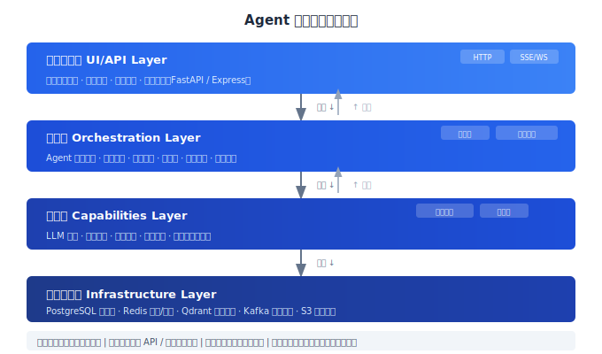
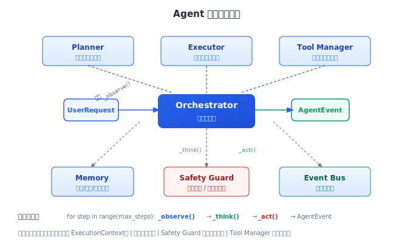

# Agent 系统架构设计

> 一个生产级 Agent 系统的架构设计决定了它的天花板——能承载多少用户、能多快迭代、出故障时能多快恢复。本文讲架构设计的核心决策。

## 目录

- [四层架构模型](#四层架构模型)
- [Agent 引擎设计](#agent-引擎设计)
- [工具与插件系统](#工具与插件系统)
- [错误处理与优雅降级](#错误处理与优雅降级)
- [扩展性设计](#扩展性设计)
- [总结](#总结)
- [参考链接](#参考链接)

你好，我是江小湖。前 14 章我们学了构建 Agent 所需的全部零件。现在要把这些零件组装成一个**可部署、可扩展、可维护**的系统。

架构设计是做权衡——没有完美的架构，只有适合当前阶段的架构。本文给出一套经过生产验证的参考架构，以及每个设计决策背后的权衡。

## 四层架构模型

一个生产级 Agent 系统分为四层，每层独立部署、独立扩展、独立演进：

```
用户界面层 (UI/API)
    │  用户交互入口、会话管理、身份认证
    ▼
编排层 (Orchestration)
    │  Agent 执行引擎、任务调度、状态管理
    ▼
能力层 (Capabilities)
    │  LLM 调用、工具执行、检索、记忆
    ▼
基础设施层 (Infrastructure)
    存储、缓存、消息队列、计算
```

**下层不依赖上层。** 能力层不知道编排层的存在，编排层不知道用户界面层的存在。这种分离让你可以在不触及下层的情况下替换上层组件。

<p align="center">
  
  <br/><em>图：Agent 系统四层架构与层间数据流</em>
</p>

### 各层的职责

**用户界面层**只做三件事：接收请求、转发到编排层、返回响应。不做任何业务逻辑。这一层的典型实现是一个 FastAPI 或 Express 服务，只负责 HTTP 协议转换。

**编排层**是 Agent 系统的核心。它运行 Agent 执行循环——接收用户输入，协调 LLM 调用、工具调用、检索、记忆等操作，管理执行状态，决定何时终止。编排层是无状态的，所有状态存储在外部。

**能力层**是"零件库"。LLM 调用、工具执行、向量检索、记忆读写——这些操作被封装为独立的服务或模块。每个能力可以独立测试、独立扩容。例如，如果你用了三个不同的 LLM，每个 LLM 可以是一个独立的服务。

**基础设施层**提供存储、缓存、消息队列等基础能力。这一层通常用现成的中间件（Redis、PostgreSQL、Qdrant）而不是自建。

### 层间通信

层与层之间通过内部 API 或消息队列通信，不能直接共享数据库或内存。

```
用户 → HTTP/REST → 编排层 → gRPC/内部 API → 能力层
                            ↓
                         消息队列（异步任务）
```

同步操作（用户等待结果的）用内部 API。异步操作（数据同步、批量处理）走消息队列。

## Agent 引擎设计

编排层的核心是 Agent 执行引擎——一个循环，反复执行"观察 → 思考 → 行动"直到任务完成或达到终止条件。

### 引擎核心

```python
class AgentEngine:
    def __init__(
        self,
        llm: LLMProvider,
        tools: ToolRegistry,
        memory: MemoryProvider,
        max_steps: int = 10,
    ):
        self.llm = llm
        self.tools = tools
        self.memory = memory
        self.max_steps = max_steps

    async def execute(
        self, request: UserRequest
    ) -> AsyncGenerator[AgentEvent, None]:
        context = ExecutionContext(
            user_id=request.user_id,
            session_id=request.session_id,
        )
        # 加载历史
        context.history = await self.memory.load_session(
            request.session_id
        )
        yield AgentEvent("status", "正在分析您的问题...")

        for step in range(self.max_steps):
            # 观察：收集当前状态
            observation = await self._observe(context)

            # 思考：LLM 决定下一步
            action = await self._think(context, observation)
            yield AgentEvent("thinking", action)

            # 行动：执行工具或回复
            result = await self._act(context, action)
            yield AgentEvent("action", action.name, result)

        # 达到最大步数，强制结束
        yield AgentEvent("status", "已达到处理上限，请简化您的请求")
```

引擎的三个关键设计：

**状态外置**。`ExecutionContext` 包含当前请求的所有状态——对话历史、已执行的工具结果、中间变量。但引擎本身不持有状态。这样每个请求可以分配到任意实例处理。

**事件驱动**。引擎的每一步发出事件。前端通过 SSE 接收这些事件实时更新 UI；审计日志订阅事件记录执行过程；监控系统订阅事件计算指标。**事件流是引擎和外部世界的唯一接口。**

**步数上限**。`max_steps` 是安全阀。Agent 可能在某个状态卡住反复循环，步数上限确保它不会无限运行。

<p align="center">
  
  <br/><em>图：Agent 引擎内部结构——Orchestrator 编排六大模块</em>
</p>

### 上下文管理

```python
class ExecutionContext:
    def __init__(self, user_id: str, session_id: str):
        self.user_id = user_id
        self.session_id = session_id
        self.history: list[Message] = []
        self.tool_results: list[ToolResult] = []
        self.metadata: dict = {}

    def build_prompt(self) -> list[dict]:
        """构造发送给 LLM 的 messages"""
        messages = [{"role": "system", "content": SYSTEM_PROMPT}]

        # 短期记忆：最近 10 轮对话
        short_term = self.history[-10:]

        # 中期记忆：超过 10 轮的部分压缩为摘要
        if len(self.history) > 10:
            summary = self._summarize_history(self.history[:-10])
            messages.append({
                "role": "system",
                "content": f"对话摘要：{summary}"
            })

        # 注入当前工具结果
        for result in self.tool_results:
            messages.append({
                "role": "tool",
                "tool_call_id": result.tool_call_id,
                "content": json.dumps(result.data)
            })

        messages.extend(self._to_openai_messages(short_term))
        return messages
```

上下文管理是 Agent 引擎最容易被低估的模块。它决定了 LLM 能看到什么信息、以什么顺序看到、信息量有多大。**上下文管理不当直接导致 Agent"变笨"——信息太多模型抓不住重点，信息太少模型不知道怎么做。**

三级缓存策略：
- **短期**：最近 10 轮完整对话，始终在上下文中
- **中期**：早期对话压缩为摘要，超过 10 轮时启用
- **长期**：用户画像、偏好、长期记忆，按需注入（不是每轮都带）

### 终止条件

引擎不能无限运行。五个终止条件：

```python
async def should_stop(self, context, step) -> tuple[bool, str]:
    # 1. LLM 没有调用工具 → 正常结束
    if not context.last_action.has_tool_calls:
        return True, "normal_completion"

    # 2. 超过最大步数
    if step >= self.max_steps:
        return True, "max_steps_exceeded"

    # 3. 工具调用连续失败
    recent = context.tool_results[-3:]
    if len(recent) >= 3 and all(r.error for r in recent):
        return True, "consecutive_tool_failures"

    # 4. 检测到死循环（同一工具重复调用）
    if self._detect_loop(context):
        return True, "loop_detected"

    # 5. 总执行时间超过限制
    if context.elapsed > MAX_EXECUTION_TIME:
        return True, "timeout"

    return False, ""
```

终止条件是安全防线的最后一道。每个条件都应该有对应的用户提示——不是冷冰冰地断开连接，而是告诉用户"为什么停止了、接下来可以做什么"。

## 工具与插件系统

Agent 的能力通过工具扩展。工具系统的设计决定了添加一个新能力需要改多少代码。

```python
from abc import ABC, abstractmethod
from pydantic import BaseModel

class ToolSpec(BaseModel):
    """工具的 LLM 可见描述"""
    name: str
    description: str
    parameters: dict  # JSON Schema

class ToolResult(BaseModel):
    success: bool
    data: dict | None = None
    error: str | None = None

class BaseTool(ABC):
    @property
    @abstractmethod
    def spec(self) -> ToolSpec:
        ...

    @abstractmethod
    async def execute(self, params: dict) -> ToolResult:
        ...

class ToolRegistry:
    def __init__(self):
        self._tools: dict[str, BaseTool] = {}

    def register(self, tool: BaseTool):
        self._tools[tool.spec.name] = tool

    def get_specs(self) -> list[ToolSpec]:
        return [t.spec for t in self._tools.values()]

    async def execute(
        self, name: str, params: dict
    ) -> ToolResult:
        tool = self._tools.get(name)
        if not tool:
            return ToolResult(
                success=False, error=f"未知工具: {name}"
            )
        try:
            return await tool.execute(params)
        except Exception as e:
            return ToolResult(success=False, error=str(e))
```

这种设计的核心是**工具和引擎解耦**。引擎通过 `ToolRegistry` 统一管理所有工具，不需要知道具体工具的实现。新增一个工具只需要写一个继承 `BaseTool` 的类然后注册：

```python
register = ToolRegistry()
register.register(QueryOrderTool())
register.register(CancelOrderTool())
register.register(SendEmailTool())
```

工具的描述（`ToolSpec`）和实现（`execute`）分离。`spec` 给 LLM 看，`execute` 在服务端执行。这意味着你可以修改工具的实现而不影响 LLM 的认知——反过来，你也可以调整工具的描述（让 LLM 更容易选中它）而不改代码。

### 工具配置的外部化

对于生产系统，工具配置不应该硬编码。一个典型的配置表：

```yaml
tools:
  query_order:
    enabled: true
    rate_limit: 30/min
    timeout: 5s
    allowed_params: [order_id, user_id]

  cancel_order:
    enabled: true
    require_approval: true
    rate_limit: 2/min
    timeout: 10s
```

配置文件可以在不重新部署引擎的情况下更新。如果你的系统需要更细粒度的控制，把配置放到数据库或配置中心。

## 错误处理与优雅降级

Agent 依赖的外部服务（LLM API、工具 API、向量数据库）都可能出问题。代码必须处理每一种失败模式。

### 错误分类

```
瞬时错误 (Transient):   可重试，通常在几秒内恢复
  └── 限流 (RateLimit)        → 指数退避重试
  └── 超时 (Timeout)           → 重试，切换到备用实例
  └── 服务暂时不可用 (5xx)     → 重试

持久错误 (Permanent):    重试也没用
  └── 认证失败 (401/403)       → 停止，通知运维
  └── 参数错误 (400/422)       → 停止，返回错误给用户
  └── 余额不足 (402/429)       → 通知运维充值

语义错误 (Semantic):     没有异常抛出但结果不对
  └── LLM 输出了不符合格式的内容
  └── 工具返回了成功但数据是空的
  └── Agent 说"我做不到"但实际上是权限不足
```

### 重试策略

```python
async def with_retry(
    fn: Callable,
    max_retries: int = 3,
    base_delay: float = 1.0,
    retryable_exceptions: tuple = (RateLimitError, TimeoutError, ServiceUnavailable),
) -> Any:
    last_error = None
    for attempt in range(max_retries):
        try:
            return await fn()
        except retryable_exceptions as e:
            last_error = e
            if attempt < max_retries - 1:
                delay = base_delay * (2 ** attempt)  # 指数退避
                await asyncio.sleep(delay)
    raise last_error
```

指数退避 + 少量随机抖动（jitter）是业界标准做法。重试次数超过上限后，不要继续重试，回退到降级策略。

### 降级策略

```python
class ModelRouter:
    def __init__(self):
        self.models = [
            ("gpt-4o", 10.0),         # 首选：最高质量
            ("gpt-4o-mini", 1.0),     # 备选 1：降级但可用
            ("claude-3-haiku", 0.5),  # 备选 2：跨模型降级
        ]

    async def call(self, prompt: str) -> str:
        errors = []
        for model, _ in self.models:
            try:
                return await self._try_model(model, prompt)
            except Exception as e:
                errors.append(f"{model}: {e}")
                continue
        # 所有模型都失败，返回错误（不要假装成功）
        raise AllModelsFailed(errors)
```

降级的关键原则：**宁可降级不要挂掉，宁可失败不要欺骗。** 如果所有降级方案都失败了，告诉用户"暂时无法处理"，不要编造一个答案。

### 熔断器 (Circuit Breaker)

对于频繁出错的依赖，用熔断器防止连锁故障：

```
状态: CLOSED（正常）→ 请求通过
    连续失败超过阈值 → 切换到 OPEN
状态: OPEN（断开）→ 请求直接失败，不调用依赖
    经过恢复时间 → 切换到 HALF_OPEN
状态: HALF_OPEN（半开）→ 放一个测试请求
    成功 → 切换回 CLOSED
    失败 → 切换回 OPEN
```

```python
class CircuitBreaker:
    def __init__(self, threshold: int = 5, recovery_time: float = 30.0):
        self.threshold = threshold
        self.recovery_time = recovery_time
        self.failures = 0
        self.state = "closed"
        self.last_failure_time = 0

    async def call(self, fn):
        if self.state == "open":
            if time.time() - self.last_failure_time > self.recovery_time:
                self.state = "half_open"
            else:
                raise CircuitBreakerOpen()

        try:
            result = await fn()
            self.failures = 0
            self.state = "closed"
            return result
        except Exception:
            self.failures += 1
            self.last_failure_time = time.time()
            if self.failures >= self.threshold:
                self.state = "open"
            raise
```

熔断器特别适合 Agent 系统，因为一个依赖挂了可能导致所有请求都挂在这个依赖上，拖垮整个系统。

## 扩展性设计

### 水平扩展

Agent 引擎是无状态的，可以水平扩展。关键依赖：

```
负载均衡器 → Agent 实例 × N
                  ↓
            共享 Redis（会话 + 缓存）
                  ↓
            共享 PostgreSQL（持久化）
                  ↓
            外部依赖（LLM API, 工具 API）
```

扩展时需要注意的瓶颈是**外部依赖的限流**。LLM API 有每分钟请求限制，不是加实例就能线性增加吞吐量。解决方案：

1. 在引擎层实现请求排队和优先级调度
2. 实例间协调限流（用 Redis 计数器共享限流状态）
3. 多个 LLM API Key 轮换

### 异步任务

非实时任务（大量数据处理、报告生成、定时任务）走消息队列：

```python
# 生产者
async def submit_batch_job(job_type: str, params: dict) -> str:
    job_id = str(uuid.uuid4())
    await queue.publish("agent_jobs", {
        "job_id": job_id,
        "type": job_type,
        "params": params
    })
    return job_id

# 消费者
async def process_jobs():
    async for message in queue.subscribe("agent_jobs"):
        job = message.data
        result = await process_job(job)
        await storage.save_job_result(job["job_id"], result)
```

消息队列的选择：Redis Streams（轻量，适合中等规模），RabbitMQ（功能完整，适合企业），Kafka（高吞吐，适合大规模）。

### 配置外部化

引擎的所有配置应该通过环境变量或配置中心注入，不硬编码：

```python
class AppConfig:
    # LLM
    llm_model: str = os.getenv("LLM_MODEL", "gpt-4o-mini")
    llm_api_key: str = os.getenv("LLM_API_KEY")
    llm_timeout: int = int(os.getenv("LLM_TIMEOUT", "30"))

    # 工具
    tool_timeout: int = int(os.getenv("TOOL_TIMEOUT", "10"))
    max_tool_retries: int = int(os.getenv("MAX_TOOL_RETRIES", "3"))

    # 引擎
    max_steps: int = int(os.getenv("MAX_STEPS", "10"))
    max_execution_time: int = int(os.getenv("MAX_EXECUTION_TIME", "60"))

    # 存储
    redis_url: str = os.getenv("REDIS_URL", "redis://localhost:6379")
    database_url: str = os.getenv("DATABASE_URL", "postgresql://localhost/agent")
```

配置变更不应需要重新构建镜像。环境变量注入、配置中心（Consul/etcd）、热加载——根据团队规模选择。

## 总结

架构设计没有银弹，但有可复用的模式：

四层模型（UI/编排/能力/基础设施）独立演进 → Agent 引擎无状态设计 + 事件驱动 + 步数上限 → 工具插件系统（描述与实现分离）→ 错误处理分层（重试/降级/熔断）→ 水平扩展 + 异步任务 + 外部化配置。

**下一篇**：[API 服务化](02-api-service.md)——架构的入口层怎么设计，REST 和 SSE 的实现细节。

## 参考链接

- [12-Factor App](https://12factor.net/)
- [Microsoft — Architecture for LLM Apps](https://learn.microsoft.com/en-us/azure/architecture/guide/llm-apps/)
- [Anthropic — Building Production Agents](https://docs.anthropic.com/en/docs/build-with-claude/agent-patterns)
- [Resilience Patterns — Circuit Breaker](https://martinfowler.com/bliki/CircuitBreaker.html)
- [Exponential Backoff — AWS](https://aws.amazon.com/blogs/architecture/exponential-backoff-and-jitter/)
