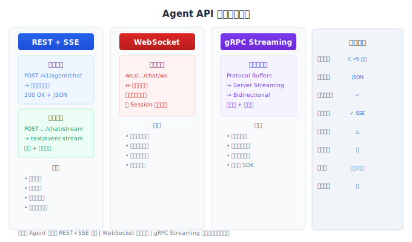
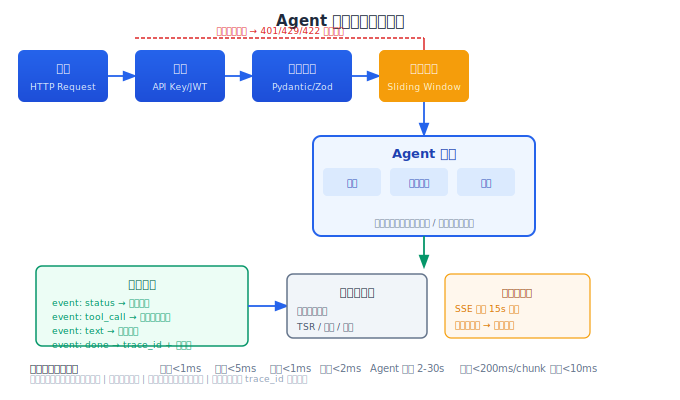

# API 服务化

> 架构层确定了，但用户怎么和 Agent 交互？REST 做同步请求、SSE 做流式响应、WebSocket 做实时对话——API 层的设计直接影响用户体验和系统可访问性。

## 目录

- [API 设计原则](#api-设计原则)
- [REST API 设计](#rest-api-设计)
- [流式响应 (SSE) 实现](#流式响应-sse-实现)
- [WebSocket 实时对话](#websocket-实时对话)
- [认证与限流](#认证与限流)
- [客户端 SDK 设计](#客户端-sdk-设计)
- [总结](#总结)
- [参考链接](#参考链接)

你好，我是江小湖。上一篇文章建立了 Agent 系统的四层架构。本文聚焦最上层——用户界面层的 API 设计。API 是 Agent 系统和外部世界的接口，它的设计决定了谁来消费、怎么消费、消费体验如何。

## API 设计原则

### 三个协议，三个场景

Agent 系统需要三种不同的 API 协议，分别对应不同的交互模式：

```
REST:    用户发送一条消息 → 等待完整响应 → 完成
         适合: 即问即答、简单查询、非流式集成

SSE:     用户发送请求 → 持续接收事件流 → 流结束
         适合: 多步 Agent 执行、进度展示、逐步推理

WebSocket: 建立连接 → 双向实时通信 → 随时中断
         适合: 语音对话、实时协作、高频交互
```

大多数 Agent 系统从 REST + SSE 开始。WebSocket 在需要双向推送时引入。

<p align="center">
  
  <br/><em>图：三种 API 协议的通信模式、特性对比与适用场景</em>
</p>

### 统一响应格式

所有 API 使用统一的响应结构，方便客户端做通用处理：

```json
{
  "code": 0,
  "message": "success",
  "data": { ... },
  "request_id": "req_abc123",
  "timestamp": "2026-06-18T10:00:00Z"
}
```

错误响应：

```json
{
  "code": 4001,
  "message": "rate_limit_exceeded",
  "data": {
    "retry_after": 30,
    "limit": 30,
    "remaining": 0
  },
  "request_id": "req_abc123"
}
```

`code` 为 0 表示成功，非 0 表示错误。错误码分段：`1xxx` 客户端错误，`2xxx` 服务端错误，`3xxx` 限流/配额，`4xxx` Agent 逻辑错误。

## REST API 设计

### 端点设计

```
POST   /v1/agent/chat           # 同步聊天（标准模式）
POST   /v1/agent/chat/stream    # 流式聊天（SSE 模式）
POST   /v1/agent/action         # 执行一次工具调用（手动触发）
GET    /v1/sessions/{id}        # 获取会话历史
DELETE /v1/sessions/{id}        # 清除会话
POST   /v1/sessions/{id}/feedback  # 用户反馈
```

端点不要按"功能"拆（如 `/v1/query-order`、`/v1/cancel-order`），而是按"交互模式"拆。功能通过 Agent 的推理能力来路由，而不是通过 API 路由。这保持了 API 的通用性和 Agent 的灵活性。

### 请求格式

```json
{
  "user_id": "usr_123",
  "session_id": "sess_456",
  "message": "帮我查一下最近的订单",
  "stream": false,
  "metadata": {
    "source": "web",
    "language": "zh-CN"
  }
}
```

认证信息通过 Header 传递，不放在请求体：

```
Authorization: Bearer sk-xxxxxxxxxxxx
X-Api-Key: abc123
```

### 幂等性

Agent 操作可能耗时较长，客户端超时重试可能导致同一个请求被执行多次。关键操作支持幂等性：

```
POST /v1/agent/chat
Idempotency-Key: idem_abc123
```

服务端在收到带有 `Idempotency-Key` 的请求时，先检查该 key 是否已经处理过。如果处理过，直接返回缓存的结果；如果未处理，正常执行并将结果缓存。

```python
async def handle_chat(request, idempotency_key=None):
    if idempotency_key:
        cached = await cache.get(f"idempotent:{idempotency_key}")
        if cached:
            return cached

    result = await agent_engine.execute(request)

    if idempotency_key:
        await cache.set(
            f"idempotent:{idempotency_key}",
            result,
            ttl=3600  # 1 小时后过期
        )
    return result
```

幂等性缓存的 TTL 决定了"多长时间内的重复请求会被去重"。TTL 太短失去了去重意义，太长可能阻塞真正的重试。建议设置为系统平均执行时间的 2 倍。

### 健康检查

```python
@app.get("/health")
async def health():
    deps = {
        "redis": await check_redis(),
        "postgres": await check_postgres(),
        "llm_api": await check_llm_api(),  # 简单 ping
    }
    all_healthy = all(deps.values())
    status_code = 200 if all_healthy else 503
    return JSONResponse(
        status_code=status_code,
        content={
            "status": "healthy" if all_healthy else "degraded",
            "dependencies": deps,
            "version": __version__,
            "uptime_seconds": time.time() - start_time,
        }
    )
```

健康检查是负载均衡器和编排平台用来判断实例是否可用的依据。**健康检查不要检查所有依赖**——如果 LLM API 挂了但 Agent 还能返回缓存结果，这个实例应该仍然接收流量。健康检查只检查"该实例是否能处理请求"（Redis 连接、数据库连接），不检查"外部依赖是否可用"（那由监控系统负责）。

<p align="center">
  
  <br/><em>图：从接收请求到日志记录——七阶段的完整链路</em>
</p>

## 流式响应 (SSE) 实现

Agent 的执行过程是多步的，用户不需要等到全部步骤完成才能看到结果。SSE (Server-Sent Events) 是 Agent 流式响应的最佳协议——简单、浏览器原生支持、自动重连。

### SSE 协议

```
POST /v1/agent/chat/stream
Content-Type: application/json

{
  "user_id": "usr_123",
  "message": "帮我查订单 ORD-123"
}

→ SSE 响应流:

event: status
data: {"content": "正在查询订单信息..."}

event: status
data: {"content": "已找到订单，正在准备回答..."}

event: tool_call
data: {"tool": "query_order", "params": {"order_id": "ORD-123"}, "duration_ms": 230}

event: text
data: {"content": "您的订单 ORD-123 当前状态是"已发货"，预计 6 月 20 日送达。", "is_final": true}

event: done
data: {"trace_id": "req_abc123", "total_duration_ms": 1860}
```

### SSE 在 FastAPI 中的实现

```python
from fastapi.responses import StreamingResponse

@app.post("/v1/agent/chat/stream")
async def stream_chat(request: ChatRequest):
    trace_id = str(uuid.uuid4())

    async def event_generator():
        # 发送心跳保活
        async def heartbeat():
            while True:
                await asyncio.sleep(15)
                yield f"event: heartbeat\ndata: \n\n"

        # Agent 执行事件
        async def agent_events():
            yield f"event: status\ndata: {json.dumps({'content': '正在处理...'})}\n\n"
            async for event in agent_engine.execute(request):
                yield f"event: {event.type}\ndata: {json.dumps(event.data)}\n\n"
            yield f"event: done\ndata: {json.dumps({'trace_id': trace_id})}\n\n"

        # 合并心跳和事件流
        async for event in merge_generators(heartbeat(), agent_events()):
            yield event

    return StreamingResponse(
        event_generator(),
        media_type="text/event-stream",
        headers={
            "X-Trace-Id": trace_id,
            "Cache-Control": "no-cache",
            "Connection": "keep-alive",
        }
    )
```

### 取消机制

用户可能随时中断对话。SSE 连接断开时，引擎需要立即停止执行：

```python
@app.post("/v1/agent/chat/stream")
async def stream_chat(request: ChatRequest):
    stop_event = asyncio.Event()

    async def event_generator():
        async for event in agent_engine.execute(request, cancel_token=stop_event):
            yield f"event: {event.type}\ndata: {json.dumps(event.data)}\n\n"

    response = StreamingResponse(event_generator(), media_type="text/event-stream")

    @response.on_disconnect
    def on_disconnect():
        stop_event.set()  # 触发取消
        # 注意：这里不能做异步操作，需要把取消信号传递给引擎

    return response
```

### 断线重连

SSE 浏览器客户端支持自动重连（Last-Event-ID 机制）。服务端在 `done` 事件中返回完整的执行结果，这样重连后客户端可以展示最终状态而不需要重新执行。

```
断线 → 重连 → 发 Last-Event-ID → 服务端判断是否已完成
  ├── 已完成 → 返回缓存的完整响应
  └── 未完成 → 显示部分结果，建议重新发送请求
```

## WebSocket 实时对话

SSE 是单向的（服务端→客户端），WebSocket 是双向的。对于需要用户随时插话的场景（语音助手、实时协作），WebSocket 更合适。

```python
@app.websocket("/v1/agent/chat/ws")
async def websocket_chat(websocket: WebSocket):
    await websocket.accept()
    session_id = str(uuid.uuid4())

    try:
        while True:
            # 接收用户消息
            data = await websocket.receive_json()

            # 处理消息
            async for event in agent_engine.execute(data):
                await websocket.send_json({
                    "type": event.type,
                    "data": event.data
                })

                # 检查用户是否插话
                if event.type == "thinking":
                    try:
                        interrupt = await asyncio.wait_for(
                            websocket.receive_json(), timeout=0.1
                        )
                        if interrupt.get("type") == "cancel":
                            await websocket.send_json({
                                "type": "cancelled"
                            })
                            break
                    except asyncio.TimeoutError:
                        pass

    except WebSocketDisconnect:
        # 清理会话
        pass
```

WebSocket 增加了状态管理的复杂度——连接断开后用户可能通过另一个连接继续对话。需要 Session 层来管理跨连接的状态。

## 认证与限流

### 认证

```
API Key 认证（服务端集成）:
  Header: Authorization: Bearer sk-xxxx
  适合: 其他服务集成 Agent

JWT 认证（用户客户端）:
  Header: Authorization: Bearer jwt-token
  适合: Web 应用、移动 App

OAuth 2.0（第三方集成）:
  标准 OAuth 2.0 流程
  适合: 企业 SSO、开放平台
```

API Key 用前缀标识用途：`sk-` = service key（服务端集成），`pk-` = personal key（个人开发者）。

### 限流

```
按用户:     30 请求/分钟/用户
按 IP:      100 请求/分钟/IP
按 API Key: 1000 请求/分钟/Key

流式模式:   同时最大 5 个活跃流/用户
全局:       1000 请求/分钟/服务
```

限流实现用 Redis + 滑动窗口：

```python
import time

class SlidingWindowRateLimiter:
    def __init__(self, redis_client):
        self.redis = redis_client

    async def check(self, key: str, limit: int, window: int = 60) -> bool:
        now = int(time.time())
        window_start = now - window

        # 移除窗口外的记录
        await self.redis.zremrangebyscore(key, 0, window_start)

        # 获取当前窗口的请求数
        count = await self.redis.zcard(key)

        if count >= limit:
            return False

        # 记录这次请求
        await self.redis.zadd(key, {str(now): now})
        await self.redis.expire(key, window)
        return True
```

限流返回的响应应该包含重试时间（`Retry-After` Header），让客户端可以等待后重试，而不是不停地试。

## 客户端 SDK 设计

API 设计得再好，如果每次集成都要手动拼 HTTP 请求、处理 SSE 流，体验也是灾难。一个好的 SDK 能让集成工作从小时缩到分钟。

### SDK 示例（Python）

```python
class AgentClient:
    def __init__(self, base_url: str, api_key: str):
        self.base_url = base_url
        self.session = httpx.AsyncClient(
            headers={"Authorization": f"Bearer {api_key}"}
        )

    async def chat(self, message: str, session_id: str = None) -> str:
        """同步聊天"""
        resp = await self.session.post(
            f"{self.base_url}/v1/agent/chat",
            json={
                "message": message,
                "session_id": session_id or str(uuid.uuid4())
            }
        )
        return resp.json()["data"]["response"]

    async def chat_stream(self, message: str):
        """流式聊天"""
        async with self.session.stream(
            "POST",
            f"{self.base_url}/v1/agent/chat/stream",
            json={"message": message}
        ) as resp:
            async for line in resp.aiter_lines():
                if line.startswith("data: "):
                    yield json.loads(line[6:])
```

SDK 只需要三个方法：`chat`（同步）、`chat_stream`（流式）、`feedback`（反馈交互结果）。不需要暴露底层 HTTP 细节。

## 总结

API 层是 Agent 系统和外部世界的接口。核心设计决策：

REST 做标准请求（统一响应格式 + 幂等性去重）→ SSE 做流式响应（心跳保活 + 取消机制 + 断线重连）→ WebSocket 做实时对话（双向通信 + 用户插话）。认证层支持 API Key/JWT/OAuth，限流用滑动窗口。

客户端 SDK 把协议细节封装起来，外部集成方只需要 `client.chat()` 和 `client.chat_stream()`。SDK 设计的好与坏直接影响 Agent 的采用率。

**下一篇**：[Agent 部署方案](03-deployment.md)——API 设计好了，怎么让它稳定运行。

## 参考链接

- [FastAPI — StreamingResponse](https://fastapi.tiangolo.com/advanced/custom-response/#streamingresponse)
- [SSE — MDN](https://developer.mozilla.org/en-US/docs/Web/API/Server-sent_events)
- [Building a Python SDK — Stripe](https://stripe.com/docs/api?lang=python)
- [API Design — Microsoft REST Guidelines](https://learn.microsoft.com/en-us/azure/architecture/best-practices/api-design)
- [Rate Limiting — Redis Sliding Window](https://redis.com/glossary/rate-limiting/)
