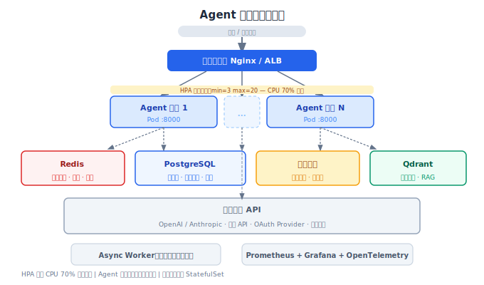
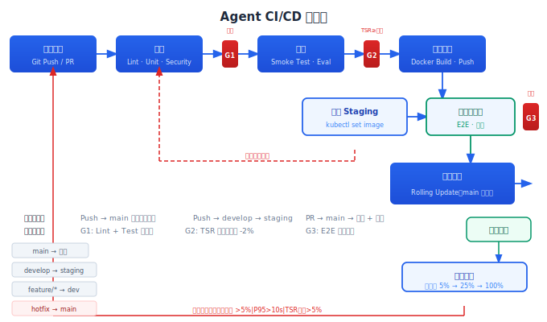

# Agent 部署方案

> 代码写好、API 设计完，接下来是"让它稳定跑在生产环境"。容器化、CI/CD、多环境、发布策略——每步选错都可能让系统上线后问题不断。

## 目录

- [容器化与镜像构建](#容器化与镜像构建)
- [Kubernetes 部署](#kubernetes-部署)
- [CI/CD 流水线](#cicd-流水线)
- [多环境管理](#多环境管理)
- [部署策略](#部署策略)
- [配置与密钥管理](#配置与密钥管理)
- [总结](#总结)
- [参考链接](#参考链接)

你好，我是江小湖。前两篇文章设计了架构和 API。现在要把这些代码打包、部署到服务器上、让它持续稳定运行。

## 容器化与镜像构建

### Dockerfile

```dockerfile
# Stage 1: 依赖安装
FROM python:3.12-slim AS builder
WORKDIR /app
COPY requirements.txt .
# 使用 --no-cache-dir 减少镜像体积
RUN pip install --no-cache-dir -r requirements.txt

# Stage 2: 运行镜像
FROM python:3.12-slim
# 非 root 用户运行（安全基线）
RUN adduser --system --group --no-create-home agent
WORKDIR /app
# 只复制 site-packages，不复制 pip 缓存
COPY --from=builder /usr/local/lib/python3.12/site-packages /usr/local/lib/python3.12/site-packages
COPY --chown=agent:agent . .
USER agent
EXPOSE 8000
HEALTHCHECK --interval=30s --timeout=3s --retries=3 \
    CMD python -c "import urllib.request; urllib.request.urlopen('http://localhost:8000/health')"
CMD ["uvicorn", "main:app", "--host", "0.0.0.0", "--port", "8000"]
```

多阶段构建的核心价值：最终镜像只包含运行时需要的文件，不包含构建工具、pip 缓存、源代码中的测试文件。**生产镜像越小越好——越小意味着启动快、安全漏洞少、传输快。**

### Docker Compose（本地开发）

```yaml
services:
  agent-engine:
    build: ./agent-engine
    ports: ["8000:8000"]
    env_file: .env.dev
    volumes:
      - ./agent-engine:/app  # 热重载
    depends_on:
      redis: { condition: service_healthy }
      postgres: { condition: service_healthy }
    deploy:
      resources:
        limits: { cpus: "1.0", memory: "2G" }

  worker:
    build: ./agent-engine
    command: python -m worker
    env_file: .env.dev
    depends_on:
      redis: { condition: service_healthy }

  redis:
    image: redis:7-alpine
    healthcheck:
      test: ["CMD", "redis-cli", "ping"]
      interval: 5s

  postgres:
    image: postgres:16-alpine
    environment:
      POSTGRES_DB: agent
      POSTGRES_PASSWORD: dev_password
    volumes:
      - pgdata:/var/lib/postgresql/data
    healthcheck:
      test: ["CMD", "pg_isready"]
      interval: 5s
```

开发环境的 `volumes` 映射让代码改动即时生效，不需要重新构建镜像——但生产环境绝不用 `volumes` 挂载代码。开发和生产的环境差异通过 `env_file` 注入。

## Kubernetes 部署

### 核心 Manifest

```yaml
# deployment.yaml
apiVersion: apps/v1
kind: Deployment
metadata:
  name: agent-engine
  namespace: prod
spec:
  replicas: 3
  strategy:
    type: RollingUpdate
    rollingUpdate:
      maxSurge: 1
      maxUnavailable: 0  # 更新期间保持全部可用
  selector:
    matchLabels:
      app: agent-engine
  template:
    metadata:
      labels:
        app: agent-engine
    spec:
      containers:
      - name: agent-engine
        image: registry.example.com/agent-engine:1.2.0
        ports:
        - containerPort: 8000
          protocol: TCP
        envFrom:
        - configMapRef:
            name: agent-config
        - secretRef:
            name: agent-secrets
        resources:
          requests:
            cpu: "1"
            memory: "2Gi"
          limits:
            cpu: "2"
            memory: "4Gi"
        livenessProbe:
          httpGet:
            path: /health
            port: 8000
          initialDelaySeconds: 10
          periodSeconds: 15
        readinessProbe:
          httpGet:
            path: /health
            port: 8000
          initialDelaySeconds: 5
          periodSeconds: 10
```

### 水平自动扩缩 (HPA)

```yaml
# hpa.yaml
apiVersion: autoscaling/v2
kind: HorizontalPodAutoscaler
metadata:
  name: agent-engine-hpa
  namespace: prod
spec:
  scaleTargetRef:
    apiVersion: apps/v1
    kind: Deployment
    name: agent-engine
  minReplicas: 3
  maxReplicas: 20
  metrics:
  - type: Resource
    resource:
      name: cpu
      target:
        type: Utilization
        averageUtilization: 70
  - type: Resource
    resource:
      name: memory
      target:
        type: Utilization
        averageUtilization: 80
```

HPA 基于 CPU/内存使用率自动扩缩。Agent 引擎是 CPU 密集型（LLM 调用是 IO 密集型，但 prompt 处理和响应解析是 CPU 密集型），CPU 用 70% 作为扩缩阈值是合理的起点。

### 关键依赖的部署策略

| 组件 | 部署方式 | 高可用策略 |
|------|---------|-----------|
| Agent 引擎 | Deployment + HPA | 多副本 |
| Redis | StatefulSet + 哨兵 | 主从 + 哨兵切换 |
| PostgreSQL | StatefulSet + WAL | PITR 恢复 |
| 消息队列 | StatefulSet | 集群 + 镜像队列 |

Agent 引擎本身无状态，用 Deployment + HPA 即可。有状态组件（Redis、PostgreSQL）用 StatefulSet。

<p align="center">
  
  <br/><em>图：负载均衡→多实例→基础设施→外部API 完整拓扑</em>
</p>

## CI/CD 流水线

### GitHub Actions 示例

```yaml
name: Agent CI/CD
on:
  push:
    branches: [main, develop]
  pull_request:
    branches: [main]

jobs:
  # Stage 1: 代码质量
  lint-and-test:
    runs-on: ubuntu-latest
    steps:
      - uses: actions/checkout@v4
      - run: make lint              # ruff / mypy
      - run: make test              # pytest
      - run: make security-scan     # trivy / bandit

  # Stage 2: 评测
  evaluation:
    needs: lint-and-test
    runs-on: ubuntu-latest
    steps:
      - uses: actions/checkout@v4
      - run: make eval-smoke        # 空跑评测（10 分钟）
      - run: make eval-component    # 组件评测（30 分钟）
        env:
          LLM_API_KEY: ${{ secrets.LLM_API_KEY }}
      - name: Check results
        run: |
          if [ $(cat eval-report.json | jq '.tsr_delta > 0.02') = "true" ]; then
            echo "TSR 下降超过 2%，阻断合并"
            exit 1
          fi

  # Stage 3: 构建镜像
  build:
    needs: evaluation
    runs-on: ubuntu-latest
    steps:
      - uses: actions/checkout@v4
      - run: |
          docker build -t registry.example.com/agent-engine:${{ github.sha }} .
          docker push registry.example.com/agent-engine:${{ github.sha }}

  # Stage 4: 部署 staging
  deploy-staging:
    needs: build
    runs-on: ubuntu-latest
    environment: staging
    steps:
      - run: kubectl set image deployment/agent-engine \
              agent-engine=registry.example.com/agent-engine:${{ github.sha }} \
              --namespace staging
      - run: make eval-e2e-staging  # 端到端评测

  # Stage 5: 部署生产（仅 main 分支）
  deploy-production:
    needs: deploy-staging
    if: github.ref == 'refs/heads/main'
    runs-on: ubuntu-latest
    environment: production
    steps:
      - run: kubectl set image deployment/agent-engine \
              agent-engine=registry.example.com/agent-engine:${{ github.sha }} \
              --namespace prod
      - run: kubectl rollout status deployment/agent-engine \
              --namespace prod --timeout=5m
```

这个流水线的设计核心是**门禁逐步收紧**。代码检查是最浅的门禁（几分钟），评测级是最重要的门禁（阻断 TSR 下降），staging 部署后的端到端评测是最终门禁。任何一道门禁不过，代码都不会进生产。

### 评测阻断的精度问题

Agent 评测有随机性——同样的代码跑两次可能 TSR 差 1%。直接把"TSR 下降"作为阻断条件会导致大量的误阻断。

实践中用 **3 次运行取中位数** 的方法：

```python
def should_block(new_tsr: float, baseline_tsr: float, threshold: float = 0.02) -> bool:
    """连续 3 次评测中有 2 次低于基线 - 阈值时阻断"""
    # baseline_tsr 是过去 7 次 main 分支评测的中位数
    passes = sum(1 for r in new_tsr if r >= baseline_tsr - threshold)
    return passes < 2
```

这样单次评测的波动不会误阻断，但持续下降肯定被抓住。

<p align="center">
  
  <br/><em>图：从代码提交到流量切换——九阶段 + 三道门禁 + 回滚路径</em>
</p>

## 多环境管理

### 环境清单

```
开发环境 (dev):
  用途: 本地开发、自测
  基础设施: Docker Compose
  LLM: gpt-4o-mini（降级模型省成本）
  外部 API: Mock

测试环境 (staging):
  用途: 集成测试、产品验收
  基础设施: 轻量 K8s 集群（1-2 节点）
  LLM: 生产相同模型
  外部 API: 测试账号

预发布 (pre-prod):
  用途: 发布前最终验证
  基础设施: 与生产一致（小规格）
  LLM: 生产相同模型
  外部 API: 正式账号（有限额度）

生产 (prod):
  用途: 用户使用
  基础设施: 生产 K8s 集群
  LLM: 生产模型
  外部 API: 正式账号
```

四种环境，越多越安全，但维护成本也越高。小团队可以只保留 dev + staging + prod。**staging 的环境配置必须和生产保持一致**——配置不一致的 staging 没有任何验证价值。

### Git 分支与环境映射

```
main 分支 → 生产环境 (自动部署)
develop 分支 → staging 环境 (自动部署)
feature 分支 → 开发环境 (手动部署)
hotfix 分支 → 从 main 切出 → 修复后直接合入 main
```

每个环境对应一个 Kubernetes Namespace，配置从不同的 ConfigMap 和 Secret 注入。

## 部署策略

### 滚动更新（默认）

最常用的策略，逐步替换 Pod：

```
初始: V1 × 5
Step 1: 启动 V2 × 1（maxSurge: 1）
Step 2: V2 健康 → 停止 V1 × 1（maxUnavailable: 0）
Step 3: 重复直到全部替换为 V2 × 5
```

**maxUnavailable: 0** 确保更新期间所有请求都能被处理。代价是需要额外的资源运行新旧版本并存。

### 蓝绿部署（高风险变更）

```
蓝色: V1（当前生产）
绿色: V2（新版本）

切换: 负载均衡器流量从蓝切到绿
观察: 10-30 分钟，确认无异常
回滚: 切回蓝色
```

蓝绿部署适合 Agent 系统的 prompt 变更——prompt 改坏了可能导致任务完成率暴跌，蓝绿让你能快速切回。代价是需要双倍资源。

### 金丝雀发布（大版本更新）

```
V1: 95% 流量
V2: 5% 流量（观察 10 分钟）→ 25%（观察 30 分钟）→ 100%
```

金丝雀最适合验证"新版本是否稳定"。对于 Agent 系统，金丝雀还可以比较新旧版本的 TSR：

```python
# 金丝雀发布期间自动比较
def compare_canary():
    v1_tsr = get_tsr("version=v1", duration="10m")
    v2_tsr = get_tsr("version=v2", duration="10m")
    delta = v2_tsr - v1_tsr
    if delta < -0.02:  # V2 TSR 比 V1 低 2%
        rollback()
    elif delta > 0.02:  # V2 更好，继续放量
        increase_canary()
    else:  # 无显著差异，继续观察
        wait()
```

### 自动回滚条件

```yaml
# 自动回滚触发器
autoRollback:
  errorRate: { threshold: 0.05, window: 5m }    # 错误率 > 5%
  p95Latency: { threshold: 10s, window: 5m }     # P95 延迟 > 10s
  taskSuccessRate: { threshold: 0.05, window: 5m } # TSR 下降 > 5%
  healthCheck: { consecutive: 3 }                # 健康检查连续 3 次失败
```

任何一个条件触发，自动回滚到上一个版本。

## 配置与密钥管理

### 环境变量分层

```python
class Config:
    def __init__(self):
        # 1. 默认值（最低优先级）
        self.llm_model = "gpt-4o-mini"
        self.max_steps = 10

        # 2. 环境变量覆盖
        self.llm_model = os.getenv("LLM_MODEL", self.llm_model)
        self.max_steps = int(os.getenv("MAX_STEPS", self.max_steps))

        # 3. 配置文件覆盖（可选）
        config_file = os.getenv("CONFIG_FILE")
        if config_file and os.path.exists(config_file):
            with open(config_file) as f:
                file_config = yaml.safe_load(f)
                self.__dict__.update(file_config)

        # 4. 密钥管理服务覆盖（最高优先级）
        secret = os.getenv("SECRET_STORE")
        if secret == "vault":
            vault_config = self._load_from_vault()
            self.__dict__.update(vault_config)
```

### 密钥管理

| 类别 | 示例 | 存储方式 |
|------|------|---------|
| LLM API Key | OpenAI / Anthropic / Claude Key | 密钥管理服务 (Vault / AWS Secrets Manager) |
| 数据库密码 | PostgreSQL 密码 | 密钥管理服务 |
| JWT Secret | Token 签名密钥 | 密钥管理服务 |
| 非敏感配置 | 模型名、日志级别、超时时间 | ConfigMap / 环境变量 |

密钥管理的基本原则：

**不提交到 Git。** `.env` 文件在 `.gitignore` 中，密钥管理服务的访问凭证通过环境变量注入。

**不同环境不同密钥。** 开发环境的 API Key 和生产环境的 API Key 不同。开发用测试额度，生产用正式额度。

**轮换自动化。** 密钥定期轮换（建议 90 天），轮换过程不能影响服务。用双 Buffer 模式：

```python
class KeyManager:
    def __init__(self):
        self.current_key = self._load_key("current")
        self.next_key = self._load_key("next")  # 预加载下一个 key

    def get_key(self) -> str:
        return self.current_key

    def rotate(self):
        """切换到预加载的下一个 key"""
        self.current_key = self.next_key
        self.next_key = self._load_key("new")
```

## 总结

部署方案决定了 Agent 系统的稳定性和发布效率：

容器化（多阶段构建 + 非 root + HEALTHCHECK）→ K8s 部署（Deployment + HPA + ConfigMap/Secret）→ CI/CD（代码检查 → 评测门禁 → 构建 → staging → 生产）→ 多环境（dev/staging/pre-prod/prod 配置一致）→ 部署策略（滚动/蓝绿/金丝雀）+ 自动回滚条件 → 密钥管理（不分环境 + 不提交 Git + 自动化轮换）。

**下一篇**：[Agent 运维实战](04-operations.md)——系统上线不是结束，是运维的开始。

## 参考链接

- [Docker Best Practices](https://docs.docker.com/develop/dev-best-practices/)
- [Kubernetes Production Best Practices](https://kubernetes.io/docs/setup/best-practices/)
- [Deployment Strategies — Kubernetes](https://kubernetes.io/docs/concepts/workloads/controllers/deployment/#strategy)
- [HashiCorp Vault](https://www.vaultproject.io/)
- [Blue-Green Deployment — Martin Fowler](https://martinfowler.com/bliki/BlueGreenDeployment.html)
- [Canary Release — Martin Fowler](https://martinfowler.com/bliki/CanaryRelease.html)
