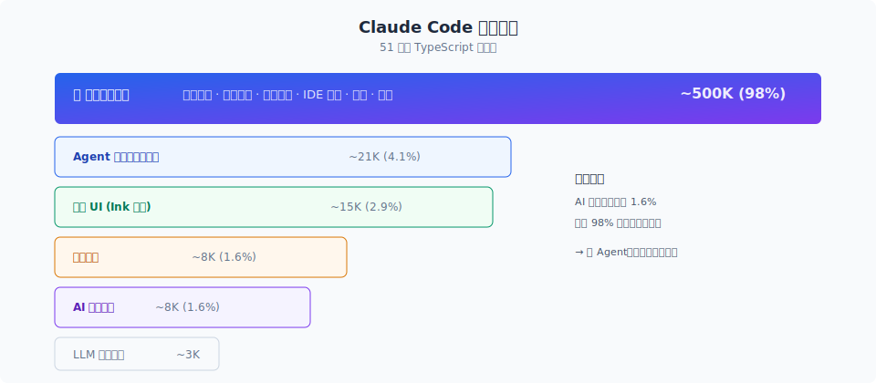
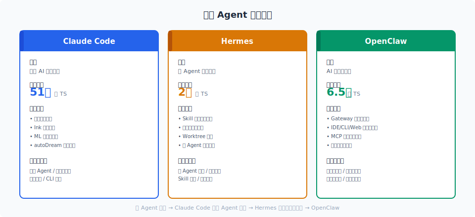

# 三大框架对比

> Claude Code、Hermes、OpenClaw 是 2026 年最受关注的三个开源 Agent 框架。它们代码量接近，但设计哲学完全不同：Claude Code 做"对"，Hermes 做"好"，OpenClaw 做"大"。

你好，我是江小湖。

前两篇讲了 Claude Code 的代码规模和五层架构。但只看 Claude Code 不够，**要判断一个设计好不好，得有参照系。**

这一篇把 Claude Code、Hermes、OpenClaw 三个框架放在一起，用真实数据和实测结果对比。不端水，直接说结论。

## 目录

- [代码规模与定位](#代码规模与定位)
- [Agent 循环](#agent-循环)
- [上下文管理](#上下文管理)
- [记忆系统](#记忆系统)
- [权限与安全](#权限与安全)
- [扩展生态](#扩展生态)
- [启动性能](#启动性能)
- [谁更值得学](#谁更值得学)
- [总结](#总结)
- [参考链接](#参考链接)

  
   
  <em>Claude Code 源码解析 01 配图</em>

## 代码规模与定位

  
   
  <em>Claude Code、Hermes、OpenClaw 三大框架核心指标对比</em>

| 框架 | 代码行数 | 语言 | 定位 |
|------|---------|------|------|
| Claude Code | ~510K | TypeScript | 桌面级 AI 编程助手 |
| Hermes | ~500K | Python | 跨平台自动化 Agent |
| OpenClaw | ~430K | TypeScript | 多平台消息集成 |

三个框架都是生产级规模，但代码分布差异很大。

Claude Code 的 51 万行中，98.4% 是工程基础设施，AI 决策逻辑只占 1.6%。它的核心是一个 88 行的 while 循环。

Hermes 的核心文件 `run_agent.py` 约 10,700 行，其余是工具、平台适配、记忆系统。它的设计哲学是"自我进化"，强调 Agent 越用越好。

OpenClaw 的核心是平台集成层，支持 24 个消息平台。它的设计哲学是"连接一切"，强调 Agent 能在任何平台上运行。

## Agent 循环

| 维度 | Claude Code | Hermes | OpenClaw |
|------|------------|--------|----------|
| 核心循环 | `while(true)` + 7 种 transition | `run_conversation()` + 3 种 API mode | Polling loop + SQLite IPC |
| 错误恢复 | **7 层恢复策略** | 重试 + fallback 模型切换 | 基础重试 |
| 流式处理 | StreamingToolExecutor 边收边跑 | 支持流式但无并发调度 | 无流式 |

Claude Code 的循环最复杂。当上下文快满时，它会尝试响应式压缩、自动压缩、微压缩、上下文折叠、裁剪等 5 种策略，然后重试。这个设计让长对话保持稳定。

Hermes 的循环相对简单，靠重试和 fallback 模型切换保证稳定。

OpenClaw 的循环最简单，就是一个 polling loop，从 SQLite 读消息，调用模型，写回结果。

**结论**：Claude Code 的循环设计最精细，错误恢复能力最强。

## 上下文管理

| 维度 | Claude Code | Hermes | OpenClaw |
|------|------------|--------|----------|
| 压缩层数 | **5 层渐进式** | 1 层（>50% 触发） | 无自动压缩 |
| Prompt Cache | **Sticky-on Latch** | 冻结快照模式 | 无 |
| CLAUDE.md 保护 | 永不删除 | 无 | 无 |

Claude Code 的 5 层压缩从便宜到贵依次触发：先削减工具输出预览，再删掉没用的工具结果，再压缩特定段落，再总结大段对话，最后才做全 session 总结。92% 的情况在便宜的层就能解决。

Hermes 只有 1 层简单百分比压缩。OpenClaw 没有自动压缩。

**结论**：Claude Code 的上下文管理是三者中最成熟的。

## 记忆系统

| 维度 | Claude Code | Hermes | OpenClaw |
|------|------------|--------|----------|
| 记忆层次 | 3 层（提取→会话→Dream） | 2 层（MEMORY.md + USER.md） | 3 级（全局/群组/会话） |
| 自我进化 | autoDream 后台反思 | **Skill 自动生成** | 无 |
| 记忆容量 | 文件级，无上限 | **约 1300 Token** | JSONL 日志 |

这里需要纠正一个常见误解：**Hermes 的记忆系统本身并不强**，只有两个文件，总共约 1,300 Token。

但 Hermes 有一个真正的亮点：**Skill 自动生成**。每次完成任务后，Hermes 会把经验写成 SKILL.md，下次遇到类似任务直接加载。实测第二次运行 token 消耗降低 17%。

这不是"记忆系统"，而是"学习循环"。Claude Code 的记忆系统更复杂，但 Hermes 的学习循环是独家设计。

OpenClaw 的记忆系统相对简单，但有个明显缺陷：实测记忆召回延迟高达 **19.6 秒**，因为每次都要把 JSONL 日志重新喂给 LLM。

**结论**：Claude Code 记忆系统最成熟，Hermes 学习循环有创新，OpenClaw 记忆系统有缺陷。

## 权限与安全

| 维度 | Claude Code | Hermes | OpenClaw |
|------|------------|--------|----------|
| 权限模式 | **7 种 + 8 级优先级** | 基础 allow/deny | 容器隔离 |
| ML 分类器 | ✅ | ❌ | ❌ |
| Bash 安全检查 | 23 项检查 + 18 个屏蔽命令 | 基础沙箱 | OS 级容器 |
| 防护层数 | **3 层** | 1 层 | 1 层 |

Claude Code 有三层防护：注册过滤、调用检查、交互询问。还有 ML 分类器在 auto 模式下自动判断。

Hermes 和 OpenClaw 的权限系统都更简单。OpenClaw 用 OS 级容器隔离，在部署安全上更彻底，但缺少细粒度控制。

**结论**：Claude Code 的权限系统最精细，适合复杂的桌面编程场景。

## 扩展生态

| 维度 | Claude Code | Hermes | OpenClaw |
|------|------------|--------|----------|
| 扩展机制 | 4 种（Hook/Skill/Plugin/MCP） | 2 种（Skill/MCP） | 2 种（Skill/MCP） |
| 平台集成 | CLI + IDE + SDK | **18+ 平台** | 24+ 平台 |
| 市场生态 | 无 | Skill Hub | ClawHub |

Claude Code 的扩展机制最丰富，有明确的成本分级：能用 Hook 就不用 Skill，能用 Skill 就不用 MCP。

Hermes 和 OpenClaw 的平台集成更广，支持 Slack、Discord、Telegram 等消息平台。但代价是技术含量相对更低，核心 Agent 能力不如 Claude Code 深。

**结论**：Claude Code 扩展机制最精细，Hermes/OpenClaw 平台集成最广。

## 启动性能

| 维度 | Claude Code | Hermes | OpenClaw |
|------|------------|--------|----------|
| 冷启动 | **~135ms** | ~3-5s | 8-12s |
| 内存占用 | 中等 | 中等 | **1GB+** |
| Fast-path | `--version` 12ms 退出 | 无 | 无 |

Claude Code 的启动性能碾压另外两个框架。这得益于 Fast-path 分发、并行预取、延迟初始化等优化。

Hermes 和 OpenClaw 都是 Python 应用，启动慢是语言特性。OpenClaw 的内存占用尤其大，达到 1GB 以上。

**结论**：Claude Code 的启动优化做得最好，桌面体验最佳。

## 谁更值得学

| 你想学什么 | 最该看哪个 | 原因 |
|-----------|-----------|------|
| 生产级 Agent 工程化 | **Claude Code** | 权限、压缩、缓存、循环恢复都是标杆 |
| Agent 学习循环 / Skill 自动生成 | **Hermes** | 自我进化机制有实测效果 |
| 多平台消息集成 | **OpenClaw** | 24+ 平台适配器设计可参考 |
| OS 级安全隔离 | **OpenClaw** | 容器隔离思路值得了解 |
| 设计哲学与价值观 | **Claude Code** | 唯一有正式 5 价值观 + 13 原则文档 |

**我的建议**：

1. **最值得深读：Claude Code**。它的工程化程度最高，每个模块都有可借鉴的生产级设计。
2. **最值得参考：Hermes 的 Skill 自动生成**。这是"让 Agent 越用越好"的关键机制。
3. **最不推荐深学：OpenClaw**。平台集成广但技术含量低，记忆系统有明显缺陷。

## 总结

- Claude Code、Hermes、OpenClaw 代码量接近，但设计哲学完全不同。
- Claude Code 的工程化最极致，适合学"怎么做对"。
- Hermes 的学习循环有创新，适合学"怎么让 Agent 自我进化"。
- OpenClaw 的平台集成最广，但核心 Agent 能力有短板，适合了解"怎么做大"。
- 学习优先级：**Claude Code > Hermes > OpenClaw**。

> 下一章进入 [启动入口](../02-startup-flow/01-entry.md)，从 `cli.tsx` 看 Claude Code 的 Fast-path 分发与并行预取。

## 参考链接

- [MCPlato — Claude Code vs Hermes vs OpenClaw](https://mcplato.com/agent-framework-comparison-2026/)
- [MindStudio — Claude Code vs Hermes vs OpenClaw](https://mindstudio.ai/blog/claude-code-vs-hermes-vs-openclaw)
- [Regolo.ai — OpenClaw 记忆延迟实测](https://regolo.ai/blog/openclaw-memory-benchmark)
- [GMI Cloud — Hermes 学习循环实验](https://gmicloud.ai/blog/hermes-learning-loop-experiment)
- [arXiv:2606.12344 — OpenClaw SWE-Bench 论文](https://arxiv.org/abs/2606.12344)
