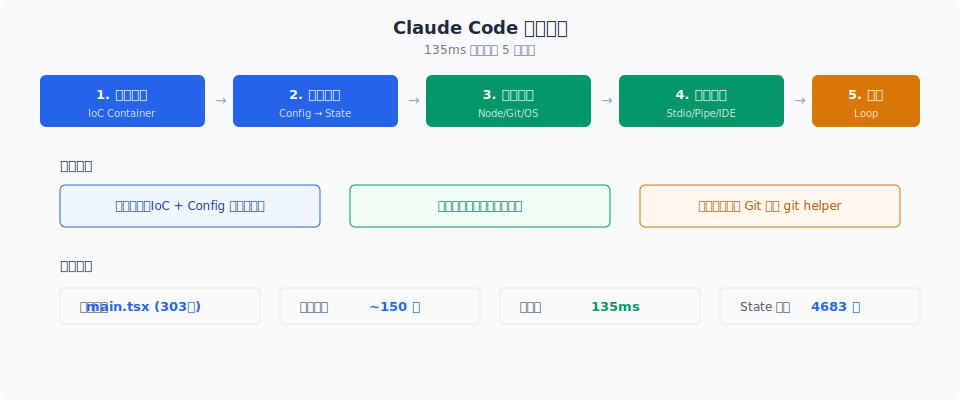
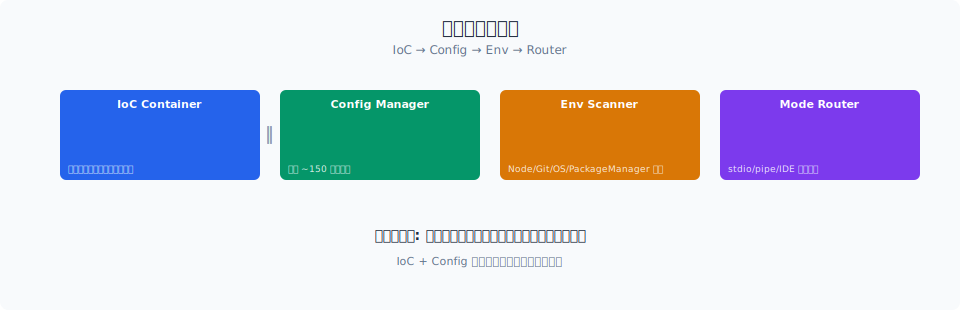

# 启动优化

> Claude Code 把冷启动压缩到约 135ms，核心手段是并行预取：在 import 模块的同时，让 MDM 子进程、Keychain 读取和 API 预连接并行跑。

你好，我是江小湖。

上一篇 [启动入口](./01-entry.md) 讲了 `cli.tsx` 如何通过 Fast-path 跳过重载。但如果用户确实要进 REPL，就必须加载完整 CLI。这一篇讲 `main.tsx` 如何把这段不可避免的加载时间压缩到最短。

## 目录

- [main.tsx 顶部的三个副作用](#maintx-顶部的三个副作用)
- [并行预取的时间账](#并行预取的时间账)
- [API 预连接](#api-预连接)
- [延迟初始化](#延迟初始化)
- [总结](#总结)
- [参考链接](#参考链接)

<p align="center">
  
  <br/>
  <em>135ms 冷启动的 5 个阶段与优化策略</em>
</p>


<p align="center">
  
  <br/>
  <em>Claude Code 源码解析 02-startup-flow 配图</em>
</p>
## main.tsx 顶部的三个副作用

打开 `main.tsx`，你会看到它并不是从 import Commander 开始的。前三个有效语句是副作用：

```typescript
// main.tsx 顶部（必须在所有 import 之前）
import { profileCheckpoint } from './utils/startupProfiler.js';
profileCheckpoint('main_tsx_entry');

import { startMdmRawRead } from './utils/settings/mdm/rawRead.js';
startMdmRawRead(); // 启动 MDM 子进程（plutil/reg query）

import { startKeychainPrefetch } from './utils/secureStorage/keychainPrefetch.js';
startKeychainPrefetch(); // 启动 macOS Keychain 读取

// 然后才开始 180+ 行 import
import { Command as CommanderCommand } from '@commander-js/extra-typings';
import chalk from 'chalk';
import React from 'react';
// ...
```

`startMdmRawRead()` 和 `startKeychainPrefetch()` 是这里的关键。它们启动了两个慢操作，然后立刻返回，不等结果。

- **MDM 子进程**：通过 `plutil`（macOS）或 `reg query`（Windows）读取远程管理配置，约 50ms
- **Keychain 读取**：读取 macOS Keychain 里的 OAuth token 和 legacy API key，约 65ms

这两个操作通常是在初始化阶段被同步调用的。Claude Code 把它们提前到 import 阶段，和模块加载并行。

## 并行预取的时间账

不算并行优化时，启动时间是各项操作串行相加：

```
import 模块：     ~135ms
MDM 子进程：      ~50ms
Keychain 读取：   ~65ms
─────────────────────────
总计：            ~250ms
```

做了并行预取后：

```
import 模块：     ~135ms（同时 MDM 和 Keychain 也在跑）
MDM 子进程：      ~50ms  ✓ 被 import 覆盖
Keychain 读取：   ~65ms  ✓ 被 import 覆盖
─────────────────────────
总计：            ~135ms
```

因为 MDM 和 Keychain 都比 import 短，等 import 完成时，它们的结果已经准备好了。启动时间从 250ms 降到 135ms，几乎减半。

这就是并行预取的精髓：**把慢操作藏到另一个慢操作里**。

## API 预连接

并行预取不止发生在 import 阶段。`init.ts` 里还做了 API 预连接：

```typescript
// entrypoints/init.ts（简化）
export const init = memoize(async (): Promise<void> => {
  enableConfigs();
  applySafeConfigEnvironmentVariables();
  applyExtraCACertsFromConfig(); // 必须在 TLS 前
  configureGlobalMTLS();
  configureGlobalAgents();
  preconnectAnthropicApi();      // TCP+TLS 握手，~100-200ms
  setShellIfWindows();
});
```

`preconnectAnthropicApi()` 在用户还没提问时，就提前建立 TCP+TLS 连接。TCP+TLS 握手通常需要 100-200ms，这是一个无法压缩的网络延迟。

Claude Code 把它和 action handler 的工作并行：当用户还在看 REPL 界面、思考问什么时，底层连接已经建好了。等用户按下回车，请求可以直接发送。

## 延迟初始化

`main.tsx` 的 action handler 在启动 REPL 后，还会触发一轮延迟预取：

```typescript
// main.tsx（简化）
await launchRepl(prompt, options);
startDeferredPrefetches();
```

`startDeferredPrefetches()` 里的工作都不是 REPL 渲染必需的，包括：

- 初始化用户上下文
- 获取系统上下文
- 文件计数
- 刷新模型能力
- 初始化设置变更监听器

这些工作被推到 REPL 渲染之后，因为用户看到界面后通常需要几秒钟思考要问什么。这几秒钟就是"免费"的预取时间窗口。

## 总结

- `main.tsx` 顶部通过 `startMdmRawRead()` 和 `startKeychainPrefetch()` 在 import 期间并行启动慢操作。
- 并行预取把启动时间从约 250ms 降到约 135ms。
- `init.ts` 通过 `preconnectAnthropicApi()` 提前完成 TCP+TLS 握手。
- REPL 渲染后的延迟初始化利用"用户思考时间"完成非关键预取。
- Claude Code 的启动哲学是：**能并行就并行，能延迟就延迟**。

> 下一篇：[初始化与 REPL](./03-initialization.md)，看 Commander 如何解析参数、如何加载全局状态、最终如何渲染界面。

## 参考链接

- [Claude Code 主入口](file:///E:/Projects/claude-code/src/main.tsx)
- [Claude Code 初始化逻辑](file:///E:/Projects/claude-code/src/entrypoints/init.ts)
- [Anthropic Claude Code 官方文档](https://docs.anthropic.com/en/docs/claude-code/overview)
