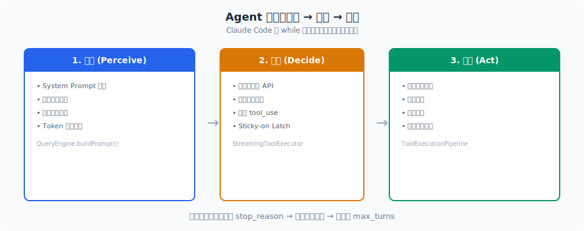
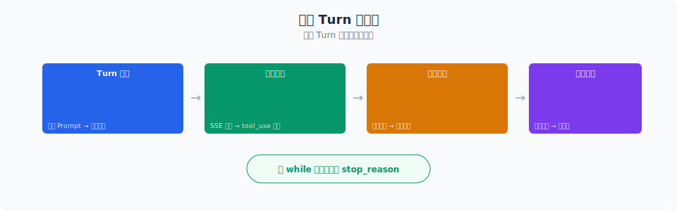

# 消息预处理流水线

> 在每次调用模型之前，Claude Code 会对上下文执行 5 层预处理：applyToolResultBudget、snip、microcompact、contextCollapse、autocompact。目的只有一个——在尽量不丢信息的前提下，把上下文塞进模型窗口。

你好，我是江小湖。

上一篇 [Agent 循环](./01-loop.md) 讲了 `query.ts` 的核心循环结构。这一篇聚焦循环体内最关键的一段逻辑：在真正调用模型之前，消息列表会经过 5 层预处理。

## 目录

- [为什么需要 5 层预处理](#为什么需要-5-层预处理)
- [5 层预处理的顺序与职责](#5-层预处理的顺序与职责)
- [每层的设计取舍](#每层的设计取舍)
- [总结](#总结)
- [参考链接](#参考链接)

<p align="center">
  
  <br/>
  <em>感知 → 决策 → 行动的 while 循环</em>
</p>


<p align="center">
  
  <br/>
  <em>Claude Code 源码解析 03-agent-loop 配图</em>
</p>
## 为什么需要 5 层预处理

Claude Code 面向真实项目。一次调试可能涉及十几个文件、几十次 Bash 命令、成百上千行工具输出。如果把这些内容原封不动地塞进上下文，200K 窗口很快就被撑满。

但直接做"全对话总结"代价很高：要调用一次额外的 LLM，产生延迟和费用，还会丢失细节。所以 Claude Code 设计了 5 层预处理，从" cheapest"到"most expensive"依次尝试，尽量在前面几层就解决问题。

```
原始消息列表
  ↓
1. applyToolResultBudget  削减单个工具结果大小
  ↓
2. snip                   删除早期已失效的工具结果
  ↓
3. microcompact           按 tool_use_id 压缩单个结果
  ↓
4. contextCollapse        把多轮对话折叠成摘要
  ↓
5. autocompact            全对话总结为摘要
  ↓
调用模型
```

这个顺序不是随意的。每一层都假设前一层已经尽力了，才轮到自己出场。

## 5 层预处理的顺序与职责

### 第 1 层：applyToolResultBudget

这一层控制**单个工具结果**的大小上限。某些工具（如 `ReadTool` 读大文件、`GlobTool` 返回大量匹配）会产生超长输出。如果不限制，一个工具结果就可能占掉几万 token。

`applyToolResultBudget` 根据工具配置里的 `maxResultSizeChars`，把过长的结果截断或替换为占位符。被替换的内容不会从会话历史中删除，而是标记为"已在别处存储"，需要的时候再读取。

### 第 2 层：snip

这一层删除**早期历史中已经没用的工具结果**。

在一段长对话里，前面某轮调用的 `BashTool` 输出可能只对那一轮有意义，后面再也没被引用过。snip 会识别这些"孤儿"工具结果，把它们从当前上下文里移除。

关键特点是：snip 只删消息，不总结。所以它是免费的——不需要调用 LLM。

### 第 3 层：microcompact

如果 snip 之后还是太长，就进入 microcompact。这一层针对**单个工具结果**做压缩。

microcompact 按 `tool_use_id` 匹配，把某个工具结果的完整内容替换成一段短摘要。比如一次 `BashTool` 输出的几百行日志，可以被压缩成"命令成功，输出 X 行"这样一句话。

源码注释里提到：microcompact 只认 `tool_use_id`，从不检查内容。这样它和 applyToolResultBudget 可以安全组合，互不干扰。

### 第 4 层：contextCollapse

microcompact 解决的是"单个结果太大"，contextCollapse 解决的是"对话轮次太多"。

它会扫描消息历史，把连续的多轮对话归档成一个摘要消息。摘要消息不直接出现在 REPL 的历史列表里，而是存到一个单独的 collapse store 中。每次进入循环时，`projectView()` 会重放 collapse store 的提交日志，重建压缩后的视图。

这个设计让压缩效果**跨轮次持久化**。即使这次循环没有触发新的折叠，之前的折叠仍然生效。

### 第 5 层：autocompact

最后一层是 autocompact，也是最贵的一层。当上面 4 层都无法把上下文降到阈值以下时，autocompact 会调用一次 LLM，把整段历史总结成摘要。

autocompact 有几个关键设计：

- **CLAUDE.md 永不删除**：项目上下文始终保留
- **熔断机制**：连续失败 3 次后停止尝试
- **token 阈值**：在上下文用到一定比例时提前触发

## 每层的设计取舍

| 层 | 粒度 | 成本 | 信息损失 |
|---|------|------|---------|
| applyToolResultBudget | 单个结果 | 低 | 可恢复 |
| snip | 单个消息 | 零 | 中 |
| microcompact | 单个结果 | 中 | 中 |
| contextCollapse | 多轮对话 | 中 | 中 |
| autocompact | 全对话 | 高 | 高 |

这个表格反映了 Claude Code 的核心策略：**尽量用低成本、低损失的方式解决问题。** 只有当便宜的方式都失效时，才动用最贵的全对话总结。

源码里有一段注释很能说明问题：

> "Runs BEFORE autocompact so that if collapse gets us under the autocompact threshold, autocompact is a no-op and we keep granular context instead of a single summary."

意思是：contextCollapse 放在 autocompact 之前，就是希望用更细粒度的折叠代替粗暴的全局总结。

## 总结

- Claude Code 在每次模型调用前执行 5 层消息预处理。
- 顺序是：applyToolResultBudget → snip → microcompact → contextCollapse → autocompact。
- 每一层解决不同层面的上下文膨胀问题：单结果大小、孤儿消息、单结果压缩、多轮折叠、全对话总结。
- 这个设计的核心思想是：低成本方案优先，尽量减少信息损失和 LLM 调用次数。

> 下一篇：[StreamingToolExecutor](./03-streaming-executor.md)，看工具如何边收边执行、如何并发调度。

## 参考链接

- [Claude Code query.ts 预处理逻辑](file:///E:/Projects/claude-code/src/query.ts)
- [Claude Code 自动压缩实现](file:///E:/Projects/claude-code/src/services/compact/autoCompact.ts)
- [Anthropic Claude Code 官方文档](https://docs.anthropic.com/en/docs/claude-code/overview)
